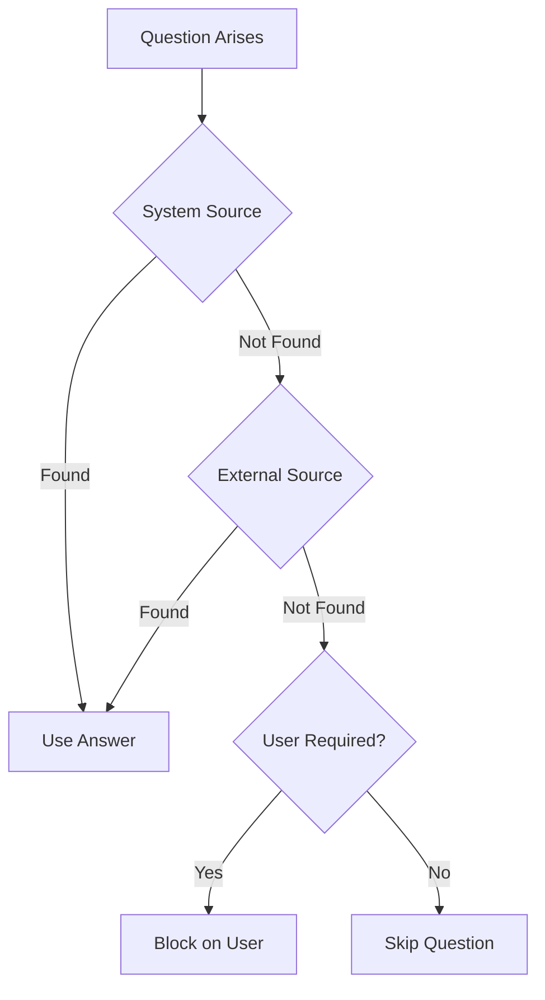

# fm-controller-agenttask

AgentTask CRD and Controller for ForgeMaster.

## Overview

This crate provides:
- **AgentTask CRD** - Custom Resource Definition for task management
- **Controller** - Kubernetes controller with phase-based reconciliation strategies

## Architecture

```
src/
├── lib.rs
├── main.rs                    # Binary entry point
├── controller/
│   ├── mod.rs
│   ├── context.rs             # Shared controller context
│   ├── dispatcher.rs          # Routes to appropriate strategy (DashMap)
│   ├── error.rs               # Error types
│   ├── runner.rs              # Controller runtime
│   └── reconciler/
│       ├── mod.rs             # ReconcileStrategy trait
│       ├── pending.rs         # PendingStrategy
│       ├── clarifying.rs      # ClarifyingStrategy
│       ├── running.rs         # RunningStrategy
│       ├── succeeded.rs       # SucceededStrategy
│       └── failed.rs          # FailedStrategy
└── crd/
    ├── mod.rs
    ├── resource_quota.rs
    ├── agent_task/
    │   ├── mod.rs
    │   ├── phase.rs           # AgentTaskPhase enum
    │   ├── spec.rs            # AgentTaskSpec
    │   ├── status.rs          # AgentTaskStatus
    │   └── task.rs            # AgentTask CRD
    └── clarification/
        ├── mod.rs
        ├── attempted.rs       # AttemptedSource
        ├── clarification.rs   # Clarification
        ├── pending.rs         # PendingClarification
        └── source.rs          # ClarificationSource
```

## Task Phases

| Phase | Description |
|-------|-------------|
| Pending | Task created, awaiting processing |
| Clarifying | Waiting for clarification answers |
| Running | Task is being executed |
| Succeeded | Task completed successfully |
| Failed | Task failed |

## Clarification Flow



## Usage

### As Library

```rust
use fm_controller_agenttask::crd::{AgentTask, AgentTaskPhase, AgentTaskStatus};
use fm_controller_agenttask::controller::run;
```

### As Binary

```bash
export NAMESPACE=forgemaster-system
cargo run --release -p fm-controller-agenttask
```

## Docker

Build the Docker image:

```bash
docker build -f crates/fm-controller-agenttask/Dockerfile -t fm-controller-agenttask:latest .
```

## Helm Chart

Deploy using Helm:

```bash
helm upgrade --install fm-controller-agenttask ./helm \
  --namespace forgemaster-system \
  --create-namespace
```

## Ansible Deployment

Deploy using Ansible role:

```bash
ansible-playbook -i inventory playbook.yml --tags fm-controller-agenttask
```

Ansible variables:

| Variable | Description | Default |
|----------|-------------|---------|
| `fm_controller_agenttask_crd_enabled` | Install CRD | true |
| `fm_controller_agenttask_controller_enabled` | Deploy controller | true |
| `fm_controller_agenttask_build_enabled` | Build Docker image | false |
| `fm_controller_agenttask_image_registry` | Docker registry | "" |
| `fm_controller_agenttask_image_tag` | Image tag | latest |

## Environment Variables

| Variable | Description | Default |
|----------|-------------|---------|
| NAMESPACE | Kubernetes namespace | forgemaster-system |
| RUST_LOG | Log level filter | info |

## Testing

```bash
cargo test -p fm-controller-agenttask
```

## Architecture Reference

See [02-components.md](../../docs/arch/02-components.md) for full architecture.
