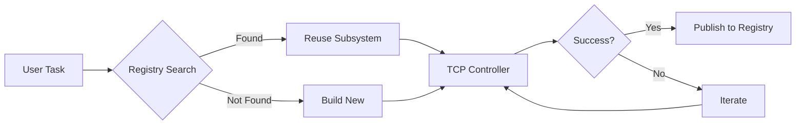

# ForgeMaster Documentation

> **Meta-Agent System for AgentForge Hackathon 2026**
>
> Autonomous discovery, creation, orchestration, and management of task-specific agent subsystems in Kubernetes.

---

## Overview

ForgeMaster treats agent combinations as **deployable, versioned artifacts**. When you submit a task:

1. **Discover** — Search registry for existing agent subsystems
2. **Build** — If not found, create new agents tailored to the task
3. **Orchestrate** — Execute via TCP Controller with feedback loop
4. **Publish or Drop** — Save proven combinations or clean up one-time tasks



---

## Protocol Stack

| Protocol | Purpose | Implementation |
|----------|---------|----------------|
| **A2UI** | Agent → User Interface | React + CopilotKit A2UI renderer |
| **A2A** | Agent → Agent communication | JSON-RPC + SSE |
| **MCP** | Agent → Tools | MCP servers in K8s |

```
┌─────────────────────────────────────────────────────────────┐
│  Web Portal (React + CopilotKit A2UI)                       │
├─────────────────────────────────────────────────────────────┤
│  REST API Service                                           │
├─────────────────────────────────────────────────────────────┤
│  TCP Controller  │  Agent Registry  │  K8s Operator        │
├─────────────────────────────────────────────────────────────┤
│  Agents (A2A)    │  MCP Servers (github, postgres, stripe)  │
└─────────────────────────────────────────────────────────────┘
```

---

## Documentation

### Core

| Document | Description |
|----------|-------------|
| [Project Goal](project-goal.md) | Vision, core idea, and key differentiators |
| [Development Plan](development-plan.md) | Phases, milestones, and crate structure |
| [Hackathon Checklist](hackathon-checklist.md) | Timeline and deliverables |

### Architecture

| Document | Description |
|----------|-------------|
| [Architecture Overview](arch/README.md) | Full architecture documentation index |
| [01-overview](arch/01-overview.md) | System overview and TCP control model |
| [02-components](arch/02-components.md) | Component descriptions and diagrams |
| [03-feedback-loop](arch/03-feedback-loop.md) | TCP Controller feedback loop |
| [04-task-lifecycle](arch/04-task-lifecycle.md) | Task submission and state machine |
| [05-k8s-deployment](arch/05-k8s-deployment.md) | Kubernetes CRDs and deployment |
| [06-agent-registry](arch/06-agent-registry.md) | Agent discovery and health management |
| [07-a2a-protocol](arch/07-a2a-protocol.md) | Agent-to-Agent communication |
| [08-a2ui-protocol](arch/08-a2ui-protocol.md) | Agent-to-User Interface |
| [09-crd-specifications](arch/09-crd-specifications.md) | CRD schemas (AgentTask, Agent, MCPServer) |

### Architecture Decision Records (ADRs)

| ADR | Decision |
|-----|----------|
| [ADR-0001](adr/0001-tcp-controller-vs-llm-agents.md) | TCP (PID) Controller for orchestration, LLM for agents |
| [ADR-0002](adr/0002-a2ui-for-user-interface.md) | A2UI with CopilotKit for web portal |
| [ADR-0003](adr/0003-a2a-for-agent-communication.md) | A2A protocol for agent-to-agent communication |
| [ADR-0004](adr/0004-mcp-for-tool-integration.md) | MCP for tool integration (GitHub, DB, Stripe) |
| [ADR-0005](adr/0005-kubernetes-native-architecture.md) | Kubernetes-native architecture with CRDs |

### Examples

| Example | Use Case |
|---------|----------|
| [Web Development](examples/01-web-development.md) | REST API, full-stack features |
| [Data Engineering](examples/02-data-engineering.md) | ETL pipelines, data validation |
| [Testing Automation](examples/03-testing-automation.md) | Test generation, coverage |
| [ML Experimentation](examples/04-ml-experimentation.md) | Model training, experiments |

---

## Technology Stack

| Component | Technology |
|-----------|------------|
| Language | Rust |
| Web Framework | Axum |
| K8s Operator | kube-rs |
| State Store | Redis |
| Artifacts | GitHub (via MCP) |
| LLM | Claude API |
| Frontend | React + CopilotKit A2UI |
| Orchestration | Kubernetes (Kind) |

---

## Quick Start

1. **Read the vision**: [Project Goal](project-goal.md)
2. **Understand the architecture**: [01-overview](arch/01-overview.md)
3. **Review key decisions**: [ADR-0001](adr/0001-tcp-controller-vs-llm-agents.md) (TCP vs LLM)
4. **See the development plan**: [Development Plan](development-plan.md)
5. **Explore the task flow**: [04-task-lifecycle](arch/04-task-lifecycle.md)

---

## Key Concepts

| Concept | Description |
|---------|-------------|
| **TCP Controller** | PID-like feedback loop (Task-Context-Prediction) |
| **Error Signal** | `(failed_tests + failed_outcomes) / total_checks` |
| **Gherkin Setpoint** | E2E tests define dynamic success criteria |
| **Dual Validation** | Tests verify HOW, outcomes verify WHAT |

---

## Team

**CSM-101** — AgentForge Hackathon 2026
