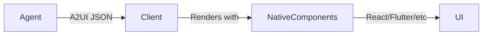

# ADR-0002: A2UI for User Interface

**Status:** Accepted

**Date:** 2026-02-04

**Decision Makers:** CSM-101

**Technical Area:** User Interface, Agent-to-User Communication

## Context

ForgeMaster needs a web portal for users to:
1. **Submit tasks** — Describe what they want to build
2. **Clarify requirements** — Answer follow-up questions from the system
3. **Monitor progress** — See real-time stages, iterations, and status
4. **View results** — Access artifacts, test reports, and completion summary

The challenge is that ForgeMaster's AI agents need to dynamically generate UI based on task context, ask clarifying questions, and stream progress updates — all without compromising security.

## Decision Drivers

- **Dynamic UI generation** — Agents should generate forms/views based on task type
- **Clarification workflow** — System must ask follow-up questions before execution
- **Real-time updates** — Progress display with stages, error signal, agent status
- **Security** — No arbitrary code execution from agent responses
- **Cross-platform** — Same protocol should work for web, mobile, desktop
- **LLM-friendly** — Format should be easy for LLMs to generate correctly

## Considered Options

### Option 1: Custom REST API + Static React UI

Build a custom REST API with predefined endpoints and a static React frontend.

**Pros:**
- Full control over UI/UX
- No new protocols to learn
- Established tooling and libraries

**Cons:**
- Static forms can't adapt to task types dynamically
- Every new question type requires frontend changes
- No standard for agent-generated UI
- Tight coupling between frontend and backend
- Progress updates require custom WebSocket implementation

### Option 2: Streamlit / Gradio

Use Python-based UI frameworks popular in ML/AI applications.

**Pros:**
- Quick prototyping
- Good for data science workflows
- Python ecosystem integration

**Cons:**
- Python runtime dependency
- Limited customization
- Not designed for agent-generated UIs
- Poor mobile support
- Server-side rendering overhead

### Option 3: Server-Sent HTML (HTMX)

Use HTMX with server-rendered HTML fragments.

**Pros:**
- Simple mental model
- No JavaScript framework needed
- Good for progressive enhancement

**Cons:**
- Agents would generate HTML (security risk)
- Not truly declarative
- Limited component abstraction
- Mobile support requires web views

### Option 4: A2UI (Agent-to-User Interface)

Use Google's [A2UI protocol](https://github.com/google/A2UI) — a declarative JSON format for agent-generated UIs.

**Pros:**
- **Security-first**: Declarative JSON, not executable code
- **LLM-optimized**: Flat component structure easy for LLMs to generate
- **Dynamic**: Agents generate forms/views based on context
- **Streaming**: Built-in support for incremental updates
- **Framework-agnostic**: Same JSON renders on React, Flutter, Angular
- **Component catalog**: Client controls allowed components
- **Open standard**: Google-backed, community-driven

**Cons:**
- Relatively new (v0.8, public preview)
- Limited existing renderers (need to build or contribute)
- Learning curve for component model
- Spec still evolving

### Option 5: Custom JSON UI Protocol

Design our own JSON-based UI protocol.

**Pros:**
- Tailored to ForgeMaster needs
- No external dependencies

**Cons:**
- Reinventing the wheel
- No community/ecosystem
- Documentation burden
- No cross-project compatibility

## Decision

**We choose Option 4: A2UI (Agent-to-User Interface)**.

A2UI aligns perfectly with ForgeMaster's requirements:

1. **Security**: Agents send declarative JSON, client renders with pre-approved components
2. **Dynamic forms**: Task submission forms adapt to task type
3. **Clarification flow**: Agents generate question forms on-the-fly
4. **Progress streaming**: Built-in support for SSE-based UI updates
5. **Component catalog**: We control exactly which components are allowed



## Consequences

### Positive

- **Security by design**: No arbitrary code execution from agents
- **Consistent UX**: Component catalog ensures UI consistency
- **Multi-platform**: Single A2UI response works on web and mobile
- **Future-proof**: Standard protocol vs. custom implementation
- **Community**: Can contribute renderers, benefit from others' work
- **Testable**: JSON responses easy to validate and test

### Negative

- **Component limits**: UI constrained to component catalog
- **Spec changes**: May need to adapt as A2UI spec evolves
- **Learning curve**: Team needs to learn A2UI schema format

### Risks

| Risk | Probability | Impact | Mitigation |
|------|-------------|--------|------------|
| A2UI spec changes break our implementation | Medium | Medium | Pin to spec version, contribute to spec stability |
| Limited component expressiveness | Low | Medium | Extend component catalog as needed |
| Performance issues with complex UIs | Low | Low | Lazy loading, component virtualization |
| Google abandons A2UI | Low | High | Fork and maintain, spec is open source |
| CopilotKit renderer updates | Low | Low | Pin version, test before upgrading |

## Implementation Notes

### Component Catalog

We'll define a ForgeMaster-specific component catalog including:

**Standard components:**
- `text`, `textField`, `dropdown`, `radioGroup`, `checkboxGroup`
- `button`, `buttonGroup`, `card`, `list`, `table`
- `alert`, `chip`, `progressBar`, `stepper`

**Custom components:**
- `logViewer` — Streaming log display
- `agentCard` — Agent status display
- `testResult` — Gherkin test result
- `tcpGauge` — Error signal visualization

### API Endpoints

| Endpoint | Purpose |
|----------|---------|
| `GET /api/v1/ui/task-form` | Task submission form |
| `POST /api/v1/tasks/clarify` | Clarification questions |
| `GET /api/v1/ui/tasks/{id}/progress` | SSE progress stream |
| `GET /api/v1/ui/tasks/{id}/result` | Completion view |

### Client Implementation

**Stack: React + CopilotKit A2UI Renderer**

We use React with `@copilotkit/a2ui-renderer` which provides native React A2UI rendering:

- **React** — Application shell, routing, state management
- **CopilotKit A2UI Renderer** — React-native A2UI renderer, handles theme/context internally
- **JSON Schemas** — A2UI schemas stored as JSON files, auto-discovered via Vite

```
┌─────────────────────────────────────────────────┐
│  React Application                              │
│  ┌───────────────────────────────────────────┐  │
│  │  A2UIRenderer (wrapper component)         │  │
│  │  ┌─────────────────────────────────────┐  │  │
│  │  │  @copilotkit/a2ui-renderer          │  │  │
│  │  │  (A2UIViewer native React)          │  │  │
│  │  └─────────────────────────────────────┘  │  │
│  └───────────────────────────────────────────┘  │
└─────────────────────────────────────────────────┘
```

```tsx
// A2UIRenderer.tsx - Wrapper for CopilotKit renderer
import { A2UIViewer } from "@copilotkit/a2ui-renderer";
import type { v0_8 } from "@a2ui/lit";

export interface A2UISchema {
  root: string;
  components: v0_8.Types.ComponentInstance[];
  defaultData?: Record<string, unknown>;
}

export function A2UIRenderer({ schema, data, onAction }: Props) {
  const mergedData = { ...schema.defaultData, ...data };
  return (
    <A2UIViewer
      root={schema.root}
      components={schema.components}
      data={mergedData}
      onAction={onAction}
    />
  );
}
```

**Dynamic Schema Loading:**

```typescript
// schemaLoader.ts - Auto-discover JSON schemas
const schemaModules = import.meta.glob<{ default: A2UISchema }>("./*.json", {
  eager: true,
});

export function getSchema(name: string): A2UISchema | undefined {
  return schemaCache.get(name);
}
```

## Related

- [A2UI GitHub Repository](https://github.com/google/A2UI)
- [A2UI Protocol Architecture](../arch/09-a2ui-protocol.md)
- [Task Lifecycle](../arch/04-task-lifecycle.md)
- [ADR-0001: TCP Controller vs LLM Agents](0001-tcp-controller-vs-llm-agents.md)
