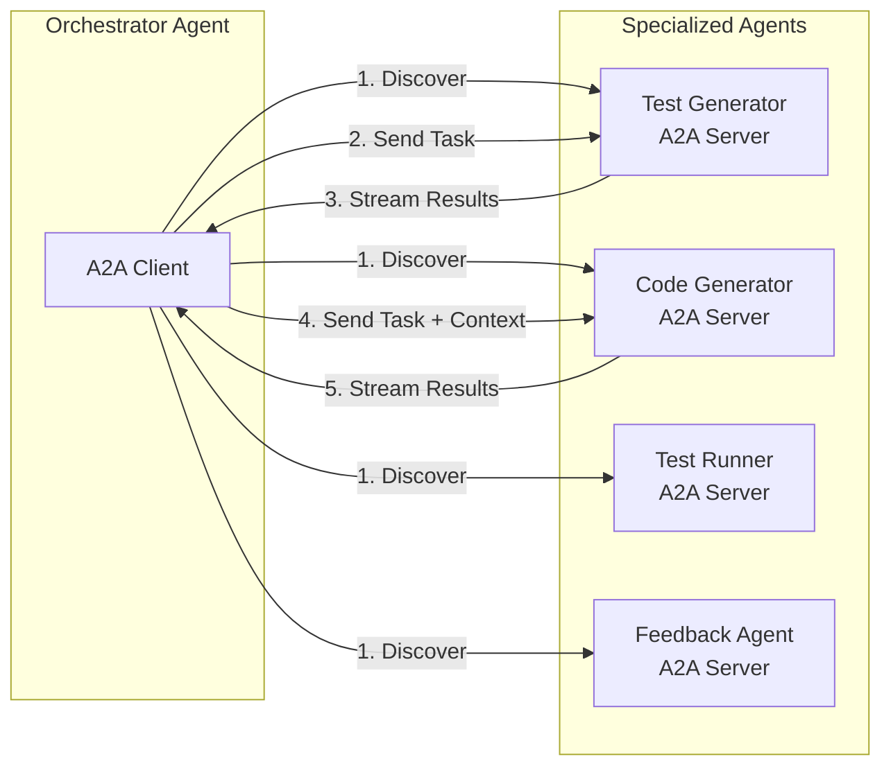

# ADR-0003: A2A for Agent-to-Agent Communication

**Status:** Accepted

**Date:** 2026-02-05

**Decision Makers:** CSM-101

**Technical Area:** Agent Communication, Inter-Agent Protocol

## Context

ForgeMaster uses multiple specialized agents (Test Generator, Code Generator, Reviewer, Feedback Agent) that must communicate with each other through the Orchestrator Agent. We need a protocol for:

1. **Agent discovery** — Find agents with specific skills
2. **Task delegation** — Send tasks from Orchestrator to specialized agents
3. **Progress streaming** — Receive real-time updates during task execution
4. **Artifact exchange** — Pass generated code, tests, and results between agents

```
┌─────────────────────────────────────────────────────────────────┐
│                    COMMUNICATION NEEDS                           │
│                                                                  │
│   Orchestrator ─────► Test Generator                            │
│        │                    │                                    │
│        │              (Gherkin tests)                           │
│        │                    │                                    │
│        ▼                    ▼                                    │
│   Code Generator ◄──────────┘                                   │
│        │                                                         │
│   (source code)                                                  │
│        │                                                         │
│        ▼                                                         │
│   Test Runner ──────► Feedback Agent ──────► Orchestrator       │
│                                                                  │
│   Need: Standard protocol for all these interactions            │
└─────────────────────────────────────────────────────────────────┘
```

## Decision Drivers

- **Interoperability** — Agents may be written in different languages (Rust, Python)
- **Streaming** — Long-running tasks need real-time progress updates
- **Discovery** — Orchestrator must find agents by capability, not hardcoded addresses
- **Security** — Authentication and authorization between agents
- **Ecosystem** — Ability to integrate third-party agents in the future
- **Simplicity** — Easy to implement for hackathon timeline

## Considered Options

### Option 1: Custom REST API

Build custom HTTP endpoints for each agent interaction.

**Pros:**
- Full control over API design
- Simple to implement initially
- No external dependencies

**Cons:**
- No standard for agent discovery
- Custom streaming implementation needed
- No ecosystem compatibility
- Each agent pair needs custom integration
- Documentation burden

### Option 2: gRPC

Use gRPC with Protocol Buffers for agent communication.

**Pros:**
- Strong typing with protobuf
- Efficient binary protocol
- Built-in streaming support
- Language-agnostic code generation

**Cons:**
- Complex setup (protobuf compilation)
- No standard for agent discovery
- No ecosystem for AI agents
- Overkill for text-based LLM communication
- Harder to debug (binary protocol)

### Option 3: Message Queue (RabbitMQ/Redis Streams)

Use message queues for async agent communication.

**Pros:**
- Decoupled communication
- Built-in retry/persistence
- Good for high throughput

**Cons:**
- Additional infrastructure (message broker)
- No request-response pattern (need correlation IDs)
- No agent discovery standard
- Overkill for our scale
- Complex error handling

### Option 4: A2A Protocol (Agent-to-Agent)

Use Google's [A2A Protocol](https://github.com/google/A2A) — an open standard for agent-to-agent communication.

**Pros:**
- **Agent Cards**: Standard discovery mechanism (JSON manifest at `.well-known/agent.json`)
- **Streaming built-in**: SSE-based progress updates
- **Task lifecycle**: Standard states (submitted → working → completed/failed)
- **Artifact support**: File and data exchange in messages
- **Authentication**: OAuth2/API key support in spec
- **Ecosystem**: Growing adoption, can integrate external agents
- **JSON-RPC**: Simple, debuggable text protocol
- **Complements MCP**: A2A for agents, MCP for tools

**Cons:**
- Relatively new (v1.0 released late 2025)
- Need to implement A2A server for each agent type
- Spec may evolve

### Option 5: Direct LLM-to-LLM (No Protocol)

Have agents communicate via shared context/prompts.

**Pros:**
- No protocol overhead
- Simple for small systems

**Cons:**
- No structure or reliability
- Context window limits
- No streaming
- Not scalable
- Hard to debug

## Decision

**We choose Option 4: A2A Protocol**.

A2A provides exactly what ForgeMaster needs:

1. **Discovery via Agent Cards** — Orchestrator queries registry for agents with required skills
2. **Standard task lifecycle** — Clear states and transitions
3. **SSE streaming** — Real-time progress during code generation
4. **JSON-based** — Easy to debug and implement
5. **Ecosystem ready** — Can integrate external agents later



## Consequences

### Positive

- **Standard protocol** — No custom API design per agent
- **Agent discovery** — Find agents by skill via Agent Cards
- **Real-time updates** — SSE streaming out of the box
- **Future-proof** — Can integrate external A2A-compatible agents
- **Debuggable** — JSON-RPC is human-readable
- **Complements MCP** — Clear separation (A2A for agents, MCP for tools)

### Negative

- **Implementation effort** — Each agent needs A2A server
- **New protocol** — Team learning curve
- **Spec evolution** — May need updates as A2A matures

### Risks

| Risk | Probability | Impact | Mitigation |
|------|-------------|--------|------------|
| A2A spec changes | Medium | Medium | Pin to version, abstract behind interface |
| Performance overhead vs gRPC | Low | Low | JSON is fine for LLM-speed operations |
| Limited Rust A2A libraries | Medium | Medium | Implement minimal A2A server; it's just HTTP + JSON |
| Google abandons A2A | Low | High | Linux Foundation governance; spec is open source |

## Implementation Notes

### Protocol Stack

```
┌─────────────────────────────────────────────────────────────────┐
│                    FORGEMASTER PROTOCOL STACK                    │
│                                                                  │
│   ┌─────────────┐    ┌─────────────┐    ┌─────────────┐        │
│   │    A2UI     │    │     A2A     │    │     MCP     │        │
│   │ Agent → UI  │    │ Agent → Agent│   │ Agent → Tool │        │
│   └─────────────┘    └─────────────┘    └─────────────┘        │
│                                                                  │
│   User Interface     Agent Orchestration    Tool Integration    │
└─────────────────────────────────────────────────────────────────┘
```

### Agent Card Example

Each agent exposes discovery information:

```json
{
  "name": "code-generator-agent",
  "description": "Generates code from Gherkin tests and requirements",
  "version": "1.0.0",
  "endpoint": "http://code-generator.agents:8080",
  "capabilities": {
    "streaming": true,
    "pushNotifications": false
  },
  "skills": [
    {
      "name": "rust-code-generation",
      "description": "Generates Rust code with Axum framework",
      "inputModes": ["text", "file"],
      "outputModes": ["file"]
    }
  ]
}
```

### A2A Task Flow

```
POST /tasks
{
  "message": {
    "role": "user",
    "parts": [{"type": "text", "text": "Generate REST API for e-commerce..."}]
  },
  "context": {
    "gherkinTests": "Feature: Shopping Cart...",
    "previousAttempt": "..."
  }
}

Response: 202 Accepted
{
  "taskId": "task-123",
  "status": "working"
}

SSE Stream: GET /tasks/task-123/stream
data: {"status": "working", "progress": "Generating models..."}
data: {"status": "working", "progress": "Implementing handlers..."}
data: {"status": "completed", "artifacts": [{"name": "api.rs", "type": "file", ...}]}
```

### Rust Implementation

Minimal A2A server using Axum:

```
crates/
├── a2a-core/          # A2A types and traits
│   ├── agent_card.rs
│   ├── task.rs
│   └── message.rs
├── a2a-server/        # Axum-based A2A server
│   ├── routes.rs
│   └── sse.rs
└── a2a-client/        # A2A client for Orchestrator
    └── client.rs
```

## Related

- [A2A Protocol GitHub](https://github.com/google/A2A)
- [A2A Protocol Architecture](../arch/07-a2a-protocol.md)
- [ADR-0001: TCP Controller vs LLM](0001-tcp-controller-vs-llm-agents.md) — Why controller is math, agents are LLM
- [ADR-0002: A2UI for User Interface](0002-a2ui-for-user-interface.md) — User-facing protocol
