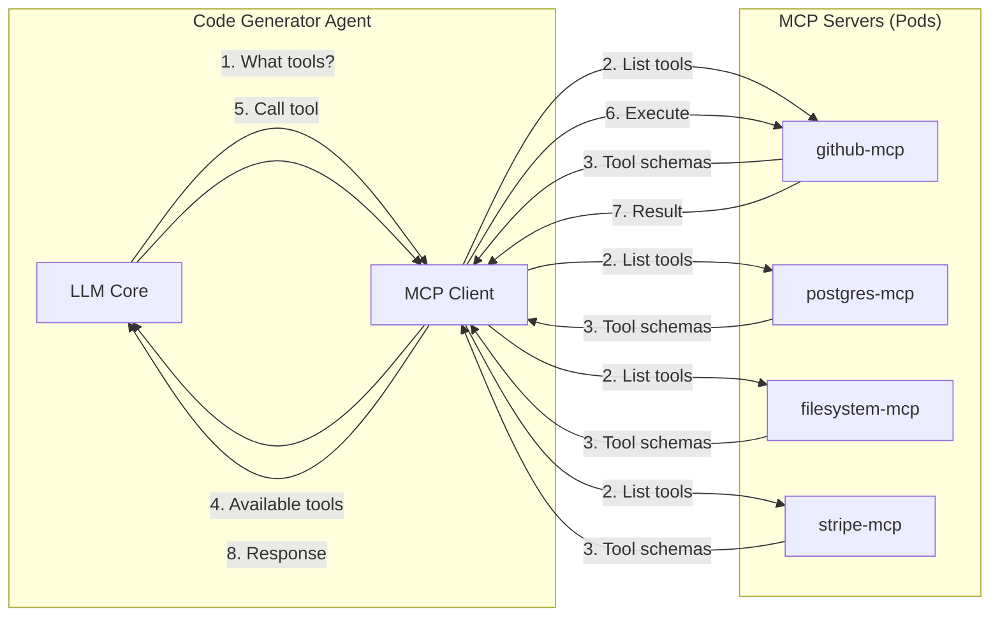

# ADR-0004: MCP for Tool Integration

**Status:** Accepted

**Date:** 2026-02-05

**Decision Makers:** CSM-101

**Technical Area:** Tool Integration, Agent-to-Tool Communication

## Context

ForgeMaster agents need to interact with external tools and services:

1. **GitHub** — Read/write code, create branches, open PRs
2. **Databases** — Query and modify data (PostgreSQL, Redis)
3. **Payment APIs** — Stripe integration for e-commerce tasks
4. **Filesystem** — Read/write files in workspace
5. **HTTP APIs** — Call external services

```
┌─────────────────────────────────────────────────────────────────┐
│                    TOOL INTEGRATION NEEDS                        │
│                                                                  │
│   Code Generator Agent                                          │
│        │                                                         │
│        ├──► GitHub: Create branch, commit code, open PR         │
│        ├──► Filesystem: Write generated files                   │
│        └──► Database: Query schema for code generation          │
│                                                                  │
│   Test Runner Agent                                             │
│        │                                                         │
│        ├──► Filesystem: Read test files                         │
│        ├──► Database: Seed test data                            │
│        └──► HTTP: Call API endpoints under test                 │
│                                                                  │
│   Need: Standard protocol for all tool interactions             │
└─────────────────────────────────────────────────────────────────┘
```

## Decision Drivers

- **Standardization** — Consistent interface for all tools
- **Security** — Controlled access to external resources
- **LLM-friendly** — Tools must be discoverable and callable by LLMs
- **Ecosystem** — Leverage existing tool implementations
- **Extensibility** — Easy to add new tools
- **Kubernetes-native** — Tools should be manageable via CRDs

## Considered Options

### Option 1: Direct SDK Integration

Embed SDKs directly in agent code (e.g., `octokit` for GitHub, `stripe-rs` for Stripe).

**Pros:**
- Full SDK capabilities
- Type-safe APIs
- No protocol overhead

**Cons:**
- Each agent needs all SDKs compiled in
- No standardized tool discovery
- LLM cannot discover tools dynamically
- Tight coupling between agents and tools
- Complex dependency management

### Option 2: Custom Tool API

Build a custom REST API that wraps all tools.

**Pros:**
- Full control over API design
- Single endpoint for all tools
- Custom authentication

**Cons:**
- Significant development effort
- No ecosystem compatibility
- Must build every tool wrapper from scratch
- No standard for LLM tool discovery

### Option 3: LangChain Tools

Use LangChain's tool abstraction.

**Pros:**
- Large ecosystem of existing tools
- Python-based, good for ML workflows
- Popular in AI community

**Cons:**
- Python-only (ForgeMaster is Rust)
- Tied to LangChain framework
- Not a protocol, just a library abstraction
- No cross-language support

### Option 4: MCP (Model Context Protocol)

Use Anthropic's [MCP Protocol](https://modelcontextprotocol.io/) — an open standard for LLM-to-tool communication.

**Pros:**
- **Open standard**: Anthropic-backed, growing adoption
- **LLM-optimized**: Tools are discoverable via JSON schema
- **Large ecosystem**: GitHub, Slack, databases, filesystems already available
- **Language-agnostic**: Rust, Python, TypeScript implementations
- **Security**: Fine-grained capability control
- **Kubernetes-ready**: MCP servers run as separate pods
- **Complements A2A**: MCP for tools, A2A for agents

**Cons:**
- Relatively new (2024-2025)
- Need to run MCP server pods
- Some tools may need custom MCP servers

### Option 5: OpenAI Function Calling Only

Rely on LLM function calling with custom tool definitions.

**Pros:**
- Built into LLM APIs
- No additional protocol

**Cons:**
- Just describes tools, doesn't provide implementation
- Still need to build tool execution layer
- No standard server implementation

## Decision

**We choose Option 4: MCP (Model Context Protocol)**.

MCP provides exactly what ForgeMaster needs:

1. **Tool discovery** — Agents query MCP servers for available tools
2. **Standardized calling** — JSON-RPC interface for all tools
3. **Ecosystem** — Pre-built servers for GitHub, PostgreSQL, filesystem, etc.
4. **Security** — MCP servers control what capabilities are exposed
5. **Kubernetes-native** — Run MCP servers as pods, manage via CRDs



## Consequences

### Positive

- **Standard protocol** — Same interface for all tools
- **Ecosystem** — Use existing MCP servers (GitHub, Slack, databases)
- **LLM-friendly** — Tools auto-discovered with JSON schemas
- **Security** — MCP servers control capabilities per-agent
- **Scalable** — MCP servers run as independent pods
- **Testable** — Mock MCP servers for testing

### Negative

- **Infrastructure overhead** — Each MCP server is a pod
- **Protocol overhead** — JSON-RPC adds some latency vs direct SDK
- **Custom servers** — Some tools may need custom MCP implementation

### Risks

| Risk | Probability | Impact | Mitigation |
|------|-------------|--------|------------|
| MCP ecosystem lacks needed tool | Low | Medium | Build custom MCP server; spec is simple |
| Performance overhead | Low | Low | MCP is lightweight JSON-RPC; cache tool schemas |
| Anthropic changes MCP spec | Low | Medium | Pin to version; spec is open source |
| MCP server reliability | Medium | Medium | Health checks, restart policies in K8s |

## Implementation Notes

### Protocol Stack

```
┌─────────────────────────────────────────────────────────────────┐
│                    FORGEMASTER PROTOCOL STACK                    │
│                                                                  │
│   ┌─────────────┐    ┌─────────────┐    ┌─────────────┐        │
│   │    A2UI     │    │     A2A     │    │     MCP     │        │
│   │ Agent → UI  │    │ Agent → Agent│   │ Agent → Tool │        │
│   └─────────────┘    └─────────────┘    └─────────────┘        │
│                                                                  │
│   User Interface     Agent Orchestration    Tool Integration    │
└─────────────────────────────────────────────────────────────────┘
```

### MCP Servers in ForgeMaster

| MCP Server | Purpose | Source |
|------------|---------|--------|
| `github-mcp` | Code repository operations | Official |
| `postgres-mcp` | Database queries | Official |
| `filesystem-mcp` | File read/write | Official |
| `stripe-mcp` | Payment processing | Custom |
| `redis-mcp` | Cache/state operations | Custom |

### MCPServer CRD

```yaml
apiVersion: forgemaster.io/v1alpha1
kind: MCPServer
metadata:
  name: github-mcp
  namespace: forgemaster-system
spec:
  type: github
  image: modelcontextprotocol/server-github:latest

  # Capabilities exposed to agents
  capabilities:
    - repository_read
    - repository_write
    - pull_request
    - issues

  # Configuration
  config:
    repository:
      owner: "forgemaster"
      name: "artifacts"

  # Credentials
  credentialsSecret:
    name: github-credentials
    keys:
      token: GITHUB_TOKEN

  # Resources
  resources:
    requests:
      memory: "128Mi"
      cpu: "100m"
    limits:
      memory: "256Mi"
      cpu: "200m"

status:
  phase: Running
  endpoint: "http://github-mcp:3000"
  availableTools:
    - create_repository
    - create_branch
    - push_files
    - create_pull_request
    - list_issues
```

### Agent MCP Configuration

Agents declare which MCP servers they need:

```yaml
apiVersion: forgemaster.io/v1alpha1
kind: Agent
metadata:
  name: code-generator
spec:
  # ... agent config ...

  mcpServers:
    - name: github-mcp
      capabilities:
        - repository_write
        - pull_request
    - name: filesystem-mcp
      capabilities:
        - read
        - write
    - name: postgres-mcp
      capabilities:
        - query  # read-only for code gen
```

### MCP Tool Discovery Flow

```
1. Agent starts
2. Agent connects to configured MCP servers
3. Agent calls `tools/list` on each MCP server
4. MCP servers return tool schemas (JSON Schema)
5. Agent includes tools in LLM system prompt
6. LLM can now call tools via function calling
7. Agent routes tool calls to appropriate MCP server
8. MCP server executes and returns result
```

### Example: GitHub MCP Tool Call

```json
// LLM requests tool call
{
  "tool": "create_pull_request",
  "arguments": {
    "owner": "forgemaster",
    "repo": "artifacts",
    "head": "task-abc123",
    "base": "main",
    "title": "feat: Add e-commerce API",
    "body": "Generated by ForgeMaster\n\n## Changes\n- Product catalog API\n- Shopping cart\n- Checkout flow"
  }
}

// MCP server response
{
  "result": {
    "number": 42,
    "url": "https://github.com/forgemaster/artifacts/pull/42",
    "state": "open"
  }
}
```

### Rust MCP Client

```
crates/
├── mcp-core/          # MCP types and traits
│   ├── tool.rs
│   ├── resource.rs
│   └── prompt.rs
├── mcp-client/        # MCP client for agents
│   ├── client.rs
│   └── transport.rs
└── mcp-servers/       # Custom MCP servers
    ├── stripe/
    └── redis/
```

## Related

- [MCP Protocol Documentation](https://modelcontextprotocol.io/)
- [MCP GitHub Repository](https://github.com/modelcontextprotocol)
- [K8s Deployment - MCPServer CRD](../arch/05-k8s-deployment.md#mcpserver-crd)
- [ADR-0003: A2A for Agent Communication](0003-a2a-for-agent-communication.md) — Agent-to-agent protocol
- [ADR-0002: A2UI for User Interface](0002-a2ui-for-user-interface.md) — User-facing protocol
