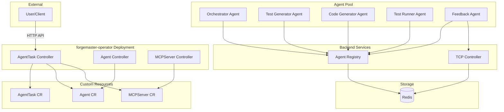
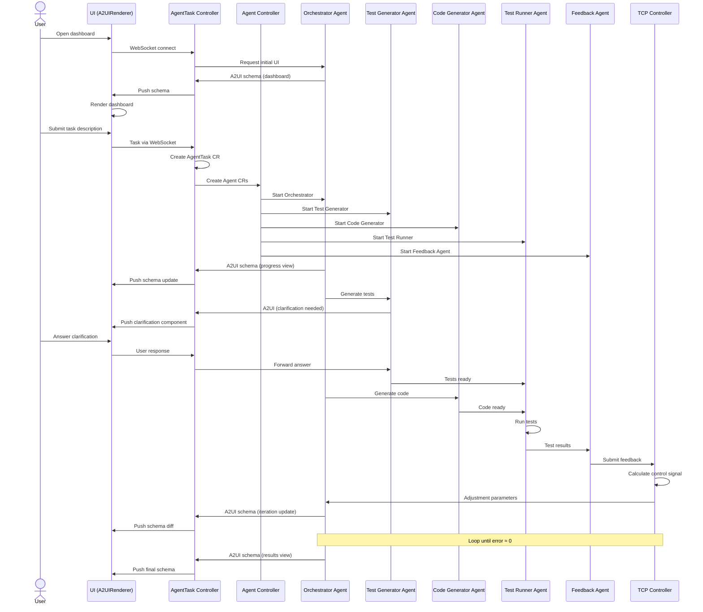

## Entity Responsibilities

This document describes every entity in the ForgeMaster system and its responsibilities.

---

## Entity Categories

| Category | What it is | Deployment Model | Examples |
|----------|-----------|------------------|----------|
| **Controllers** | Kubernetes operators that watch and reconcile CRDs | Single `forgemaster-operator` Deployment | AgentTask Controller, Agent Controller |
| **Backend Services** | HTTP services that don't reconcile CRDs | Separate Deployments | TCP Controller, Agent Registry |
| **Agents** | LLM-powered workers that execute tasks | Dynamic pods per task | Orchestrator, Code Generator |
| **CRDs** | Kubernetes Custom Resources (data, not processes) | Stored in etcd | AgentTask, Agent, MCPServer |
| **Infrastructure** | Stateful storage systems | Helm-managed Deployments | Redis |

**Why this grouping?**

```
┌─────────────────────────────────────────────────────────────────────────┐
│                         CONTROL PLANE                                    │
│  ┌────────────────────────────┐    ┌────────────────────────────────┐   │
│  │   Operator Controllers     │    │      Backend Services          │   │
│  │   (CRD Reconciliation)     │    │      (HTTP APIs)               │   │
│  │                            │    │                                │   │
│  │   • Watch K8s resources    │    │   • Receive HTTP requests      │   │
│  │   • Reconcile desired      │    │   • Stateless (Redis state)    │   │
│  │     state vs actual        │    │   • Don't manage K8s resources │   │
│  │   • Create/delete pods     │    │   • Runtime coordination       │   │
│  └────────────────────────────┘    └────────────────────────────────┘   │
└─────────────────────────────────────────────────────────────────────────┘

┌─────────────────────────────────────────────────────────────────────────┐
│                          DATA PLANE                                      │
│  ┌────────────────────────────┐    ┌────────────────────────────────┐   │
│  │         Agents             │    │       Infrastructure           │   │
│  │    (Task Execution)        │    │       (State Storage)          │   │
│  │                            │    │                                │   │
│  │   • LLM-powered            │    │   • Redis: context, registry   │   │
│  │   • Ephemeral (per task)   │    │   • Persistent across tasks    │   │
│  │   • Communicate via A2A    │    │                                │   │
│  │   • Use MCP tools          │    │                                │   │
│  └────────────────────────────┘    └────────────────────────────────┘   │
└─────────────────────────────────────────────────────────────────────────┘
```

---

## Architecture Overview



---

## Controllers

> **See also:** [K8s Deployment](05-k8s-deployment.md), [Backend Services](12-backend-services.md)

### AgentTask Controller

| Responsibility | Description |
|----------------|-------------|
| WebSocket Hub | Real-time communication with UI via WebSocket |
| A2UI Schema Relay | Receive A2UI schemas from agents, push to UI |
| Schema Caching | Cache schemas, send diffs for efficiency |
| Task Initialization | Create AgentTask CR |
| Agent Provisioning | Create Agent CRs for required agents |
| MCP Provisioning | Create MCPServer CRs for required tools |
| Namespace Management | Create isolated namespace for each task |
| Status Tracking | Update AgentTask status throughout lifecycle |
| Cleanup | Delete namespace and resources when task completes |

**Does NOT do:** Runtime feedback loop, Agent health monitoring, MCP server lifecycle

---

### Agent Controller

| Responsibility | Description |
|----------------|-------------|
| Agent Lifecycle | Start, stop, restart Agent pods |
| Health Monitoring | Watch agent health via Registry |
| Scaling | Scale agent replicas based on load |
| Pod Management | Create/delete Kubernetes pods for agents |
| Resource Limits | Enforce CPU/memory limits per agent |
| Restart Policy | Handle agent crashes with exponential backoff |

**Does NOT do:** Decide which agents to create, Route tasks to agents

---

### MCPServer Controller

| Responsibility | Description |
|----------------|-------------|
| MCP Lifecycle | Start, stop MCP server pods |
| Tool Registration | Register MCP tools with agents |
| Secret Injection | Mount API keys/credentials into MCP pods |
| Health Checks | Verify MCP servers are responding |
| Connection Management | Maintain MCP endpoint information |

**Does NOT do:** Decide which MCP servers to provision, Execute tools

---

## Backend Services

> **See also:** [Feedback Loop](03-feedback-loop.md), [Agent Registry](06-agent-registry.md), [Backend Services](12-backend-services.md)

### TCP Controller

| Responsibility | Description |
|----------------|-------------|
| Feedback Loop | PID-like control loop during task execution |
| Error Signal | Calculate error from test results (failed/total) |
| Control Signal | Compute adjustment parameters for agents |
| Context History | Store iteration history in Redis |
| Convergence Detection | Detect when task is converged (error ≈ 0) |
| Strategy Adjustment | Recommend strategy changes based on patterns |

**T-C-P Components:**

| Component | Role |
|-----------|------|
| **T (Task)** | Parse current error, react to test failures |
| **C (Context)** | Leverage history, learned patterns from past iterations |
| **P (Prediction)** | Anticipate failures, adapt proactively |

**Does NOT do:** Create agents, Run tests

---

### Agent Registry

| Responsibility | Description |
|----------------|-------------|
| Registration | Accept agent registrations on startup |
| Heartbeat | Track agent liveness via periodic heartbeats |
| Discovery | Enable agents to find each other by skill |
| Skill Matching | Index agents by capabilities for lookup |
| Deregistration | Remove agents on shutdown or timeout |
| Load Tracking | Track current load per agent |

**Does NOT do:** Start/stop agents, Route tasks

---

## Agents

> **See also:** [Task Lifecycle](04-task-lifecycle.md), [Orchestrator Spec](04b-orchestrator-spec.md), [Agent Creation](04a-agent-creation.md)

### Orchestrator Agent

| Responsibility | Description |
|----------------|-------------|
| Task Decomposition | Break complex tasks into subtasks |
| Agent Selection | Query Registry, select best agent for each subtask |
| Task Routing | Route subtasks to selected agents via A2A |
| Progress Tracking | Monitor subtask completion |
| Result Aggregation | Combine results from multiple agents |
| Dynamic Provisioning | Request new agents if needed |
| A2UI Generation | Generate dashboard A2UI schemas for current task state |
| Clarification UI | Generate context-aware clarification components |

**Does NOT do:** Execute tasks directly, Run tests, Calculate error signal

---

### Test Generator Agent

| Responsibility | Description |
|----------------|-------------|
| Requirement Analysis | Analyze task description for testable requirements |
| Gherkin Generation | Create BDD test scenarios (Given-When-Then) |
| Edge Case Coverage | Generate tests for edge cases and errors |
| Test Storage | Store tests in ConfigMap for Test Runner |

**Does NOT do:** Run tests, Generate code

---

### Code Generator Agent

| Responsibility | Description |
|----------------|-------------|
| Code Generation | Generate code based on task requirements |
| MCP Tool Usage | Use filesystem, GitHub MCP tools |
| Iteration | Improve code based on test feedback |
| Artifact Storage | Store code artifacts |

**Does NOT do:** Run tests, Validate outcomes

---

### Test Runner Agent

| Responsibility | Description |
|----------------|-------------|
| Test Execution | Run Gherkin tests against agent output |
| Framework Selection | Use appropriate BDD framework (behave, cucumber-js, godog) |
| Result Collection | Collect pass/fail per scenario |
| Report Generation | Generate test reports |

**Does NOT do:** Generate tests, Calculate error signal

---

### Outcome Validator Agent

| Responsibility | Description |
|----------------|-------------|
| Real-world Verification | Verify task actually worked beyond tests |
| External Checks | Call external APIs, verify data, check emails |
| False Positive Detection | Catch cases where tests pass but task failed |

**Why needed:** Tests verify HOW (implementation). Outcomes verify WHAT (it actually worked).

---

### Feedback Agent

| Responsibility | Description |
|----------------|-------------|
| Metric Collection | Gather test results, execution metrics |
| Error Calculation | Calculate error signal (failed/total) |
| Pattern Analysis | Identify failure patterns across iterations |
| Feedback Submission | Submit feedback to TCP Controller |

---

## Custom Resource Definitions (CRDs)

> **See also:** [CRD Specifications](09-crd-specifications.md) for full schemas

| CRD | Created by | Managed by | Purpose |
|-----|-----------|------------|---------|
| AgentTask | AgentTask Controller | AgentTask Controller | Task definition and status |
| Agent | AgentTask Controller / Orchestrator | Agent Controller | Agent instance configuration |
| MCPServer | AgentTask Controller | MCPServer Controller | MCP server configuration |

---

## Infrastructure

> **See also:** [Infrastructure](09-infrastructure.md), [Helm Charts](10-helm-charts.md)

| Component | Purpose |
|-----------|---------|
| Redis | TCP context, Registry data, Caching, Pub/Sub |

---

## A2UI Architecture

> **See:** [07-a2ui-architecture.md](07-a2ui-architecture.md) for full A2UI architecture documentation.

The UI is a pure A2UI renderer with no business logic. Agents generate UI schemas dynamically based on task context. The AgentTask Controller acts as a WebSocket hub, caching schemas and pushing diffs to the UI.

---

## Entity Interaction Summary


