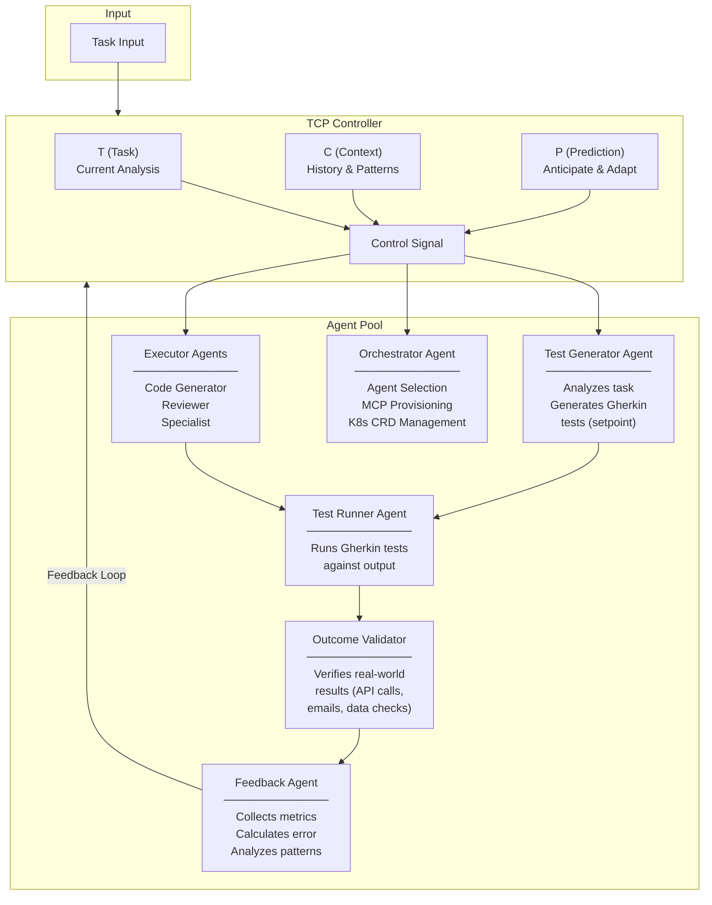
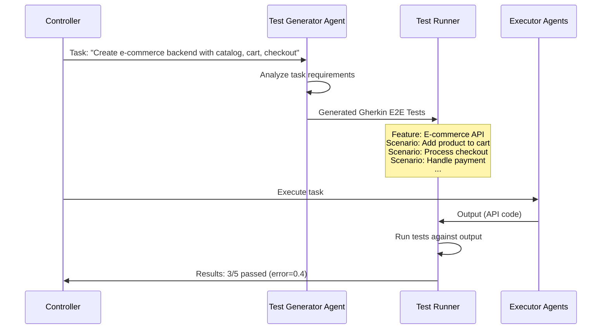

## Architecture Diagram



---

## Components

### 1. TCP Controller (Task-Context-Prediction)

The brain of the system. Receives task input and feedback, computes control signal.

**Responsibilities:**
- **T (Task):** Parse and understand incoming task, react to current error
- **C (Context):** Store and leverage history, learned patterns
- **P (Prediction):** Anticipate failures, adapt proactively
- Compute control signal to determine next action
- Decide: retry, spawn new agent, change strategy, or complete

### 2. Test Generator Agent

Creates the definition of success for each task using **Gherkin** syntax (Given-When-Then).

**Input:** Task description
**Output:** Set of E2E tests in Gherkin format



**Example Gherkin Output:**

```gherkin
Feature: E-commerce Backend API
  As a customer
  I want to browse products, manage cart, and checkout
  So that I can purchase items online

  Scenario: Add product to cart
    Given the API is running
    And a product exists with id "prod-123"
    When I send a POST request to "/cart/items" with body:
      """
      {
        "product_id": "prod-123",
        "quantity": 2
      }
      """
    Then the response status should be 201
    And the cart should contain 2 items

  Scenario: View shopping cart
    Given items exist in my cart
    When I send a GET request to "/cart"
    Then the response status should be 200
    And the response should contain "items"
    And the response should contain "total_price"

  Scenario: Process checkout with Stripe
    Given items exist in my cart
    And I have a valid Stripe payment method
    When I send a POST request to "/checkout" with body:
      """
      {
        "payment_method_id": "pm_card_visa",
        "shipping_address": {
          "street": "123 Main St",
          "city": "San Francisco",
          "zip": "94102"
        }
      }
      """
    Then the response status should be 201
    And the response should contain "order_id"
    And the Stripe charge should be created

  Scenario: Invalid payment fails gracefully
    Given items exist in my cart
    When I send a POST request to "/checkout" with invalid payment
    Then the response status should be 402
    And the response should contain "payment_error"
    And the cart should remain unchanged
```

### 3. Orchestrator Agent

An agent that provisions and manages execution resources.

**Responsibilities:**
- Select appropriate agents for the task
- Create new agents if needed (dynamically define new Agent CRDs)
- Provision MCP servers
- Manage K8s CRDs (AgentTask, Agent, MCPServer, TestSuite)
- Manage lifecycle (start, stop, scale)

### 4. Executor Agents

Task-specific agents that do the actual work.

**Types:**
- Code Generator
- Code Reviewer
- Data Processor
- Research Agent
- Specialist Agents (created on demand)

### 5. Test Runner Agent

An agent that executes Gherkin E2E tests against the output using BDD frameworks.

**Input:** Gherkin feature files + Agent output
**Output:** Test results (pass/fail per scenario)

**Supported Runners:**
- Python: `behave`, `pytest-bdd`
- JavaScript: `cucumber-js`
- Java: `cucumber-jvm`
- Go: `godog`

### 6. Outcome Validator

Verifies real-world results beyond self-generated tests. Since tests are created by the system itself, they could have false positives. Outcome validation checks that the task **actually worked**.

**Why needed:** Tests verify the HOW (implementation). Outcomes verify the WHAT (it actually worked).

**Validation by Task Type:**

| Task Type | Outcome Verification |
|-----------|---------------------|
| Ticket Booking | Confirmation email received, booking ID valid in external system |
| ETL Pipeline | Data exists in target DB, row counts match, checksums valid |
| API Development | External client can call endpoints, integration tests pass |
| ML Training | Metrics improve on held-out validation set |
| Test Automation | Generated tests actually catch bugs when code is broken |

**Input:** Task output + task type
**Output:** Outcome validation results (verified/failed per check)

### 7. Feedback Collector Agent

An agent that gathers metrics, analyzes results, and calculates the error signal for the TCP Controller.

**Responsibilities:**
- Collect test results from Test Runner Agent
- Collect outcome validation results from Outcome Validator
- Gather execution metrics (time, tokens, retries)
- Calculate combined error signal
- Analyze failure patterns
- Provide recommendations for next iteration

**Error Signal Calculation:**
```
error = (failed_tests + failed_outcomes) / total_checks
```

**Metrics:**
- Test pass rate
- Outcome validation rate
- Execution time
- Token usage
- Retry count
- Agent performance trends

---
