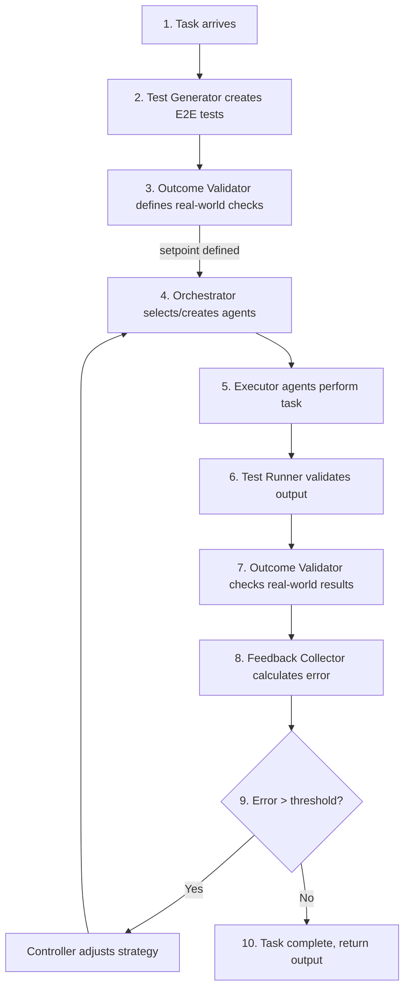
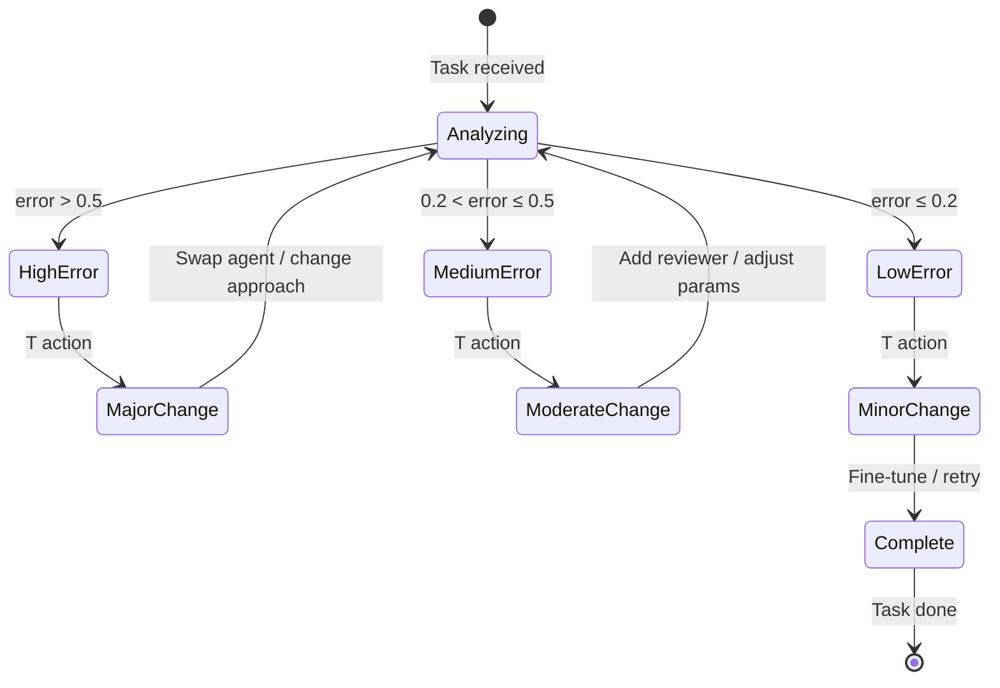

## Feedback Loop Flow



### Dual Validation

The system validates success through two independent checks:

| Validation Type | What It Checks | Example |
|-----------------|----------------|---------|
| **Test Validation** | Implementation correctness | "Checkout flow completes, Stripe charge created" |
| **Outcome Validation** | Real-world result | "Order confirmation email sent, payment in Stripe dashboard" |

> **Why both?** Tests are self-generated, so could have false positives. Outcome checks verify the task actually worked in the real world.

---

## TCP Control Logic



### T (Task) — Immediate Response

```python
t_action = Kt * current_error
```

| Error Level | Action |
|-------------|--------|
| High (> 0.5) | Major change: swap agent, change approach |
| Medium (0.2-0.5) | Moderate: add reviewer agent, adjust params |
| Low (< 0.2) | Minor: fine-tune, retry failed tests |

### C (Context) — Accumulated Learning

```python
context += current_error * dt
c_action = Kc * context
```

Tracks patterns over time:
- Same task type keeps failing → flag for model change
- Certain agents consistently underperform → deprioritize
- Successful patterns → remember and reuse

### P (Prediction) — Predictive Adjustment

```python
prediction = (current_error - previous_error) / dt
p_action = Kp * prediction
```

| Trend | Meaning | Action |
|-------|---------|--------|
| Error increasing | Getting worse | Preemptive intervention |
| Error stable | No progress | Try different approach |
| Error decreasing | Improving | Continue current strategy |

---
