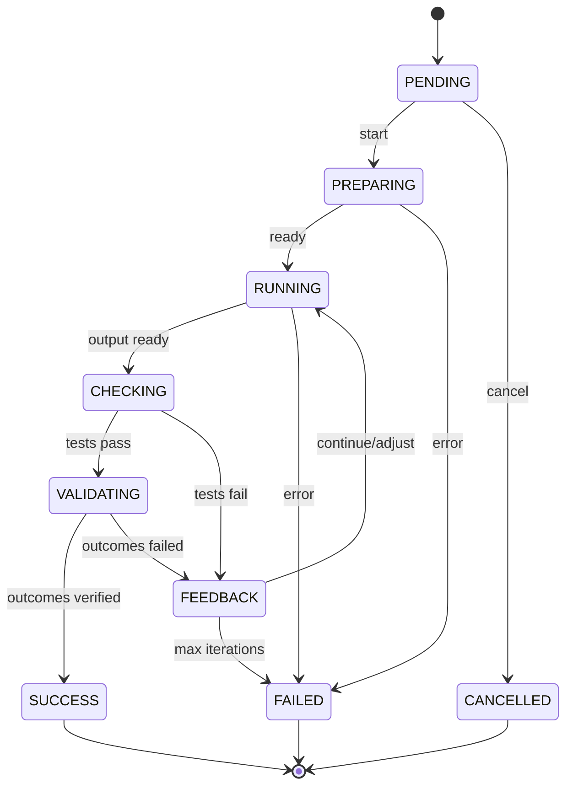
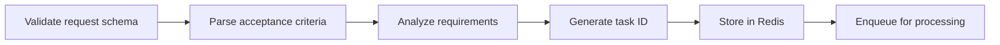

# Task Lifecycle

## Overview

A **Task** is the unit of work submitted to ForgeMaster. Each task gets its own K8s namespace with dedicated agents and MCP servers.

## Task Submission

### API Endpoint

```
POST /api/v1/tasks
```

### Request Schema

```json
{
  "name": "user-management-api",
  "description": "Build REST API for user management with CRUD operations",
  "requirements": {
    "type": "web-api",
    "language": "rust",
    "framework": "axum",
    "features": ["authentication", "validation", "pagination"]
  },
  "acceptance_criteria": [
    "Given a valid user payload, when POST /users, then return 201",
    "Given an invalid email, when POST /users, then return 400",
    "Given existing user ID, when GET /users/{id}, then return user"
  ],
  "constraints": {
    "timeout_minutes": 60,
    "max_iterations": 10,
    "resource_limit": "medium"
  }
}
```

### Response

```json
{
  "task_id": "task-a1b2c3d4",
  "namespace": "task-a1b2c3d4",
  "status": "pending",
  "created_at": "2026-02-04T10:00:00Z",
  "estimated_agents": ["test-generator", "code-generator", "reviewer"]
}
```

## Task State Machine



### States

| State | Description | Actions |
|-------|-------------|---------|
| `PENDING` | Task submitted, awaiting processing | Validate, queue |
| `PREPARING` | Creating namespace, deploying agents/MCPs | Provision resources |
| `RUNNING` | Agents executing task | Monitor, collect output |
| `CHECKING` | Running E2E tests against output | Execute test suite |
| `VALIDATING` | Verifying real-world outcomes | Check actual results |
| `FEEDBACK` | Analyzing results, deciding next action | TCP Controller decision |
| `SUCCESS` | Tests pass AND outcomes verified | Archive, cleanup |
| `FAILED` | Max iterations or timeout reached | Archive, cleanup |
| `CANCELLED` | User cancelled task | Cleanup |

## Lifecycle Phases

### Phase 1: Task Ingestion



### Phase 2: Namespace Preparation

```
┌─────────────────────────────────────────────────────────────────┐
│                   NAMESPACE PREPARATION                          │
│                                                                  │
│   1. Create K8s namespace: task-{id}                            │
│   2. Apply resource quotas                                       │
│   3. Create network policies                                     │
│   4. Deploy MCP servers (github, filesystem, etc.)              │
│   5. Wait for MCP servers ready                                  │
│   6. Deploy agents based on skill requirements                   │
│   7. Wait for agents to register in Agent Registry               │
│   8. Create TestSuite CRD with Gherkin tests                    │
└─────────────────────────────────────────────────────────────────┘
```

### Phase 3: Execution Loop

```
┌─────────────────────────────────────────────────────────────────┐
│                     EXECUTION LOOP                               │
│                                                                  │
│   ┌──────────────────────────────────────────────────────┐      │
│   │  ITERATION N                                          │      │
│   │                                                       │      │
│   │  1. Orchestrator assigns work to agents               │      │
│   │  2. Agents execute (generate tests, write code)       │      │
│   │  3. Collect agent outputs                             │      │
│   │  4. Run E2E test suite                                │      │
│   │  5. Calculate error signal                            │      │
│   │  6. TCP Controller computes control action            │      │
│   │  7. Apply action (continue, swap, add agent)          │      │
│   └──────────────────────────────────────────────────────┘      │
│                              │                                   │
│                              ▼                                   │
│              ┌───────────────────────────────┐                   │
│              │  error == 0 OR max_iterations │                   │
│              └───────────────────────────────┘                   │
│                       │              │                           │
│                  YES  │              │  NO                       │
│                       ▼              ▼                           │
│                   SUCCESS        CONTINUE                        │
└─────────────────────────────────────────────────────────────────┘
```

### Phase 4: Completion

```
┌─────────────────────────────────────────────────────────────────┐
│                       COMPLETION                                 │
│                                                                  │
│   On SUCCESS:                                                    │
│   1. Archive artifacts to GitHub                                 │
│   2. Extract subsystem template (for reuse)                      │
│   3. Update pattern memory                                       │
│   4. Notify user                                                 │
│   5. Schedule namespace cleanup (after retention period)         │
│                                                                  │
│   On FAILED:                                                     │
│   1. Archive partial artifacts                                   │
│   2. Log failure reason and iteration history                    │
│   3. Notify user with failure report                             │
│   4. Schedule namespace cleanup                                  │
└─────────────────────────────────────────────────────────────────┘
```

## Namespace Structure

```yaml
apiVersion: v1
kind: Namespace
metadata:
  name: task-a1b2c3d4
  labels:
    forgemaster.io/task-id: a1b2c3d4
    forgemaster.io/task-name: user-management-api
    forgemaster.io/created-at: "2026-02-04T10:00:00Z"
  annotations:
    forgemaster.io/timeout: "60m"
    forgemaster.io/max-iterations: "10"
---
apiVersion: v1
kind: ResourceQuota
metadata:
  name: task-quota
  namespace: task-a1b2c3d4
spec:
  hard:
    requests.cpu: "4"
    requests.memory: 8Gi
    limits.cpu: "8"
    limits.memory: 16Gi
    pods: "20"
```

## Task CRD

```yaml
apiVersion: forgemaster.io/v1alpha1
kind: AgentTask
metadata:
  name: user-management-api
  namespace: task-a1b2c3d4
spec:
  description: "Build REST API for user management"
  requirements:
    type: web-api
    language: rust
  acceptance_criteria:
    - "Given valid user, when POST /users, then 201"
  constraints:
    timeout_minutes: 60
    max_iterations: 10
  tcp_controller:
    coefficients:
      task: 1.0
      context: 0.5
      prediction: 0.3
    thresholds:
      swap_agent: 0.5
      add_agent: 0.2
status:
  phase: Running
  iteration: 3
  error_signal: 0.25
  agents_deployed:
    - test-generator-abc123
    - code-generator-def456
  last_test_run:
    passed: 6
    failed: 2
    total: 8
  history:
    - iteration: 1
      error: 0.75
      action: AddAgent
    - iteration: 2
      error: 0.50
      action: Continue
    - iteration: 3
      error: 0.25
      action: Continue
```

## Cleanup Policy

### Retention Period

| Task Status | Namespace Retention | Artifact Retention |
|-------------|--------------------|--------------------|
| SUCCESS | 1 hour | Permanent (GitHub) |
| FAILED | 24 hours | 30 days |
| CANCELLED | Immediate | None |

### Cleanup Process

```
1. Task completes (SUCCESS/FAILED)
2. Wait for retention period
3. Archive logs and metrics
4. Delete namespace (cascades to all resources)
5. Update task record in database
```

## API Endpoints

| Method | Endpoint | Description |
|--------|----------|-------------|
| POST | `/api/v1/tasks` | Submit new task |
| GET | `/api/v1/tasks/{id}` | Get task status |
| GET | `/api/v1/tasks/{id}/logs` | Stream task logs |
| GET | `/api/v1/tasks/{id}/artifacts` | List artifacts |
| DELETE | `/api/v1/tasks/{id}` | Cancel task |
| GET | `/api/v1/tasks` | List all tasks |

## Error Handling

### Retryable Errors

- Agent pod crash → Restart pod
- MCP server timeout → Retry request
- Network issues → Backoff and retry

### Non-Retryable Errors

- Invalid task schema → Reject with 400
- Namespace creation failed → Fail task
- All agents exhausted → Fail task with report

### Timeout Handling

```
If task_duration > timeout_minutes:
  1. Set status = FAILED
  2. reason = "Timeout exceeded"
  3. Capture current state
  4. Archive partial results
  5. Initiate cleanup
```
