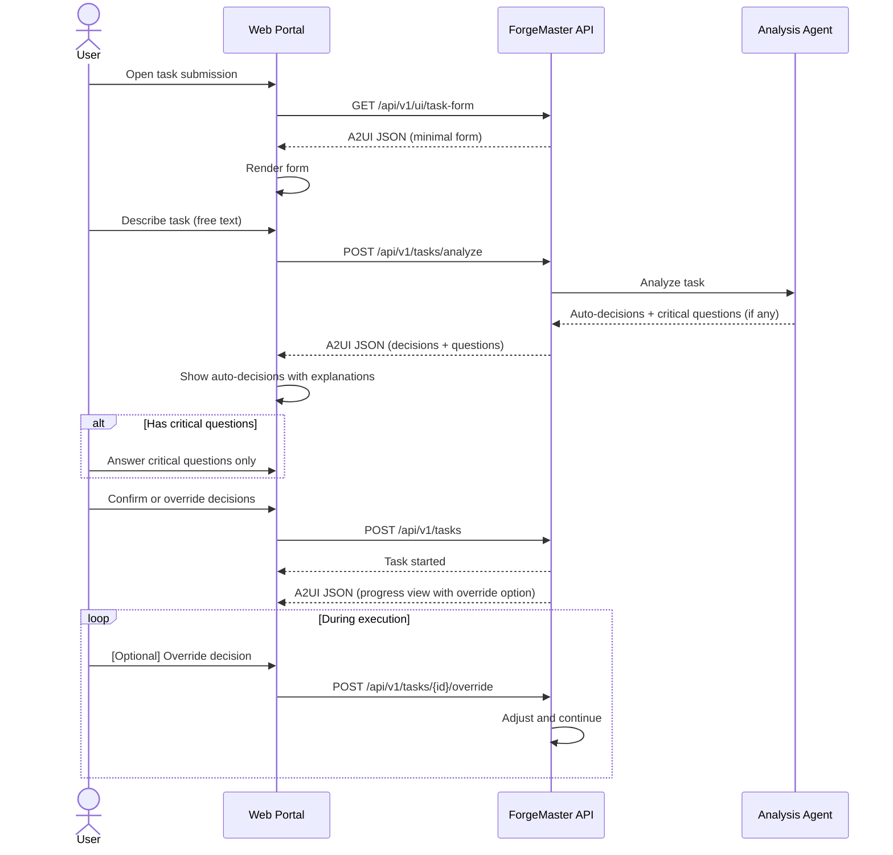
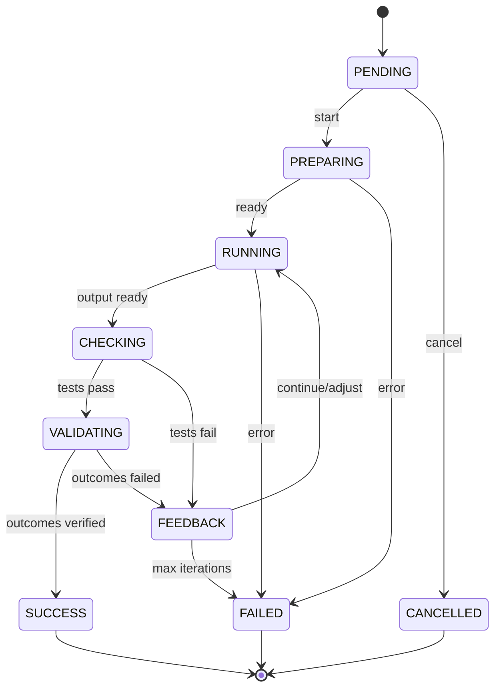
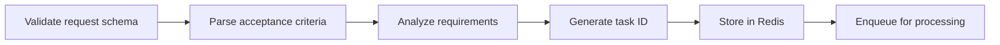

# Task Lifecycle

## Overview

A **Task** is the unit of work submitted to ForgeMaster. Each task gets its own K8s namespace with dedicated agents and MCP servers.

## Task Submission

Users submit tasks through a **Web Portal** powered by [A2UI](https://github.com/google/A2UI) (Agent-to-User Interface). A2UI is a declarative JSON format that allows the system to generate rich, interactive UIs without executable code.

### Why A2UI?

| Benefit | Description |
|---------|-------------|
| **Security-First** | Declarative data format, not executable code |
| **Dynamic UI** | System generates forms based on task type |
| **Auto-decisions** | System chooses sensible defaults, explains reasoning |
| **Real-time Updates** | Live progress, stages, and status display |
| **Interruptible** | User can override any auto-decision during execution |

### Design Principle: Minimal Questions

ForgeMaster is designed for **autonomous execution**. The system should:

1. **Ask only critical questions** — Things that fundamentally change the outcome
2. **Auto-select everything else** — Language, database, framework, architecture
3. **Explain decisions** — Show what was chosen and why
4. **Allow override** — User can interrupt and change any decision

```
┌─────────────────────────────────────────────────────────────────────────┐
│                     QUESTION HIERARCHY                                   │
│                                                                          │
│   MUST ASK (blocking, no good default):                                 │
│   ─────────────────────────────────────                                 │
│   • Payment provider API keys (security-critical)                       │
│   • External service credentials                                         │
│   • Deployment target (if multiple options)                             │
│                                                                          │
│   AUTO-DECIDE (choose best, explain why):                               │
│   ────────────────────────────────────────                               │
│   • Language → based on task type, team patterns, subsystem match       │
│   • Database → based on data model, scale requirements                  │
│   • Framework → based on language choice, task requirements             │
│   • Architecture → based on complexity, scalability needs               │
│   • Auth method → based on task description, security level             │
│                                                                          │
│   User can override ANY auto-decision at any time                       │
└─────────────────────────────────────────────────────────────────────────┘
```

### Task Submission Flow



### A2UI: Task Submission Form (Minimal)

Only ask for the task description — everything else is auto-decided:

```json
{
  "version": "0.8",
  "components": [
    {
      "id": "header",
      "type": "text",
      "properties": {
        "content": "What do you want to build?",
        "style": "headline"
      }
    },
    {
      "id": "description-input",
      "type": "textField",
      "properties": {
        "label": "Describe your task",
        "placeholder": "e.g., Create an e-commerce backend with product catalog, shopping cart, and checkout with Stripe...",
        "multiline": true,
        "rows": 5,
        "hint": "Be specific about features. The system will auto-select language, database, and architecture."
      }
    },
    {
      "id": "submit-btn",
      "type": "button",
      "properties": {
        "label": "Analyze & Start",
        "action": "submit",
        "style": "primary"
      }
    }
  ]
}
```

### A2UI: Auto-Decisions with Explanations

After analysis, show what the system decided and why:

```json
{
  "version": "0.8",
  "components": [
    {
      "id": "decisions-header",
      "type": "text",
      "properties": {
        "content": "Ready to build your e-commerce backend",
        "style": "headline"
      }
    },
    {
      "id": "decisions-intro",
      "type": "alert",
      "properties": {
        "type": "info",
        "message": "We've analyzed your task and made the following choices. You can override any decision."
      }
    },
    {
      "id": "auto-decisions",
      "type": "card",
      "properties": {
        "title": "Auto-Selected Configuration",
        "children": ["decision-list"]
      }
    },
    {
      "id": "decision-list",
      "type": "decisionList",
      "properties": {
        "decisions": [
          {
            "key": "Language",
            "value": "Rust",
            "reason": "Best for high-performance APIs, matches your previous projects",
            "overridable": true,
            "options": ["Rust", "Go", "TypeScript", "Python"]
          },
          {
            "key": "Framework",
            "value": "Axum",
            "reason": "Modern async Rust framework, excellent for REST APIs",
            "overridable": true,
            "options": ["Axum", "Actix-web", "Rocket"]
          },
          {
            "key": "Database",
            "value": "PostgreSQL",
            "reason": "Relational data (products, orders, users), ACID compliance needed",
            "overridable": true,
            "options": ["PostgreSQL", "MySQL", "MongoDB"]
          },
          {
            "key": "Payment",
            "value": "Stripe",
            "reason": "Mentioned in task description",
            "overridable": true,
            "options": ["Stripe", "PayPal", "Square"]
          },
          {
            "key": "Auth",
            "value": "JWT + Email/Password",
            "reason": "Standard for e-commerce, secure token-based auth",
            "overridable": true,
            "options": ["JWT", "Session", "OAuth only"]
          }
        ]
      }
    },
    {
      "id": "critical-questions",
      "type": "card",
      "properties": {
        "title": "Required Information",
        "subtitle": "We need this to proceed",
        "children": ["stripe-key-input"]
      }
    },
    {
      "id": "stripe-key-input",
      "type": "textField",
      "properties": {
        "label": "Stripe API Key (or 'skip' to use test mode)",
        "placeholder": "sk_live_... or 'skip'",
        "sensitive": true,
        "required": true
      }
    },
    {
      "id": "start-btn",
      "type": "button",
      "properties": {
        "label": "Start Building",
        "action": "submit",
        "style": "primary"
      }
    }
  ]
}
```

### A2UI: Override During Execution

User can interrupt and change decisions while task is running:

```json
{
  "version": "0.8",
  "components": [
    {
      "id": "progress-header",
      "type": "card",
      "properties": {
        "children": ["task-name", "status-badge", "override-btn"]
      }
    },
    {
      "id": "task-name",
      "type": "text",
      "properties": {
        "content": "ecommerce-backend",
        "style": "headline"
      }
    },
    {
      "id": "status-badge",
      "type": "chip",
      "properties": {
        "label": "RUNNING - Iteration 2/10",
        "color": "blue"
      }
    },
    {
      "id": "override-btn",
      "type": "button",
      "properties": {
        "label": "Override Decisions",
        "action": "show_override_panel",
        "style": "secondary",
        "icon": "settings"
      }
    },
    {
      "id": "current-config",
      "type": "expandable",
      "properties": {
        "title": "Current Configuration",
        "expanded": false,
        "children": ["config-summary"]
      }
    },
    {
      "id": "config-summary",
      "type": "keyValueList",
      "properties": {
        "items": [
          {"key": "Language", "value": "Rust (Axum)", "action": "override:language"},
          {"key": "Database", "value": "PostgreSQL", "action": "override:database"},
          {"key": "Payment", "value": "Stripe", "action": "override:payment"}
        ],
        "hint": "Click any item to change"
      }
    },
    {
      "id": "override-warning",
      "type": "alert",
      "properties": {
        "type": "warning",
        "message": "Changing configuration will restart from the current iteration with new settings.",
        "visible": false
      }
    }
  ]
}
```

### Override API

```
POST /api/v1/tasks/{id}/override
{
  "decisions": {
    "database": "MongoDB"
  },
  "reason": "Need flexible schema for product variants"
}

Response:
{
  "status": "accepted",
  "action": "restarting_iteration",
  "message": "Switching to MongoDB. Iteration 2 will restart with new configuration.",
  "rollback_available": true
}
```

### A2UI: Live Progress View

Once a task is running, the portal shows real-time progress:

```json
{
  "version": "0.8",
  "components": [
    {
      "id": "task-header",
      "type": "text",
      "properties": {
        "content": "Task: ecommerce-backend",
        "style": "headline"
      }
    },
    {
      "id": "status-badge",
      "type": "chip",
      "properties": {
        "label": "RUNNING",
        "color": "blue"
      }
    },
    {
      "id": "progress-stepper",
      "type": "stepper",
      "properties": {
        "steps": [
          {"label": "Submitted", "status": "completed"},
          {"label": "Preparing", "status": "completed"},
          {"label": "Generating Tests", "status": "completed"},
          {"label": "Writing Code", "status": "active"},
          {"label": "Testing", "status": "pending"},
          {"label": "Validating", "status": "pending"}
        ]
      }
    },
    {
      "id": "iteration-info",
      "type": "card",
      "properties": {
        "title": "Iteration 3 of 10",
        "children": ["error-signal", "test-results"]
      }
    },
    {
      "id": "error-signal",
      "type": "progressBar",
      "properties": {
        "label": "Error Signal",
        "value": 0.25,
        "max": 1.0,
        "color": "green"
      }
    },
    {
      "id": "test-results",
      "type": "text",
      "properties": {
        "content": "Tests: 6/8 passing",
        "style": "body"
      }
    },
    {
      "id": "agent-list",
      "type": "list",
      "properties": {
        "title": "Active Agents",
        "items": [
          {"icon": "check", "text": "test-generator - completed"},
          {"icon": "sync", "text": "code-generator - running"},
          {"icon": "clock", "text": "reviewer - waiting"}
        ]
      }
    },
    {
      "id": "logs-panel",
      "type": "expandable",
      "properties": {
        "title": "Live Logs",
        "children": ["log-stream"]
      }
    },
    {
      "id": "log-stream",
      "type": "logViewer",
      "properties": {
        "source": "/api/v1/tasks/task-a1b2c3d4/logs",
        "streaming": true
      }
    },
    {
      "id": "cancel-btn",
      "type": "button",
      "properties": {
        "label": "Cancel Task",
        "action": "cancel",
        "style": "danger"
      }
    }
  ]
}
```

### A2UI: Completion View

When a task completes, the portal shows results and artifacts:

```json
{
  "version": "0.8",
  "components": [
    {
      "id": "success-banner",
      "type": "alert",
      "properties": {
        "type": "success",
        "title": "Task Completed Successfully",
        "message": "Your e-commerce backend is ready!"
      }
    },
    {
      "id": "summary-card",
      "type": "card",
      "properties": {
        "title": "Summary",
        "children": ["summary-stats"]
      }
    },
    {
      "id": "summary-stats",
      "type": "keyValueList",
      "properties": {
        "items": [
          {"key": "Duration", "value": "23 minutes"},
          {"key": "Iterations", "value": "5"},
          {"key": "Tests Passed", "value": "12/12"},
          {"key": "Outcome Validated", "value": "Yes"}
        ]
      }
    },
    {
      "id": "artifacts-section",
      "type": "card",
      "properties": {
        "title": "Artifacts",
        "children": ["artifact-list"]
      }
    },
    {
      "id": "artifact-list",
      "type": "list",
      "properties": {
        "items": [
          {"icon": "github", "text": "Source Code", "action": "open_url", "url": "https://github.com/..."},
          {"icon": "file", "text": "API Documentation", "action": "download"},
          {"icon": "test", "text": "Test Suite", "action": "download"}
        ]
      }
    },
    {
      "id": "actions",
      "type": "buttonGroup",
      "properties": {
        "buttons": [
          {"label": "View in GitHub", "action": "open_url", "style": "primary"},
          {"label": "Download All", "action": "download_all", "style": "secondary"},
          {"label": "Submit Another Task", "action": "new_task", "style": "text"}
        ]
      }
    }
  ]
}
```

### API Endpoint

```
POST /api/v1/tasks
```

### Request Schema

```json
{
  "name": "ecommerce-backend",
  "description": "Create e-commerce backend with product catalog, shopping cart, and checkout flow",
  "requirements": {
    "type": "web-api",
    "language": "rust",
    "framework": "axum",
    "features": ["product-catalog", "shopping-cart", "checkout", "stripe-integration"]
  },
  "acceptance_criteria": [
    "Given a product exists, when POST /cart/items, then add to cart",
    "Given items in cart, when POST /checkout, then process payment via Stripe",
    "Given valid payment, when checkout completes, then create order"
  ],
  "constraints": {
    "timeout_minutes": 60,
    "max_iterations": 10,
    "resource_limit": "medium"
  }
}
```

### Response

```json
{
  "task_id": "task-a1b2c3d4",
  "namespace": "task-a1b2c3d4",
  "status": "pending",
  "created_at": "2026-02-04T10:00:00Z",
  "estimated_agents": ["test-generator", "code-generator", "reviewer"]
}
```

## Task State Machine



### States

| State | Description | Actions |
|-------|-------------|---------|
| `PENDING` | Task submitted, awaiting processing | Validate, queue |
| `PREPARING` | Creating namespace, deploying agents/MCPs | Provision resources |
| `RUNNING` | Agents executing task | Monitor, collect output |
| `CHECKING` | Running E2E tests against output | Execute test suite |
| `VALIDATING` | Verifying real-world outcomes | Check actual results |
| `FEEDBACK` | Analyzing results, deciding next action | TCP Controller decision |
| `SUCCESS` | Tests pass AND outcomes verified | Archive, cleanup |
| `FAILED` | Max iterations or timeout reached | Archive, cleanup |
| `CANCELLED` | User cancelled task | Cleanup |

## Lifecycle Phases

### Phase 1: Task Ingestion



### Phase 2: Namespace Preparation

```
┌─────────────────────────────────────────────────────────────────┐
│                   NAMESPACE PREPARATION                          │
│                                                                  │
│   1. Create K8s namespace: task-{id}                            │
│   2. Apply resource quotas                                       │
│   3. Create network policies                                     │
│   4. Deploy MCP servers (github, filesystem, etc.)              │
│   5. Wait for MCP servers ready                                  │
│   6. Deploy agents based on skill requirements                   │
│   7. Wait for agents to register in Agent Registry               │
│   8. Create TestSuite CRD with Gherkin tests                    │
└─────────────────────────────────────────────────────────────────┘
```

### Phase 3: Execution Loop

```
┌─────────────────────────────────────────────────────────────────┐
│                     EXECUTION LOOP                               │
│                                                                  │
│   ┌──────────────────────────────────────────────────────┐      │
│   │  ITERATION N                                          │      │
│   │                                                       │      │
│   │  1. Orchestrator assigns work to agents               │      │
│   │  2. Agents execute (generate tests, write code)       │      │
│   │  3. Collect agent outputs                             │      │
│   │  4. Run E2E test suite                                │      │
│   │  5. Calculate error signal                            │      │
│   │  6. TCP Controller computes control action            │      │
│   │  7. Apply action (continue, swap, add agent)          │      │
│   └──────────────────────────────────────────────────────┘      │
│                              │                                   │
│                              ▼                                   │
│              ┌───────────────────────────────┐                   │
│              │  error == 0 OR max_iterations │                   │
│              └───────────────────────────────┘                   │
│                       │              │                           │
│                  YES  │              │  NO                       │
│                       ▼              ▼                           │
│                   SUCCESS        CONTINUE                        │
└─────────────────────────────────────────────────────────────────┘
```

### Phase 4: Completion

```
┌─────────────────────────────────────────────────────────────────┐
│                       COMPLETION                                 │
│                                                                  │
│   On SUCCESS:                                                    │
│   1. Archive artifacts to GitHub                                 │
│   2. Extract subsystem template (for reuse)                      │
│   3. Update pattern memory                                       │
│   4. Notify user                                                 │
│   5. Schedule namespace cleanup (after retention period)         │
│                                                                  │
│   On FAILED:                                                     │
│   1. Archive partial artifacts                                   │
│   2. Log failure reason and iteration history                    │
│   3. Notify user with failure report                             │
│   4. Schedule namespace cleanup                                  │
└─────────────────────────────────────────────────────────────────┘
```

## Namespace Structure

```yaml
apiVersion: v1
kind: Namespace
metadata:
  name: task-a1b2c3d4
  labels:
    forgemaster.io/task-id: a1b2c3d4
    forgemaster.io/task-name: ecommerce-backend
    forgemaster.io/created-at: "2026-02-04T10:00:00Z"
  annotations:
    forgemaster.io/timeout: "60m"
    forgemaster.io/max-iterations: "10"
---
apiVersion: v1
kind: ResourceQuota
metadata:
  name: task-quota
  namespace: task-a1b2c3d4
spec:
  hard:
    requests.cpu: "4"
    requests.memory: 8Gi
    limits.cpu: "8"
    limits.memory: 16Gi
    pods: "20"
```

## Task CRD

```yaml
apiVersion: forgemaster.io/v1alpha1
kind: AgentTask
metadata:
  name: ecommerce-backend
  namespace: task-a1b2c3d4
spec:
  description: "Create e-commerce backend with product catalog, shopping cart, and checkout"
  requirements:
    type: web-api
    language: rust
  acceptance_criteria:
    - "Given product exists, when POST /cart/items, then add to cart"
  constraints:
    timeout_minutes: 60
    max_iterations: 10
  tcp_controller:
    coefficients:
      task: 1.0
      context: 0.5
      prediction: 0.3
    thresholds:
      swap_agent: 0.5
      add_agent: 0.2
status:
  phase: Running
  iteration: 3
  error_signal: 0.25
  agents_deployed:
    - test-generator-abc123
    - code-generator-def456
  last_test_run:
    passed: 6
    failed: 2
    total: 8
  history:
    - iteration: 1
      error: 0.75
      action: AddAgent
    - iteration: 2
      error: 0.50
      action: Continue
    - iteration: 3
      error: 0.25
      action: Continue
```

## Cleanup Policy

### Retention Period

| Task Status | Namespace Retention | Artifact Retention |
|-------------|--------------------|--------------------|
| SUCCESS | 1 hour | Permanent (GitHub) |
| FAILED | 24 hours | 30 days |
| CANCELLED | Immediate | None |

### Cleanup Process

```
1. Task completes (SUCCESS/FAILED)
2. Wait for retention period
3. Archive logs and metrics
4. Delete namespace (cascades to all resources)
5. Update task record in database
```

## API Endpoints

| Method | Endpoint | Description |
|--------|----------|-------------|
| POST | `/api/v1/tasks` | Submit new task |
| POST | `/api/v1/tasks/clarify` | Analyze task and get clarifying questions |
| GET | `/api/v1/tasks/{id}` | Get task status |
| GET | `/api/v1/tasks/{id}/logs` | Stream task logs |
| GET | `/api/v1/tasks/{id}/artifacts` | List artifacts |
| DELETE | `/api/v1/tasks/{id}` | Cancel task |
| GET | `/api/v1/tasks` | List all tasks |
| GET | `/api/v1/ui/task-form` | Get A2UI task submission form |
| GET | `/api/v1/ui/tasks/{id}/progress` | Get A2UI progress view (SSE) |
| GET | `/api/v1/ui/tasks/{id}/result` | Get A2UI completion view |

> See [A2UI Protocol](09-a2ui-protocol.md) for detailed A2UI integration documentation.

## Error Handling

### Retryable Errors

- Agent pod crash → Restart pod
- MCP server timeout → Retry request
- Network issues → Backoff and retry

### Non-Retryable Errors

- Invalid task schema → Reject with 400
- Namespace creation failed → Fail task
- All agents exhausted → Fail task with report

### Timeout Handling

```
If task_duration > timeout_minutes:
  1. Set status = FAILED
  2. reason = "Timeout exceeded"
  3. Capture current state
  4. Archive partial results
  5. Initiate cleanup
```
