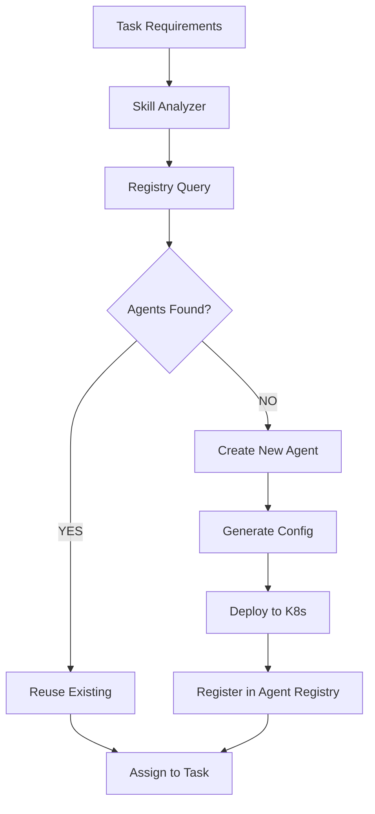
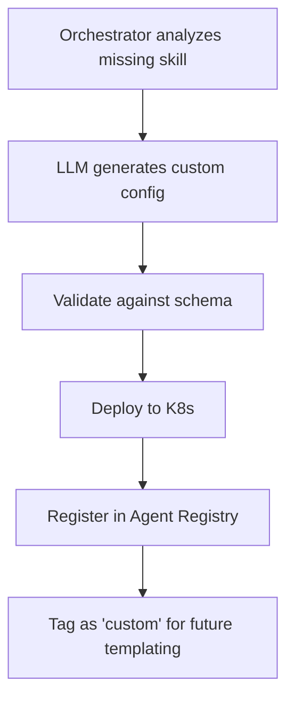
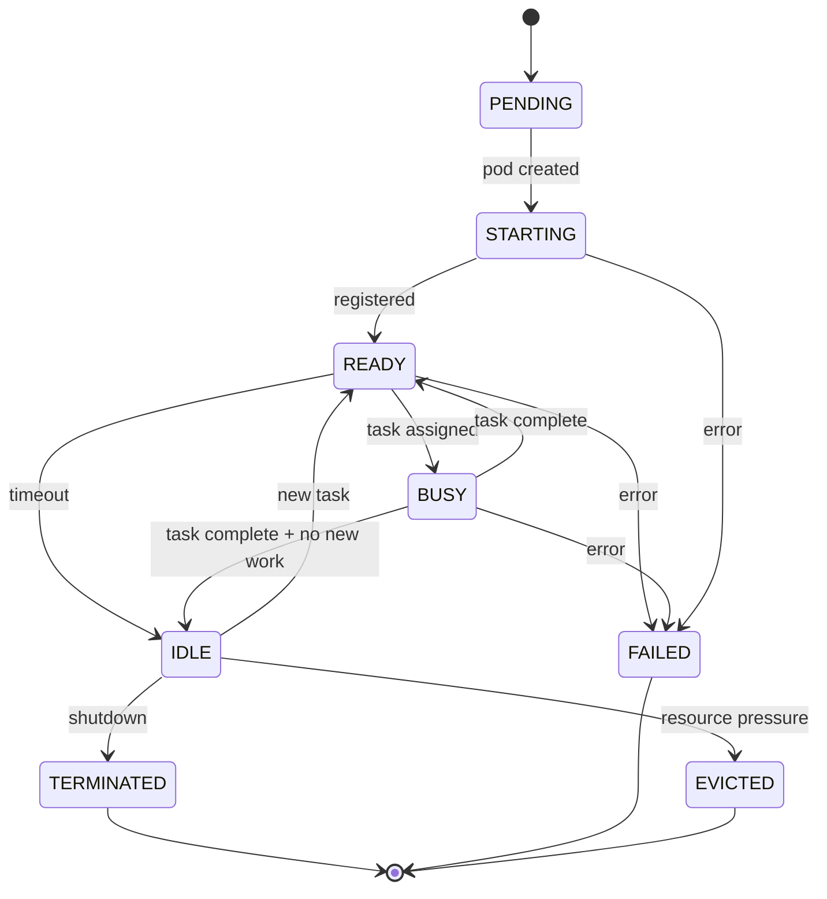

# Agent Creation Pipeline

## Overview

ForgeMaster dynamically creates agents based on task requirements. This document specifies how agents are instantiated, configured, and deployed.

## Agent Creation Flow



## Step 1: Skill Analysis

### Input: Task Requirements

```json
{
  "type": "web-api",
  "language": "rust",
  "framework": "axum",
  "features": ["product-catalog", "shopping-cart", "checkout", "stripe-integration"]
}
```

### Output: Required Skills

```json
{
  "required_skills": [
    {"skill": "gherkin-generation", "min_proficiency": 0.8},
    {"skill": "rust-code-generation", "min_proficiency": 0.9},
    {"skill": "axum-framework", "min_proficiency": 0.7},
    {"skill": "code-review", "min_proficiency": 0.8},
    {"skill": "authentication-patterns", "min_proficiency": 0.6}
  ]
}
```

### Skill Mapping Rules

```yaml
task_type_to_skills:
  web-api:
    - gherkin-generation
    - code-generation
    - code-review
    - api-design

  data-pipeline:
    - gherkin-generation
    - python-code-generation
    - data-validation
    - etl-patterns

  ml-experiment:
    - experiment-design
    - python-code-generation
    - model-training
    - metrics-analysis

language_to_skills:
  rust:
    - rust-code-generation
    - cargo-tooling
  python:
    - python-code-generation
    - pip-tooling
  typescript:
    - typescript-code-generation
    - npm-tooling

feature_to_skills:
  authentication:
    - authentication-patterns
    - security-review
  validation:
    - input-validation
    - error-handling
  pagination:
    - api-pagination
    - query-optimization
```

## Step 2: Registry Query

### Agent Matching Algorithm

```
For each required_skill:
  1. Query registry: agents with skill AND proficiency >= min
  2. Filter by availability (not at max concurrent tasks)
  3. Sort by:
     a. Proficiency (higher is better)
     b. Success rate on similar tasks
     c. Current load (lower is better)
  4. Select top candidate

If no match found:
  → Create new agent with this skill
```

## Step 3: Agent Configuration Generation

### When Creating New Agent

The Orchestrator Agent generates agent configuration using LLM:

```
┌─────────────────────────────────────────────────────────────────┐
│                  AGENT CONFIG GENERATION                         │
│                                                                  │
│  Input:                                                          │
│  - Required skill: "rust-code-generation"                        │
│  - Task context: "Build e-commerce backend with Axum"            │
│  - Feature requirements: ["catalog", "cart", "checkout"]         │
│                                                                  │
│  LLM generates:                                                  │
│  - System prompt tailored to skill + context                     │
│  - Model selection (claude-3-sonnet for code gen)               │
│  - MCP server requirements                                       │
│  - Resource requirements                                         │
└─────────────────────────────────────────────────────────────────┘
```

### Agent Configuration Template

```yaml
apiVersion: forgemaster.io/v1alpha1
kind: Agent
metadata:
  name: code-generator-${random_id}
  namespace: task-${task_id}
  labels:
    forgemaster.io/agent-type: code-generator
    forgemaster.io/task-id: ${task_id}
    forgemaster.io/created-by: orchestrator
spec:
  # Model Configuration
  model:
    provider: anthropic
    name: claude-3-sonnet
    temperature: 0.3
    max_tokens: 4096

  # System Prompt (generated by Orchestrator)
  system_prompt: |
    You are a Rust code generation agent specialized in building REST APIs.

    Context:
    - Framework: Axum
    - Features required: product catalog, shopping cart, checkout, Stripe integration

    Guidelines:
    - Follow Rust best practices and idioms
    - Use typed-builder for structs with optional fields
    - Implement proper error handling with anyhow
    - Write clean, documented code

    Output format:
    - Respond with complete, compilable Rust code
    - Include necessary Cargo.toml dependencies
    - Add unit tests for core functionality

  # Skills (for registry)
  skills:
    - name: rust-code-generation
      proficiency: 0.9
    - name: axum-framework
      proficiency: 0.8
    - name: api-design
      proficiency: 0.7

  # MCP Servers needed
  mcp_servers:
    - name: github-mcp
      config:
        repository: ${github_repo}
        branch: task-${task_id}
    - name: filesystem-mcp
      config:
        root_path: /workspace

  # Resource limits
  resources:
    requests:
      cpu: "500m"
      memory: "512Mi"
    limits:
      cpu: "1000m"
      memory: "1Gi"

  # Lifecycle
  lifecycle:
    max_concurrent_tasks: 3
    idle_timeout: 10m
    max_lifetime: 2h
```

## Step 4: Agent Deployment

### Deployment Sequence

```
1. Create Agent CRD in task namespace
2. K8s Operator detects new Agent CRD
3. Operator creates:
   - Pod with agent runtime
   - Service for agent communication
   - ConfigMap with system prompt
   - Secret with API keys
4. Agent pod starts
5. Agent registers with Agent Registry
6. Orchestrator receives "agent ready" event
```

### Agent Pod Specification

```yaml
apiVersion: v1
kind: Pod
metadata:
  name: code-generator-abc123
  namespace: task-a1b2c3d4
spec:
  containers:
    - name: agent
      image: forgemaster/agent-runtime:latest
      env:
        - name: AGENT_ID
          value: "code-generator-abc123"
        - name: AGENT_REGISTRY_URL
          value: "http://agent-registry.metaagent-system:8080"
        - name: ANTHROPIC_API_KEY
          valueFrom:
            secretKeyRef:
              name: llm-credentials
              key: anthropic-api-key
      volumeMounts:
        - name: system-prompt
          mountPath: /config/system-prompt.txt
          subPath: system-prompt.txt
        - name: workspace
          mountPath: /workspace
  volumes:
    - name: system-prompt
      configMap:
        name: code-generator-abc123-config
    - name: workspace
      emptyDir: {}
```

## Step 5: Agent Registration

### Registration Request

```json
POST /api/v1/agents/register
{
  "agent_id": "code-generator-abc123",
  "namespace": "task-a1b2c3d4",
  "endpoint": "http://code-generator-abc123.task-a1b2c3d4:8080",
  "skills": [
    {"name": "rust-code-generation", "proficiency": 0.9},
    {"name": "axum-framework", "proficiency": 0.8}
  ],
  "status": "available",
  "metadata": {
    "model": "claude-3-sonnet",
    "created_by": "orchestrator",
    "task_id": "a1b2c3d4"
  }
}
```

## Agent Type Templates

### Pre-defined Agent Types

| Type | Skills | Model | Purpose |
|------|--------|-------|---------|
| `test-generator` | gherkin-generation | claude-3-sonnet | Generate E2E tests |
| `code-generator` | code-generation, language-specific | claude-3-sonnet | Write implementation |
| `reviewer` | code-review, security | claude-3-opus | Review and suggest fixes |
| `feedback-analyzer` | analysis, summarization | claude-3-haiku | Summarize results |
| `specialist` | domain-specific | varies | Handle specific domains |

### Template Inheritance

```yaml
# Base template
agent_templates:
  base:
    model:
      provider: anthropic
      temperature: 0.3
    resources:
      requests:
        cpu: "500m"
        memory: "512Mi"
    lifecycle:
      idle_timeout: 10m

  # Inherits from base
  code-generator:
    extends: base
    model:
      name: claude-3-sonnet
      max_tokens: 4096
    skills:
      - code-generation
    system_prompt_template: |
      You are a code generation agent for {{language}}.
      Framework: {{framework}}
      ...

  # Inherits from base with overrides
  reviewer:
    extends: base
    model:
      name: claude-3-opus  # Override for better review
      temperature: 0.1     # More deterministic
    skills:
      - code-review
      - security-review
```

## Custom Agent Creation

When no template matches, Orchestrator creates custom agent:



### Custom Agent Example

```yaml
# Auto-generated for "kubernetes-deployment" skill
apiVersion: forgemaster.io/v1alpha1
kind: Agent
metadata:
  name: k8s-deployer-custom-xyz789
  labels:
    forgemaster.io/agent-type: custom
    forgemaster.io/origin-skill: kubernetes-deployment
spec:
  model:
    name: claude-3-sonnet
    temperature: 0.2
  system_prompt: |
    You are a Kubernetes deployment specialist.

    Expertise:
    - Writing Kubernetes manifests (Deployment, Service, ConfigMap)
    - Helm chart creation and templating
    - Resource optimization and limits
    - Security best practices (RBAC, NetworkPolicy)

    Output format:
    - Valid YAML manifests
    - Include comments explaining choices
    - Follow K8s naming conventions
  skills:
    - name: kubernetes-deployment
      proficiency: 0.85
    - name: helm-charts
      proficiency: 0.75
  mcp_servers:
    - name: kubernetes-mcp
      config:
        kubeconfig: /etc/kubernetes/config
```

## Agent Lifecycle States



| State | Description |
|-------|-------------|
| `PENDING` | CRD created, awaiting pod |
| `STARTING` | Pod starting, loading model |
| `READY` | Registered, accepting tasks |
| `BUSY` | Currently processing task |
| `IDLE` | No tasks, waiting |
| `TERMINATED` | Clean shutdown |
| `FAILED` | Error, needs attention |
| `EVICTED` | Resource pressure, removed |
