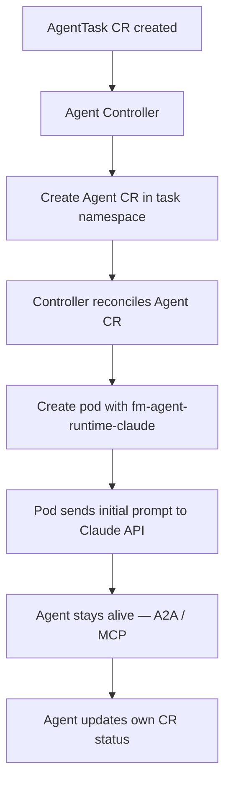
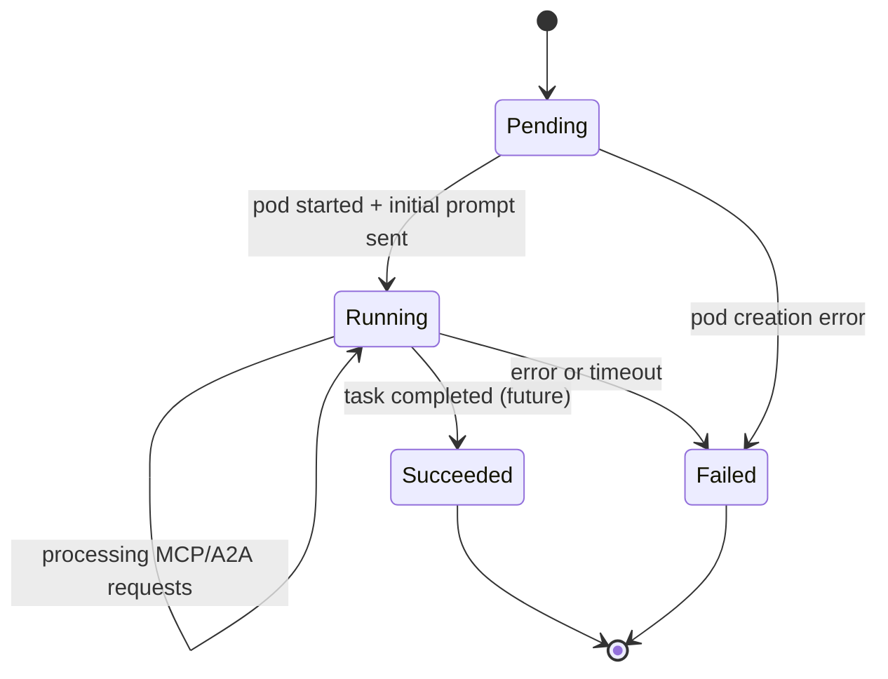

# Agent Creation Pipeline

## Overview

The **Agent Controller** (`fm-controller-agent`) is responsible for creating and managing agents. When an AgentTask is created, the Agent Controller creates Agent CRs in the task namespace. Each Agent CR triggers pod creation with the appropriate runtime (e.g. `fm-agent-runtime-claude`). Agents are long-lived — after the initial prompt they stay alive and communicate via **A2A** (agent-to-agent) and **MCP** (model context protocol). Agents can update their own CR status.

## Agent Creation Flow



## Step 1: Agent Configuration Generation

### When Creating New Agent

The Agent Controller builds the Agent CR spec based on the AgentTask requirements:

```
┌─────────────────────────────────────────────────────────────────┐
│                  AGENT CONFIG GENERATION                         │
│                                                                  │
│  Input (from AgentTask):                                         │
│  - Task description and requirements                             │
│  - Agent type needed (orchestrator, code-generator, etc.)        │
│                                                                  │
│  Agent Controller generates Agent CR with:                       │
│  - taskPrompt: role definition + task description                │
│  - model: name, temperature, maxTokens                           │
│  - mcpServers: MCP servers the agent can use                     │
│  - resources: CPU/memory requests and limits                     │
└─────────────────────────────────────────────────────────────────┘
```

### Agent CRD Spec

The Agent CRD is defined in [`crates/fm-controller-agent/src/crd/agent/crd.rs`](../../crates/fm-controller-agent/src/crd/agent/crd.rs).

Key fields:

| Field | Type | Description |
|-------|------|-------------|
| `spec.type` | `String` | Agent type (e.g. `orchestrator`, `code-generator`, `architect`) |
| `spec.model` | `ModelConfig` | LLM model settings (`name`, `temperature`, `maxTokens`) |
| `spec.taskPrompt` | `String` | Full instruction prompt: role definition + task description |
| `spec.mcpServers` | `Vec<McpServerRef>` | MCP servers this agent can use |
| `spec.resources` | `ResourceRequirements` | CPU/memory requests and limits |

Related types:
- ModelConfig: [`crates/fm-controller-agent/src/crd/model_config.rs`](../../crates/fm-controller-agent/src/crd/model_config.rs)
- McpServerRef: [`crates/fm-controller-agent/src/crd/mcp_server_ref.rs`](../../crates/fm-controller-agent/src/crd/mcp_server_ref.rs)
- ResourceRequirements: [`crates/fm-controller-agent/src/crd/resource_requirements.rs`](../../crates/fm-controller-agent/src/crd/resource_requirements.rs)

## Step 2: Agent Deployment

### Deployment Sequence

```
1. AgentTask CR is created in the cluster
2. Agent Controller watches AgentTask, creates Agent CR in the task namespace
3. Agent Controller reconciles Agent CR (Pending phase), creates:
   - Pod running fm-agent-runtime-claude (see pod_builder.rs)
   - RBAC resources (ServiceAccount, ClusterRoleBinding)
4. Agent pod starts → sends initial prompt to Claude API → stays alive
5. Agent is now long-lived: communicates via A2A and MCP
6. Agent updates its own CR status (phase, tokens used, etc.)
```

### Long-lived Runtime

All agent runtime pods are **long-lived processes**. After sending the initial prompt, the runtime stays alive and waits for incoming MCP or A2A requests. The pod only exits on:
- Shutdown signal (SIGTERM from K8s)
- Explicit task completion (future implementation)
- Error / timeout

### Runtime Providers

The runtime is provider-specific — currently `fm-agent-runtime-claude` for Anthropic Claude. The architecture supports multiple providers:

| Runtime | Provider | Status |
|---------|----------|--------|
| `fm-agent-runtime-claude` | Anthropic Claude | Implemented |
| `fm-agent-runtime-gemini` | Google Gemini | Future |
| `fm-agent-runtime-chatgpt` | OpenAI ChatGPT | Future |
| `fm-agent-runtime-custom` | Custom / self-hosted | Future |

Each runtime implements the same contract: read Agent CR config from env vars, send initial prompt, stay alive for A2A/MCP communication, update own CR status.

### Pod Spec Generation

The Agent Controller creates Pod specs programmatically — config is injected via env vars (no ConfigMap/volume mounts). The container image is pre-built and available in the registry.

- **CI/CD pipeline**: Builds `fm-agent-runtime-claude` image, pushes to container registry
- **Local development**: Ansible builds the image and pushes to local OrbStack storage (see [`ansible/roles/fm-agent-runtime-claude/`](../../ansible/roles/fm-agent-runtime-claude/))

Source references:
- Pod spec builder: [`crates/fm-controller-agent/src/controller/pod_builder.rs`](../../crates/fm-controller-agent/src/controller/pod_builder.rs)
- RBAC propagator: [`crates/fm-controller-agent/src/controller/rbac_propagator.rs`](../../crates/fm-controller-agent/src/controller/rbac_propagator.rs)
- Agent runtime: [`crates/fm-agent-runtime-claude/src/runtime.rs`](../../crates/fm-agent-runtime-claude/src/runtime.rs)
- Helm chart (Agent Controller): [`crates/fm-controller-agent/helm/`](../../crates/fm-controller-agent/helm/)
- Helm chart (RBAC/CRD): [`crates/fm-controller-agent/helm/templates/rbac.yaml`](../../crates/fm-controller-agent/helm/templates/rbac.yaml)

## Step 3: Agent Communication

Agents are long-lived and communicate after initial prompt:
- **A2A** (Agent-to-Agent): Agents communicate with each other directly
- **MCP** (Model Context Protocol): Agents use MCP servers for tool access (filesystem, GitHub, K8s API, etc.)
- **CR updates**: Agents update their own Agent CR status (phase, tokens used, iterations)

Status updater: [`crates/fm-agent-runtime-claude/src/status_updater.rs`](../../crates/fm-agent-runtime-claude/src/status_updater.rs)

## Agent Types

| Type | Purpose |
|------|---------|
| `orchestrator` | Decomposes tasks, coordinates child agents via A2A |
| `code-generator` | Write implementation code |
| `test-generator` | Generate E2E Gherkin tests |
| `reviewer` | Review code and suggest fixes |
| `architect` | Design system architecture |

Agent CRD definition: [`crates/fm-controller-agent/helm/templates/agent-crd.yaml`](../../crates/fm-controller-agent/helm/templates/agent-crd.yaml)
Orchestrator factory: [`crates/fm-controller-agent/src/task_watcher/orchestrator_factory.rs`](../../crates/fm-controller-agent/src/task_watcher/orchestrator_factory.rs)

## Agent Lifecycle States

Defined in [`crates/fm-controller-agent/src/crd/agent/phase.rs`](../../crates/fm-controller-agent/src/crd/agent/phase.rs).



| Phase | Description |
|-------|-------------|
| `Pending` | Agent CR created, waiting for pod to be scheduled |
| `Running` | Pod started, initial prompt sent, accepting MCP/A2A requests (long-lived) |
| `Succeeded` | Work completed successfully, output stored (future — currently agents stay Running) |
| `Failed` | Error occurred or timeout reached |

Reconciler implementations per phase:
- Pending: [`crates/fm-controller-agent/src/controller/reconciler/pending.rs`](../../crates/fm-controller-agent/src/controller/reconciler/pending.rs)
- Running: [`crates/fm-controller-agent/src/controller/reconciler/running.rs`](../../crates/fm-controller-agent/src/controller/reconciler/running.rs)
- Succeeded: [`crates/fm-controller-agent/src/controller/reconciler/succeeded.rs`](../../crates/fm-controller-agent/src/controller/reconciler/succeeded.rs)
- Failed: [`crates/fm-controller-agent/src/controller/reconciler/failed.rs`](../../crates/fm-controller-agent/src/controller/reconciler/failed.rs)
