# Domain Reuse

## Overview

**Domain reuse** is a core capability of ForgeMaster. Domains represent areas of expertise (Web Development, Data Engineering, etc.) with proven agent combinations that can be reused and composed across tasks.

## Domain Boundaries

Domains are extensible — new domains are created automatically when tasks don't fit existing ones. Below are **example domains** (not a fixed list):

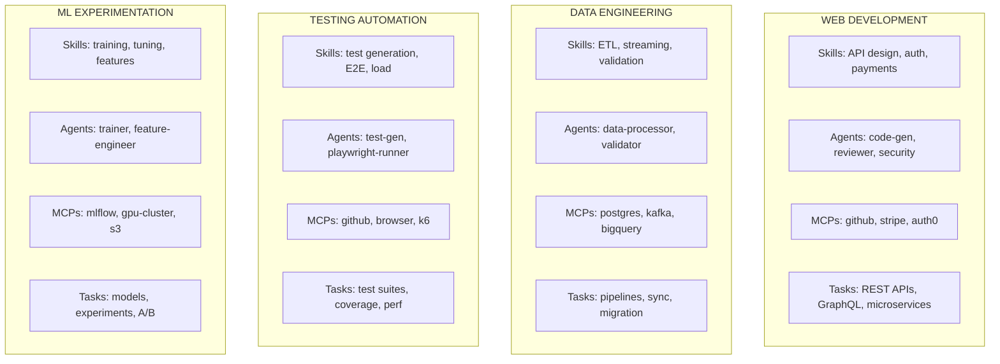

### Domain Catalog (Examples)

| Domain | Skills | Typical Agents | MCPs | Example Tasks |
|--------|--------|----------------|------|---------------|
| **Web Development** | API design, authentication, payments, database | code-generator, reviewer, security-auditor | github, stripe, postgres, auth0 | REST APIs, e-commerce, microservices |
| **Data Engineering** | ETL, streaming, validation, schema | data-processor, validator, migrator | kafka, bigquery, postgres, s3 | Pipelines, sync, migrations |
| **Testing Automation** | Test generation, E2E, load testing | test-generator, playwright-runner, k6-runner | github, browser-mcp, k6 | Test suites, coverage, performance |
| **ML Experimentation** | Training, tuning, feature engineering | model-trainer, feature-engineer, evaluator | mlflow, gpu-cluster, s3 | Model training, experiments |
| **...** | *New domains created automatically* | *Based on task requirements* | *As needed* | *Any novel task type* |

### Shared vs Domain-Specific Agents

Some agents are **shared** across domains, others are **domain-specific**:

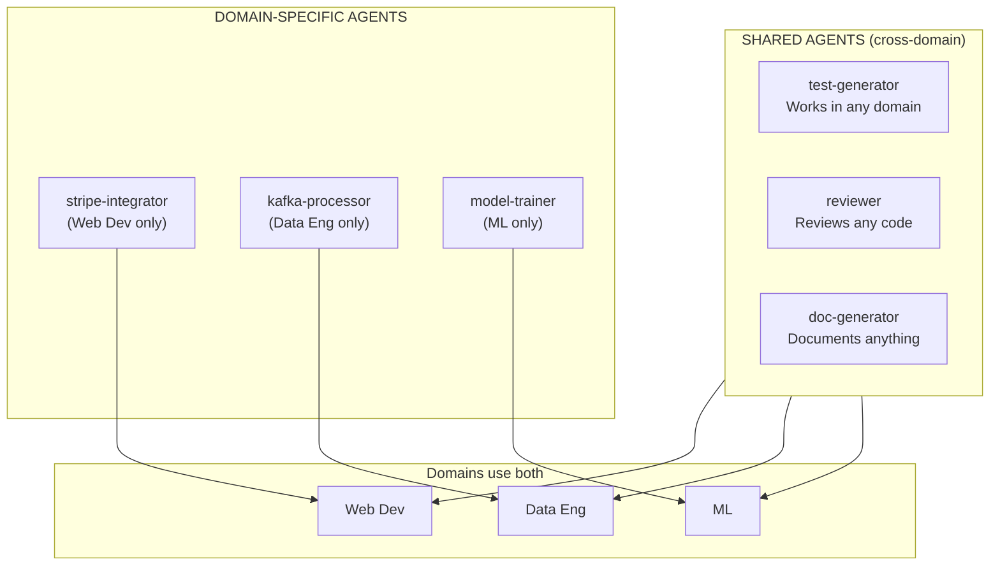

| Agent Type | Scope | Used By |
|------------|-------|---------|
| `test-generator` | Shared | All domains |
| `reviewer` | Shared | All domains |
| `doc-generator` | Shared | All domains |
| `code-generator` | Shared | All domains (with domain-specific prompts) |
| `stripe-integrator` | Domain-specific | Web Development |
| `kafka-processor` | Domain-specific | Data Engineering |
| `model-trainer` | Domain-specific | ML Experimentation |
| `playwright-runner` | Domain-specific | Testing Automation |

### Boundary Rules

Each domain is bounded by:

1. **Skills** — What capabilities are needed
2. **Agents** — Shared agents + domain-specific agents
3. **MCPs** — Which tools/data sources are used
4. **Task Patterns** — Keywords and task types that match

```yaml
# Domain boundary definition
domain:
  name: web-development

  # What defines this domain
  boundaries:
    skills:
      - api-design
      - authentication
      - payment-integration
      - database-modeling

    agents:
      - code-generator
      - reviewer
      - security-auditor

    mcps:
      - github-mcp
      - postgres-mcp
      - stripe-mcp
      - auth0-mcp

    task_patterns:
      keywords: [api, rest, graphql, backend, endpoint, service]
      types: [web-api, microservice, backend]
```

### Domain Intersection

When a task spans multiple domains, ForgeMaster composes them:

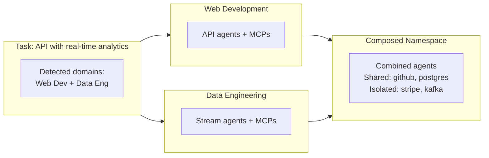

**Intersection rules:**
- Shared MCPs (github, postgres) → provisioned once
- Domain-specific MCPs (stripe, kafka) → isolated
- Agents from both domains deployed together
- Context flows across domain boundaries

### Domain Rejection & Routing

If a domain cannot solve a task, it **rejects** and routes to the appropriate domain:

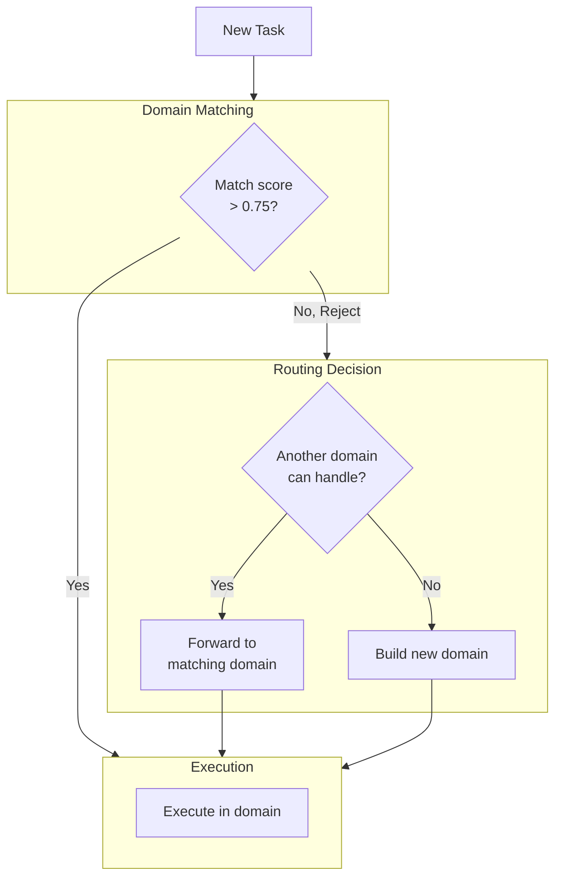

**Rejection criteria:**
- Match score < 0.75 (not enough skill overlap)
- Missing required MCPs that can't be provisioned
- Task type outside domain's boundaries
- Required skills not available in domain

**Routing algorithm:**

```yaml
routing:
  # Step 1: Try to match existing domain
  match_threshold: 0.75

  # Step 2: If rejected, find alternative
  on_rejection:
    - action: search_other_domains
      criteria:
        min_score: 0.6
        required_skills: from_task

    - action: check_composable
      description: "Can multiple domains combine to solve?"

    - action: build_new_domain
      trigger: no_match_found
      process:
        - analyze_task_requirements
        - identify_needed_skills
        - select_agents_for_skills
        - provision_required_mcps
        - create_domain_template
```

**Example: Task rejection and routing**

```
Task: "Build IoT sensor data pipeline with ML anomaly detection"

Step 1: Match against domains
├── Web Development: 0.2 (REJECT - not web related)
├── Data Engineering: 0.6 (REJECT - partial match, missing ML)
├── Testing Automation: 0.1 (REJECT - not testing)
└── ML Experimentation: 0.5 (REJECT - partial match, missing streaming)

Step 2: Check composition
├── Data Engineering + ML Experimentation = 0.85 (MATCH)
└── Action: Compose both domains

Step 3: Execute
└── Deploy agents from both domains in single namespace
```

**Building new domain:**

When no existing domain matches (score < 0.6 even with composition):

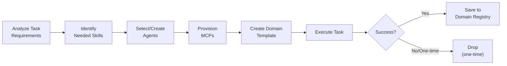

## Concept

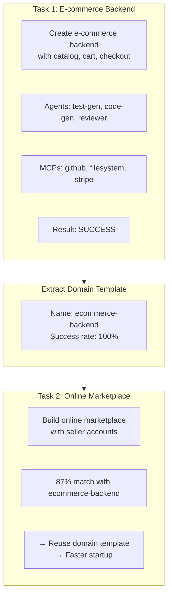

## Domain Definition

### Domain Template Schema

```yaml
apiVersion: forgemaster.io/v1alpha1
kind: DomainTemplate
metadata:
  name: ecommerce-backend
  namespace: metaagent-system
  labels:
    forgemaster.io/task-type: web-api
    forgemaster.io/language: rust
    forgemaster.io/framework: axum
spec:
  # Description
  description: |
    Proven agent combination for building e-commerce backends in Rust with Axum.
    Includes test generation, code generation, Stripe integration, and code review.

  # Task matching criteria
  matching:
    task_types:
      - web-api
      - ecommerce
    languages:
      - rust
    frameworks:
      - axum
    keywords:
      - ecommerce
      - catalog
      - cart
      - checkout
      - payment
      - stripe

  # Agent configurations
  agents:
    - type: test-generator
      config:
        model: claude-3-sonnet
        prompt_template: ecommerce-tests
        skills: [gherkin-generation, rust-testing]

    - type: code-generator
      config:
        model: claude-3-sonnet
        prompt_template: rust-axum-ecommerce
        skills: [rust-code-generation, axum-framework, stripe-integration]

    - type: reviewer
      config:
        model: claude-3-opus
        prompt_template: ecommerce-security-review
        skills: [code-review, security-review, payment-security]

  # MCP server configurations
  mcp_servers:
    - type: github-mcp
      required: true
    - type: filesystem-mcp
      required: true
    - type: stripe-mcp
      required: true
    - type: postgres-mcp
      required: false
      condition: "database in features"

  # Execution flow
  execution_order:
    - stage: 1
      agents: [test-generator]
      parallel: false
    - stage: 2
      agents: [code-generator]
      parallel: false
    - stage: 3
      agents: [reviewer]
      parallel: false

  # Performance metrics
  metrics:
    times_used: 15
    success_rate: 0.87
    avg_iterations: 4.2
    avg_duration_minutes: 25

status:
  last_used: "2026-02-03T14:30:00Z"
  created_from_task: "task-a1b2c3d4"
  version: 3
```

## Domain Registry

### Storage

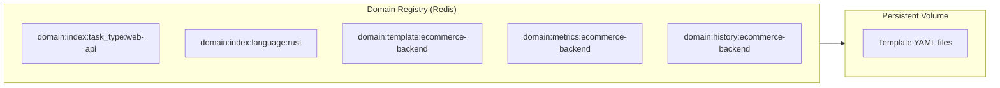

**Key Structure:**

| Key Pattern                      | Content                          |
|----------------------------------|----------------------------------|
| `domain:index:task_type:{type}`  | List of domain names             |
| `domain:index:language:{lang}`   | List of domain names             |
| `domain:template:{name}`         | Template YAML                    |
| `domain:metrics:{name}`          | Usage statistics                 |
| `domain:history:{name}`          | Task IDs that used this domain   |

### API Endpoints

| Method | Endpoint | Description |
|--------|----------|-------------|
| GET | `/api/v1/domains` | List all domain templates |
| GET | `/api/v1/domains/{name}` | Get specific template |
| POST | `/api/v1/domains/match` | Find matching templates for task |
| POST | `/api/v1/domains` | Create new template |
| PUT | `/api/v1/domains/{name}` | Update template |
| DELETE | `/api/v1/domains/{name}` | Delete template |

## Template Extraction

### When to Extract

```yaml
extraction_triggers:
  # Primary trigger: successful task completion
  - event: task_completed
    condition: status == SUCCESS
    action: analyze_for_extraction

  # Additional triggers
  - event: multiple_similar_successes
    condition: same_agent_combo_success >= 3
    action: create_template
```

### Extraction Algorithm

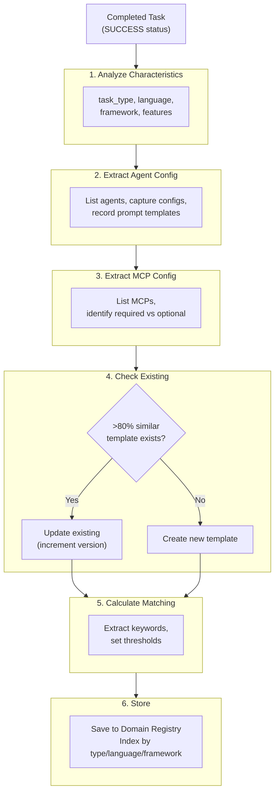

## Template Matching

### Matching Algorithm

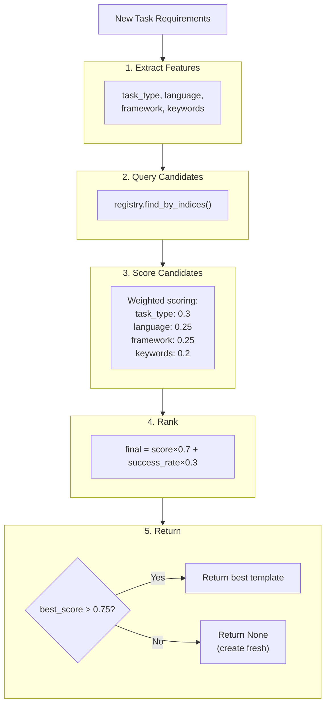

### Match Response

```json
{
  "task_id": "task-xyz789",
  "match_found": true,
  "template": {
    "name": "ecommerce-backend",
    "score": 0.92,
    "success_rate": 0.87,
    "times_used": 15
  },
  "recommendation": "USE_TEMPLATE",
  "customizations_needed": [
    "Add subscription-billing MCP if recurring payments needed"
  ]
}
```

## Template Application

### Instantiation Flow

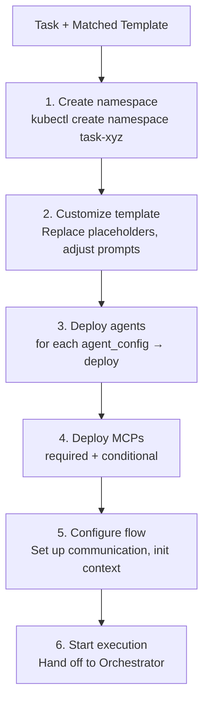

## Template Evolution

### Versioning

```yaml
# Template versioning strategy
versioning:
  # Increment patch for minor updates
  patch:
    - Prompt tweaks
    - Model temperature adjustments

  # Increment minor for additions
  minor:
    - New optional agent added
    - New MCP server option

  # Increment major for breaking changes
  major:
    - Agent removed
    - Execution order changed
    - Required component changed

# Example versions
# v1.0.0 - Initial template
# v1.1.0 - Added optional security-reviewer agent
# v1.1.1 - Tweaked code-generator prompt
# v2.0.0 - Changed from sonnet to opus for code-generator
```

### Learning from Usage

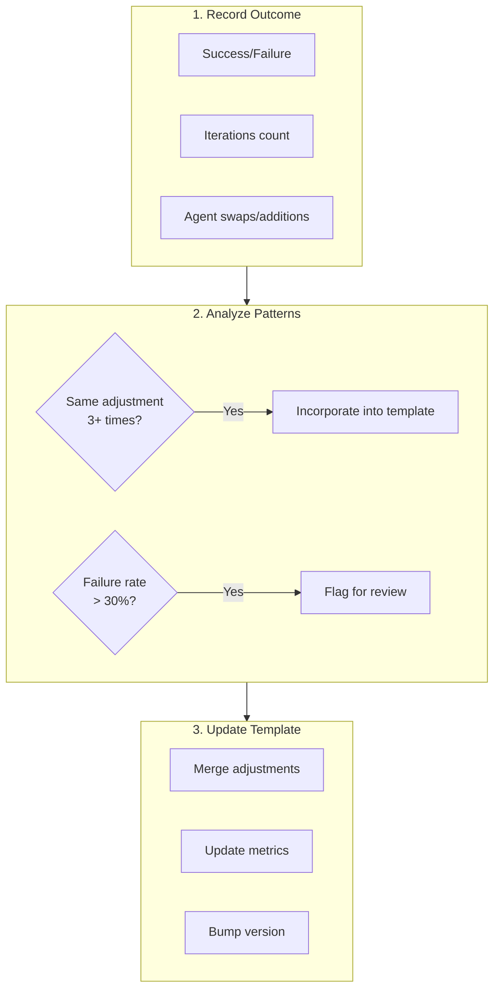

**Example:**
- Template "ecommerce-backend" used for 10 tasks
- 7 tasks added "inventory-validator" agent during execution
- → Update template to include "inventory-validator" as default

## Domain Composition

### Composing Multiple Domains

```yaml
# Complex task might use multiple domains
task: "Build full-stack e-commerce platform"

composed_domains:
  - name: ecommerce-backend
    scope: backend-api
    customization:
      features: [catalog, cart, checkout, stripe]

  - name: react-frontend
    scope: web-frontend
    customization:
      features: [product-listing, cart-ui, checkout-flow]

  - name: postgres-schema
    scope: database
    customization:
      tables: [products, carts, orders, payments]

coordination:
  # How domains interact
  - backend-api depends_on database
  - web-frontend depends_on backend-api
```

### Domain Communication

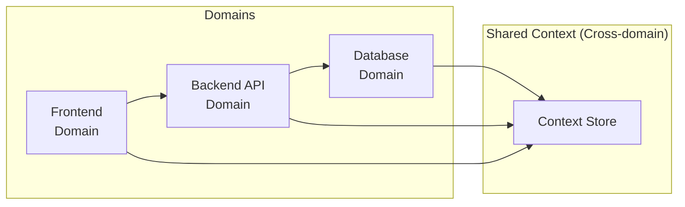

## Best Practices

### Template Creation

1. **Wait for proven success** - Extract after 2-3 similar successful tasks
2. **Keep templates focused** - One template per task type/language combo
3. **Document customization points** - Mark what varies between uses
4. **Include failure handling** - Capture what adjustments were needed

### Template Usage

1. **Don't force-fit** - If match score < 0.75, create fresh
2. **Allow customization** - Templates are starting points, not rigid
3. **Track modifications** - If template consistently needs changes, update it
4. **Monitor success rates** - Retire templates with low success

### Template Maintenance

1. **Regular review** - Quarterly review of template performance
2. **Prune unused** - Archive templates not used in 90 days
3. **Merge similar** - Combine templates with >90% overlap
4. **Version carefully** - Major versions for breaking changes only
