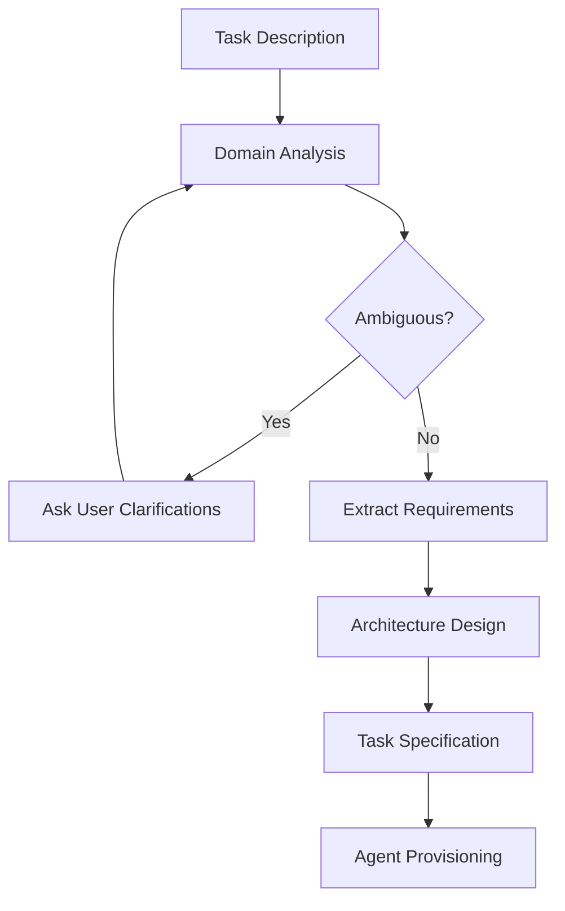

# Requirements Preparation

> **See also:** [Orchestrator Spec](04b-orchestrator-spec.md), [Agent Creation](04a-agent-creation.md), [Task Lifecycle](04-task-lifecycle.md)

## Overview

Before any executor agent starts work, the Orchestrator (acting as Architect) must transform the user's free-text task description into structured, actionable requirements. This phase is critical — poor requirements lead to wasted iterations and wrong outputs.

## Why This Phase Matters

```
User: "Build me an e-commerce API"

Without requirements:
  code-generator gets: "Build me an e-commerce API"
  → guesses tech stack, scope, structure
  → produces something, but probably wrong

With requirements:
  code-generator gets: structured spec with endpoints, models, constraints
  → produces targeted, accurate code
  → fewer feedback loop iterations
```

## Requirements Preparation Flow



## Phase 1: Domain Analysis

The architect analyzes the task description to understand:

| Aspect | What to Extract | Example |
|--------|----------------|---------|
| **Domain** | Business domain and terminology | E-commerce, payments, inventory |
| **Scope** | What's included and what's not | API only, no frontend; CRUD + Stripe |
| **Boundaries** | System edges and integrations | Stripe API, PostgreSQL, no auth for MVP |
| **Constraints** | Tech stack, performance, compliance | Rust + Axum, <200ms response, PCI if payments |
| **Users** | Who interacts with the system | API consumers, admin dashboard |

### Input Available to the Architect

| Source | Data | How It Gets There |
|--------|------|-------------------|
| `AgentTask.spec.description` | User's task description | User submits via WebSocket |
| `AgentTask.spec.timeout` | Time budget | User or system default |
| `AgentTask.spec.resource_quota` | Resource constraints | User or system default |
| `AgentTask.spec.clarifications` | User answers to follow-up questions | Clarification loop (future) |
| MCP filesystem server | Existing codebase context | Orchestrator reads project files |

## Phase 2: Clarification (When Needed)

If the description is ambiguous, the architect should request clarification before proceeding.

### Triggers for Clarification

- Missing tech stack (no language/framework specified)
- Ambiguous scope ("build an app" — what kind?)
- Conflicting requirements
- Missing integration details (which external APIs?)
- No acceptance criteria provided by the user

### Clarification Format

```yaml
clarifications:
  - question: "Which database should be used?"
    options: ["PostgreSQL", "SQLite", "MongoDB"]
    default: "PostgreSQL"
  - question: "Should authentication be included in MVP?"
    options: ["Yes (JWT)", "Yes (OAuth)", "No, skip for MVP"]
  - question: "Which payment provider?"
    options: ["Stripe", "PayPal", "None"]
```

## Phase 3: Requirements Extraction

The architect produces a structured specification from the description + clarifications.

### Functional Requirements

```yaml
functional_requirements:
  - id: FR-1
    description: "Product catalog with CRUD operations"
    acceptance_criteria:
      - "GET /products returns paginated list"
      - "POST /products creates a product with name, price, description"
      - "GET /products/{id} returns single product or 404"

  - id: FR-2
    description: "Shopping cart management"
    acceptance_criteria:
      - "POST /cart/items adds product to cart"
      - "DELETE /cart/items/{id} removes item"
      - "GET /cart returns current cart with total"
```

### Non-Functional Requirements

```yaml
non_functional_requirements:
  - id: NFR-1
    category: performance
    description: "API response time < 200ms for reads"

  - id: NFR-2
    category: reliability
    description: "Idempotent payment processing"

  - id: NFR-3
    category: security
    description: "Input validation on all endpoints"

  - id: NFR-4
    category: maintainability
    description: "Clean separation between domain and infrastructure layers"
```

### Technical Decisions

```yaml
technical_decisions:
  language: rust
  framework: axum
  database: postgresql
  external_apis:
    - name: stripe
      purpose: payment processing
  project_structure: modular (one handler per file, separate domain layer)
  error_handling: anyhow for application errors, typed errors for API responses
  testing: integration tests with Gherkin, unit tests for domain logic
```

## Phase 4: Architecture Design

### Component Design

```yaml
components:
  - name: api-layer
    responsibility: "HTTP handlers, request/response types, routing"
    files:
      - "src/handlers/products.rs"
      - "src/handlers/cart.rs"
      - "src/handlers/checkout.rs"

  - name: domain-layer
    responsibility: "Business logic, domain models, validation"
    files:
      - "src/domain/product.rs"
      - "src/domain/cart.rs"
      - "src/domain/order.rs"

  - name: infrastructure-layer
    responsibility: "Database access, Stripe client, external integrations"
    files:
      - "src/infra/db.rs"
      - "src/infra/stripe.rs"
```

### Interface Contracts

The architect defines component boundaries so agents working on different components produce compatible code.

## Phase 5: Task Specification

The final output — input for agent provisioning.

```yaml
task_specification:
  summary: "E-commerce REST API with product catalog, cart, and Stripe checkout"

  requirements:
    functional: [FR-1, FR-2, FR-3]
    non_functional: [NFR-1, NFR-2, NFR-3, NFR-4]

  architecture:
    components: [api-layer, domain-layer, infrastructure-layer]
    tech_stack:
      language: rust
      framework: axum
      database: postgresql

  subtasks:
    - id: ST-1
      description: "Generate Gherkin test scenarios for all functional requirements"
      agent_type: test-generator
      input: functional_requirements
      output: "tests/*.feature"

    - id: ST-2
      description: "Implement product catalog API (FR-1)"
      agent_type: code-generator
      input: FR-1 + architecture
      output: "src/handlers/products.rs, src/domain/product.rs"
      context: "Use Axum, return JSON, implement pagination"

    - id: ST-3
      description: "Implement shopping cart API (FR-2)"
      agent_type: code-generator
      input: FR-2 + architecture
      depends_on: [ST-2]

    - id: ST-4
      description: "Review all code for quality and security"
      agent_type: reviewer
      input: "all generated code"
      depends_on: [ST-2, ST-3]

  execution_order:
    parallel: [ST-1, ST-2]
    sequential: [ST-3, ST-4]
```

## How the Spec Reaches Agents

Each executor agent receives only the context relevant to its subtask:

```
Orchestrator (architect)
  |
  |-- test-generator agent
  |     taskPrompt: role + functional_requirements + output format
  |
  |-- code-generator agent (products)
  |     taskPrompt: role + FR-1 + architecture + tech decisions
  |
  |-- code-generator agent (cart)
  |     taskPrompt: role + FR-2 + architecture + Product type interface
  |
  +-- reviewer agent
        taskPrompt: role + NFR list + code to review
```

## Quality Checklist

Before the architect provisions any agents, the specification should satisfy:

- [ ] Every functional requirement has at least one acceptance criterion
- [ ] Tech stack is explicitly decided (no ambiguity for agents)
- [ ] Component boundaries are defined (who owns what)
- [ ] Subtask dependencies are clear (execution order)
- [ ] Each subtask has enough context for the agent to work independently
- [ ] Non-functional requirements are testable (not vague)
- [ ] Scope exclusions are stated (what is NOT being built)

## Current Implementation Status

| Capability | Status | Notes |
|------------|--------|-------|
| Task description passed to orchestrator | Done | via `Agent.spec.taskPrompt` |
| Timeout passed to orchestrator | Not yet | Available in `AgentTask.spec.timeout` |
| Clarification loop | Not yet | `AgentTask.spec.clarifications` field exists |
| Structured spec output | Not yet | Orchestrator produces free-text only |
| MCP filesystem access | Not yet | No MCP servers configured |
| Subtask dependency tracking | Not yet | Agents are independent |
