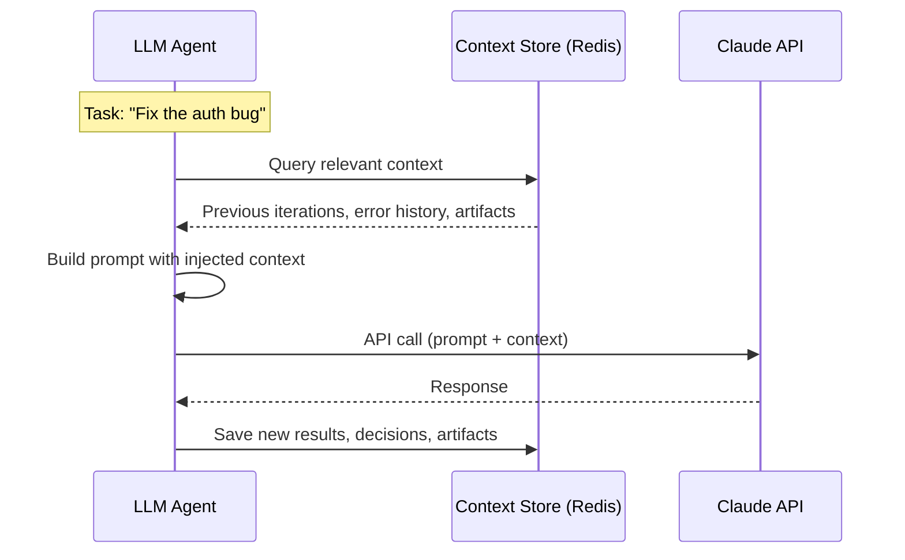

# Context Management

## Overview

**Context** is the shared state that flows between agents during task execution. It includes task requirements, generated artifacts, test results, and iteration history.

## Why External Context Storage Matters

Traditional LLM agents lose information when context gets compressed:

```
LLM Context Problem:
────────────────────
Conversation grows → Context window fills → Compress/summarize → Details LOST
```

ForgeMaster solves this by storing context **externally**:

```
ForgeMaster Solution:
─────────────────────
Context stored in Redis/DB → LLM queries what it needs → Nothing LOST
```

**Key Insight:** The TCP Controller uses **math, not LLM** for orchestration decisions. LLM agents can "forget" details after compression, but the Context Store preserves everything. When an agent needs historical context:

1. Query Context Store for relevant data
2. Inject into agent prompt
3. Agent works with full context
4. Results saved back to Context Store

This means ForgeMaster maintains **perfect memory** across iterations, tasks, and agent lifetimes.

## LLM Integration Pattern

How to integrate Claude API with external context storage:



### Context Injection (Before LLM Call)

```rust
async fn call_agent(task: &Task, agent: &Agent) -> Result<Response> {
    // 1. Query relevant context from Redis
    let context = context_store.get_task_context(&task.id).await?;
    let history = context_store.get_iteration_history(&task.id, limit: 5).await?;
    let failures = context_store.get_test_failures(&task.id).await?;

    // 2. Build prompt with injected context
    let prompt = format!(r#"
## Task
{task_description}

## Previous Iterations (last 5)
{history}

## Current Failing Tests
{failures}

## Your Role
{agent_system_prompt}

## Instructions
Continue from where we left off. Fix the failing tests.
"#);

    // 3. Call Claude API
    let response = claude.messages.create(
        model: "claude-sonnet-4-20250514",
        messages: vec![Message { role: "user", content: prompt }],
        max_tokens: 4096,
    ).await?;

    // 4. Save results back to context store
    context_store.save_iteration(&task.id, &response).await?;

    Ok(response)
}
```

### Smart Context Selection

Don't inject ALL context (too large). Select what's relevant:

```rust
async fn get_relevant_context(task_id: &str, current_error: &str) -> RelevantContext {
    // Recent history (last 3-5 iterations)
    let recent = context_store.get_iteration_history(task_id, 5).await?;

    // Current failing tests with details
    let failures = context_store.get_test_failures(task_id).await?;

    // Related decisions from TCP Controller
    let decisions = context_store.get_recent_decisions(task_id, 3).await?;

    // Current artifacts (code, tests)
    let artifacts = context_store.get_current_artifacts(task_id).await?;

    RelevantContext { recent, failures, decisions, artifacts }
}
```

### What Gets Stored vs Injected

| Stored (Everything) | Injected (Relevant Only) |
|---------------------|--------------------------|
| All iterations | Last 3-5 iterations |
| All artifacts | Current artifacts + diffs |
| All decisions | Recent decisions |
| Full test history | Failing tests only |
| All agent outputs | Summaries |

### Context Store Trait

```rust
trait ContextStore {
    // Read operations
    async fn get_task_context(&self, task_id: &str) -> Result<TaskContext>;
    async fn get_iteration_history(&self, task_id: &str, limit: usize) -> Result<Vec<Iteration>>;
    async fn get_test_failures(&self, task_id: &str) -> Result<Vec<TestFailure>>;
    async fn get_recent_decisions(&self, task_id: &str, limit: usize) -> Result<Vec<Decision>>;
    async fn get_current_artifacts(&self, task_id: &str) -> Result<Artifacts>;

    // Write operations
    async fn save_iteration(&self, task_id: &str, result: &AgentResponse) -> Result<()>;
    async fn save_artifact(&self, task_id: &str, artifact: &Artifact) -> Result<()>;
    async fn save_decision(&self, task_id: &str, decision: &Decision) -> Result<()>;

    // Smart retrieval
    async fn query_relevant(&self, task_id: &str, query: &str) -> Result<Vec<ContextChunk>>;
}
```

> **Key Principle:** LLM sees a "window" into the context store. The store has everything. The LLM gets what's relevant for THIS call.

## Context Architecture

```
┌─────────────────────────────────────────────────────────────────────────┐
│                        CONTEXT MANAGEMENT                                │
│                                                                          │
│   ┌─────────────┐    ┌─────────────┐    ┌─────────────┐                 │
│   │   Agent 1   │    │   Agent 2   │    │   Agent 3   │                 │
│   └──────┬──────┘    └──────┬──────┘    └──────┬──────┘                 │
│          │                  │                  │                         │
│          │    read/write    │    read/write    │                         │
│          └──────────────────┼──────────────────┘                         │
│                             │                                            │
│                             ▼                                            │
│   ┌─────────────────────────────────────────────────────────────────┐   │
│   │                     CONTEXT STORE                                │   │
│   │                        (Redis)                                   │   │
│   │                                                                  │   │
│   │   ┌─────────────┐  ┌─────────────┐  ┌─────────────┐             │   │
│   │   │    Task     │  │  Artifacts  │  │   History   │             │   │
│   │   │   Context   │  │   Store     │  │    Log      │             │   │
│   │   └─────────────┘  └─────────────┘  └─────────────┘             │   │
│   └─────────────────────────────────────────────────────────────────┘   │
│                             │                                            │
│                             ▼                                            │
│   ┌─────────────────────────────────────────────────────────────────┐   │
│   │                   PERSISTENT STORAGE                             │   │
│   │                      (S3/GitHub)                                 │   │
│   │                                                                  │   │
│   │   Checkpoints, Final Artifacts, Archived Context                 │   │
│   └─────────────────────────────────────────────────────────────────┘   │
└─────────────────────────────────────────────────────────────────────────┘
```

## Context Schema

### Task Context

```json
{
  "$schema": "https://forgemaster.io/schemas/context/v1",
  "task_id": "a1b2c3d4",
  "version": 5,
  "created_at": "2026-02-04T10:00:00Z",
  "updated_at": "2026-02-04T10:25:00Z",

  "task": {
    "name": "user-management-api",
    "description": "Build REST API for user management",
    "requirements": {
      "type": "web-api",
      "language": "rust",
      "framework": "axum",
      "features": ["authentication", "validation"]
    },
    "acceptance_criteria": [
      "Given valid user, when POST /users, then 201",
      "Given invalid email, when POST /users, then 400"
    ]
  },

  "execution": {
    "iteration": 3,
    "status": "running",
    "current_agent": "code-generator-abc123",
    "started_at": "2026-02-04T10:00:00Z"
  },

  "agents": {
    "deployed": [
      {
        "id": "test-generator-xyz789",
        "type": "test-generator",
        "status": "completed"
      },
      {
        "id": "code-generator-abc123",
        "type": "code-generator",
        "status": "running"
      }
    ]
  },

  "artifacts": {
    "tests": {
      "path": "artifacts/tests/user-api.feature",
      "checksum": "sha256:abc123...",
      "created_by": "test-generator-xyz789",
      "iteration": 1
    },
    "code": {
      "path": "artifacts/src/",
      "files": ["main.rs", "handlers.rs", "models.rs"],
      "checksum": "sha256:def456...",
      "created_by": "code-generator-abc123",
      "iteration": 3
    }
  },

  "test_results": {
    "latest": {
      "iteration": 3,
      "passed": 6,
      "failed": 2,
      "total": 8,
      "error_signal": 0.25,
      "failures": [
        {
          "test": "auth-token-validation",
          "scenario": "Given expired token, when authenticate, then reject",
          "error": "Expected 401, got 200",
          "file": "src/handlers.rs",
          "line": 45
        }
      ]
    },
    "history": [
      {"iteration": 1, "passed": 2, "failed": 6, "error_signal": 0.75},
      {"iteration": 2, "passed": 4, "failed": 4, "error_signal": 0.50},
      {"iteration": 3, "passed": 6, "failed": 2, "error_signal": 0.25}
    ]
  },

  "decisions": [
    {
      "iteration": 1,
      "tcp_signal": 0.75,
      "action": "ADD_AGENT",
      "details": "Added reviewer agent to help with authentication"
    },
    {
      "iteration": 2,
      "tcp_signal": 0.50,
      "action": "ADJUST_PARAMS",
      "details": "Updated code-generator prompt with auth examples"
    }
  ],

  "metadata": {
    "subsystem_template": "rest-api-rust-axum",
    "tcp_coefficients": {"task": 1.0, "context": 0.5, "prediction": 0.3},
    "resource_usage": {
      "llm_calls": 45,
      "tokens_used": 125000,
      "estimated_cost": 1.25
    }
  }
}
```

## Context Operations

### Read Context

```rust
// Agent reads task context
async fn read_context(task_id: &str) -> Result<TaskContext> {
    let redis = get_redis_connection().await?;
    let key = format!("task:{}:context", task_id);

    let context_json: String = redis.get(&key).await?;
    let context: TaskContext = serde_json::from_str(&context_json)?;

    Ok(context)
}
```

### Write Context

```rust
// Agent updates context
async fn update_context(
    task_id: &str,
    update: ContextUpdate,
) -> Result<()> {
    let redis = get_redis_connection().await?;
    let key = format!("task:{}:context", task_id);

    // Optimistic locking with version
    let current: TaskContext = read_context(task_id).await?;

    if update.expected_version != current.version {
        return Err(anyhow!("Context version conflict"));
    }

    let updated = current.apply(update);
    updated.version += 1;
    updated.updated_at = Utc::now();

    redis.set(&key, serde_json::to_string(&updated)?).await?;

    // Publish update event
    redis.publish(
        format!("task:{}:context:updated", task_id),
        updated.version.to_string()
    ).await?;

    Ok(())
}
```

### Context Update Types

```rust
enum ContextUpdate {
    // Add new artifact
    AddArtifact {
        artifact_type: String,
        path: String,
        created_by: String,
    },

    // Update test results
    UpdateTestResults {
        passed: u32,
        failed: u32,
        failures: Vec<TestFailure>,
    },

    // Record decision
    RecordDecision {
        tcp_signal: f64,
        action: ControlAction,
        details: String,
    },

    // Update execution state
    UpdateExecution {
        iteration: u32,
        current_agent: Option<String>,
        status: ExecutionStatus,
    },

    // Add/update agent
    UpdateAgent {
        agent_id: String,
        status: AgentStatus,
    },
}
```

## Context Flow Between Agents

### Flow Diagram

```
┌─────────────────────────────────────────────────────────────────────────┐
│                     CONTEXT FLOW                                         │
│                                                                          │
│  1. Test Generator                                                       │
│     ┌─────────────────────────────────────────────────────────────┐     │
│     │  READ:  task.requirements, task.acceptance_criteria         │     │
│     │  WRITE: artifacts.tests                                      │     │
│     └─────────────────────────────────────────────────────────────┘     │
│                              │                                           │
│                              ▼                                           │
│  2. Code Generator                                                       │
│     ┌─────────────────────────────────────────────────────────────┐     │
│     │  READ:  task.requirements, artifacts.tests,                 │     │
│     │         test_results.failures (if retry)                     │     │
│     │  WRITE: artifacts.code                                       │     │
│     └─────────────────────────────────────────────────────────────┘     │
│                              │                                           │
│                              ▼                                           │
│  3. Reviewer                                                             │
│     ┌─────────────────────────────────────────────────────────────┐     │
│     │  READ:  artifacts.code, artifacts.tests, task.requirements   │     │
│     │  WRITE: artifacts.review                                      │     │
│     └─────────────────────────────────────────────────────────────┘     │
│                              │                                           │
│                              ▼                                           │
│  4. Test Runner                                                          │
│     ┌─────────────────────────────────────────────────────────────┐     │
│     │  READ:  artifacts.tests, artifacts.code                      │     │
│     │  WRITE: test_results.latest, test_results.history            │     │
│     └─────────────────────────────────────────────────────────────┘     │
│                              │                                           │
│                              ▼                                           │
│  5. TCP Controller                                                       │
│     ┌─────────────────────────────────────────────────────────────┐     │
│     │  READ:  test_results.latest.error_signal,                   │     │
│     │         test_results.history                                 │     │
│     │  WRITE: decisions (via Orchestrator)                         │     │
│     └─────────────────────────────────────────────────────────────┘     │
└─────────────────────────────────────────────────────────────────────────┘
```

### Agent Context Interface

```rust
// Context interface for agents
trait AgentContext {
    // Read operations
    async fn get_task_requirements(&self) -> Result<TaskRequirements>;
    async fn get_artifact(&self, artifact_type: &str) -> Result<Artifact>;
    async fn get_test_results(&self) -> Result<TestResults>;
    async fn get_history(&self) -> Result<Vec<HistoryEntry>>;

    // Write operations
    async fn store_artifact(&self, artifact: Artifact) -> Result<()>;
    async fn update_status(&self, status: AgentStatus) -> Result<()>;

    // Subscribe to updates
    async fn subscribe_updates(&self) -> Result<UpdateStream>;
}
```

## Context Storage

### Redis Schema

```
# Task context (main state)
task:{task_id}:context → JSON (TaskContext)

# Artifacts (large files stored as references)
task:{task_id}:artifacts:{type} → JSON (ArtifactMetadata)
task:{task_id}:artifacts:{type}:content → BLOB (if small) or S3 reference

# History log (append-only)
task:{task_id}:history → LIST of JSON entries

# Agent states
task:{task_id}:agents:{agent_id} → JSON (AgentState)

# Pub/sub channels
task:{task_id}:context:updated → version number
task:{task_id}:agents:status → agent status changes

# TTL for cleanup
task:{task_id}:* → TTL 24h after task completion
```

### Large Artifact Handling

```
┌─────────────────────────────────────────────────────────────────────────┐
│                   ARTIFACT STORAGE STRATEGY                              │
│                                                                          │
│   Artifact Size        Storage Location                                  │
│   ─────────────────────────────────────────────                          │
│   < 1 KB              Redis (inline in context)                          │
│   1 KB - 1 MB         Redis (separate key)                               │
│   > 1 MB              S3/GitHub (reference in Redis)                     │
│                                                                          │
│   Example:                                                               │
│   {                                                                      │
│     "artifacts": {                                                       │
│       "tests": {                                                         │
│         "storage": "inline",                                             │
│         "content": "Feature: User API..."                                │
│       },                                                                 │
│       "code": {                                                          │
│         "storage": "s3",                                                 │
│         "bucket": "forgemaster-artifacts",                               │
│         "key": "task-a1b2c3d4/code/v3.tar.gz",                          │
│         "checksum": "sha256:..."                                         │
│       }                                                                  │
│     }                                                                    │
│   }                                                                      │
└─────────────────────────────────────────────────────────────────────────┘
```

## Context Checkpoints

### Checkpoint Strategy

```yaml
checkpoints:
  # When to create checkpoints
  triggers:
    - after_each_iteration
    - before_agent_swap
    - on_significant_progress  # error drops by > 0.2

  # What to include
  contents:
    - full context snapshot
    - all artifact references
    - agent configurations

  # Where to store
  storage:
    location: s3://forgemaster-checkpoints/
    path: "{task_id}/checkpoint-{iteration}.json"
    retention: 7 days

  # Recovery
  recovery:
    - On agent failure: restore from last checkpoint
    - On task resume: load checkpoint, continue
```

### Checkpoint Format

```json
{
  "checkpoint_id": "task-a1b2c3d4-iter-3",
  "created_at": "2026-02-04T10:20:00Z",
  "task_id": "a1b2c3d4",
  "iteration": 3,

  "context_snapshot": {
    "...": "full TaskContext JSON"
  },

  "agent_states": {
    "code-generator-abc123": {
      "status": "completed",
      "last_output": "s3://artifacts/code-gen-output-3.json"
    }
  },

  "recovery_instructions": {
    "resume_from": "code-generator-abc123",
    "next_step": "run_tests",
    "pending_agents": ["reviewer"]
  }
}
```

## Context API

### REST Endpoints

| Method | Endpoint | Description |
|--------|----------|-------------|
| GET | `/api/v1/tasks/{id}/context` | Get full context |
| GET | `/api/v1/tasks/{id}/context/artifacts` | List artifacts |
| GET | `/api/v1/tasks/{id}/context/artifacts/{type}` | Get artifact |
| PUT | `/api/v1/tasks/{id}/context/artifacts/{type}` | Store artifact |
| GET | `/api/v1/tasks/{id}/context/history` | Get history |
| GET | `/api/v1/tasks/{id}/context/test-results` | Get test results |
| POST | `/api/v1/tasks/{id}/context/checkpoint` | Create checkpoint |
| GET | `/api/v1/tasks/{id}/context/checkpoints` | List checkpoints |

### WebSocket for Real-time Updates

```javascript
// Client subscribes to context updates
ws.connect(`wss://api.forgemaster.io/tasks/${taskId}/context/stream`);

ws.onmessage = (event) => {
  const update = JSON.parse(event.data);

  switch (update.type) {
    case 'artifact_added':
      console.log(`New artifact: ${update.artifact_type}`);
      break;
    case 'test_results':
      console.log(`Tests: ${update.passed}/${update.total} passed`);
      break;
    case 'iteration_complete':
      console.log(`Iteration ${update.iteration} complete`);
      break;
    case 'decision':
      console.log(`Decision: ${update.action}`);
      break;
  }
};
```

## Context Lifecycle

### Creation

```
1. Task submitted
2. Create initial context with:
   - Task requirements
   - Empty artifacts
   - Empty history
   - Initial execution state
3. Store in Redis
4. Create initial checkpoint
```

### During Execution

```
1. Agents read/write context
2. Context version increments on each write
3. Pub/sub notifies interested parties
4. Checkpoints created at iteration boundaries
```

### Completion

```
1. Task completes (success or failure)
2. Create final checkpoint
3. Archive context to S3
4. Start TTL countdown in Redis
5. After TTL: Remove from Redis, keep S3 archive
```

### Cleanup

```yaml
cleanup_policy:
  redis:
    success_tasks: 1 hour after completion
    failed_tasks: 24 hours after completion

  s3_archives:
    success_tasks: 90 days
    failed_tasks: 30 days

  checkpoints:
    during_execution: keep all
    after_completion: keep final only
```

## Context Security

### Access Control

```yaml
access_control:
  # Agents can only access their task's context
  agent_scope: task_namespace

  # Read permissions
  read:
    - orchestrator: full context
    - agents: task context, own artifacts
    - tcp_controller: test_results, history

  # Write permissions
  write:
    - orchestrator: full context
    - agents: own artifacts, own status
    - tcp_controller: none (reads only)
    - test_runner: test_results
```

### Data Sanitization

```
Before passing context to agent:
1. Remove sensitive fields (API keys, secrets)
2. Truncate large artifacts (provide references)
3. Summarize history if too long
4. Apply agent-specific view filters
```
