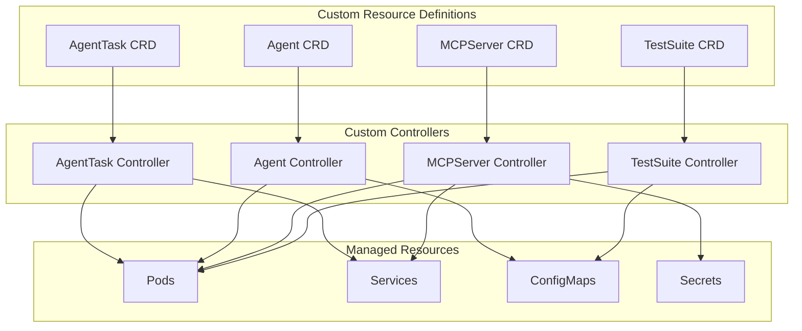
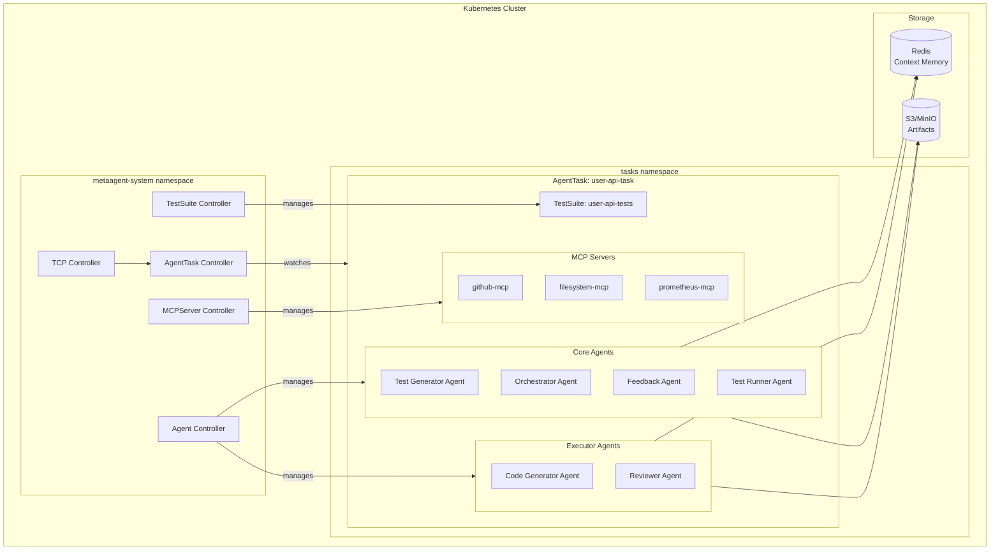
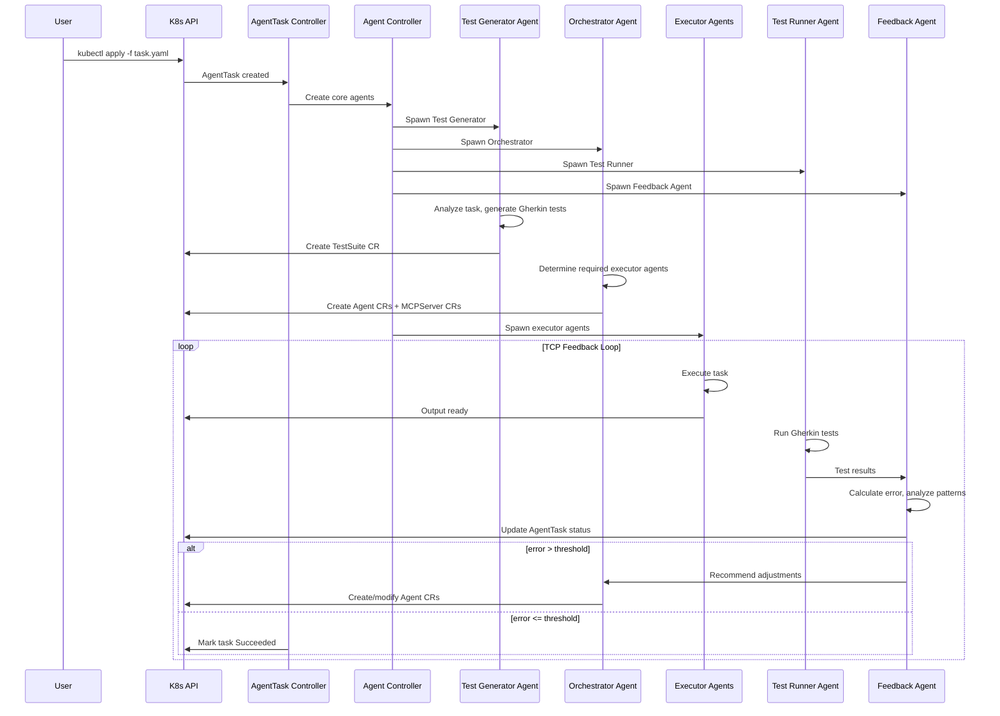

## K8s Deployment Model

### Custom Resource Definitions (CRDs)



### AgentTask CRD

Top-level resource that defines a task to be executed.

```yaml
apiVersion: metaagent.io/v1alpha1
kind: AgentTask
metadata:
  name: user-api-task
  namespace: tasks
spec:
  description: "Build REST API for user management"
  
  # TCP Controller settings
  controller:
    taskWeight: 1.0      # T coefficient
    contextWeight: 0.5   # C coefficient  
    predictionWeight: 0.3 # P coefficient
    errorThreshold: 0.2
    maxIterations: 10
    
  # Test generation config
  testGenerator:
    format: gherkin
    framework: behave
    
  # Resource limits for spawned agents
  resourceQuota:
    maxAgents: 5
    maxMemory: "4Gi"
    maxCPU: "4"
    
status:
  phase: Running # Pending | Running | Succeeded | Failed
  iteration: 3
  currentError: 0.35
  testsTotal: 5
  testsPassed: 3
  agents:
    - name: code-generator-abc123
      status: Completed
    - name: reviewer-def456
      status: Running
```

### Agent CRD

Defines an individual agent instance.

```yaml
apiVersion: metaagent.io/v1alpha1
kind: Agent
metadata:
  name: code-generator-abc123
  namespace: tasks
  labels:
    metaagent.io/task: user-api-task
    metaagent.io/type: code-generator
spec:
  type: code-generator
  
  # LLM configuration
  model:
    provider: anthropic
    name: claude-sonnet-4-20250514
    temperature: 0.7
    maxTokens: 4096
    
  # Agent prompt/instructions
  systemPrompt: |
    You are a code generator agent specialized in REST APIs.
    Generate clean, well-documented code.
    
  # MCP servers this agent needs
  mcpServers:
    - name: github-mcp
    - name: filesystem-mcp
    
  # Resource limits
  resources:
    limits:
      memory: "512Mi"
      cpu: "500m"
    requests:
      memory: "256Mi"
      cpu: "250m"

status:
  phase: Running
  startTime: "2026-01-19T12:00:00Z"
  tokensUsed: 2847
  output:
    configMapRef: code-generator-abc123-output
```

### MCPServer CRD

Defines an MCP server instance.

```yaml
apiVersion: metaagent.io/v1alpha1
kind: MCPServer
metadata:
  name: github-mcp
  namespace: tasks
  labels:
    metaagent.io/task: user-api-task
spec:
  type: github
  
  # MCP server image
  image: metaagent/mcp-github:latest
  
  # Server configuration
  config:
    capabilities:
      - repository_read
      - repository_write
      - pull_request
      
  # Credentials reference
  credentialsSecret:
    name: github-credentials
    
  # Resource limits
  resources:
    limits:
      memory: "256Mi"
      cpu: "250m"

status:
  phase: Running
  endpoint: "http://github-mcp:3000"
  tools:
    - create_repository
    - list_files
    - create_pull_request
```

### TestSuite CRD

Defines the Gherkin test suite (setpoint).

```yaml
apiVersion: metaagent.io/v1alpha1
kind: TestSuite
metadata:
  name: user-api-tests
  namespace: tasks
  labels:
    metaagent.io/task: user-api-task
spec:
  format: gherkin
  framework: behave
  
  # Gherkin feature inline or from ConfigMap
  features:
    - name: user-management
      content: |
        Feature: User Management API
          As a client
          I want to manage users via REST API
          So that I can perform CRUD operations

          Scenario: Create a new user
            Given the API is running
            When I send a POST request to "/users" with body:
              """
              {
                "name": "John Doe",
                "email": "john@example.com"
              }
              """
            Then the response status should be 201
            And the response should contain "id"

          Scenario: Get existing user
            Given a user exists with id "123"
            When I send a GET request to "/users/123"
            Then the response status should be 200
            And the response should contain "name"

          Scenario: Invalid input returns error
            Given the API is running
            When I send a POST request to "/users" with body:
              """
              {
                "invalid": "data"
              }
              """
            Then the response status should be 400
            And the response should contain "error"

  # Test Runner Agent reference
  runnerAgent:
    name: test-runner-agent

status:
  phase: Completed
  lastRun: "2026-01-19T12:05:00Z"
  results:
    total: 3
    passed: 2
    failed: 1
    error: 0.33
  failedScenarios:
    - "Invalid input returns error"
```

### Test Runner Agent CRD

```yaml
apiVersion: metaagent.io/v1alpha1
kind: Agent
metadata:
  name: test-runner-agent
  namespace: tasks
  labels:
    metaagent.io/task: user-api-task
    metaagent.io/type: test-runner
spec:
  type: test-runner
  
  model:
    provider: anthropic
    name: claude-sonnet-4-20250514
    temperature: 0.3
    maxTokens: 2048
    
  systemPrompt: |
    You are a Test Runner agent. Your job is to:
    1. Execute Gherkin test scenarios against the provided output
    2. Report pass/fail for each scenario
    3. Provide detailed failure messages
    
  # Test framework configuration
  testConfig:
    framework: behave
    timeout: 300s
    parallel: false
    
  mcpServers:
    - name: filesystem-mcp
    
  resources:
    limits:
      memory: "512Mi"
      cpu: "500m"

status:
  phase: Running
  lastExecution: "2026-01-19T12:05:00Z"
```

### Feedback Agent CRD

```yaml
apiVersion: metaagent.io/v1alpha1
kind: Agent
metadata:
  name: feedback-agent
  namespace: tasks
  labels:
    metaagent.io/task: user-api-task
    metaagent.io/type: feedback
spec:
  type: feedback
  
  model:
    provider: anthropic
    name: claude-sonnet-4-20250514
    temperature: 0.5
    maxTokens: 2048
    
  systemPrompt: |
    You are a Feedback Collector agent. Your job is to:
    1. Analyze test results from Test Runner
    2. Calculate error metrics
    3. Identify failure patterns
    4. Recommend adjustments for next iteration
    5. Update context memory with learnings
    
  # Metrics to collect
  metricsConfig:
    collectTokenUsage: true
    collectExecutionTime: true
    collectRetryCount: true
    analyzePatterns: true
    
  mcpServers:
    - name: prometheus-mcp
    
  resources:
    limits:
      memory: "256Mi"
      cpu: "250m"

status:
  phase: Running
  currentError: 0.33
  recommendations:
    - "Executor agent missed input validation"
    - "Suggest adding validation-specialist agent"
```

### Cluster Architecture



### Operator Reconciliation Loop



### Resource Management

- **Namespace per task** — isolation
- **HPA** — scale agents based on load
- **Pod lifecycle** — terminate on completion
- **MCP servers as sidecars** — co-located with agents

---

