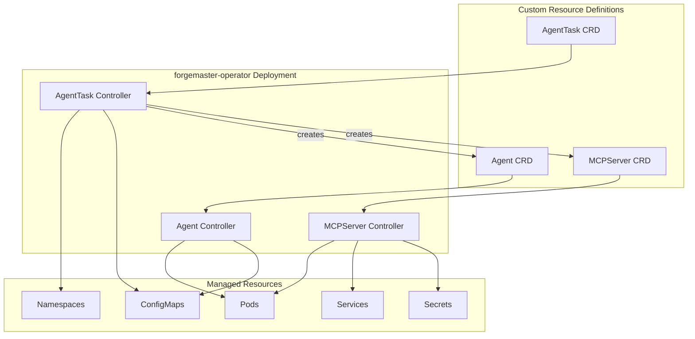
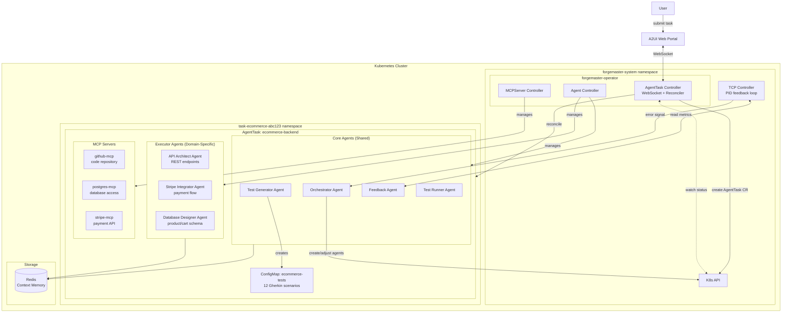
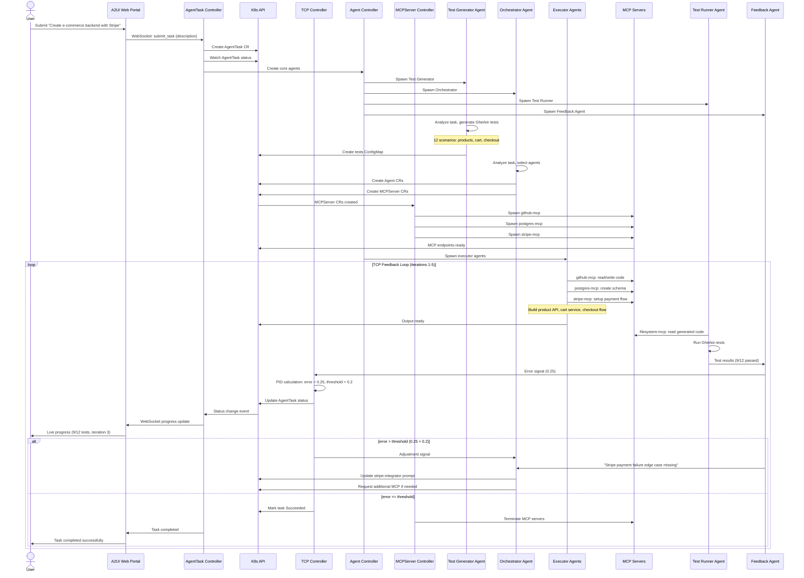
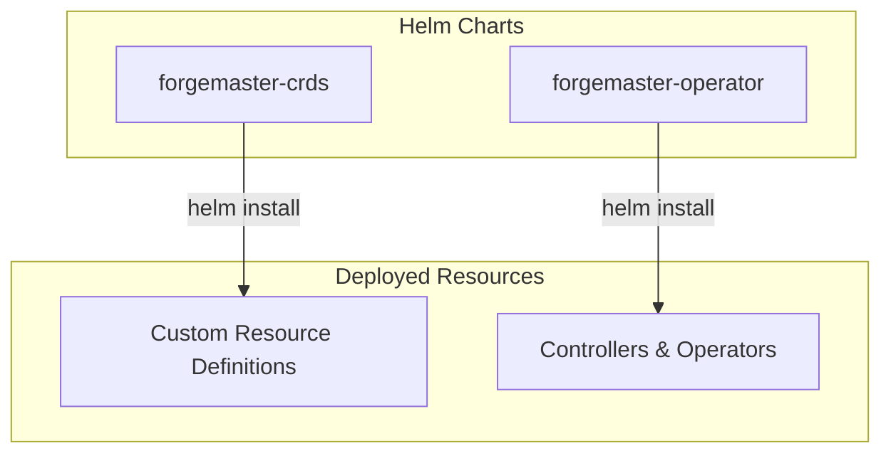

## K8s Deployment Model

### Custom Resource Definitions (CRDs)



> **Note:** Controllers run as a single Operator Deployment, not as separate CRDs.

### AgentTask CRD

Top-level resource that defines a task to be executed.

```yaml
apiVersion: forgemaster.io/v1alpha1
kind: AgentTask
metadata:
  name: ecommerce-backend
  namespace: task-ecommerce-abc123
spec:
  description: |
    Create an e-commerce backend with product catalog, shopping cart,
    and checkout flow. Include Stripe integration.

  # TCP Controller settings
  controller:
    taskWeight: 1.0      # T coefficient
    contextWeight: 0.5   # C coefficient
    predictionWeight: 0.3 # P coefficient
    errorThreshold: 0.2
    maxIterations: 10

  # Test generation config
  testGenerator:
    format: gherkin
    framework: behave

  # Resource limits for spawned agents
  resourceQuota:
    maxAgents: 5
    maxMemory: "4Gi"
    maxCPU: "4"

status:
  phase: Running # Pending | Running | Succeeded | Failed
  iteration: 3
  currentError: 0.25
  testsTotal: 12
  testsPassed: 9
  agents:
    - name: api-architect-abc123
      status: Completed
    - name: stripe-integrator-def456
      status: Running
    - name: database-designer-ghi789
      status: Completed
```

### Agent CRD

Defines an individual agent instance.

```yaml
apiVersion: forgemaster.io/v1alpha1
kind: Agent
metadata:
  name: api-architect-abc123
  namespace: task-ecommerce-abc123
  labels:
    forgemaster.io/task: ecommerce-backend
    forgemaster.io/type: code-generator
spec:
  type: code-generator

  # LLM configuration
  model:
    provider: anthropic
    name: claude-sonnet-4-20250514
    temperature: 0.7
    maxTokens: 4096

  # Agent prompt/instructions
  systemPrompt: |
    You are an API Architect agent specialized in REST APIs for e-commerce.
    Design and implement endpoints for product catalog, shopping cart, and checkout.
    Follow RESTful conventions and ensure proper error handling.

  # MCP servers this agent needs
  mcpServers:
    - name: github-mcp
    - name: postgres-mcp

  # Resource limits
  resources:
    limits:
      memory: "512Mi"
      cpu: "500m"
    requests:
      memory: "256Mi"
      cpu: "250m"

status:
  phase: Completed
  startTime: "2026-01-19T12:00:00Z"
  tokensUsed: 4521
  output:
    configMapRef: api-architect-abc123-output
```

### MCPServer CRD

Defines an MCP server instance.

```yaml
apiVersion: forgemaster.io/v1alpha1
kind: MCPServer
metadata:
  name: stripe-mcp
  namespace: task-ecommerce-abc123
  labels:
    forgemaster.io/task: ecommerce-backend
spec:
  type: stripe

  # MCP server image
  image: forgemaster/mcp-stripe:latest

  # Server configuration
  config:
    capabilities:
      - payment_intents
      - customers
      - webhooks

  # Credentials reference
  credentialsSecret:
    name: stripe-credentials

  # Resource limits
  resources:
    limits:
      memory: "256Mi"
      cpu: "250m"

status:
  phase: Running
  endpoint: "http://stripe-mcp:3000"
  tools:
    - create_payment_intent
    - confirm_payment
    - create_customer
    - handle_webhook
```

### Test Storage (ConfigMaps)

Test definitions are stored in ConfigMaps rather than a separate CRD. The Test Generator Agent creates these, and the Test Runner Agent executes them.

```yaml
apiVersion: v1
kind: ConfigMap
metadata:
  name: ecommerce-tests
  namespace: task-ecommerce-abc123
  labels:
    forgemaster.io/task: ecommerce-backend
    forgemaster.io/type: test-suite
data:
  format: gherkin
  framework: behave
  product-catalog.feature: |
    Feature: Product Catalog API
      Scenario: Create a new product
        Given the API is running
        When I POST to "/products" with valid data
        Then the response status is 201
  shopping-cart.feature: |
    Feature: Shopping Cart
      Scenario: Add item to cart
        Given a product exists
        When I POST to "/cart/items"
        Then the cart is updated
  checkout.feature: |
    Feature: Checkout with Stripe
      Scenario: Successful checkout
        Given I have items in cart
        When I POST to "/checkout"
        Then I receive order confirmation
```

### Test Runner Agent

```yaml
apiVersion: forgemaster.io/v1alpha1
kind: Agent
metadata:
  name: test-runner-agent
  namespace: task-ecommerce-abc123
  labels:
    forgemaster.io/task: ecommerce-backend
    forgemaster.io/type: test-runner
spec:
  type: test-runner

  model:
    provider: anthropic
    name: claude-sonnet-4-20250514
    temperature: 0.3
    maxTokens: 2048

  systemPrompt: |
    You are a Test Runner agent. Your job is to:
    1. Execute Gherkin test scenarios for e-commerce backend
    2. Test product catalog, shopping cart, and checkout endpoints
    3. Verify Stripe payment integration
    4. Report pass/fail for each scenario with detailed failure messages

  # Test framework configuration
  testConfig:
    framework: behave
    timeout: 300s
    parallel: false

  mcpServers:
    - name: filesystem-mcp

  resources:
    limits:
      memory: "512Mi"
      cpu: "500m"

status:
  phase: Running
  lastExecution: "2026-01-19T12:05:00Z"
```

### Feedback Agent CRD

```yaml
apiVersion: forgemaster.io/v1alpha1
kind: Agent
metadata:
  name: feedback-agent
  namespace: task-ecommerce-abc123
  labels:
    forgemaster.io/task: ecommerce-backend
    forgemaster.io/type: feedback
spec:
  type: feedback

  model:
    provider: anthropic
    name: claude-sonnet-4-20250514
    temperature: 0.5
    maxTokens: 2048

  systemPrompt: |
    You are a Feedback Collector agent. Your job is to:
    1. Analyze test results from Test Runner
    2. Calculate error metrics for e-commerce scenarios
    3. Identify failure patterns in checkout/payment flow
    4. Recommend adjustments for next iteration
    5. Update context memory with learnings

  # Metrics to collect
  metricsConfig:
    collectTokenUsage: true
    collectExecutionTime: true
    collectRetryCount: true
    analyzePatterns: true

  mcpServers:
    - name: prometheus-mcp

  resources:
    limits:
      memory: "256Mi"
      cpu: "250m"

status:
  phase: Running
  currentError: 0.25
  recommendations:
    - "Stripe Integrator missed payment failure edge case"
    - "Cart service needs quantity validation"
    - "Suggest adding retry logic for Stripe API timeouts"
```

### Cluster Architecture

Example: E-commerce backend task — "Create an e-commerce backend with product catalog, shopping cart, and checkout flow. Include Stripe integration."



**Task Flow:**

1. User submits: "Create an e-commerce backend with product catalog, shopping cart, and checkout flow. Include Stripe integration."
2. AgentTask Controller creates isolated namespace `task-ecommerce-abc123`
3. Core agents spawn (orchestrator, test-generator, test-runner, feedback)
4. Orchestrator analyzes task and provisions executor agents (API Architect, Stripe Integrator, Database Designer)
5. MCP servers provision: github-mcp, postgres-mcp, stripe-mcp
6. Test Generator creates 12 Gherkin scenarios for product CRUD, cart operations, checkout flow
7. TCP feedback loop runs until all tests pass

### Operator Reconciliation Loop

Example: E-commerce backend task flow.



### Resource Management

- **Namespace per task** — isolation
- **HPA** — scale agents based on load
- **Pod lifecycle** — terminate on completion
- **MCP servers as sidecars** — co-located with agents

### Helm Chart Deployment

All CRDs and controllers are deployed via Helm charts. See [10-helm-charts.md](10-helm-charts.md) for full details.



**Quick Start:**

```bash
# Add Helm repository
helm repo add forgemaster https://charts.forgemaster.io

# Install CRDs first
helm install forgemaster-crds forgemaster/forgemaster-crds

# Install operators
helm install forgemaster-operator forgemaster/forgemaster-operator \
  --namespace forgemaster-system \
  --create-namespace
```

---

