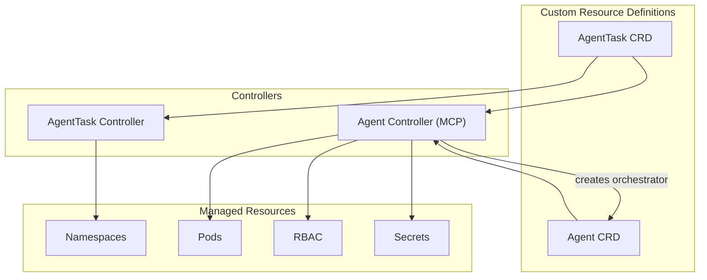
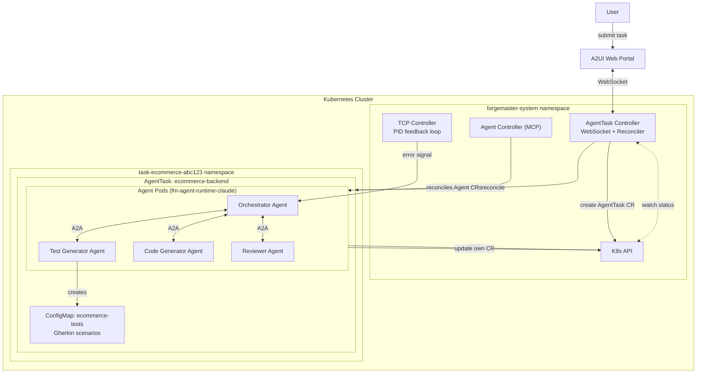
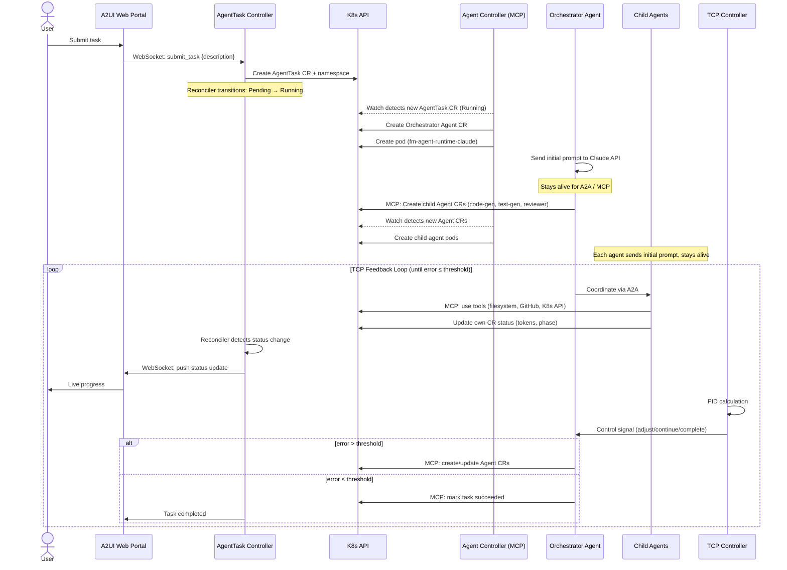

## K8s Deployment Model

### Custom Resource Definitions (CRDs)



Each controller runs as a separate Deployment:
- AgentTask Controller: [`crates/fm-controller-agenttask/helm/`](../../crates/fm-controller-agenttask/helm/)
- Agent Controller: [`crates/fm-controller-agent/helm/`](../../crates/fm-controller-agent/helm/)

MCP servers are external services — agents connect to them directly via `spec.mcpServers` references. No dedicated MCP controller is needed.

### AgentTask CRD

Top-level resource that defines a task to be executed. See [`crates/fm-controller-agenttask/helm/templates/agenttask-crd.yaml`](../../crates/fm-controller-agenttask/helm/templates/agenttask-crd.yaml) for the full CRD definition.

### Agent CRD

Defines an individual agent instance. See [`crates/fm-controller-agent/src/crd/agent/crd.rs`](../../crates/fm-controller-agent/src/crd/agent/crd.rs) for the full spec.

The Agent Controller creates pods with the appropriate runtime image (e.g. `fm-agent-runtime-claude`). Config is injected via env vars — see [`crates/fm-controller-agent/src/controller/pod_builder.rs`](../../crates/fm-controller-agent/src/controller/pod_builder.rs).

### Test Storage (ConfigMaps)

Test definitions are stored in ConfigMaps rather than a separate CRD. The Test Generator Agent creates these, and the Test Runner Agent executes them.

```yaml
apiVersion: v1
kind: ConfigMap
metadata:
  name: ecommerce-tests
  namespace: task-ecommerce-abc123
  labels:
    forgemaster.io/task: ecommerce-backend
    forgemaster.io/type: test-suite
data:
  format: gherkin
  framework: behave
  product-catalog.feature: |
    Feature: Product Catalog API
      Scenario: Create a new product
        Given the API is running
        When I POST to "/products" with valid data
        Then the response status is 201
  shopping-cart.feature: |
    Feature: Shopping Cart
      Scenario: Add item to cart
        Given a product exists
        When I POST to "/cart/items"
        Then the cart is updated
  checkout.feature: |
    Feature: Checkout with Stripe
      Scenario: Successful checkout
        Given I have items in cart
        When I POST to "/checkout"
        Then I receive order confirmation
```

### Cluster Architecture

Example: E-commerce backend task — "Create an e-commerce backend with product catalog, shopping cart, and checkout flow. Include Stripe integration."



**Task Flow:**

1. User submits task via A2UI Web Portal
2. AgentTask Controller creates AgentTask CR and isolated namespace
3. Agent Controller detects new AgentTask (Running), creates Orchestrator Agent CR
4. Agent Controller reconciles Agent CR, creates pod with `fm-agent-runtime-claude`
5. Orchestrator pod sends initial prompt, stays alive for A2A/MCP communication
6. Orchestrator coordinates child agents via A2A, agents use MCP for tool access (filesystem, GitHub, K8s API)
7. Agents update their own CR status (phase, tokens used)
8. TCP feedback loop runs until error threshold is met

### Reconciliation Loop

Example: E-commerce backend task flow.



### Resource Management

- **Namespace per task** — isolation between tasks
- **Long-lived agent pods** — stay alive for A2A/MCP, exit on SIGTERM or task completion
- **RBAC per agent** — ServiceAccount + ClusterRoleBinding for K8s API access
- **Owner references** — agent pods are owned by Agent CR (garbage collected on deletion)


