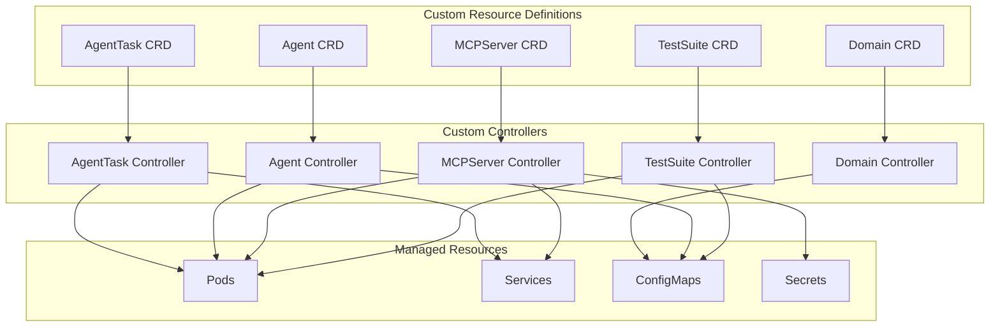
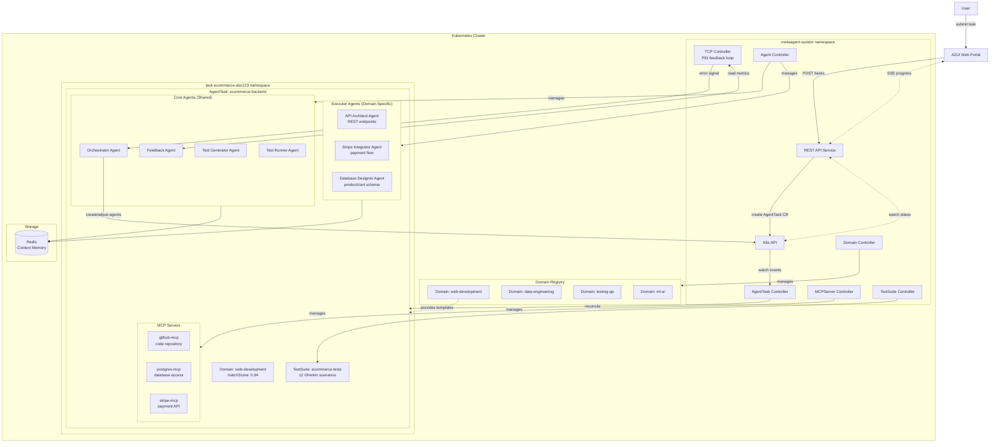
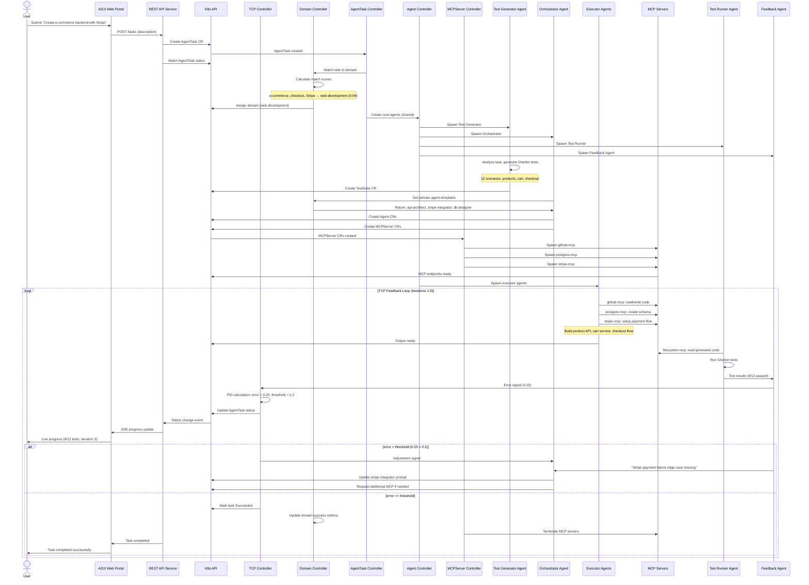
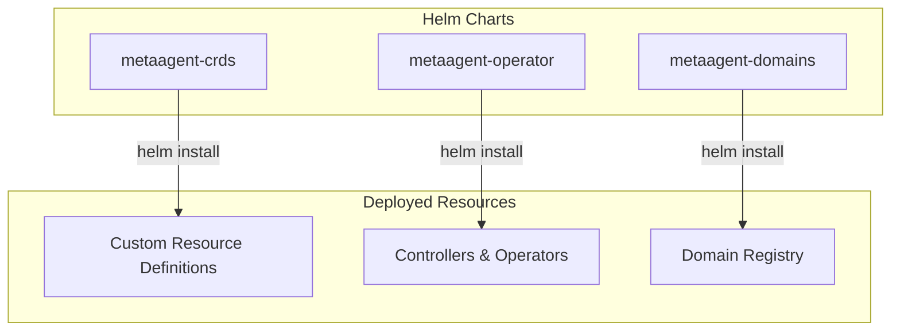

## K8s Deployment Model

### Custom Resource Definitions (CRDs)



### Domain CRD

Defines a domain — a specialized area of expertise with proven agent combinations, MCP servers, and task patterns.

```yaml
apiVersion: metaagent.io/v1alpha1
kind: Domain
metadata:
  name: web-development
  namespace: metaagent-system
spec:
  # Domain identification
  displayName: "Web Development"
  description: "Full-stack web applications, REST APIs, frontend frameworks"

  # Skills this domain provides
  skills:
    - rest-api
    - graphql
    - authentication
    - database-integration
    - frontend-spa
    - payment-processing

  # Task patterns this domain can handle (regex patterns)
  taskPatterns:
    - ".*REST API.*"
    - ".*web (app|application).*"
    - ".*frontend.*"
    - ".*e-commerce.*"
    - ".*checkout.*"

  # Agent templates available in this domain
  agentTemplates:
    domainSpecific:
      - name: api-architect
        type: code-generator
        systemPrompt: |
          You are an API architect specializing in REST and GraphQL APIs.
          Design clean, scalable API structures.
        model:
          provider: anthropic
          name: claude-sonnet-4-20250514
          temperature: 0.7

      - name: stripe-integrator
        type: code-generator
        systemPrompt: |
          You are a payment integration specialist.
          Implement secure Stripe payment flows.
        model:
          provider: anthropic
          name: claude-sonnet-4-20250514
          temperature: 0.5

    # References to shared agents (defined separately)
    sharedAgentRefs:
      - test-generator
      - reviewer
      - doc-generator

  # MCP servers required by this domain
  mcpServers:
    - name: github-mcp
      required: true
    - name: postgres-mcp
      required: false
    - name: stripe-mcp
      required: false

  # Matching configuration
  matching:
    minMatchScore: 0.75
    keywordWeights:
      "REST": 0.9
      "API": 0.8
      "web": 0.7
      "frontend": 0.8
      "Stripe": 0.9
      "checkout": 0.85

  # Domain composition rules
  composition:
    canComposeWith:
      - data-engineering
      - testing-qa
    compositionPatterns:
      - pattern: ".*real-time.*analytics.*"
        composeDomains: ["web-development", "data-engineering"]

status:
  phase: Active  # Active | Deprecated | Disabled
  registeredAgents: 5
  activeTasks: 3
  successRate: 0.87
  lastUsed: "2026-01-19T14:00:00Z"
```

### AgentTask CRD

Top-level resource that defines a task to be executed.

```yaml
apiVersion: metaagent.io/v1alpha1
kind: AgentTask
metadata:
  name: ecommerce-backend
  namespace: task-ecommerce-abc123
spec:
  description: |
    Create an e-commerce backend with product catalog, shopping cart,
    and checkout flow. Include Stripe integration.

  # Domain reference (auto-selected or user-specified)
  domain:
    name: web-development
    autoSelected: true
    matchScore: 0.94
    reason: "Task mentions e-commerce, checkout, Stripe — matched web-development domain"

  # TCP Controller settings
  controller:
    taskWeight: 1.0      # T coefficient
    contextWeight: 0.5   # C coefficient
    predictionWeight: 0.3 # P coefficient
    errorThreshold: 0.2
    maxIterations: 10

  # Test generation config
  testGenerator:
    format: gherkin
    framework: behave

  # Resource limits for spawned agents
  resourceQuota:
    maxAgents: 5
    maxMemory: "4Gi"
    maxCPU: "4"

status:
  phase: Running # Pending | Running | Succeeded | Failed
  iteration: 3
  currentError: 0.25
  testsTotal: 12
  testsPassed: 9
  agents:
    - name: api-architect-abc123
      status: Completed
    - name: stripe-integrator-def456
      status: Running
    - name: database-designer-ghi789
      status: Completed
```

### Agent CRD

Defines an individual agent instance.

```yaml
apiVersion: metaagent.io/v1alpha1
kind: Agent
metadata:
  name: api-architect-abc123
  namespace: task-ecommerce-abc123
  labels:
    metaagent.io/task: ecommerce-backend
    metaagent.io/type: code-generator
    metaagent.io/domain: web-development
spec:
  type: code-generator

  # LLM configuration
  model:
    provider: anthropic
    name: claude-sonnet-4-20250514
    temperature: 0.7
    maxTokens: 4096

  # Agent prompt/instructions
  systemPrompt: |
    You are an API Architect agent specialized in REST APIs for e-commerce.
    Design and implement endpoints for product catalog, shopping cart, and checkout.
    Follow RESTful conventions and ensure proper error handling.

  # MCP servers this agent needs
  mcpServers:
    - name: github-mcp
    - name: postgres-mcp

  # Resource limits
  resources:
    limits:
      memory: "512Mi"
      cpu: "500m"
    requests:
      memory: "256Mi"
      cpu: "250m"

status:
  phase: Completed
  startTime: "2026-01-19T12:00:00Z"
  tokensUsed: 4521
  output:
    configMapRef: api-architect-abc123-output
```

### MCPServer CRD

Defines an MCP server instance.

```yaml
apiVersion: metaagent.io/v1alpha1
kind: MCPServer
metadata:
  name: stripe-mcp
  namespace: task-ecommerce-abc123
  labels:
    metaagent.io/task: ecommerce-backend
spec:
  type: stripe

  # MCP server image
  image: metaagent/mcp-stripe:latest

  # Server configuration
  config:
    capabilities:
      - payment_intents
      - customers
      - webhooks

  # Credentials reference
  credentialsSecret:
    name: stripe-credentials

  # Resource limits
  resources:
    limits:
      memory: "256Mi"
      cpu: "250m"

status:
  phase: Running
  endpoint: "http://stripe-mcp:3000"
  tools:
    - create_payment_intent
    - confirm_payment
    - create_customer
    - handle_webhook
```

### TestSuite CRD

Defines the Gherkin test suite (setpoint).

```yaml
apiVersion: metaagent.io/v1alpha1
kind: TestSuite
metadata:
  name: ecommerce-tests
  namespace: task-ecommerce-abc123
  labels:
    metaagent.io/task: ecommerce-backend
spec:
  format: gherkin
  framework: behave

  # Gherkin feature inline or from ConfigMap
  features:
    - name: product-catalog
      content: |
        Feature: Product Catalog API
          As an e-commerce client
          I want to manage products via REST API
          So that I can build a product catalog

          Scenario: Create a new product
            Given the API is running
            When I send a POST request to "/products" with body:
              """
              {
                "name": "Wireless Headphones",
                "price": 99.99,
                "category": "electronics"
              }
              """
            Then the response status should be 201
            And the response should contain "id"

          Scenario: List products by category
            Given products exist in category "electronics"
            When I send a GET request to "/products?category=electronics"
            Then the response status should be 200
            And the response should contain a list of products

    - name: shopping-cart
      content: |
        Feature: Shopping Cart
          As a customer
          I want to manage my shopping cart
          So that I can purchase multiple items

          Scenario: Add item to cart
            Given a product exists with id "prod-123"
            And I have an active cart session
            When I send a POST request to "/cart/items" with body:
              """
              {
                "productId": "prod-123",
                "quantity": 2
              }
              """
            Then the response status should be 200
            And the cart total should be updated

    - name: checkout-flow
      content: |
        Feature: Checkout with Stripe
          As a customer
          I want to complete checkout with Stripe payment
          So that I can purchase my cart items

          Scenario: Successful checkout
            Given I have items in my cart
            And I have a valid Stripe payment method
            When I send a POST request to "/checkout" with payment details
            Then the response status should be 200
            And I should receive an order confirmation
            And Stripe should have processed the payment

          Scenario: Payment failure handling
            Given I have items in my cart
            And I have an invalid payment method
            When I send a POST request to "/checkout" with payment details
            Then the response status should be 402
            And the response should contain "payment_failed"

  # Test Runner Agent reference
  runnerAgent:
    name: test-runner-agent

status:
  phase: Running
  lastRun: "2026-01-19T12:05:00Z"
  results:
    total: 12
    passed: 9
    failed: 3
    error: 0.25
  failedScenarios:
    - "Payment failure handling"
    - "List products by category"
    - "Add item to cart"
```

### Test Runner Agent CRD

```yaml
apiVersion: metaagent.io/v1alpha1
kind: Agent
metadata:
  name: test-runner-agent
  namespace: task-ecommerce-abc123
  labels:
    metaagent.io/task: ecommerce-backend
    metaagent.io/type: test-runner
spec:
  type: test-runner

  model:
    provider: anthropic
    name: claude-sonnet-4-20250514
    temperature: 0.3
    maxTokens: 2048

  systemPrompt: |
    You are a Test Runner agent. Your job is to:
    1. Execute Gherkin test scenarios for e-commerce backend
    2. Test product catalog, shopping cart, and checkout endpoints
    3. Verify Stripe payment integration
    4. Report pass/fail for each scenario with detailed failure messages

  # Test framework configuration
  testConfig:
    framework: behave
    timeout: 300s
    parallel: false

  mcpServers:
    - name: filesystem-mcp

  resources:
    limits:
      memory: "512Mi"
      cpu: "500m"

status:
  phase: Running
  lastExecution: "2026-01-19T12:05:00Z"
```

### Feedback Agent CRD

```yaml
apiVersion: metaagent.io/v1alpha1
kind: Agent
metadata:
  name: feedback-agent
  namespace: task-ecommerce-abc123
  labels:
    metaagent.io/task: ecommerce-backend
    metaagent.io/type: feedback
spec:
  type: feedback

  model:
    provider: anthropic
    name: claude-sonnet-4-20250514
    temperature: 0.5
    maxTokens: 2048

  systemPrompt: |
    You are a Feedback Collector agent. Your job is to:
    1. Analyze test results from Test Runner
    2. Calculate error metrics for e-commerce scenarios
    3. Identify failure patterns in checkout/payment flow
    4. Recommend adjustments for next iteration
    5. Update context memory with learnings

  # Metrics to collect
  metricsConfig:
    collectTokenUsage: true
    collectExecutionTime: true
    collectRetryCount: true
    analyzePatterns: true

  mcpServers:
    - name: prometheus-mcp

  resources:
    limits:
      memory: "256Mi"
      cpu: "250m"

status:
  phase: Running
  currentError: 0.25
  recommendations:
    - "Stripe Integrator missed payment failure edge case"
    - "Cart service needs quantity validation"
    - "Suggest adding retry logic for Stripe API timeouts"
```

### Cluster Architecture

Example: E-commerce backend task — "Create an e-commerce backend with product catalog, shopping cart, and checkout flow. Include Stripe integration."



**Task Flow:**

1. User submits: "Create an e-commerce backend with product catalog, shopping cart, and checkout flow. Include Stripe integration."
2. Domain Controller matches to `web-development` domain (score: 0.94)
3. AgentTask Controller creates isolated namespace `task-ecommerce-abc123`
4. Core agents spawn (shared across all domains)
5. Domain provides templates for: API Architect, Stripe Integrator, Database Designer
6. MCP servers provision: github-mcp, postgres-mcp, stripe-mcp
7. Test Generator creates 12 Gherkin scenarios for product CRUD, cart operations, checkout flow
8. TCP feedback loop runs until all tests pass

### Operator Reconciliation Loop

Example: E-commerce backend task flow.



### Resource Management

- **Namespace per task** — isolation
- **HPA** — scale agents based on load
- **Pod lifecycle** — terminate on completion
- **MCP servers as sidecars** — co-located with agents
- **Domain registry** — cluster-wide shared resource

### Helm Chart Deployment

All CRDs and controllers are deployed via Helm charts. See [10-helm-charts.md](10-helm-charts.md) for full details.



**Quick Start:**

```bash
# Add Helm repository
helm repo add metaagent https://charts.metaagent.io

# Install CRDs first
helm install metaagent-crds metaagent/metaagent-crds

# Install operators
helm install metaagent-operator metaagent/metaagent-operator \
  --namespace metaagent-system \
  --create-namespace

# Install default domains
helm install metaagent-domains metaagent/metaagent-domains \
  --namespace metaagent-system
```

**Custom Domain Installation:**

```bash
# Install with custom domain values
helm install metaagent-domains metaagent/metaagent-domains \
  --namespace metaagent-system \
  -f custom-domains.yaml
```

Example `custom-domains.yaml`:

```yaml
domains:
  - name: fintech
    displayName: "FinTech Development"
    skills:
      - payment-processing
      - fraud-detection
      - regulatory-compliance
    agentTemplates:
      - name: compliance-checker
        type: reviewer
        systemPrompt: "You verify PCI-DSS and SOX compliance..."
```

---

