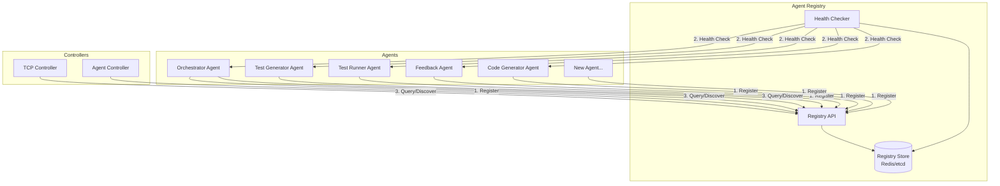
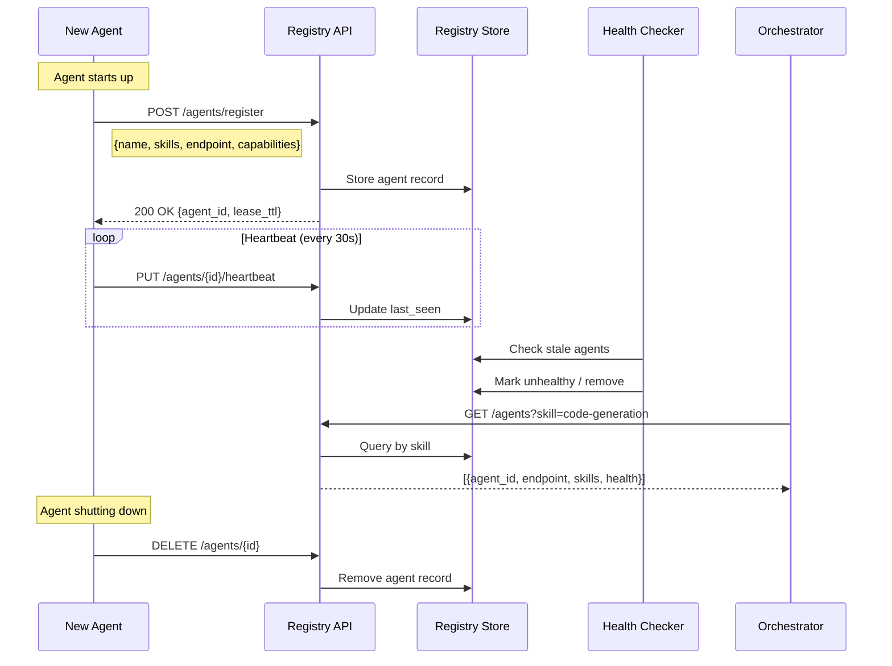
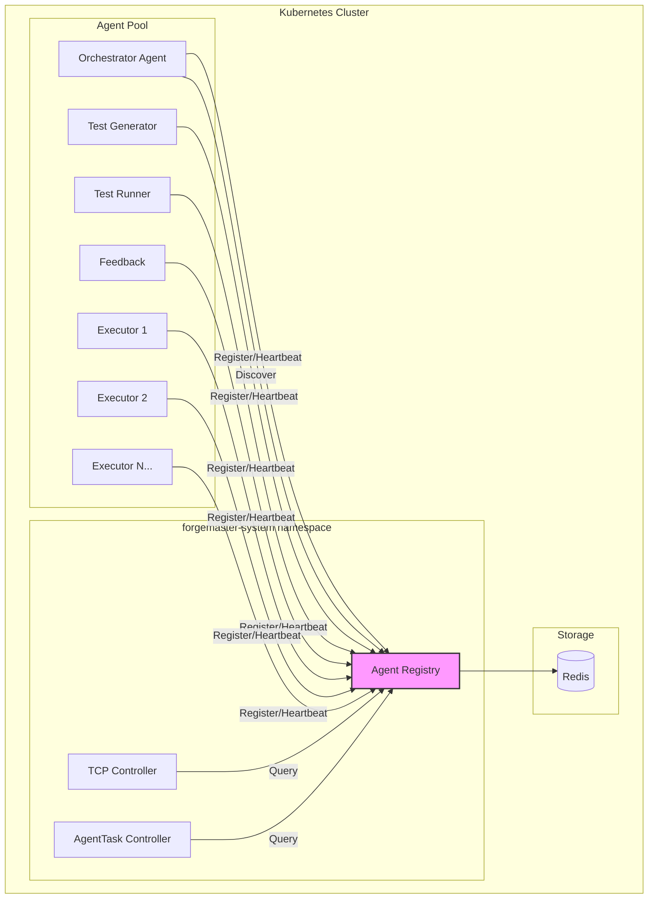

## Agent Registry

A centralized registry where agents register their capabilities on startup and can be discovered by other agents or controllers.

### Why Agent Registry?

| Problem | Solution |
|---------|----------|
| How does Orchestrator find the right agent? | Search by skills/capabilities |
| New agent spins up — who knows about it? | Auto-registration on startup |
| Agent crashes — how to avoid routing to it? | Health checks + auto-deregister |
| Need specialist agent for rare task? | Query registry for matching skills |

### Registry Architecture



### Agent Registration Flow



### Registry CRD

```yaml
apiVersion: forgemaster.io/v1alpha1
kind: AgentRegistry
metadata:
  name: meta-agent-registry
  namespace: forgemaster-system
spec:
  # Storage backend
  storage:
    type: redis  # redis, etcd, postgresql
    connectionRef:
      secretName: registry-redis-credentials
      
  # Health check configuration
  healthCheck:
    enabled: true
    interval: 30s
    timeout: 10s
    unhealthyThreshold: 3
    
  # Registration settings
  registration:
    # How long before agent must re-register
    leaseTTL: 60s
    # Require heartbeat to stay registered
    requireHeartbeat: true
    # Auto-cleanup stale registrations
    cleanupInterval: 120s
    
  # Discovery settings
  discovery:
    # Cache discovery results
    cacheEnabled: true
    cacheTTL: 10s
    # Enable skill-based search
    skillMatching: true
    # Enable capability filtering
    capabilityFiltering: true
    
  # API server configuration
  api:
    port: 8082
    rateLimit:
      requestsPerMinute: 1000
```

### Agent Registration Record

```yaml
apiVersion: forgemaster.io/v1alpha1
kind: AgentRegistration
metadata:
  name: code-generator-abc123
  namespace: forgemaster-system
  labels:
    forgemaster.io/type: executor
    forgemaster.io/skill: code-generation
spec:
  # Agent identity
  agentRef:
    name: code-generator-abc123
    namespace: forgemaster-system
    
  # Skills this agent provides (searchable)
  skills:
    - name: code-generation
      description: "Generates code from specifications"
      proficiency: 0.95  # 0-1 score
      languages:
        - python
        - javascript
        - rust
        
    - name: api-design
      description: "Designs REST API endpoints"
      proficiency: 0.85
      
    - name: documentation
      description: "Writes code documentation"
      proficiency: 0.80
      
  # Capabilities (what protocols/features supported)
  capabilities:
    a2a:
      enabled: true
      version: "1.0"
      endpoint: "http://code-generator-abc123:8080/a2a"
    a2ui:
      enabled: false
    mcp:
      enabled: true
      tools:
        - filesystem
        - github
    streaming:
      enabled: true
      format: sse
      
  # Resource information
  resources:
    maxConcurrentTasks: 5
    currentLoad: 2
    memoryUsage: "256Mi"
    cpuUsage: "200m"
    
  # Model information
  model:
    provider: anthropic
    name: claude-sonnet-4-20250514
    
status:
  phase: Healthy  # Healthy, Unhealthy, Unknown, Deregistered
  lastHeartbeat: "2026-01-19T12:05:00Z"
  registeredAt: "2026-01-19T10:00:00Z"
  tasksCompleted: 47
  averageLatency: "2.3s"
  successRate: 0.94
```

### Registry API

```yaml
# OpenAPI spec for Registry API
openapi: 3.0.0
info:
  title: Agent Registry API
  version: 1.0.0
  
paths:
  /agents/register:
    post:
      summary: Register a new agent
      requestBody:
        content:
          application/json:
            schema:
              $ref: '#/components/schemas/AgentRegistration'
      responses:
        '200':
          description: Registration successful
          content:
            application/json:
              schema:
                type: object
                properties:
                  agentId:
                    type: string
                  leaseTTL:
                    type: integer
                    
  /agents/{agentId}:
    get:
      summary: Get agent details
      parameters:
        - name: agentId
          in: path
          required: true
          schema:
            type: string
      responses:
        '200':
          description: Agent details
          
    delete:
      summary: Deregister agent
      parameters:
        - name: agentId
          in: path
          required: true
          schema:
            type: string
      responses:
        '204':
          description: Deregistered
          
  /agents/{agentId}/heartbeat:
    put:
      summary: Send heartbeat
      parameters:
        - name: agentId
          in: path
          required: true
          schema:
            type: string
      requestBody:
        content:
          application/json:
            schema:
              type: object
              properties:
                currentLoad:
                  type: integer
                memoryUsage:
                  type: string
      responses:
        '200':
          description: Heartbeat accepted
          
  /agents/search:
    get:
      summary: Search agents by criteria
      parameters:
        - name: skill
          in: query
          schema:
            type: string
          description: Filter by skill name
        - name: capability
          in: query
          schema:
            type: string
          description: Filter by capability (a2a, a2ui, mcp)
        - name: healthy
          in: query
          schema:
            type: boolean
          description: Only return healthy agents
        - name: minProficiency
          in: query
          schema:
            type: number
          description: Minimum skill proficiency (0-1)
        - name: maxLoad
          in: query
          schema:
            type: integer
          description: Maximum current load
      responses:
        '200':
          description: Matching agents
          content:
            application/json:
              schema:
                type: array
                items:
                  $ref: '#/components/schemas/AgentRegistration'
                  
  /agents/skills:
    get:
      summary: List all available skills
      responses:
        '200':
          description: List of skills
          content:
            application/json:
              schema:
                type: array
                items:
                  type: object
                  properties:
                    name:
                      type: string
                    agentCount:
                      type: integer
                    avgProficiency:
                      type: number
```

### Helm Values for Registry

```yaml
# values.yaml (additions)
agentRegistry:
  enabled: true
  
  image:
    repository: forgemaster/agent-registry
    tag: latest
    
  replicas: 2  # HA
  
  storage:
    type: redis
    # Uses same Redis as other components
    
  healthCheck:
    enabled: true
    interval: 30s
    timeout: 10s
    unhealthyThreshold: 3
    
  registration:
    leaseTTL: 60s
    requireHeartbeat: true
    cleanupInterval: 120s
    
  api:
    port: 8082
    
  service:
    type: ClusterIP
    port: 8082
    
  resources:
    limits:
      memory: "256Mi"
      cpu: "250m"
```

### Registry in Cluster Architecture


