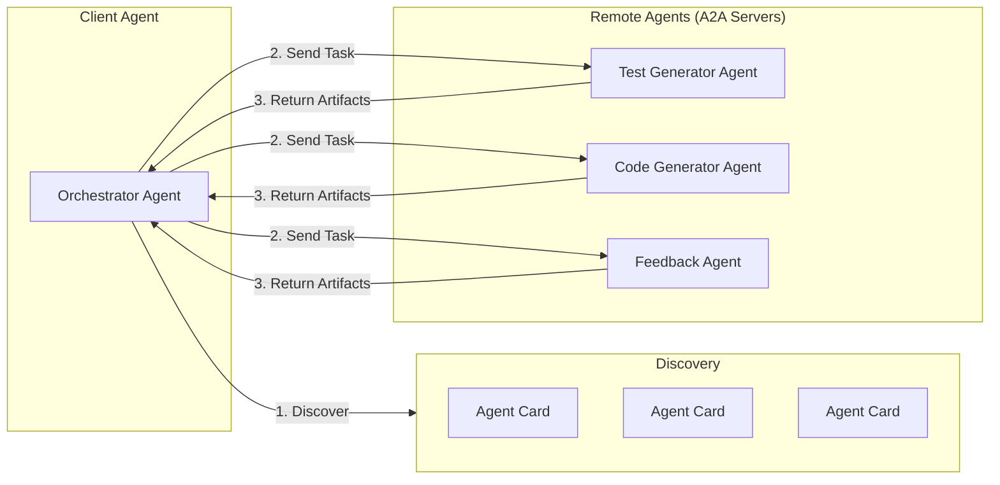
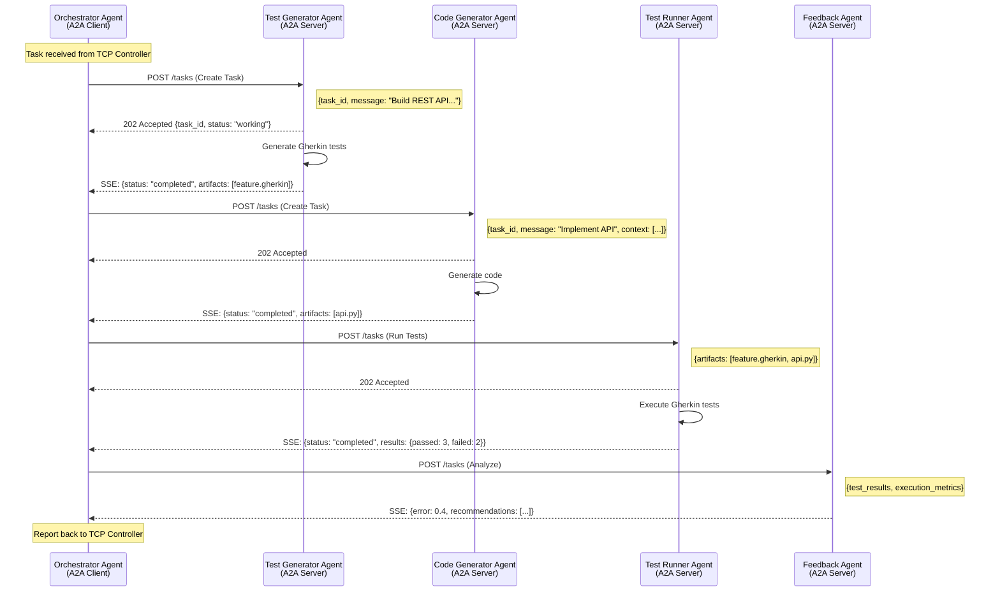
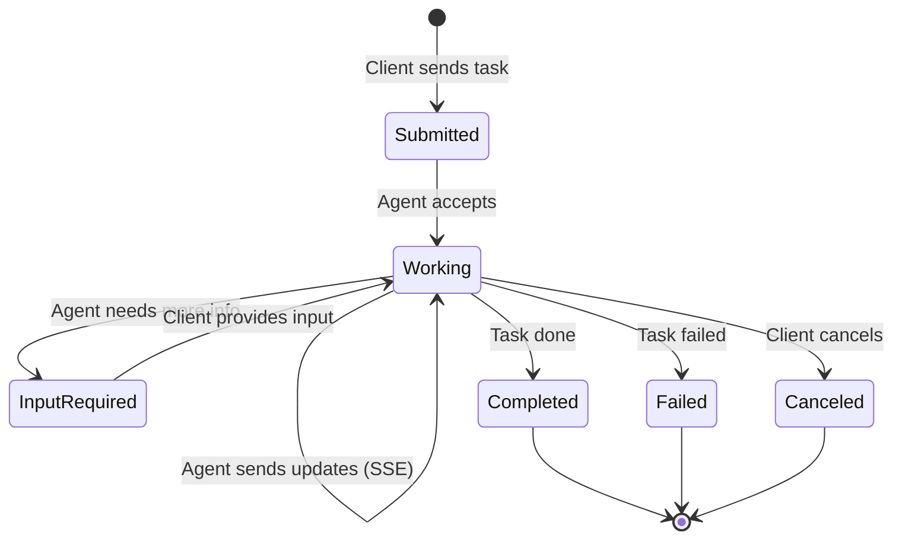
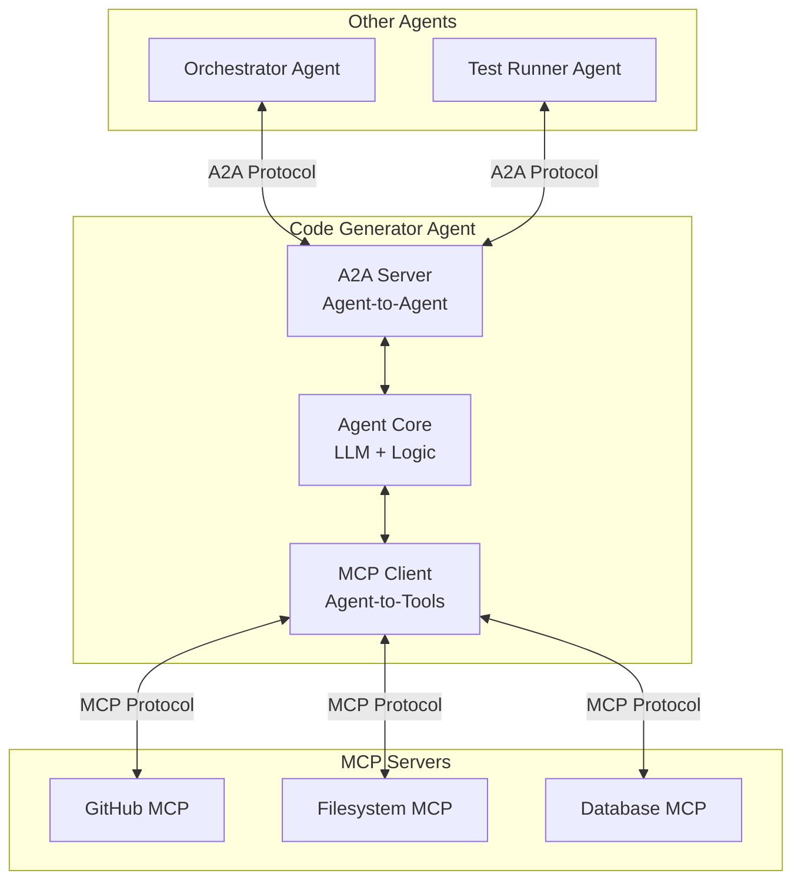

## Agent Communication: A2A Protocol

Agents communicate using the **Agent2Agent (A2A) Protocol** — an open standard by Google (now Linux Foundation) for secure agent-to-agent communication.

### Why A2A?

| Protocol | Purpose |
|----------|---------|
| **MCP** | Agent ↔ Tools/Data communication |
| **A2A** | Agent ↔ Agent communication |

A2A complements MCP: use MCP for tools and data access, use A2A for inter-agent collaboration.

### A2A Core Concepts



### Agent Card

Each agent exposes an **Agent Card** — a JSON manifest describing its capabilities:

```json
{
  "name": "test-generator-agent",
  "description": "Generates Gherkin E2E tests from task descriptions",
  "version": "1.0.0",
  "endpoint": "https://agents.forgemaster.io/test-generator",
  "capabilities": {
    "streaming": true,
    "pushNotifications": true
  },
  "skills": [
    {
      "name": "generate-gherkin",
      "description": "Analyzes task and generates Gherkin feature files",
      "inputModes": ["text"],
      "outputModes": ["text", "file"]
    }
  ],
  "authentication": {
    "type": "oauth2",
    "authorizationUrl": "https://auth.forgemaster.io/oauth/authorize"
  }
}
```

### A2A Message Flow



### A2A Task States



### Agent CRD with A2A Configuration

```yaml
apiVersion: forgemaster.io/v1alpha1
kind: Agent
metadata:
  name: test-generator-agent
  namespace: tasks
spec:
  type: test-generator
  
  # A2A Server Configuration
  a2a:
    enabled: true
    endpoint: "/a2a"
    port: 8080
    
    # Agent Card configuration
    agentCard:
      description: "Generates Gherkin E2E tests from task descriptions"
      skills:
        - name: generate-gherkin
          description: "Analyzes task and generates Gherkin feature files"
          inputModes: ["text"]
          outputModes: ["text", "file"]
      capabilities:
        streaming: true
        pushNotifications: true
        
    # Authentication
    authentication:
      type: oauth2
      secretRef:
        name: a2a-oauth-credentials
        
    # Rate limiting
    rateLimit:
      requestsPerMinute: 60
      
  model:
    provider: anthropic
    name: claude-sonnet-4-20250514
    
  # MCP servers for tools/data access
  mcpServers:
    - name: filesystem-mcp
    
  resources:
    limits:
      memory: "512Mi"
      cpu: "500m"
```

### A2A + MCP Integration



### K8s Service for A2A

```yaml
apiVersion: v1
kind: Service
metadata:
  name: test-generator-agent-a2a
  namespace: tasks
  labels:
    forgemaster.io/agent: test-generator-agent
    forgemaster.io/protocol: a2a
spec:
  selector:
    forgemaster.io/agent: test-generator-agent
  ports:
    - name: a2a
      port: 8080
      targetPort: 8080
      protocol: TCP
  type: ClusterIP
---
# Ingress for external A2A access
apiVersion: networking.k8s.io/v1
kind: Ingress
metadata:
  name: a2a-gateway
  namespace: tasks
  annotations:
    nginx.ingress.kubernetes.io/ssl-redirect: "true"
spec:
  rules:
    - host: agents.forgemaster.io
      http:
        paths:
          - path: /test-generator/.well-known/agent.json
            pathType: Prefix
            backend:
              service:
                name: test-generator-agent-a2a
                port:
                  number: 8080
          - path: /test-generator/
            pathType: Prefix
            backend:
              service:
                name: test-generator-agent-a2a
                port:
                  number: 8080
```
