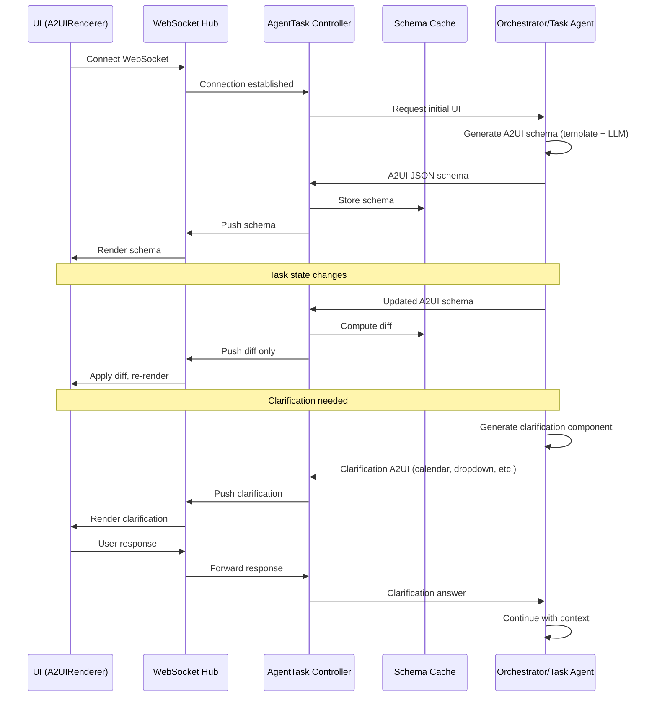

# A2UI Architecture

This document describes how ForgeMaster uses A2UI for dynamic UI generation by agents.

---

## Overview

The UI is a pure **A2UI renderer** with no business logic. Agents generate UI schemas dynamically based on task context, and the AgentTask Controller relays these schemas to the UI via WebSocket.

---

## Why Agents Generate A2UI

| Reason | Explanation |
|--------|-------------|
| **Context Awareness** | Agent knows task context (e.g., needs time range → generate calendar) |
| **No Bottleneck** | UI generation distributed across agents, not centralized |
| **Dynamic Clarifications** | Agent generates appropriate UI component for clarification type |
| **Templates + LLM** | Base templates for common patterns, LLM fills dynamic parts |

---

## Components

### UI (A2UIRenderer)

- Pure renderer, no business logic
- Connects to AgentTask Controller via WebSocket
- Renders A2UI schemas received from backend
- Sends user interactions (form submissions, clicks) back via WebSocket

### AgentTask Controller (WebSocket Hub)

- Manages WebSocket connections with UI clients
- Receives A2UI schemas from agents
- Caches schemas for efficiency
- Computes diffs and pushes only changes to UI
- Relays user responses back to agents

### Agents (A2UI Generators)

- Generate A2UI schemas as part of task processing
- Use templates for common patterns
- Use LLM for dynamic/context-specific parts
- Generate clarification components when needed

---

## Data Flow



---

## Schema Generation Strategies

| Strategy | When Used | Example |
|----------|-----------|---------|
| **Templates** | Common UI patterns | Dashboard layout, progress stepper, agent cards |
| **LLM Dynamic** | Task-specific content | Clarification questions, custom components |
| **Cached** | Unchanged parts | Header, navigation (doesn't change often) |
| **Diff** | Incremental updates | Only send changed properties |

---

## Clarification Components

Agents generate context-appropriate A2UI components based on clarification type:

| Need | Generated Component | Example |
|------|---------------------|---------|
| Choose from options | Dropdown / Radio buttons | "Select database: PostgreSQL, MySQL, MongoDB" |
| Select time/date | Calendar picker | "Choose deployment date" |
| Enter text | Text input / Textarea | "Enter API key" |
| Yes/No decision | Toggle / Buttons | "Enable caching?" |
| Select multiple | Checkboxes | "Select features to include" |
| Numeric range | Slider | "Set max agents (1-10)" |
| Complex input | Custom form | Multi-field configuration |

---

## Schema Caching

The AgentTask Controller maintains a schema cache to optimize WebSocket traffic:

```
┌─────────────────────────────────────────────────────────────┐
│                      Schema Cache                            │
│                                                              │
│  ┌─────────────┐  ┌─────────────┐  ┌─────────────┐         │
│  │ Task A      │  │ Task B      │  │ Task C      │         │
│  │ Schema v3   │  │ Schema v1   │  │ Schema v5   │         │
│  └─────────────┘  └─────────────┘  └─────────────┘         │
│                                                              │
│  Operations:                                                 │
│  • Store full schema on first push                          │
│  • Compute JSON diff on updates                             │
│  • Send only changed paths to UI                            │
│  • Invalidate on task completion                            │
└─────────────────────────────────────────────────────────────┘
```

---

## A2UI Templates

Agents use base templates for common UI patterns:

### Dashboard Template

```json
{
  "type": "container",
  "children": [
    { "$ref": "components/header" },
    { "$ref": "components/navigation" },
    { "type": "slot", "name": "content" }
  ]
}
```

### Progress Template

```json
{
  "type": "stepper",
  "steps": [
    { "label": "Analyze", "status": "{{analyzeStatus}}" },
    { "label": "Generate Tests", "status": "{{testGenStatus}}" },
    { "label": "Generate Code", "status": "{{codeGenStatus}}" },
    { "label": "Run Tests", "status": "{{runTestsStatus}}" },
    { "label": "Complete", "status": "{{completeStatus}}" }
  ]
}
```

### Clarification Template

```json
{
  "type": "clarification",
  "id": "{{questionId}}",
  "question": "{{questionText}}",
  "component": "{{componentType}}",
  "options": "{{options}}",
  "required": "{{required}}"
}
```

The `{{placeholders}}` are filled by LLM based on task context.

---

## WebSocket Protocol

### Messages from Server (Controller → UI)

| Type | Description | Payload |
|------|-------------|---------|
| `schema` | Full A2UI schema | `{ schema: {...} }` |
| `diff` | Schema diff | `{ path: "/content", value: {...} }` |
| `clarification` | Clarification request | `{ id, question, component, options }` |

### Messages from Client (UI → Controller)

| Type | Description | Payload |
|------|-------------|---------|
| `connect` | Initial connection | `{ clientId }` |
| `action` | User action | `{ actionId, data }` |
| `clarification_response` | Answer to clarification | `{ id, answer }` |

---

## Benefits

1. **No UI Logic Duplication** - All UI decisions made by agents
2. **Context-Aware UI** - Agent knows what user needs to see
3. **Dynamic Clarifications** - Right component for the clarification type
4. **Efficient Updates** - Only diffs sent over WebSocket
5. **Scalable** - UI generation distributed across agents
6. **Consistent** - Templates ensure consistent look and feel

---

## References

- [02-components.md](02-components.md) - Component responsibilities
- [04-task-lifecycle.md](04-task-lifecycle.md) - Task lifecycle and clarification flow
