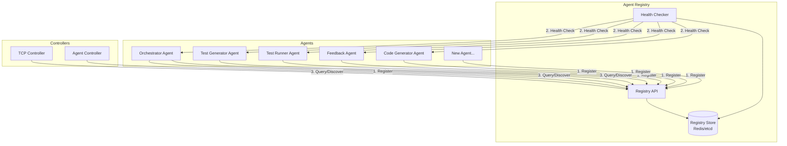
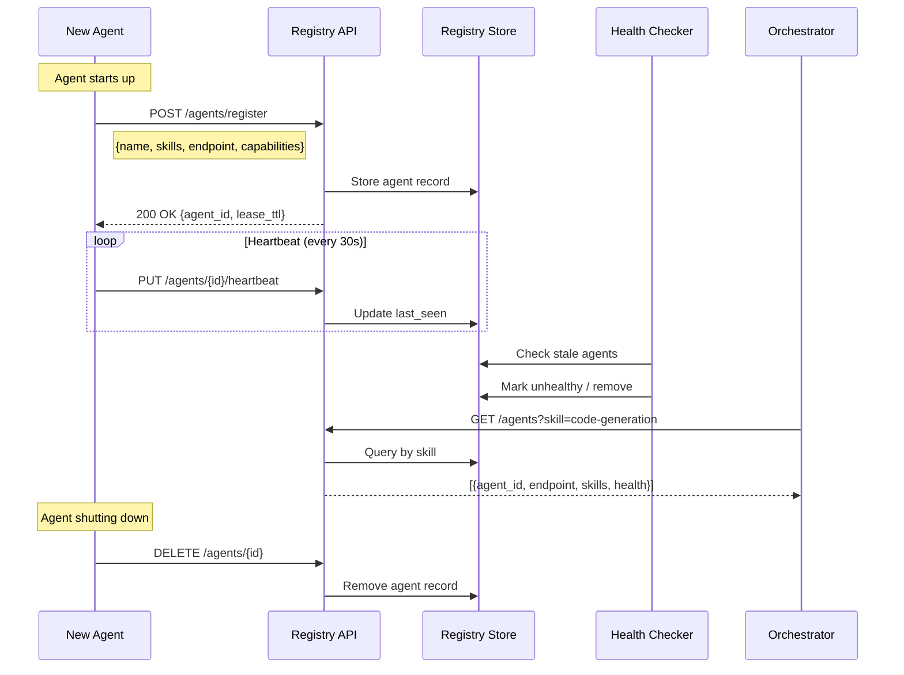
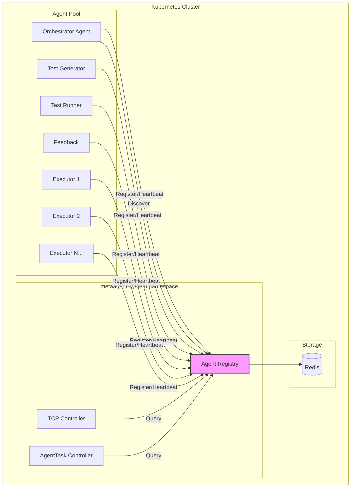

## Agent Registry

A centralized registry where agents register their capabilities on startup and can be discovered by other agents or controllers.

### Why Agent Registry?

| Problem | Solution |
|---------|----------|
| How does Orchestrator find the right agent? | Search by skills/capabilities |
| New agent spins up — who knows about it? | Auto-registration on startup |
| Agent crashes — how to avoid routing to it? | Health checks + auto-deregister |
| Need specialist agent for rare task? | Query registry for matching skills |

### Registry Architecture



### Agent Registration Flow



### Registry CRD

```yaml
apiVersion: metaagent.io/v1alpha1
kind: AgentRegistry
metadata:
  name: meta-agent-registry
  namespace: meta-agent-system
spec:
  # Storage backend
  storage:
    type: redis  # redis, etcd, postgresql
    connectionRef:
      secretName: registry-redis-credentials
      
  # Health check configuration
  healthCheck:
    enabled: true
    interval: 30s
    timeout: 10s
    unhealthyThreshold: 3
    
  # Registration settings
  registration:
    # How long before agent must re-register
    leaseTTL: 60s
    # Require heartbeat to stay registered
    requireHeartbeat: true
    # Auto-cleanup stale registrations
    cleanupInterval: 120s
    
  # Discovery settings
  discovery:
    # Cache discovery results
    cacheEnabled: true
    cacheTTL: 10s
    # Enable skill-based search
    skillMatching: true
    # Enable capability filtering
    capabilityFiltering: true
    
  # API server configuration
  api:
    port: 8082
    rateLimit:
      requestsPerMinute: 1000
```

### Agent Registration Record

```yaml
apiVersion: metaagent.io/v1alpha1
kind: AgentRegistration
metadata:
  name: code-generator-abc123
  namespace: meta-agent-system
  labels:
    metaagent.io/type: executor
    metaagent.io/skill: code-generation
spec:
  # Agent identity
  agentRef:
    name: code-generator-abc123
    namespace: meta-agent-system
    
  # Skills this agent provides (searchable)
  skills:
    - name: code-generation
      description: "Generates code from specifications"
      proficiency: 0.95  # 0-1 score
      languages:
        - python
        - javascript
        - rust
        
    - name: api-design
      description: "Designs REST API endpoints"
      proficiency: 0.85
      
    - name: documentation
      description: "Writes code documentation"
      proficiency: 0.80
      
  # Capabilities (what protocols/features supported)
  capabilities:
    a2a:
      enabled: true
      version: "1.0"
      endpoint: "http://code-generator-abc123:8080/a2a"
    a2ui:
      enabled: false
    mcp:
      enabled: true
      tools:
        - filesystem
        - github
    streaming:
      enabled: true
      format: sse
      
  # Resource information
  resources:
    maxConcurrentTasks: 5
    currentLoad: 2
    memoryUsage: "256Mi"
    cpuUsage: "200m"
    
  # Model information
  model:
    provider: anthropic
    name: claude-sonnet-4-20250514
    
status:
  phase: Healthy  # Healthy, Unhealthy, Unknown, Deregistered
  lastHeartbeat: "2026-01-19T12:05:00Z"
  registeredAt: "2026-01-19T10:00:00Z"
  tasksCompleted: 47
  averageLatency: "2.3s"
  successRate: 0.94
```

### Registry API

```yaml
# OpenAPI spec for Registry API
openapi: 3.0.0
info:
  title: Agent Registry API
  version: 1.0.0
  
paths:
  /agents/register:
    post:
      summary: Register a new agent
      requestBody:
        content:
          application/json:
            schema:
              $ref: '#/components/schemas/AgentRegistration'
      responses:
        '200':
          description: Registration successful
          content:
            application/json:
              schema:
                type: object
                properties:
                  agentId:
                    type: string
                  leaseTTL:
                    type: integer
                    
  /agents/{agentId}:
    get:
      summary: Get agent details
      parameters:
        - name: agentId
          in: path
          required: true
          schema:
            type: string
      responses:
        '200':
          description: Agent details
          
    delete:
      summary: Deregister agent
      parameters:
        - name: agentId
          in: path
          required: true
          schema:
            type: string
      responses:
        '204':
          description: Deregistered
          
  /agents/{agentId}/heartbeat:
    put:
      summary: Send heartbeat
      parameters:
        - name: agentId
          in: path
          required: true
          schema:
            type: string
      requestBody:
        content:
          application/json:
            schema:
              type: object
              properties:
                currentLoad:
                  type: integer
                memoryUsage:
                  type: string
      responses:
        '200':
          description: Heartbeat accepted
          
  /agents/search:
    get:
      summary: Search agents by criteria
      parameters:
        - name: skill
          in: query
          schema:
            type: string
          description: Filter by skill name
        - name: capability
          in: query
          schema:
            type: string
          description: Filter by capability (a2a, a2ui, mcp)
        - name: healthy
          in: query
          schema:
            type: boolean
          description: Only return healthy agents
        - name: minProficiency
          in: query
          schema:
            type: number
          description: Minimum skill proficiency (0-1)
        - name: maxLoad
          in: query
          schema:
            type: integer
          description: Maximum current load
      responses:
        '200':
          description: Matching agents
          content:
            application/json:
              schema:
                type: array
                items:
                  $ref: '#/components/schemas/AgentRegistration'
                  
  /agents/skills:
    get:
      summary: List all available skills
      responses:
        '200':
          description: List of skills
          content:
            application/json:
              schema:
                type: array
                items:
                  type: object
                  properties:
                    name:
                      type: string
                    agentCount:
                      type: integer
                    avgProficiency:
                      type: number
```

### Agent Registration on Startup (Rust)

```rust
// src/registry/client.rs
use anyhow::Result;
use reqwest::Client;
use serde::{Deserialize, Serialize};
use std::sync::Arc;
use tokio::sync::RwLock;
use tokio::time::{interval, Duration};
use tracing::{info, error};

#[derive(Debug, Clone, Serialize, Deserialize)]
pub struct Skill {
    pub name: String,
    pub description: String,
    pub proficiency: f32,
    #[serde(skip_serializing_if = "Option::is_none")]
    pub metadata: Option<serde_json::Value>,
}

#[derive(Debug, Clone, Serialize, Deserialize)]
pub struct AgentCapabilities {
    pub a2a: A2ACapability,
    pub a2ui: A2UICapability,
    pub mcp: MCPCapability,
    pub streaming: StreamingCapability,
}

#[derive(Debug, Clone, Serialize, Deserialize)]
pub struct A2ACapability {
    pub enabled: bool,
    #[serde(skip_serializing_if = "Option::is_none")]
    pub endpoint: Option<String>,
}

#[derive(Debug, Clone, Serialize, Deserialize)]
pub struct A2UICapability {
    pub enabled: bool,
}

#[derive(Debug, Clone, Serialize, Deserialize)]
pub struct MCPCapability {
    pub enabled: bool,
    #[serde(default)]
    pub tools: Vec<String>,
}

#[derive(Debug, Clone, Serialize, Deserialize)]
pub struct StreamingCapability {
    pub enabled: bool,
    #[serde(default = "default_format")]
    pub format: String,
}

fn default_format() -> String {
    "sse".to_string()
}

#[derive(Debug, Serialize)]
struct RegistrationRequest {
    name: String,
    endpoint: String,
    skills: Vec<Skill>,
    capabilities: AgentCapabilities,
}

#[derive(Debug, Deserialize)]
struct RegistrationResponse {
    agent_id: String,
    lease_ttl: u64,
}

#[derive(Debug, Serialize)]
struct HeartbeatRequest {
    current_load: u32,
    memory_usage: String,
}

pub struct AgentRegistryClient {
    client: Client,
    registry_url: String,
    agent_name: String,
    agent_id: Arc<RwLock<Option<String>>>,
    lease_ttl: Arc<RwLock<u64>>,
    shutdown_tx: Option<tokio::sync::oneshot::Sender<()>>,
}

impl AgentRegistryClient {
    pub fn new(registry_url: &str, agent_name: &str) -> Self {
        Self {
            client: Client::new(),
            registry_url: registry_url.to_string(),
            agent_name: agent_name.to_string(),
            agent_id: Arc::new(RwLock::new(None)),
            lease_ttl: Arc::new(RwLock::new(60)),
            shutdown_tx: None,
        }
    }

    pub async fn register(
        &mut self,
        skills: Vec<Skill>,
        capabilities: AgentCapabilities,
        endpoint: &str,
    ) -> Result<String> {
        let request = RegistrationRequest {
            name: self.agent_name.clone(),
            endpoint: endpoint.to_string(),
            skills,
            capabilities,
        };

        let response: RegistrationResponse = self
            .client
            .post(format!("{}/agents/register", self.registry_url))
            .json(&request)
            .send()
            .await?
            .error_for_status()?
            .json()
            .await?;

        // Store agent_id and lease_ttl
        {
            let mut id = self.agent_id.write().await;
            *id = Some(response.agent_id.clone());
        }
        {
            let mut ttl = self.lease_ttl.write().await;
            *ttl = response.lease_ttl;
        }

        // Start heartbeat loop
        let (shutdown_tx, shutdown_rx) = tokio::sync::oneshot::channel();
        self.shutdown_tx = Some(shutdown_tx);
        
        self.spawn_heartbeat_loop(shutdown_rx);

        info!(agent_id = %response.agent_id, "Agent registered successfully");
        Ok(response.agent_id)
    }

    fn spawn_heartbeat_loop(&self, mut shutdown_rx: tokio::sync::oneshot::Receiver<()>) {
        let client = self.client.clone();
        let registry_url = self.registry_url.clone();
        let agent_id = self.agent_id.clone();
        let lease_ttl = self.lease_ttl.clone();

        tokio::spawn(async move {
            loop {
                let ttl = *lease_ttl.read().await;
                let mut interval = interval(Duration::from_secs(ttl / 2));
                
                tokio::select! {
                    _ = interval.tick() => {
                        if let Some(id) = agent_id.read().await.as_ref() {
                            if let Err(e) = Self::send_heartbeat(&client, &registry_url, id).await {
                                error!(error = %e, "Heartbeat failed");
                            }
                        }
                    }
                    _ = &mut shutdown_rx => {
                        info!("Heartbeat loop shutting down");
                        break;
                    }
                }
            }
        });
    }

    async fn send_heartbeat(client: &Client, registry_url: &str, agent_id: &str) -> Result<()> {
        let request = HeartbeatRequest {
            current_load: Self::get_current_load(),
            memory_usage: Self::get_memory_usage(),
        };

        client
            .put(format!("{}/agents/{}/heartbeat", registry_url, agent_id))
            .json(&request)
            .send()
            .await?
            .error_for_status()?;

        Ok(())
    }

    pub async fn deregister(&mut self) -> Result<()> {
        // Stop heartbeat loop
        if let Some(tx) = self.shutdown_tx.take() {
            let _ = tx.send(());
        }

        // Deregister from registry
        if let Some(id) = self.agent_id.read().await.as_ref() {
            self.client
                .delete(format!("{}/agents/{}", self.registry_url, id))
                .send()
                .await?
                .error_for_status()?;
            
            info!(agent_id = %id, "Agent deregistered");
        }

        Ok(())
    }

    fn get_current_load() -> u32 {
        // TODO: Implement actual load tracking
        0
    }

    fn get_memory_usage() -> String {
        // TODO: Implement actual memory tracking
        "256Mi".to_string()
    }
}

// Usage
#[tokio::main]
async fn main() -> Result<()> {
    tracing_subscriber::init();

    let mut registry = AgentRegistryClient::new(
        "http://agent-registry:8082",
        "code-generator-agent",
    );

    let agent_id = registry
        .register(
            vec![
                Skill {
                    name: "code-generation".to_string(),
                    description: "Generates code from specs".to_string(),
                    proficiency: 0.95,
                    metadata: Some(serde_json::json!({
                        "languages": ["python", "javascript", "rust"]
                    })),
                },
                Skill {
                    name: "api-design".to_string(),
                    description: "Designs REST APIs".to_string(),
                    proficiency: 0.85,
                    metadata: None,
                },
            ],
            AgentCapabilities {
                a2a: A2ACapability {
                    enabled: true,
                    endpoint: Some("http://code-generator:8080/a2a".to_string()),
                },
                a2ui: A2UICapability { enabled: false },
                mcp: MCPCapability {
                    enabled: true,
                    tools: vec!["filesystem".to_string(), "github".to_string()],
                },
                streaming: StreamingCapability {
                    enabled: true,
                    format: "sse".to_string(),
                },
            },
            "http://code-generator:8080",
        )
        .await?;

    println!("Registered with ID: {}", agent_id);

    // Run agent main loop...
    tokio::signal::ctrl_c().await?;

    registry.deregister().await?;
    Ok(())
}
```

### Agent Registry Service (Rust)

```rust
// src/registry/server.rs
use axum::{
    extract::{Path, Query, State},
    http::StatusCode,
    routing::{delete, get, post, put},
    Json, Router,
};
use redis::AsyncCommands;
use serde::{Deserialize, Serialize};
use std::sync::Arc;
use tokio::sync::RwLock;
use tracing::{info, error};
use uuid::Uuid;

#[derive(Clone)]
pub struct AppState {
    redis: redis::Client,
    config: RegistryConfig,
}

#[derive(Clone)]
pub struct RegistryConfig {
    pub lease_ttl: u64,
    pub cleanup_interval: u64,
    pub unhealthy_threshold: u64,
}

#[derive(Debug, Serialize, Deserialize)]
pub struct AgentRegistration {
    pub id: String,
    pub name: String,
    pub endpoint: String,
    pub skills: Vec<Skill>,
    pub capabilities: serde_json::Value,
    pub status: AgentStatus,
    pub registered_at: chrono::DateTime<chrono::Utc>,
    pub last_heartbeat: chrono::DateTime<chrono::Utc>,
    pub current_load: u32,
    pub memory_usage: String,
}

#[derive(Debug, Serialize, Deserialize, Clone, PartialEq)]
#[serde(rename_all = "lowercase")]
pub enum AgentStatus {
    Healthy,
    Unhealthy,
    Unknown,
}

#[derive(Debug, Serialize, Deserialize, Clone)]
pub struct Skill {
    pub name: String,
    pub description: String,
    pub proficiency: f32,
    #[serde(skip_serializing_if = "Option::is_none")]
    pub metadata: Option<serde_json::Value>,
}

// Request/Response types
#[derive(Debug, Deserialize)]
pub struct RegisterRequest {
    pub name: String,
    pub endpoint: String,
    pub skills: Vec<Skill>,
    pub capabilities: serde_json::Value,
}

#[derive(Debug, Serialize)]
pub struct RegisterResponse {
    pub agent_id: String,
    pub lease_ttl: u64,
}

#[derive(Debug, Deserialize)]
pub struct HeartbeatRequest {
    pub current_load: u32,
    pub memory_usage: String,
}

#[derive(Debug, Deserialize)]
pub struct SearchQuery {
    pub skill: Option<String>,
    pub capability: Option<String>,
    pub healthy: Option<bool>,
    pub min_proficiency: Option<f32>,
    pub max_load: Option<u32>,
}

#[derive(Debug, Serialize)]
pub struct SkillSummary {
    pub name: String,
    pub agent_count: usize,
    pub avg_proficiency: f32,
}

// Handlers
async fn register_agent(
    State(state): State<Arc<AppState>>,
    Json(request): Json<RegisterRequest>,
) -> Result<Json<RegisterResponse>, StatusCode> {
    let agent_id = Uuid::new_v4().to_string();
    let now = chrono::Utc::now();

    let registration = AgentRegistration {
        id: agent_id.clone(),
        name: request.name,
        endpoint: request.endpoint,
        skills: request.skills,
        capabilities: request.capabilities,
        status: AgentStatus::Healthy,
        registered_at: now,
        last_heartbeat: now,
        current_load: 0,
        memory_usage: "0Mi".to_string(),
    };

    // Store in Redis
    let mut conn = state.redis.get_async_connection().await
        .map_err(|_| StatusCode::INTERNAL_SERVER_ERROR)?;

    let json = serde_json::to_string(&registration)
        .map_err(|_| StatusCode::INTERNAL_SERVER_ERROR)?;

    conn.set_ex::<_, _, ()>(
        format!("agent:{}", agent_id),
        json,
        state.config.lease_ttl * 2,
    )
    .await
    .map_err(|_| StatusCode::INTERNAL_SERVER_ERROR)?;

    // Add to agent index
    conn.sadd::<_, _, ()>("agents:index", &agent_id)
        .await
        .map_err(|_| StatusCode::INTERNAL_SERVER_ERROR)?;

    // Index by skills
    for skill in &registration.skills {
        conn.sadd::<_, _, ()>(format!("skill:{}:agents", skill.name), &agent_id)
            .await
            .map_err(|_| StatusCode::INTERNAL_SERVER_ERROR)?;
    }

    info!(agent_id = %agent_id, name = %registration.name, "Agent registered");

    Ok(Json(RegisterResponse {
        agent_id,
        lease_ttl: state.config.lease_ttl,
    }))
}

async fn heartbeat(
    State(state): State<Arc<AppState>>,
    Path(agent_id): Path<String>,
    Json(request): Json<HeartbeatRequest>,
) -> Result<StatusCode, StatusCode> {
    let mut conn = state.redis.get_async_connection().await
        .map_err(|_| StatusCode::INTERNAL_SERVER_ERROR)?;

    // Get current registration
    let json: Option<String> = conn
        .get(format!("agent:{}", agent_id))
        .await
        .map_err(|_| StatusCode::INTERNAL_SERVER_ERROR)?;

    let json = json.ok_or(StatusCode::NOT_FOUND)?;
    let mut registration: AgentRegistration = serde_json::from_str(&json)
        .map_err(|_| StatusCode::INTERNAL_SERVER_ERROR)?;

    // Update heartbeat
    registration.last_heartbeat = chrono::Utc::now();
    registration.current_load = request.current_load;
    registration.memory_usage = request.memory_usage;
    registration.status = AgentStatus::Healthy;

    // Save back
    let json = serde_json::to_string(&registration)
        .map_err(|_| StatusCode::INTERNAL_SERVER_ERROR)?;

    conn.set_ex::<_, _, ()>(
        format!("agent:{}", agent_id),
        json,
        state.config.lease_ttl * 2,
    )
    .await
    .map_err(|_| StatusCode::INTERNAL_SERVER_ERROR)?;

    Ok(StatusCode::OK)
}

async fn get_agent(
    State(state): State<Arc<AppState>>,
    Path(agent_id): Path<String>,
) -> Result<Json<AgentRegistration>, StatusCode> {
    let mut conn = state.redis.get_async_connection().await
        .map_err(|_| StatusCode::INTERNAL_SERVER_ERROR)?;

    let json: Option<String> = conn
        .get(format!("agent:{}", agent_id))
        .await
        .map_err(|_| StatusCode::INTERNAL_SERVER_ERROR)?;

    let json = json.ok_or(StatusCode::NOT_FOUND)?;
    let registration: AgentRegistration = serde_json::from_str(&json)
        .map_err(|_| StatusCode::INTERNAL_SERVER_ERROR)?;

    Ok(Json(registration))
}

async fn deregister_agent(
    State(state): State<Arc<AppState>>,
    Path(agent_id): Path<String>,
) -> Result<StatusCode, StatusCode> {
    let mut conn = state.redis.get_async_connection().await
        .map_err(|_| StatusCode::INTERNAL_SERVER_ERROR)?;

    // Get registration to clean up skill indexes
    let json: Option<String> = conn
        .get(format!("agent:{}", agent_id))
        .await
        .map_err(|_| StatusCode::INTERNAL_SERVER_ERROR)?;

    if let Some(json) = json {
        if let Ok(registration) = serde_json::from_str::<AgentRegistration>(&json) {
            // Remove from skill indexes
            for skill in &registration.skills {
                conn.srem::<_, _, ()>(format!("skill:{}:agents", skill.name), &agent_id)
                    .await
                    .ok();
            }
        }
    }

    // Remove from index and delete record
    conn.srem::<_, _, ()>("agents:index", &agent_id)
        .await
        .map_err(|_| StatusCode::INTERNAL_SERVER_ERROR)?;

    conn.del::<_, ()>(format!("agent:{}", agent_id))
        .await
        .map_err(|_| StatusCode::INTERNAL_SERVER_ERROR)?;

    info!(agent_id = %agent_id, "Agent deregistered");

    Ok(StatusCode::NO_CONTENT)
}

async fn search_agents(
    State(state): State<Arc<AppState>>,
    Query(query): Query<SearchQuery>,
) -> Result<Json<Vec<AgentRegistration>>, StatusCode> {
    let mut conn = state.redis.get_async_connection().await
        .map_err(|_| StatusCode::INTERNAL_SERVER_ERROR)?;

    // Get agent IDs (filtered by skill if specified)
    let agent_ids: Vec<String> = if let Some(skill) = &query.skill {
        conn.smembers(format!("skill:{}:agents", skill))
            .await
            .unwrap_or_default()
    } else {
        conn.smembers("agents:index")
            .await
            .unwrap_or_default()
    };

    let mut results = Vec::new();

    for agent_id in agent_ids {
        let json: Option<String> = conn
            .get(format!("agent:{}", agent_id))
            .await
            .ok()
            .flatten();

        if let Some(json) = json {
            if let Ok(registration) = serde_json::from_str::<AgentRegistration>(&json) {
                // Apply filters
                if let Some(healthy) = query.healthy {
                    if healthy && registration.status != AgentStatus::Healthy {
                        continue;
                    }
                }

                if let Some(max_load) = query.max_load {
                    if registration.current_load > max_load {
                        continue;
                    }
                }

                if let Some(min_prof) = query.min_proficiency {
                    if let Some(skill_name) = &query.skill {
                        let has_skill = registration.skills.iter().any(|s| {
                            &s.name == skill_name && s.proficiency >= min_prof
                        });
                        if !has_skill {
                            continue;
                        }
                    }
                }

                results.push(registration);
            }
        }
    }

    Ok(Json(results))
}

async fn list_skills(
    State(state): State<Arc<AppState>>,
) -> Result<Json<Vec<SkillSummary>>, StatusCode> {
    let mut conn = state.redis.get_async_connection().await
        .map_err(|_| StatusCode::INTERNAL_SERVER_ERROR)?;

    // Get all agents
    let agent_ids: Vec<String> = conn
        .smembers("agents:index")
        .await
        .unwrap_or_default();

    let mut skill_map: std::collections::HashMap<String, (usize, f32)> = 
        std::collections::HashMap::new();

    for agent_id in agent_ids {
        let json: Option<String> = conn
            .get(format!("agent:{}", agent_id))
            .await
            .ok()
            .flatten();

        if let Some(json) = json {
            if let Ok(registration) = serde_json::from_str::<AgentRegistration>(&json) {
                for skill in registration.skills {
                    let entry = skill_map.entry(skill.name).or_insert((0, 0.0));
                    entry.0 += 1;
                    entry.1 += skill.proficiency;
                }
            }
        }
    }

    let summaries: Vec<SkillSummary> = skill_map
        .into_iter()
        .map(|(name, (count, total_prof))| SkillSummary {
            name,
            agent_count: count,
            avg_proficiency: total_prof / count as f32,
        })
        .collect();

    Ok(Json(summaries))
}

// Router setup
pub fn create_router(state: Arc<AppState>) -> Router {
    Router::new()
        .route("/agents/register", post(register_agent))
        .route("/agents/search", get(search_agents))
        .route("/agents/skills", get(list_skills))
        .route("/agents/:agent_id", get(get_agent))
        .route("/agents/:agent_id", delete(deregister_agent))
        .route("/agents/:agent_id/heartbeat", put(heartbeat))
        .with_state(state)
}

// Main
#[tokio::main]
async fn main() -> anyhow::Result<()> {
    tracing_subscriber::init();

    let redis = redis::Client::open("redis://localhost:6379")?;
    
    let state = Arc::new(AppState {
        redis,
        config: RegistryConfig {
            lease_ttl: 60,
            cleanup_interval: 120,
            unhealthy_threshold: 3,
        },
    });

    // Spawn cleanup task
    let cleanup_state = state.clone();
    tokio::spawn(async move {
        cleanup_loop(cleanup_state).await;
    });

    let app = create_router(state);

    let listener = tokio::net::TcpListener::bind("0.0.0.0:8082").await?;
    info!("Agent Registry listening on :8082");
    
    axum::serve(listener, app).await?;
    
    Ok(())
}

async fn cleanup_loop(state: Arc<AppState>) {
    let mut interval = tokio::time::interval(
        std::time::Duration::from_secs(state.config.cleanup_interval)
    );

    loop {
        interval.tick().await;
        
        if let Err(e) = cleanup_stale_agents(&state).await {
            error!(error = %e, "Cleanup failed");
        }
    }
}

async fn cleanup_stale_agents(state: &AppState) -> anyhow::Result<()> {
    let mut conn = state.redis.get_async_connection().await?;
    
    let agent_ids: Vec<String> = conn.smembers("agents:index").await?;
    let threshold = chrono::Utc::now() 
        - chrono::Duration::seconds(state.config.lease_ttl as i64 * 2);

    for agent_id in agent_ids {
        let json: Option<String> = conn.get(format!("agent:{}", agent_id)).await?;
        
        if let Some(json) = json {
            if let Ok(registration) = serde_json::from_str::<AgentRegistration>(&json) {
                if registration.last_heartbeat < threshold {
                    info!(agent_id = %agent_id, "Removing stale agent");
                    
                    // Remove from indexes
                    for skill in &registration.skills {
                        conn.srem::<_, _, ()>(
                            format!("skill:{}:agents", skill.name), 
                            &agent_id
                        ).await?;
                    }
                    conn.srem::<_, _, ()>("agents:index", &agent_id).await?;
                    conn.del::<_, ()>(format!("agent:{}", agent_id)).await?;
                }
            }
        }
    }

    Ok(())
}
```

### Cargo.toml for Backend Services

```toml
[package]
name = "meta-agent"
version = "0.1.0"
edition = "2021"

[workspace]
members = [
    "crates/registry",
    "crates/tcp-controller",
    "crates/agent-runtime",
    "crates/a2a-rs",
    "crates/common",
]

[workspace.dependencies]
# Async runtime
tokio = { version = "1.35", features = ["full"] }

# Web framework
axum = { version = "0.7", features = ["macros"] }
tower = "0.4"
tower-http = { version = "0.5", features = ["cors", "trace"] }

# Serialization
serde = { version = "1.0", features = ["derive"] }
serde_json = "1.0"

# Database
redis = { version = "0.24", features = ["tokio-comp", "connection-manager"] }

# HTTP client
reqwest = { version = "0.11", features = ["json", "rustls-tls"] }

# Observability
tracing = "0.1"
tracing-subscriber = { version = "0.3", features = ["env-filter"] }
opentelemetry = "0.21"
opentelemetry-otlp = "0.14"

# Utils
anyhow = "1.0"
thiserror = "1.0"
uuid = { version = "1.6", features = ["v4", "serde"] }
chrono = { version = "0.4", features = ["serde"] }
config = "0.14"

# Kubernetes
kube = { version = "0.87", features = ["runtime", "derive"] }
k8s-openapi = { version = "0.20", features = ["v1_28"] }

# LLM
anthropic-sdk = "0.1"  # or custom implementation

[profile.release]
lto = true
codegen-units = 1
panic = "abort"
strip = true
```

### Rust Project Structure

```
meta-agent/
├── Cargo.toml
├── Cargo.lock
├── crates/
│   ├── registry/
│   │   ├── Cargo.toml
│   │   └── src/
│   │       ├── lib.rs
│   │       ├── main.rs
│   │       ├── handlers.rs
│   │       ├── models.rs
│   │       ├── storage.rs
│   │       └── health.rs
│   │
│   ├── tcp-controller/
│   │   ├── Cargo.toml
│   │   └── src/
│   │       ├── lib.rs
│   │       ├── main.rs
│   │       ├── controller.rs
│   │       ├── feedback.rs
│   │       └── coefficients.rs
│   │
│   ├── agent-runtime/
│   │   ├── Cargo.toml
│   │   └── src/
│   │       ├── lib.rs
│   │       ├── main.rs
│   │       ├── agent.rs
│   │       ├── llm.rs
│   │       └── executor.rs
│   │
│   ├── a2a-rs/
│   │   ├── Cargo.toml
│   │   └── src/
│   │       ├── lib.rs
│   │       ├── client.rs
│   │       ├── server.rs
│   │       ├── types.rs
│   │       └── transport.rs
│   │
│   └── common/
│       ├── Cargo.toml
│       └── src/
│           ├── lib.rs
│           ├── config.rs
│           ├── errors.rs
│           └── telemetry.rs
│
├── docker/
│   ├── Dockerfile.registry
│   ├── Dockerfile.tcp-controller
│   └── Dockerfile.agent
│
└── helm/
    └── meta-agent/
```

### Dockerfile for Rust Services

```dockerfile
# docker/Dockerfile.registry
FROM rust:1.75-alpine AS builder

RUN apk add --no-cache musl-dev

WORKDIR /app

# Copy workspace files
COPY Cargo.toml Cargo.lock ./
COPY crates ./crates

# Build release binary
RUN cargo build --release --package registry

# Runtime image
FROM alpine:3.19

RUN apk add --no-cache ca-certificates

COPY --from=builder /app/target/release/registry /usr/local/bin/

EXPOSE 8082

ENV RUST_LOG=info

CMD ["registry"]
```

### Orchestrator Agent Discovery (Rust)

```rust
// src/discovery.rs
use anyhow::Result;
use reqwest::Client;
use serde::{Deserialize, Serialize};
use tracing::info;

#[derive(Debug, Clone, Serialize, Deserialize)]
pub struct DiscoveredAgent {
    pub id: String,
    pub name: String,
    pub endpoint: String,
    pub skills: Vec<Skill>,
    pub capabilities: serde_json::Value,
    pub status: String,
    pub current_load: u32,
}

#[derive(Debug, Clone, Serialize, Deserialize)]
pub struct Skill {
    pub name: String,
    pub description: String,
    pub proficiency: f32,
    #[serde(skip_serializing_if = "Option::is_none")]
    pub metadata: Option<serde_json::Value>,
}

pub struct AgentDiscovery {
    client: Client,
    registry_url: String,
}

impl AgentDiscovery {
    pub fn new(registry_url: &str) -> Self {
        Self {
            client: Client::new(),
            registry_url: registry_url.to_string(),
        }
    }

    /// Find the best agent for a given skill requirement
    pub async fn find_agent_for_task(
        &self,
        required_skill: &str,
        min_proficiency: f32,
        prefer_low_load: bool,
    ) -> Result<Option<DiscoveredAgent>> {
        let mut agents = self
            .search_agents(Some(required_skill), None, true, Some(min_proficiency), None)
            .await?;

        if agents.is_empty() {
            return Ok(None);
        }

        if prefer_low_load {
            // Sort by load (ascending), then by proficiency (descending)
            agents.sort_by(|a, b| {
                let load_cmp = a.current_load.cmp(&b.current_load);
                if load_cmp == std::cmp::Ordering::Equal {
                    let prof_a = self.get_skill_proficiency(a, required_skill);
                    let prof_b = self.get_skill_proficiency(b, required_skill);
                    prof_b.partial_cmp(&prof_a).unwrap_or(std::cmp::Ordering::Equal)
                } else {
                    load_cmp
                }
            });
        } else {
            // Sort by proficiency only (descending)
            agents.sort_by(|a, b| {
                let prof_a = self.get_skill_proficiency(a, required_skill);
                let prof_b = self.get_skill_proficiency(b, required_skill);
                prof_b.partial_cmp(&prof_a).unwrap_or(std::cmp::Ordering::Equal)
            });
        }

        Ok(agents.into_iter().next())
    }

    /// Search registry for agents matching criteria
    pub async fn search_agents(
        &self,
        skill: Option<&str>,
        capability: Option<&str>,
        healthy_only: bool,
        min_proficiency: Option<f32>,
        max_load: Option<u32>,
    ) -> Result<Vec<DiscoveredAgent>> {
        let mut params = Vec::new();

        if let Some(s) = skill {
            params.push(("skill", s.to_string()));
        }
        if let Some(c) = capability {
            params.push(("capability", c.to_string()));
        }
        if healthy_only {
            params.push(("healthy", "true".to_string()));
        }
        if let Some(p) = min_proficiency {
            params.push(("minProficiency", p.to_string()));
        }
        if let Some(l) = max_load {
            params.push(("maxLoad", l.to_string()));
        }

        let response = self
            .client
            .get(format!("{}/agents/search", self.registry_url))
            .query(&params)
            .send()
            .await?
            .error_for_status()?
            .json::<Vec<DiscoveredAgent>>()
            .await?;

        Ok(response)
    }

    /// Get list of all skills available in the registry
    pub async fn get_available_skills(&self) -> Result<Vec<SkillSummary>> {
        let response = self
            .client
            .get(format!("{}/agents/skills", self.registry_url))
            .send()
            .await?
            .error_for_status()?
            .json()
            .await?;

        Ok(response)
    }

    fn get_skill_proficiency(&self, agent: &DiscoveredAgent, skill_name: &str) -> f32 {
        agent
            .skills
            .iter()
            .find(|s| s.name == skill_name)
            .map(|s| s.proficiency)
            .unwrap_or(0.0)
    }
}

#[derive(Debug, Deserialize)]
pub struct SkillSummary {
    pub name: String,
    pub agent_count: usize,
    pub avg_proficiency: f32,
}

// Usage in Orchestrator Agent
pub async fn orchestrate_task(
    discovery: &AgentDiscovery,
    task_description: &str,
) -> Result<std::collections::HashMap<String, DiscoveredAgent>> {
    // Analyze task to determine required skills
    let required_skills = analyze_task_skills(task_description);
    // e.g., vec!["code-generation", "testing", "documentation"]

    let mut selected_agents = std::collections::HashMap::new();

    for skill in required_skills {
        match discovery
            .find_agent_for_task(&skill, 0.8, true)
            .await?
        {
            Some(agent) => {
                info!(
                    skill = %skill,
                    agent_id = %agent.id,
                    agent_name = %agent.name,
                    "Found agent for skill"
                );
                selected_agents.insert(skill, agent);
            }
            None => {
                // No agent found - might need to create one dynamically
                info!(skill = %skill, "No agent found for skill");
            }
        }
    }

    Ok(selected_agents)
}

fn analyze_task_skills(task_description: &str) -> Vec<String> {
    // TODO: Use LLM to analyze task and extract required skills
    // For now, return hardcoded skills based on keywords
    let mut skills = Vec::new();
    
    let description = task_description.to_lowercase();
    
    if description.contains("api") || description.contains("code") {
        skills.push("code-generation".to_string());
    }
    if description.contains("test") {
        skills.push("testing".to_string());
    }
    if description.contains("document") {
        skills.push("documentation".to_string());
    }
    if description.contains("review") {
        skills.push("code-review".to_string());
    }
    
    if skills.is_empty() {
        skills.push("general".to_string());
    }
    
    skills
}
```

### Helm Values for Registry

```yaml
# values.yaml (additions)
agentRegistry:
  enabled: true
  
  image:
    repository: metaagent/agent-registry
    tag: latest
    
  replicas: 2  # HA
  
  storage:
    type: redis
    # Uses same Redis as other components
    
  healthCheck:
    enabled: true
    interval: 30s
    timeout: 10s
    unhealthyThreshold: 3
    
  registration:
    leaseTTL: 60s
    requireHeartbeat: true
    cleanupInterval: 120s
    
  api:
    port: 8082
    
  service:
    type: ClusterIP
    port: 8082
    
  resources:
    limits:
      memory: "256Mi"
      cpu: "250m"
```

### Registry in Cluster Architecture


