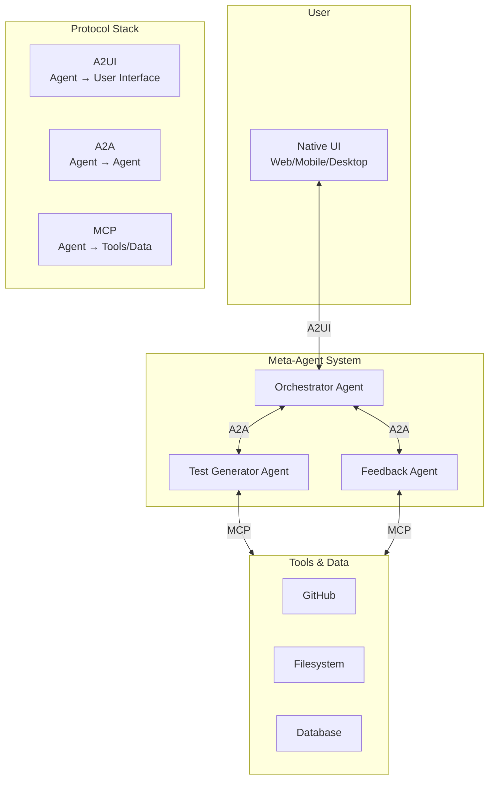
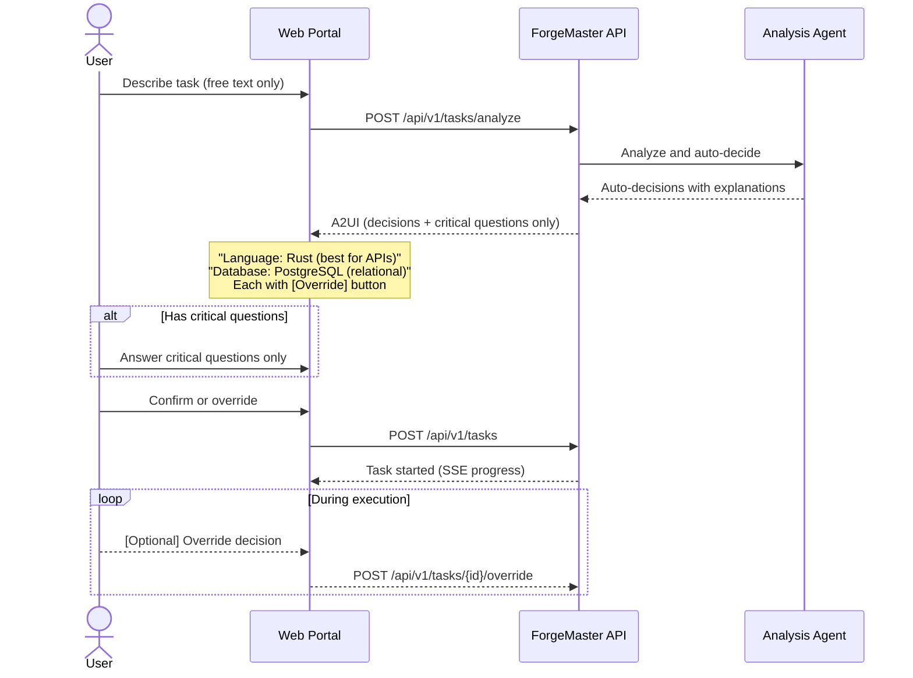
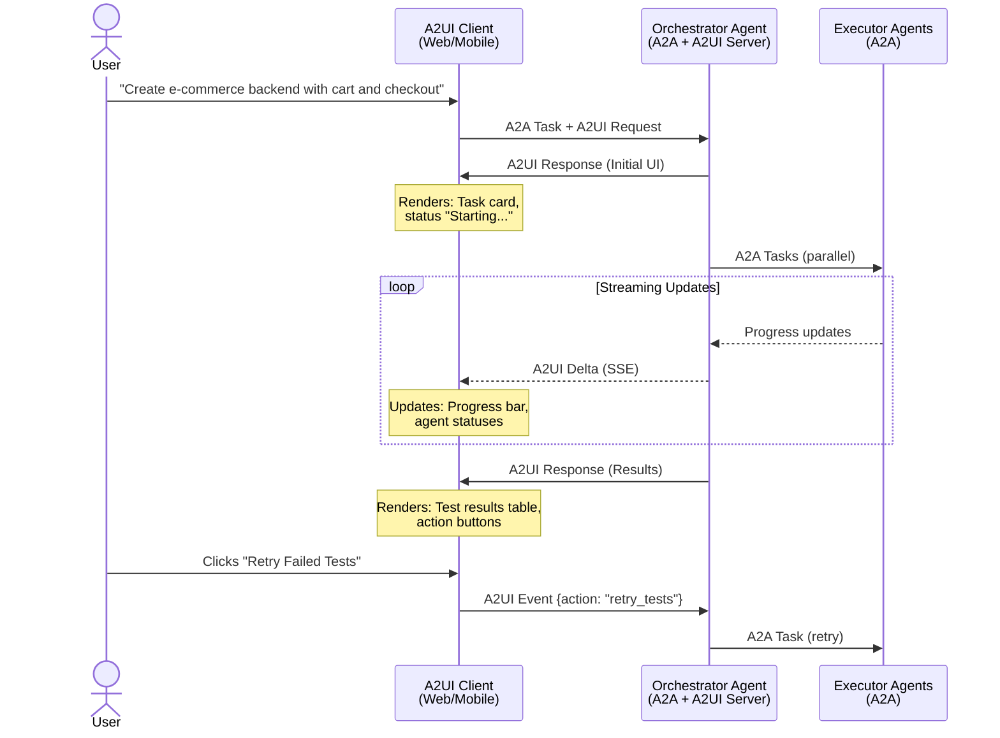
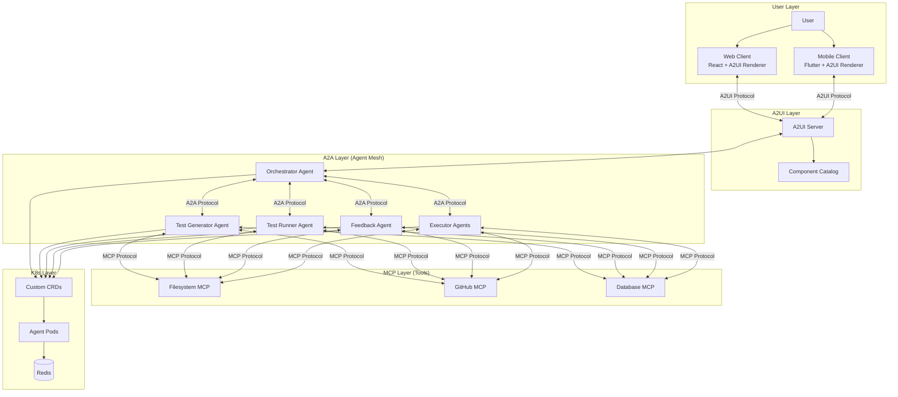

# A2UI Protocol Integration

ForgeMaster uses [A2UI](https://github.com/google/A2UI) (Agent-to-User Interface) to provide a dynamic, interactive web portal for task submission, clarification, and real-time progress monitoring.

> See [ADR-0002: A2UI for User Interface](../adr/0002-a2ui-for-user-interface.md) for the decision rationale.

## Overview

Agents interact with users using the **A2UI (Agent to User Interface)** protocol — a declarative UI protocol that lets agents generate rich, interactive interfaces without executing arbitrary code.

### Protocol Stack



| Protocol | Purpose | Direction |
|----------|---------|-----------|
| **A2UI** | Agent ↔ User Interface | Agent to User |
| **A2A** | Agent ↔ Agent | Agent to Agent |
| **MCP** | Agent ↔ Tools/Data | Agent to Tools |

### Why A2UI?

| Benefit | Description |
|---------|-------------|
| **Security-First** | Declarative data format, not executable code |
| **Dynamic UI** | System generates forms based on task type |
| **Clarification Flow** | Agents can ask follow-up questions via UI |
| **Real-time Updates** | Live progress, stages, and status display |
| **Framework Agnostic** | Works with React, Flutter, Angular, etc. |

**Traditional approach (text-only):**
```
User: "Show me task status"
Agent: "Task ecommerce-backend is running. Iteration 3 of 10.
        Error: 0.35. Tests: 3/5 passed. Agents: code-generator
        (completed), reviewer (running)..."
```

**With A2UI (rich UI):**
```
Agent generates → Dashboard with progress bar, test results table,
                  agent status cards, action buttons
```

## Web Portal Task Flow

### Design Principle: Minimal Questions, Maximum Autonomy

ForgeMaster minimizes user interaction:

| Policy | Description |
|--------|-------------|
| **Ask only critical** | External API keys, security-critical choices |
| **Auto-decide rest** | Language, database, framework, architecture |
| **Explain decisions** | Show "Chose X because Y" for each choice |
| **Allow override** | User can change any decision during execution |

### Task Submission Flow



### A2UI: Minimal Task Form

Only task description — no dropdowns:

```json
{
  "version": "0.8",
  "components": [
    {
      "id": "header",
      "type": "text",
      "properties": {
        "content": "What do you want to build?",
        "style": "headline"
      }
    },
    {
      "id": "description-input",
      "type": "textField",
      "properties": {
        "label": "Describe your task",
        "placeholder": "e.g., Create an e-commerce backend with product catalog, shopping cart, and Stripe checkout...",
        "multiline": true,
        "rows": 5,
        "hint": "System will auto-select language, database, and architecture."
      }
    },
    {
      "id": "submit-btn",
      "type": "button",
      "properties": {
        "label": "Analyze & Start",
        "action": "submit",
        "style": "primary"
      }
    }
  ]
}
```

### A2UI: Auto-Decisions with Override

Show decisions with explanations and override capability:

```json
{
  "version": "0.8",
  "components": [
    {
      "id": "ready-header",
      "type": "text",
      "properties": {
        "content": "Ready to build",
        "style": "headline"
      }
    },
    {
      "id": "decisions",
      "type": "decisionList",
      "properties": {
        "decisions": [
          {
            "key": "Language",
            "value": "Rust",
            "reason": "High-performance API, type safety for payments",
            "overridable": true
          },
          {
            "key": "Database",
            "value": "PostgreSQL",
            "reason": "Relational data (products, orders), ACID needed",
            "overridable": true
          },
          {
            "key": "Payment",
            "value": "Stripe",
            "reason": "Detected in description",
            "overridable": true
          }
        ]
      }
    },
    {
      "id": "critical-section",
      "type": "card",
      "properties": {
        "title": "Required Information",
        "children": ["stripe-key"]
      }
    },
    {
      "id": "stripe-key",
      "type": "textField",
      "properties": {
        "label": "Stripe API Key",
        "placeholder": "sk_live_... (or 'test' for test mode)",
        "sensitive": true
      }
    },
    {
      "id": "start-btn",
      "type": "button",
      "properties": {
        "label": "Start Building",
        "action": "submit",
        "style": "primary"
      }
    }
  ]
}
```

### A2UI: Live Progress View

Real-time progress with stepper showing stages:

```json
{
  "version": "0.8",
  "components": [
    {
      "id": "task-header",
      "type": "text",
      "properties": {
        "content": "Task: ecommerce-backend",
        "style": "headline"
      }
    },
    {
      "id": "status-badge",
      "type": "chip",
      "properties": {
        "label": "RUNNING",
        "color": "blue"
      }
    },
    {
      "id": "progress-stepper",
      "type": "stepper",
      "properties": {
        "steps": [
          {"label": "Submitted", "status": "completed"},
          {"label": "Preparing", "status": "completed"},
          {"label": "Generating Tests", "status": "completed"},
          {"label": "Writing Code", "status": "active"},
          {"label": "Testing", "status": "pending"},
          {"label": "Validating", "status": "pending"}
        ]
      }
    },
    {
      "id": "iteration-info",
      "type": "card",
      "properties": {
        "title": "Iteration 3 of 10",
        "children": ["error-signal", "test-results"]
      }
    },
    {
      "id": "error-signal",
      "type": "progressBar",
      "properties": {
        "label": "Error Signal",
        "value": 0.25,
        "max": 1.0,
        "color": "green"
      }
    },
    {
      "id": "logs-panel",
      "type": "expandable",
      "properties": {
        "title": "Live Logs",
        "children": ["log-stream"]
      }
    },
    {
      "id": "log-stream",
      "type": "logViewer",
      "properties": {
        "source": "/api/v1/tasks/task-a1b2c3d4/logs",
        "streaming": true
      }
    }
  ]
}
```

### A2UI: Completion View

```json
{
  "version": "0.8",
  "components": [
    {
      "id": "success-banner",
      "type": "alert",
      "properties": {
        "type": "success",
        "title": "Task Completed Successfully",
        "message": "Your e-commerce backend is ready!"
      }
    },
    {
      "id": "summary-stats",
      "type": "keyValueList",
      "properties": {
        "items": [
          {"key": "Duration", "value": "23 minutes"},
          {"key": "Iterations", "value": "5"},
          {"key": "Tests Passed", "value": "12/12"},
          {"key": "Outcome Validated", "value": "Yes"}
        ]
      }
    },
    {
      "id": "artifact-list",
      "type": "list",
      "properties": {
        "items": [
          {"icon": "github", "text": "Source Code", "action": "open_url"},
          {"icon": "file", "text": "API Documentation", "action": "download"},
          {"icon": "test", "text": "Test Suite", "action": "download"}
        ]
      }
    }
  ]
}
```

## API Endpoints for A2UI

| Method | Endpoint | Description | Response |
|--------|----------|-------------|----------|
| GET | `/api/v1/ui/task-form` | Get task submission form | A2UI JSON |
| POST | `/api/v1/tasks/clarify` | Analyze task, get clarifications | A2UI JSON |
| GET | `/api/v1/ui/tasks/{id}/progress` | Stream progress updates | SSE with A2UI |
| GET | `/api/v1/ui/tasks/{id}/result` | Get completion view | A2UI JSON |

### A2UI Core Concepts

**1. Declarative, not executable** — Agents send JSON component descriptions, not code
**2. Component catalog** — Clients define trusted components agents can use
**3. Native rendering** — Same JSON renders on web, mobile, desktop
**4. Streaming** — UI builds incrementally in real-time

### A2UI Response Structure

```json
{
  "a2ui": "0.8",
  "components": [
    {
      "id": "task-dashboard",
      "type": "card",
      "properties": {
        "title": "Task: user-api-task"
      },
      "children": ["progress-section", "tests-section", "agents-section"]
    },
    {
      "id": "progress-section",
      "type": "container",
      "children": ["progress-bar", "iteration-text", "error-text"]
    },
    {
      "id": "progress-bar",
      "type": "progress",
      "properties": {
        "value": { "$data": "/task/progress" },
        "max": 100,
        "label": "Task Progress"
      }
    },
    {
      "id": "iteration-text",
      "type": "text",
      "properties": {
        "content": { "$data": "/task/iterationText" }
      }
    },
    {
      "id": "error-text",
      "type": "text",
      "properties": {
        "content": { "$data": "/task/errorText" },
        "variant": "error"
      }
    },
    {
      "id": "tests-section",
      "type": "container",
      "children": ["tests-table"]
    },
    {
      "id": "tests-table",
      "type": "table",
      "properties": {
        "columns": ["Scenario", "Status"],
        "rows": { "$data": "/task/testResults" }
      }
    },
    {
      "id": "agents-section",
      "type": "container",
      "children": ["agents-list"]
    },
    {
      "id": "agents-list",
      "type": "list",
      "properties": {
        "items": { "$data": "/task/agents" },
        "itemTemplate": "agent-card"
      }
    },
    {
      "id": "action-buttons",
      "type": "button-group",
      "children": ["retry-btn", "cancel-btn"]
    },
    {
      "id": "retry-btn",
      "type": "button",
      "properties": {
        "label": "Retry Failed Tests",
        "action": "retry_tests",
        "variant": "primary"
      }
    },
    {
      "id": "cancel-btn",
      "type": "button",
      "properties": {
        "label": "Cancel Task",
        "action": "cancel_task",
        "variant": "danger"
      }
    }
  ],
  "data": {
    "task": {
      "progress": 60,
      "iterationText": "Iteration 3 of 10",
      "errorText": "Current Error: 0.35",
      "testResults": [
        { "scenario": "Create user", "status": "✅ Passed" },
        { "scenario": "Get user", "status": "✅ Passed" },
        { "scenario": "Update user", "status": "❌ Failed" },
        { "scenario": "Delete user", "status": "✅ Passed" },
        { "scenario": "Invalid input", "status": "❌ Failed" }
      ],
      "agents": [
        { "name": "code-generator", "status": "Completed" },
        { "name": "reviewer", "status": "Running" }
      ]
    }
  }
}
```

### Component Catalog

Define trusted components the agents can use:

```yaml
# a2ui-catalog.yaml
apiVersion: forgemaster.io/v1alpha1
kind: A2UICatalog
metadata:
  name: meta-agent-catalog
  namespace: forgemaster-system
spec:
  components:
    # Layout Components
    - name: card
      description: "Container with title and content"
      properties:
        - name: title
          type: string
        - name: subtitle
          type: string
          optional: true
          
    - name: container
      description: "Generic container for grouping"
      properties:
        - name: direction
          type: enum
          values: [row, column]
          default: column
          
    # Display Components
    - name: text
      description: "Text display"
      properties:
        - name: content
          type: string
        - name: variant
          type: enum
          values: [default, heading, subheading, error, success]
          
    - name: progress
      description: "Progress bar"
      properties:
        - name: value
          type: number
        - name: max
          type: number
          default: 100
        - name: label
          type: string
          
    - name: table
      description: "Data table"
      properties:
        - name: columns
          type: array
        - name: rows
          type: array
          
    - name: list
      description: "List of items"
      properties:
        - name: items
          type: array
        - name: itemTemplate
          type: string
          
    # Input Components
    - name: button
      description: "Clickable button"
      properties:
        - name: label
          type: string
        - name: action
          type: string
        - name: variant
          type: enum
          values: [primary, secondary, danger]
          
    - name: text-field
      description: "Text input"
      properties:
        - name: label
          type: string
        - name: placeholder
          type: string
        - name: value
          type: string
          
    - name: select
      description: "Dropdown select"
      properties:
        - name: label
          type: string
        - name: options
          type: array
        - name: value
          type: string
          
    # Task-Specific Components
    - name: agent-card
      description: "Agent status card"
      properties:
        - name: name
          type: string
        - name: status
          type: enum
          values: [Pending, Running, Completed, Failed]
        - name: tokensUsed
          type: number
          optional: true
          
    - name: test-result
      description: "Gherkin test result"
      properties:
        - name: scenario
          type: string
        - name: status
          type: enum
          values: [Passed, Failed, Skipped]
        - name: error
          type: string
          optional: true
          
    - name: tcp-gauge
      description: "TCP Controller gauge"
      properties:
        - name: label
          type: string
        - name: value
          type: number
        - name: threshold
          type: number
```

### A2UI Flow with A2A



### Client Renderer (ForgeMaster Implementation)

ForgeMaster uses `@copilotkit/a2ui-renderer` which provides a React-based A2UI renderer:

```typescript
// A2UIRenderer.tsx
import { A2UIViewer } from "@copilotkit/a2ui-renderer";
import type { v0_8 } from "@a2ui/lit";

export interface A2UISchema {
  root: string;
  components: v0_8.Types.ComponentInstance[];
  defaultData?: Record<string, unknown>;
}

interface Props {
  schema: A2UISchema;
  data?: Record<string, unknown>;
  onAction?: (action: v0_8.Types.UserAction) => void;
}

export function A2UIRenderer({ schema, data, onAction }: Props) {
  const mergedData = { ...schema.defaultData, ...data };

  return (
    <A2UIViewer
      root={schema.root}
      components={schema.components}
      data={mergedData}
      onAction={onAction}
    />
  );
}
```

### Dynamic Schema Loading

Schemas are stored as JSON files and auto-discovered using Vite's `import.meta.glob`:

```typescript
// schemaLoader.ts
import type { A2UISchema } from "../components/A2UIRenderer";

const schemaModules = import.meta.glob<{ default: A2UISchema }>("./*.json", {
  eager: true,
});

const schemaCache = new Map<string, A2UISchema>();

for (const [path, module] of Object.entries(schemaModules)) {
  const name = path.replace("./", "").replace(".json", "");
  schemaCache.set(name, module.default);
}

export function getSchema(name: string): A2UISchema | undefined {
  return schemaCache.get(name);
}

export function getAvailableSchemas(): string[] {
  return Array.from(schemaCache.keys());
}
```

### A2UI Schema Format (v0.8)

The component type is the KEY of the component object, not a property:

```json
{
  "root": "card-1",
  "components": [
    {
      "id": "card-1",
      "component": {
        "Card": {
          "child": "col-1"
        }
      }
    },
    {
      "id": "col-1",
      "component": {
        "Column": {
          "children": { "explicitList": ["title-1", "field-1"] }
        }
      }
    },
    {
      "id": "title-1",
      "component": {
        "Text": {
          "text": { "path": "/title" },
          "usageHint": "h2"
        }
      }
    },
    {
      "id": "field-1",
      "component": {
        "TextField": {
          "label": { "path": "/fieldLabel" },
          "text": { "path": "/description" }
        }
      }
    }
  ],
  "defaultData": {
    "title": "Create New Task",
    "fieldLabel": "Description",
    "description": ""
  }
}
```

Key points:
- **Component type as key**: `{ "Text": { ... } }` not `{ "type": "Text", ... }`
- **Data binding**: Use `{ "path": "/fieldName" }` or `{ "literalString": "value" }`
- **Children**: Use `{ "explicitList": ["id1", "id2"] }` for multiple children
- **Single child**: Use `"child": "id"` for single child reference

### Agent CRD with A2UI Support

```yaml
apiVersion: forgemaster.io/v1alpha1
kind: Agent
metadata:
  name: orchestrator-agent
  namespace: forgemaster-system
spec:
  type: orchestrator
  
  model:
    provider: anthropic
    name: claude-sonnet-4-20250514
    
  # A2A Server (agent-to-agent)
  a2a:
    enabled: true
    port: 8080
    
  # A2UI Server (agent-to-user)
  a2ui:
    enabled: true
    port: 8081
    
    # Reference to component catalog
    catalogRef:
      name: meta-agent-catalog
      
    # Streaming configuration
    streaming:
      enabled: true
      format: sse  # Server-Sent Events
      
    # UI generation settings
    generation:
      # Include task dashboard by default
      defaultComponents:
        - task-dashboard
        - agent-status-panel
      # Max components per response
      maxComponents: 50
      
  systemPrompt: |
    You are the Orchestrator Agent with A2UI capabilities.
    
    When presenting information to users:
    1. Use A2UI components from the catalog
    2. Prefer rich UI over text when showing:
       - Task progress and status
       - Test results
       - Agent states
       - Error information
    3. Include action buttons for user interactions
    4. Stream updates in real-time
    
    Available A2UI components:
    - card, container, text, progress
    - table, list, button, select
    - agent-card, test-result, tcp-gauge
```

### Helm Values for A2UI

```yaml
# values.yaml (additions)
a2ui:
  enabled: true
  
  # A2UI Client (Frontend)
  client:
    enabled: true
    image:
      repository: forgemaster/a2ui-client
      tag: latest
    framework: react  # react, angular, flutter
    port: 3000
    
  # Component catalog
  catalog:
    name: meta-agent-catalog
    components:
      # Include all standard + custom components
      standard: true
      custom:
        - agent-card
        - test-result
        - tcp-gauge
        
  # Ingress for A2UI client
  ingress:
    enabled: true
    host: ui.forgemaster.io
    tls:
      enabled: true
```

### A2UI + A2A + MCP Integration Diagram


