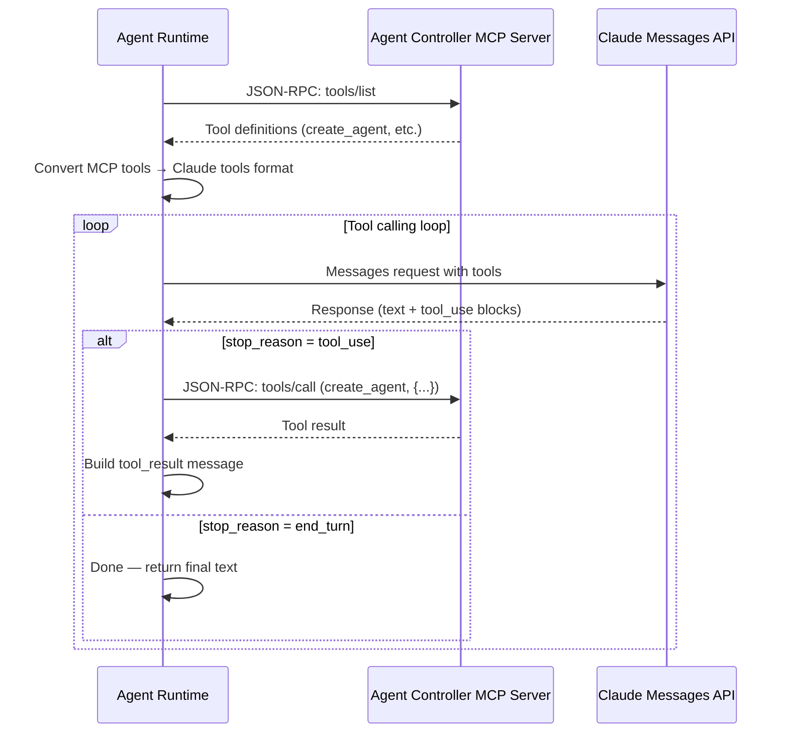

# MCP Integration

## Overview

ForgeMaster agents communicate with external tools via [Model Context Protocol (MCP)](https://modelcontextprotocol.io/introduction). The agent runtime (`fm-agent-runtime-claude`) acts as the MCP client — connecting to MCP servers inside the Kubernetes cluster, discovering available tools, and bridging them to the Claude Messages API.

**Why a local MCP client?** The Anthropic Messages API has a native MCP connector (`mcp_servers` parameter), but it requires HTTPS endpoints reachable from Anthropic's infrastructure. Since our MCP servers run inside a private K8s cluster, the runtime handles the MCP protocol locally and passes tools as regular `tools` definitions to the Claude API.

## How It Works



The runtime acts as the MCP client:
1. Connects to the MCP server inside the cluster (HTTP, no TLS required for in-cluster)
2. Discovers available tools via `tools/list` (JSON-RPC 2.0)
3. Converts MCP tool definitions to Claude `tools` parameter format
4. Sends Messages API request with tools
5. When Claude returns `tool_use` blocks, executes them via `tools/call`
6. Feeds `tool_result` back to Claude in the next message
7. Repeats until Claude returns `end_turn`

## MCP Protocol (JSON-RPC 2.0)

### Tool Discovery — `tools/list`

```json
// Request
POST /mcp HTTP/1.1
Content-Type: application/json

{
  "jsonrpc": "2.0",
  "id": 1,
  "method": "tools/list"
}

// Response
{
  "jsonrpc": "2.0",
  "id": 1,
  "result": {
    "tools": [
      {
        "name": "create_agent",
        "description": "Create a child Agent CR in the task namespace",
        "inputSchema": {
          "type": "object",
          "properties": {
            "agent_type": { "type": "string" },
            "task_prompt": { "type": "string" }
          },
          "required": ["agent_type", "task_prompt"]
        }
      }
    ]
  }
}
```

### Tool Execution — `tools/call`

```json
// Request
POST /mcp HTTP/1.1
Content-Type: application/json

{
  "jsonrpc": "2.0",
  "id": 2,
  "method": "tools/call",
  "params": {
    "name": "create_agent",
    "arguments": {
      "agent_type": "code-generator",
      "task_prompt": "Implement the REST API endpoints"
    }
  }
}

// Response
{
  "jsonrpc": "2.0",
  "id": 2,
  "result": {
    "content": [
      { "type": "text", "text": "Agent created: code-generator-task-abc123" }
    ],
    "isError": false
  }
}
```

## Claude API Tool Calling

The runtime converts MCP tools to the Claude Messages API `tools` parameter format.

### Request with tools

```json
{
  "model": "claude-sonnet-4-20250514",
  "max_tokens": 4096,
  "system": "You are an orchestrator agent...",
  "tools": [
    {
      "name": "create_agent",
      "description": "Create a child Agent CR in the task namespace",
      "input_schema": {
        "type": "object",
        "properties": {
          "agent_type": { "type": "string" },
          "task_prompt": { "type": "string" }
        },
        "required": ["agent_type", "task_prompt"]
      }
    }
  ],
  "messages": [
    { "role": "user", "content": "Execute the task described in the system prompt." }
  ]
}
```

### Response with tool_use

When Claude decides to use a tool, it returns `stop_reason: "tool_use"`:

```json
{
  "stop_reason": "tool_use",
  "content": [
    { "type": "text", "text": "I'll create a code generator agent..." },
    {
      "type": "tool_use",
      "id": "toolu_01A09q90qw90lq917835lq9",
      "name": "create_agent",
      "input": { "agent_type": "code-generator", "task_prompt": "..." }
    }
  ]
}
```

### Sending tool_result back

The runtime executes the tool via MCP, then sends the result back:

```json
{
  "messages": [
    { "role": "user", "content": "Execute the task..." },
    {
      "role": "assistant",
      "content": [
        { "type": "text", "text": "I'll create a code generator agent..." },
        { "type": "tool_use", "id": "toolu_01A09q90qw90lq917835lq9", "name": "create_agent", "input": {...} }
      ]
    },
    {
      "role": "user",
      "content": [
        {
          "type": "tool_result",
          "tool_use_id": "toolu_01A09q90qw90lq917835lq9",
          "content": "Agent created: code-generator-task-abc123"
        }
      ]
    }
  ]
}
```

## ForgeMaster MCP Servers

### Agent Controller (MCP)

The Agent Controller exposes an MCP server for agent lifecycle management. The orchestrator agent connects to it to create and manage child agents.

**Planned tools:**

| Tool | Description |
|------|-------------|
| `create_agent` | Create a child Agent CR in the task namespace |
| `list_agents` | List agents in the current task namespace |
| `get_agent_status` | Get phase and status of a specific agent |

Source: [`crates/fm-controller-agent/`](../../crates/fm-controller-agent/)

### Multiple MCP Servers

Agents can connect to multiple MCP servers simultaneously. Each `McpServerRef` in the Agent CR carries a service name and port (default: 3000). The Agent Controller builds full K8s DNS URLs at pod creation time and injects them as `MCP_SERVER_URLS`.

The `CompositeToolExecutor` in the runtime aggregates tools from all configured servers and routes `tools/call` requests to the correct server based on which server provides that tool.

```
Agent CR:
  mcpServers:
    - name: github-mcp            # port defaults to 3000
    - name: filesystem-mcp
      port: 9090                   # custom port

→ Controller builds URLs via K8s DNS:
  http://{name}.{namespace}.svc.cluster.local:{port}

→ MCP_SERVER_URLS=http://github-mcp.task-abc.svc.cluster.local:3000,http://filesystem-mcp.task-abc.svc.cluster.local:9090

→ CompositeToolExecutor
    ├─ McpToolExecutor(github-mcp)     → [create_pr, list_issues]
    └─ McpToolExecutor(filesystem-mcp) → [read_file, write_file]
```

**Future: Dynamic MCP Server Registry.** Currently, MCP server URLs are built statically at pod startup from `McpServerRef` entries. In the future, this should evolve into a registry pattern with dynamic MCP server discovery — allowing servers to be registered/deregistered at runtime (e.g., via K8s watch on MCPServer CRDs). This is out of scope for now.

### Future MCP Servers

Planned integrations:

| MCP Server | Purpose |
|------------|---------|
| K8s API MCP | Direct Kubernetes API access |
| Filesystem MCP | File read/write operations |
| GitHub MCP | Repository operations |

## Source References

- MCP client (rmcp SDK): [`crates/fm-agent-runtime-claude/src/mcp_client/`](../../crates/fm-agent-runtime-claude/src/mcp_client/)
- Tool executor trait + composite: [`crates/fm-agent-runtime-claude/src/tool_executor/`](../../crates/fm-agent-runtime-claude/src/tool_executor/)
- Conversation loop: [`crates/fm-agent-runtime-claude/src/conversation_loop.rs`](../../crates/fm-agent-runtime-claude/src/conversation_loop.rs)
- Claude API tool types: [`crates/fm-agent-runtime-claude/src/claude_api/tool_definition.rs`](../../crates/fm-agent-runtime-claude/src/claude_api/tool_definition.rs)
- McpServerRef (name + port → URL): [`crates/fm-controller-agent/src/crd/mcp_server_ref.rs`](../../crates/fm-controller-agent/src/crd/mcp_server_ref.rs)
- Pod builder (MCP_SERVER_URLS injection): [`crates/fm-controller-agent/src/controller/pod_builder.rs`](../../crates/fm-controller-agent/src/controller/pod_builder.rs)
- SDK selection: [`docs/adr/0006-mcp-client-sdk-selection.md`](../adr/0006-mcp-client-sdk-selection.md)

## Official Documentation

- [Tool Use with Claude](https://docs.anthropic.com/en/docs/build-with-claude/tool-use)
- [MCP Specification](https://modelcontextprotocol.io/introduction)
- [MCP Connector — Anthropic API Docs](https://docs.anthropic.com/en/docs/agents-and-tools/mcp-connector) (native connector — not used, requires public HTTPS)
