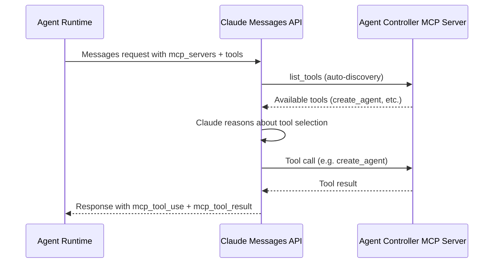

# MCP Integration

## Overview

ForgeMaster agents communicate with external tools via [Model Context Protocol (MCP)](https://modelcontextprotocol.io/introduction). The Anthropic Messages API has a native **MCP connector** (beta) that handles connection management, tool discovery, and execution automatically — no custom MCP client code needed.

## How It Works



The Claude API acts as the MCP client:
1. Connects to the specified MCP server URL
2. Discovers available tools via `list_tools`
3. Claude decides which tools to call based on the prompt
4. API executes tool calls and returns results
5. Runtime receives the final response with tool use/result blocks

## API Parameters

### `mcp_servers` — Server connection

```json
{
  "mcp_servers": [
    {
      "type": "url",
      "url": "https://agent-controller.forgemaster-system:8080/mcp/",
      "name": "forgemaster",
      "authorization_token": "optional-token"
    }
  ]
}
```

| Field | Required | Description |
|-------|----------|-------------|
| `type` | Yes | Must be `"url"` |
| `url` | Yes | MCP server URL (HTTPS required, supports SSE and Streamable HTTP) |
| `name` | Yes | Unique identifier, referenced by `mcp_toolset` in `tools` array |
| `authorization_token` | No | OAuth Bearer token for authenticated servers |

### `tools` — Toolset configuration

```json
{
  "tools": [
    {
      "type": "mcp_toolset",
      "mcp_server_name": "forgemaster"
    }
  ]
}
```

| Field | Required | Description |
|-------|----------|-------------|
| `type` | Yes | Must be `"mcp_toolset"` |
| `mcp_server_name` | Yes | Must match a `name` in `mcp_servers` |
| `default_config` | No | Default config for all tools (`enabled`, `defer_loading`) |
| `configs` | No | Per-tool overrides keyed by tool name |

### Beta header

Required: `"anthropic-beta": "mcp-client-2025-11-20"`

## Response Content Types

Claude returns two new content block types when using MCP tools:

**`mcp_tool_use`** — Claude's tool call:
```json
{
  "type": "mcp_tool_use",
  "id": "mcptoolu_014Q35RayjACSWkSj4X2yov1",
  "name": "create_agent",
  "server_name": "forgemaster",
  "input": { "type": "code-generator", "taskPrompt": "..." }
}
```

**`mcp_tool_result`** — Tool execution result:
```json
{
  "type": "mcp_tool_result",
  "tool_use_id": "mcptoolu_014Q35RayjACSWkSj4X2yov1",
  "is_error": false,
  "content": [{ "type": "text", "text": "Agent created: code-generator-task-abc123" }]
}
```

## ForgeMaster MCP Servers

### Agent Controller (MCP)

The Agent Controller exposes an MCP server for agent lifecycle management. The orchestrator agent connects to it to create and manage child agents.

**Planned tools:**

| Tool | Description |
|------|-------------|
| `create_agent` | Create a child Agent CR in the task namespace |
| `list_agents` | List agents in the current task namespace |
| `get_agent_status` | Get phase and status of a specific agent |

Source: [`crates/fm-controller-agent/`](../../crates/fm-controller-agent/)

### Future MCP Servers

Agents can connect to multiple MCP servers simultaneously. Future integrations:

| MCP Server | Purpose |
|------------|---------|
| K8s API MCP | Direct Kubernetes API access |
| Filesystem MCP | File read/write operations |
| GitHub MCP | Repository operations |

## Limitations

- Only **tool calls** are supported (not MCP resources or prompts)
- Server must be publicly exposed via HTTP (no local STDIO)
- HTTPS required for the server URL
- Not supported on Amazon Bedrock or Google Vertex

## Official Documentation

- [MCP Connector — Anthropic API Docs](https://docs.anthropic.com/en/docs/agents-and-tools/mcp-connector)
- [Tool Use with Claude](https://docs.anthropic.com/en/docs/build-with-claude/tool-use)
- [Advanced Tool Use](https://www.anthropic.com/engineering/advanced-tool-use)
- [MCP Specification](https://modelcontextprotocol.io/introduction)
- [Agent Capabilities API](https://claude.com/blog/agent-capabilities-api)
