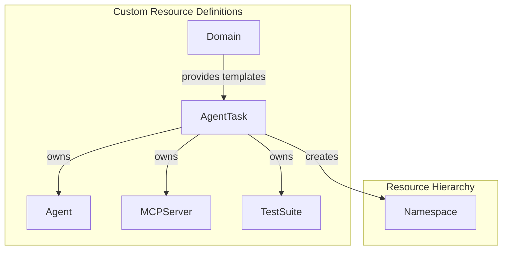

# Custom Resource Definitions (CRDs)

ForgeMaster uses Kubernetes Custom Resource Definitions to model the domain. This document specifies the schema for each CRD.

## Overview



| CRD | API Group | Purpose | Scope |
|-----|-----------|---------|-------|
| AgentTask | `forgemaster.io/v1alpha1` | Top-level task resource | Namespaced |
| Agent | `forgemaster.io/v1alpha1` | Agent instance | Namespaced |
| MCPServer | `forgemaster.io/v1alpha1` | MCP server instance | Namespaced |
| TestSuite | `forgemaster.io/v1alpha1` | Gherkin test suite | Namespaced |
| Domain | `forgemaster.io/v1alpha1` | Domain templates | Cluster-scoped |

---

## AgentTask CRD

Top-level resource representing a user's task request.

### Schema

```yaml
apiVersion: forgemaster.io/v1alpha1
kind: AgentTask
metadata:
  name: string                    # Task identifier (e.g., "ecommerce-backend")
  namespace: string               # Task namespace (e.g., "task-abc123")
  labels:
    forgemaster.io/domain: string # Matched domain name
spec:
  # Task Description (required)
  description: string             # Natural language task description

  # Domain Configuration
  domain:
    name: string                  # Domain name (e.g., "web-development")
    autoSelected: boolean         # Whether domain was auto-matched
    matchScore: number            # Match confidence (0.0 - 1.0)

  # TCP Controller Configuration
  controller:
    taskWeight: number            # T coefficient (default: 1.0)
    contextWeight: number         # C coefficient (default: 0.5)
    predictionWeight: number      # P coefficient (default: 0.3)
    errorThreshold: number        # Success threshold (default: 0.1)
    maxIterations: integer        # Max iterations before failure (default: 10)

  # Test Configuration
  testConfig:
    format: string                # "gherkin" | "pytest" | "jest"
    framework: string             # Test framework (e.g., "behave", "pytest")
    timeout: string               # Test timeout (e.g., "5m")

  # Resource Quotas
  resourceQuota:
    maxAgents: integer            # Max concurrent agents (default: 5)
    maxMemory: string             # Total memory limit (e.g., "4Gi")
    maxCPU: string                # Total CPU limit (e.g., "4")

  # Artifact Storage
  artifacts:
    repository: string            # Git repository URL
    branch: string                # Branch name (default: "main")
    path: string                  # Output path in repo

status:
  # Task Phase
  phase: string                   # Pending | Initializing | Running | Succeeded | Failed

  # Progress
  iteration: integer              # Current iteration number
  currentError: number            # Current error signal (0.0 - 1.0)
  startTime: string               # ISO 8601 timestamp
  completionTime: string          # ISO 8601 timestamp (if completed)

  # Test Results
  tests:
    total: integer                # Total test count
    passed: integer               # Passed tests
    failed: integer               # Failed tests
    skipped: integer              # Skipped tests

  # Agent Status
  agents:
    - name: string                # Agent name
      type: string                # Agent type
      phase: string               # Pending | Running | Succeeded | Failed

  # Conditions
  conditions:
    - type: string                # Condition type
      status: string              # True | False | Unknown
      reason: string              # Machine-readable reason
      message: string             # Human-readable message
      lastTransitionTime: string  # ISO 8601 timestamp
```

### Example

```yaml
apiVersion: forgemaster.io/v1alpha1
kind: AgentTask
metadata:
  name: ecommerce-backend
  namespace: task-ecommerce-abc123
  labels:
    forgemaster.io/domain: web-development
spec:
  description: |
    Create an e-commerce backend API with:
    - Product catalog with categories
    - Shopping cart management
    - Checkout with Stripe integration
    - Order history

  domain:
    name: web-development
    autoSelected: true
    matchScore: 0.94

  controller:
    taskWeight: 1.0
    contextWeight: 0.5
    predictionWeight: 0.3
    errorThreshold: 0.1
    maxIterations: 10

  testConfig:
    format: gherkin
    framework: behave
    timeout: 5m

  resourceQuota:
    maxAgents: 5
    maxMemory: 4Gi
    maxCPU: "4"

  artifacts:
    repository: https://github.com/user/ecommerce-api
    branch: main
    path: /src

status:
  phase: Running
  iteration: 3
  currentError: 0.25
  startTime: "2026-02-05T12:00:00Z"
  tests:
    total: 12
    passed: 9
    failed: 3
    skipped: 0
  agents:
    - name: orchestrator-abc123
      type: orchestrator
      phase: Running
    - name: code-generator-def456
      type: code-generator
      phase: Running
    - name: test-runner-ghi789
      type: test-runner
      phase: Succeeded
  conditions:
    - type: Initialized
      status: "True"
      reason: NamespaceCreated
      message: Task namespace created successfully
      lastTransitionTime: "2026-02-05T12:00:05Z"
    - type: AgentsReady
      status: "True"
      reason: AllAgentsRunning
      message: All required agents are running
      lastTransitionTime: "2026-02-05T12:00:30Z"
```

---

## Agent CRD

Represents an individual agent instance.

### Schema

```yaml
apiVersion: forgemaster.io/v1alpha1
kind: Agent
metadata:
  name: string                    # Agent identifier
  namespace: string               # Task namespace
  labels:
    forgemaster.io/task: string   # Parent AgentTask name
    forgemaster.io/type: string   # Agent type
    forgemaster.io/domain: string # Domain name
  ownerReferences:                # Garbage collection
    - apiVersion: forgemaster.io/v1alpha1
      kind: AgentTask
      name: string
      uid: string
spec:
  # Agent Type (required)
  type: string                    # orchestrator | code-generator | test-generator |
                                  # test-runner | feedback | reviewer

  # LLM Configuration (required)
  model:
    provider: string              # anthropic | openai | local
    name: string                  # Model name (e.g., "claude-sonnet-4-20250514")
    temperature: number           # Temperature (0.0 - 2.0)
    maxTokens: integer            # Max output tokens

  # System Prompt (required)
  systemPrompt: string            # Agent instructions

  # MCP Server References
  mcpServers:
    - name: string                # MCPServer CR name

  # A2A Configuration
  a2a:
    enabled: boolean              # Enable A2A server
    port: integer                 # A2A server port (default: 8080)

  # Resource Limits
  resources:
    limits:
      memory: string              # Memory limit (e.g., "512Mi")
      cpu: string                 # CPU limit (e.g., "500m")
    requests:
      memory: string              # Memory request
      cpu: string                 # CPU request

  # Environment Variables
  env:
    - name: string
      value: string
    - name: string
      valueFrom:
        secretKeyRef:
          name: string
          key: string

status:
  # Agent Phase
  phase: string                   # Pending | Running | Succeeded | Failed

  # Execution Info
  startTime: string               # ISO 8601 timestamp
  completionTime: string          # ISO 8601 timestamp
  tokensUsed: integer             # Total tokens consumed
  iterationsCompleted: integer    # Iterations this agent participated in

  # Pod Reference
  podRef:
    name: string                  # Pod name
    uid: string                   # Pod UID

  # Output Reference
  output:
    configMapRef: string          # ConfigMap with agent output

  # Conditions
  conditions:
    - type: string
      status: string
      reason: string
      message: string
      lastTransitionTime: string
```

### Example

```yaml
apiVersion: forgemaster.io/v1alpha1
kind: Agent
metadata:
  name: code-generator-def456
  namespace: task-ecommerce-abc123
  labels:
    forgemaster.io/task: ecommerce-backend
    forgemaster.io/type: code-generator
    forgemaster.io/domain: web-development
  ownerReferences:
    - apiVersion: forgemaster.io/v1alpha1
      kind: AgentTask
      name: ecommerce-backend
      uid: abc123-def456-ghi789
spec:
  type: code-generator

  model:
    provider: anthropic
    name: claude-sonnet-4-20250514
    temperature: 0.7
    maxTokens: 4096

  systemPrompt: |
    You are a Code Generator agent specialized in Rust backend development.

    Your task:
    - Implement REST API endpoints based on test specifications
    - Use Axum framework for HTTP handling
    - Follow clean architecture principles
    - Include proper error handling

    Output format:
    - Generate complete, compilable Rust code
    - Include module structure
    - Add inline documentation

  mcpServers:
    - name: github-mcp
    - name: postgres-mcp

  a2a:
    enabled: true
    port: 8080

  resources:
    limits:
      memory: 512Mi
      cpu: 500m
    requests:
      memory: 256Mi
      cpu: 250m

  env:
    - name: RUST_LOG
      value: info
    - name: ANTHROPIC_API_KEY
      valueFrom:
        secretKeyRef:
          name: llm-credentials
          key: anthropic-api-key

status:
  phase: Running
  startTime: "2026-02-05T12:00:30Z"
  tokensUsed: 8542
  iterationsCompleted: 2
  podRef:
    name: code-generator-def456-pod
    uid: pod-uid-123
  conditions:
    - type: Ready
      status: "True"
      reason: PodRunning
      message: Agent pod is running and healthy
      lastTransitionTime: "2026-02-05T12:00:35Z"
```

---

## MCPServer CRD

Represents an MCP (Model Context Protocol) server instance.

### Schema

```yaml
apiVersion: forgemaster.io/v1alpha1
kind: MCPServer
metadata:
  name: string                    # Server identifier
  namespace: string               # Task namespace
  labels:
    forgemaster.io/task: string   # Parent AgentTask name
    forgemaster.io/type: string   # Server type
  ownerReferences:
    - apiVersion: forgemaster.io/v1alpha1
      kind: AgentTask
      name: string
      uid: string
spec:
  # Server Type (required)
  type: string                    # github | postgres | filesystem | stripe | redis

  # Container Image
  image: string                   # Docker image (e.g., "forgemaster/mcp-github:latest")

  # Server Configuration
  config:
    # Type-specific configuration
    capabilities: []string        # Enabled capabilities
    settings: map[string]string   # Additional settings

  # Credentials
  credentialsSecret:
    name: string                  # Secret name
    keys:                         # Key mappings
      - secretKey: string         # Key in secret
        envVar: string            # Environment variable name

  # Resource Limits
  resources:
    limits:
      memory: string
      cpu: string
    requests:
      memory: string
      cpu: string

  # Health Check
  healthCheck:
    path: string                  # Health endpoint (default: "/health")
    port: integer                 # Health port (default: 3000)
    initialDelaySeconds: integer  # Startup delay
    periodSeconds: integer        # Check interval

status:
  # Server Phase
  phase: string                   # Pending | Running | Failed

  # Endpoint
  endpoint: string                # Service endpoint URL

  # Available Tools
  tools:
    - name: string                # Tool name
      description: string         # Tool description

  # Pod Reference
  podRef:
    name: string
    uid: string

  # Conditions
  conditions:
    - type: string
      status: string
      reason: string
      message: string
      lastTransitionTime: string
```

### Example

```yaml
apiVersion: forgemaster.io/v1alpha1
kind: MCPServer
metadata:
  name: github-mcp
  namespace: task-ecommerce-abc123
  labels:
    forgemaster.io/task: ecommerce-backend
    forgemaster.io/type: github
  ownerReferences:
    - apiVersion: forgemaster.io/v1alpha1
      kind: AgentTask
      name: ecommerce-backend
      uid: abc123-def456-ghi789
spec:
  type: github

  image: forgemaster/mcp-github:latest

  config:
    capabilities:
      - read_file
      - write_file
      - create_branch
      - create_pull_request
      - list_files
    settings:
      defaultBranch: main
      autoCommit: "true"

  credentialsSecret:
    name: github-credentials
    keys:
      - secretKey: token
        envVar: GITHUB_TOKEN
      - secretKey: repository
        envVar: GITHUB_REPOSITORY

  resources:
    limits:
      memory: 256Mi
      cpu: 250m
    requests:
      memory: 128Mi
      cpu: 100m

  healthCheck:
    path: /health
    port: 3000
    initialDelaySeconds: 5
    periodSeconds: 10

status:
  phase: Running
  endpoint: http://github-mcp.task-ecommerce-abc123.svc.cluster.local:3000
  tools:
    - name: read_file
      description: Read file contents from repository
    - name: write_file
      description: Write or update file in repository
    - name: create_branch
      description: Create a new branch
    - name: create_pull_request
      description: Create a pull request
    - name: list_files
      description: List files in a directory
  podRef:
    name: github-mcp-pod
    uid: pod-uid-456
  conditions:
    - type: Ready
      status: "True"
      reason: ServerHealthy
      message: MCP server is responding to health checks
      lastTransitionTime: "2026-02-05T12:00:20Z"
```

---

## TestSuite CRD

Represents the Gherkin test suite (setpoint for TCP controller).

### Schema

```yaml
apiVersion: forgemaster.io/v1alpha1
kind: TestSuite
metadata:
  name: string                    # Test suite identifier
  namespace: string               # Task namespace
  labels:
    forgemaster.io/task: string   # Parent AgentTask name
  ownerReferences:
    - apiVersion: forgemaster.io/v1alpha1
      kind: AgentTask
      name: string
      uid: string
spec:
  # Test Format (required)
  format: string                  # gherkin | pytest | jest

  # Test Framework
  framework: string               # behave | pytest | jest | cucumber

  # Features (Gherkin)
  features:
    - name: string                # Feature name
      content: string             # Gherkin feature content

  # Or reference ConfigMap
  featuresConfigMapRef:
    name: string                  # ConfigMap name

  # Test Runner Configuration
  runner:
    image: string                 # Test runner image
    timeout: string               # Overall timeout
    parallel: boolean             # Run tests in parallel
    retries: integer              # Retry failed tests

status:
  # Suite Phase
  phase: string                   # Pending | Running | Completed

  # Last Run
  lastRun: string                 # ISO 8601 timestamp
  duration: string                # Run duration

  # Results
  results:
    total: integer                # Total scenarios
    passed: integer               # Passed scenarios
    failed: integer               # Failed scenarios
    skipped: integer              # Skipped scenarios
    error: number                 # Error signal (failed/total)

  # Failed Scenarios
  failedScenarios:
    - feature: string             # Feature name
      scenario: string            # Scenario name
      error: string               # Error message

  # Conditions
  conditions:
    - type: string
      status: string
      reason: string
      message: string
      lastTransitionTime: string
```

### Example

```yaml
apiVersion: forgemaster.io/v1alpha1
kind: TestSuite
metadata:
  name: ecommerce-tests
  namespace: task-ecommerce-abc123
  labels:
    forgemaster.io/task: ecommerce-backend
  ownerReferences:
    - apiVersion: forgemaster.io/v1alpha1
      kind: AgentTask
      name: ecommerce-backend
      uid: abc123-def456-ghi789
spec:
  format: gherkin
  framework: behave

  features:
    - name: product-catalog
      content: |
        Feature: Product Catalog API
          As an API client
          I want to manage products
          So that I can build a catalog

          Scenario: Create a new product
            Given the API is running
            When I POST to "/products" with:
              | name     | price  | category    |
              | Headphones | 99.99 | electronics |
            Then the response status is 201
            And the response contains "id"

          Scenario: List products by category
            Given products exist in "electronics"
            When I GET "/products?category=electronics"
            Then the response status is 200
            And the response is a list

    - name: shopping-cart
      content: |
        Feature: Shopping Cart
          Scenario: Add item to cart
            Given a product "prod-123" exists
            And I have a cart session
            When I POST to "/cart/items" with productId "prod-123"
            Then the response status is 200
            And the cart total is updated

    - name: checkout
      content: |
        Feature: Checkout with Stripe
          Scenario: Successful checkout
            Given I have items in cart
            And I have valid payment method
            When I POST to "/checkout"
            Then the response status is 200
            And I receive order confirmation

          Scenario: Payment failure
            Given I have items in cart
            And I have invalid payment method
            When I POST to "/checkout"
            Then the response status is 402

  runner:
    image: forgemaster/test-runner:latest
    timeout: 5m
    parallel: false
    retries: 1

status:
  phase: Completed
  lastRun: "2026-02-05T12:05:00Z"
  duration: 45s
  results:
    total: 5
    passed: 4
    failed: 1
    skipped: 0
    error: 0.2
  failedScenarios:
    - feature: checkout
      scenario: Payment failure
      error: "Expected status 402, got 500"
  conditions:
    - type: Complete
      status: "True"
      reason: TestsFinished
      message: Test run completed with 1 failure
      lastTransitionTime: "2026-02-05T12:05:45Z"
```

---

## Domain CRD

Cluster-scoped resource defining domain templates and matching rules.

### Schema

```yaml
apiVersion: forgemaster.io/v1alpha1
kind: Domain
metadata:
  name: string                    # Domain identifier (cluster-scoped, no namespace)
spec:
  # Display Information
  displayName: string             # Human-readable name
  description: string             # Domain description

  # Skills
  skills: []string                # Skills this domain provides

  # Task Matching
  matching:
    patterns: []string            # Regex patterns to match task descriptions
    keywords:                     # Keyword weights for scoring
      - keyword: string
        weight: number            # 0.0 - 1.0
    minScore: number              # Minimum match score (default: 0.7)

  # Agent Templates
  agentTemplates:
    - name: string                # Template name
      type: string                # Agent type
      model:
        provider: string
        name: string
        temperature: number
        maxTokens: integer
      systemPrompt: string        # System prompt template
      mcpServers: []string        # Required MCP servers

  # Shared Agent References
  sharedAgentRefs: []string       # References to shared agents

  # Required MCP Servers
  mcpServers:
    - name: string                # MCP server type
      required: boolean           # Required or optional
      config: map[string]string   # Default configuration

status:
  # Domain Status
  phase: string                   # Active | Deprecated | Disabled

  # Usage Statistics
  stats:
    totalTasks: integer           # Total tasks using this domain
    activeTasks: integer          # Currently running tasks
    successRate: number           # Success rate (0.0 - 1.0)
    avgIterations: number         # Average iterations to completion

  # Last Used
  lastUsed: string                # ISO 8601 timestamp

  # Conditions
  conditions:
    - type: string
      status: string
      reason: string
      message: string
      lastTransitionTime: string
```

### Example

```yaml
apiVersion: forgemaster.io/v1alpha1
kind: Domain
metadata:
  name: web-development
spec:
  displayName: Web Development
  description: |
    Full-stack web applications, REST APIs, frontend frameworks,
    and common integrations (payments, auth, databases).

  skills:
    - rest-api
    - graphql
    - authentication
    - database-integration
    - frontend-spa
    - payment-processing

  matching:
    patterns:
      - ".*REST API.*"
      - ".*web (app|application).*"
      - ".*frontend.*"
      - ".*e-commerce.*"
      - ".*backend.*API.*"
    keywords:
      - keyword: REST
        weight: 0.9
      - keyword: API
        weight: 0.8
      - keyword: web
        weight: 0.7
      - keyword: frontend
        weight: 0.8
      - keyword: backend
        weight: 0.8
      - keyword: Stripe
        weight: 0.9
      - keyword: checkout
        weight: 0.85
      - keyword: e-commerce
        weight: 0.95
    minScore: 0.7

  agentTemplates:
    - name: api-architect
      type: code-generator
      model:
        provider: anthropic
        name: claude-sonnet-4-20250514
        temperature: 0.7
        maxTokens: 4096
      systemPrompt: |
        You are an API Architect specializing in REST and GraphQL APIs.
        Design clean, scalable API structures following best practices.
        Use appropriate HTTP methods, status codes, and error handling.
      mcpServers:
        - github
        - postgres

    - name: frontend-developer
      type: code-generator
      model:
        provider: anthropic
        name: claude-sonnet-4-20250514
        temperature: 0.7
        maxTokens: 4096
      systemPrompt: |
        You are a Frontend Developer specializing in React and TypeScript.
        Build responsive, accessible user interfaces.
        Follow component-based architecture and modern React patterns.
      mcpServers:
        - github
        - filesystem

    - name: stripe-integrator
      type: code-generator
      model:
        provider: anthropic
        name: claude-sonnet-4-20250514
        temperature: 0.5
        maxTokens: 4096
      systemPrompt: |
        You are a Payment Integration specialist for Stripe.
        Implement secure payment flows following PCI compliance.
        Handle webhooks, refunds, and subscription billing.
      mcpServers:
        - github
        - stripe

  sharedAgentRefs:
    - test-generator
    - test-runner
    - reviewer

  mcpServers:
    - name: github
      required: true
    - name: postgres
      required: false
    - name: stripe
      required: false
    - name: redis
      required: false

status:
  phase: Active
  stats:
    totalTasks: 156
    activeTasks: 3
    successRate: 0.87
    avgIterations: 4.2
  lastUsed: "2026-02-05T11:30:00Z"
  conditions:
    - type: Ready
      status: "True"
      reason: DomainActive
      message: Domain is active and accepting tasks
      lastTransitionTime: "2026-02-01T00:00:00Z"
```

---

## Generating CRDs with kube-rs

### Rust Struct Definitions

```rust
// crates/fm-core/src/crds/agent_task.rs

use kube::CustomResource;
use schemars::JsonSchema;
use serde::{Deserialize, Serialize};

#[derive(CustomResource, Clone, Debug, Deserialize, Serialize, JsonSchema)]
#[kube(
    group = "forgemaster.io",
    version = "v1alpha1",
    kind = "AgentTask",
    namespaced,
    status = "AgentTaskStatus",
    printcolumn = r#"{"name":"Phase", "type":"string", "jsonPath":".status.phase"}"#,
    printcolumn = r#"{"name":"Iteration", "type":"integer", "jsonPath":".status.iteration"}"#,
    printcolumn = r#"{"name":"Error", "type":"number", "jsonPath":".status.currentError"}"#,
    printcolumn = r#"{"name":"Age", "type":"date", "jsonPath":".metadata.creationTimestamp"}"#
)]
#[serde(rename_all = "camelCase")]
pub struct AgentTaskSpec {
    pub description: String,

    #[serde(default)]
    pub domain: Option<DomainRef>,

    #[serde(default)]
    pub controller: ControllerConfig,

    #[serde(default)]
    pub test_config: TestConfig,

    #[serde(default)]
    pub resource_quota: ResourceQuota,

    #[serde(default)]
    pub artifacts: Option<ArtifactConfig>,
}

#[derive(Clone, Debug, Default, Deserialize, Serialize, JsonSchema)]
#[serde(rename_all = "camelCase")]
pub struct AgentTaskStatus {
    #[serde(default)]
    pub phase: TaskPhase,

    #[serde(default)]
    pub iteration: i32,

    #[serde(default)]
    pub current_error: f64,

    pub start_time: Option<String>,
    pub completion_time: Option<String>,

    #[serde(default)]
    pub tests: TestResults,

    #[serde(default)]
    pub agents: Vec<AgentStatus>,

    #[serde(default)]
    pub conditions: Vec<Condition>,
}

#[derive(Clone, Debug, Default, Deserialize, Serialize, JsonSchema, PartialEq)]
pub enum TaskPhase {
    #[default]
    Pending,
    Initializing,
    Running,
    Succeeded,
    Failed,
}

// Additional types...
```

### Generate CRD Manifests

```rust
// crates/fm-core/src/bin/gen_crds.rs

use fm_core::crds::{AgentTask, Agent, MCPServer, TestSuite, Domain};
use kube::CustomResourceExt;
use std::fs;

fn main() {
    let crds = vec![
        serde_yaml::to_string(&AgentTask::crd()).unwrap(),
        serde_yaml::to_string(&Agent::crd()).unwrap(),
        serde_yaml::to_string(&MCPServer::crd()).unwrap(),
        serde_yaml::to_string(&TestSuite::crd()).unwrap(),
        serde_yaml::to_string(&Domain::crd()).unwrap(),
    ];

    let output = crds.join("---\n");
    fs::write("manifests/crds.yaml", output).expect("Failed to write CRDs");

    println!("Generated CRDs to manifests/crds.yaml");
}
```

### Build and Generate

```bash
# Generate CRD manifests
cargo run --package fm-core --bin gen_crds

# Output: manifests/crds.yaml
```

---

## Applying CRDs to Cluster

### Manual Application

```bash
# Apply CRDs to cluster
kubectl apply -f manifests/crds.yaml

# Verify CRDs are installed
kubectl get crds | grep forgemaster

# Expected output:
# agenttasks.forgemaster.io      2026-02-05T12:00:00Z
# agents.forgemaster.io          2026-02-05T12:00:00Z
# mcpservers.forgemaster.io      2026-02-05T12:00:00Z
# testsuites.forgemaster.io      2026-02-05T12:00:00Z
# domains.forgemaster.io         2026-02-05T12:00:00Z
```

### Helm Chart

```yaml
# helm/forgemaster-crds/templates/crds.yaml
{{- range $path, $_ := .Files.Glob "crds/*.yaml" }}
{{ $.Files.Get $path }}
---
{{- end }}
```

```bash
# Install CRDs via Helm
helm install forgemaster-crds ./helm/forgemaster-crds

# Upgrade CRDs
helm upgrade forgemaster-crds ./helm/forgemaster-crds
```

### Makefile Target

```makefile
# Makefile

.PHONY: crds-generate crds-apply crds-delete

crds-generate:
	cargo run --package fm-core --bin gen_crds

crds-apply: crds-generate
	kubectl apply -f manifests/crds.yaml

crds-delete:
	kubectl delete -f manifests/crds.yaml --ignore-not-found
```

---

## Validation

### Verify CRD Installation

```bash
# Check CRDs exist
kubectl get crds | grep forgemaster.io

# Describe a CRD
kubectl describe crd agenttasks.forgemaster.io

# Check API resources
kubectl api-resources | grep forgemaster
```

### Test Creating Resources

```bash
# Create a test AgentTask
cat <<EOF | kubectl apply -f -
apiVersion: forgemaster.io/v1alpha1
kind: AgentTask
metadata:
  name: test-task
  namespace: default
spec:
  description: "Test task for CRD validation"
EOF

# Verify creation
kubectl get agenttasks
kubectl describe agenttask test-task

# Clean up
kubectl delete agenttask test-task
```

---

## Related

- [ADR-0005: Kubernetes-Native Architecture](../adr/0005-kubernetes-native-architecture.md)
- [05-k8s-deployment.md](05-k8s-deployment.md) — Full deployment architecture
- [Development Plan](../development-plan.md) — Implementation phases
