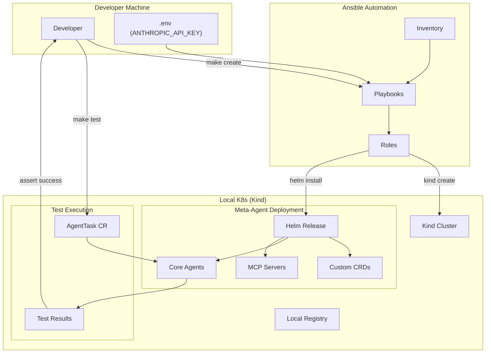

## Infrastructure: Ansible + Local K8s Cluster

### Directory Structure

```
infrastructure/
├── ansible.cfg
├── inventory/
│   ├── local.yml
│   └── production.yml
├── playbooks/
│   ├── site.yml
│   ├── cluster-create.yml
│   ├── cluster-destroy.yml
│   ├── deploy-meta-agent.yml
│   └── run-tests.yml
├── roles/
│   ├── common/
│   │   ├── tasks/
│   │   │   └── main.yml
│   │   └── vars/
│   │       └── main.yml
│   ├── docker/
│   │   ├── tasks/
│   │   │   └── main.yml
│   │   └── handlers/
│   │       └── main.yml
│   ├── kind/
│   │   ├── tasks/
│   │   │   └── main.yml
│   │   ├── templates/
│   │   │   └── kind-config.yaml.j2
│   │   └── defaults/
│   │       └── main.yml
│   ├── kubectl/
│   │   └── tasks/
│   │       └── main.yml
│   ├── helm/
│   │   └── tasks/
│   │       └── main.yml
│   ├── meta-agent/
│   │   ├── tasks/
│   │   │   └── main.yml
│   │   ├── templates/
│   │   │   └── values-local.yaml.j2
│   │   └── defaults/
│   │       └── main.yml
│   └── tests/
│       ├── tasks/
│       │   └── main.yml
│       └── files/
│           └── test-task.yaml
└── group_vars/
    ├── all.yml
    └── local.yml
```

### ansible.cfg

```ini
[defaults]
inventory = inventory/local.yml
roles_path = roles
host_key_checking = False
retry_files_enabled = False
stdout_callback = yaml
interpreter_python = auto_silent

[privilege_escalation]
become = False
```

### Inventory: Local Development

```yaml
# inventory/local.yml
all:
  hosts:
    localhost:
      ansible_connection: local
      ansible_python_interpreter: "{{ ansible_playbook_python }}"
  
  vars:
    env: local
    cluster_name: meta-agent-local
    k8s_provider: kind  # kind, minikube, k3d
    
    # Kind cluster settings
    kind_version: "0.20.0"
    kubernetes_version: "1.28.0"
    kind_workers: 2
    
    # Meta-agent settings
    meta_agent_namespace: meta-agent-system
    meta_agent_chart_path: "../helm/meta-agent"
    
    # Local registry
    local_registry_enabled: true
    local_registry_port: 5000
```

### Group Variables

```yaml
# group_vars/all.yml
---
# Common variables for all environments
project_name: meta-agent
domain: metaagent.local

# Tool versions
kubectl_version: "1.28.0"
helm_version: "3.13.0"
kind_version: "0.20.0"

# Docker settings
docker_registry: "localhost:5000"

# Anthropic API (from environment or vault)
anthropic_api_key: "{{ lookup('env', 'ANTHROPIC_API_KEY') }}"

# TCP Controller defaults
tcp_coefficients:
  task: 1.0
  context: 0.5
  prediction: 0.3
```

```yaml
# group_vars/local.yml
---
# Local development overrides
k8s_context: "kind-{{ cluster_name }}"

# Smaller resources for local
resources:
  tcp_controller:
    memory: "256Mi"
    cpu: "250m"
  agents:
    memory: "256Mi"
    cpu: "250m"

# Local storage
storage:
  redis_size: "1Gi"
  minio_size: "5Gi"

# Disable TLS locally
tls_enabled: false

# Local ingress
ingress_host: "agents.local"
```

### Main Playbook: site.yml

```yaml
# playbooks/site.yml
---
- name: Setup Meta-Agent Development Environment
  hosts: localhost
  gather_facts: true
  
  vars_prompt:
    - name: action
      prompt: "Action (create/destroy/deploy/test)"
      default: "create"
      private: false

  tasks:
    - name: Create cluster
      when: action == "create"
      include_tasks: cluster-create.yml
      
    - name: Destroy cluster
      when: action == "destroy"
      include_tasks: cluster-destroy.yml
      
    - name: Deploy meta-agent
      when: action == "deploy"
      include_tasks: deploy-meta-agent.yml
      
    - name: Run tests
      when: action == "test"
      include_tasks: run-tests.yml
```

### Playbook: Cluster Create

```yaml
# playbooks/cluster-create.yml
---
- name: Create Local Kubernetes Cluster
  hosts: localhost
  gather_facts: true
  become: false
  
  pre_tasks:
    - name: Display cluster info
      debug:
        msg: |
          Creating cluster: {{ cluster_name }}
          Provider: {{ k8s_provider }}
          Workers: {{ kind_workers }}
  
  roles:
    - role: common
      tags: [common]
    - role: docker
      tags: [docker]
    - role: kubectl
      tags: [kubectl]
    - role: helm
      tags: [helm]
    - role: kind
      tags: [kind, cluster]
  
  post_tasks:
    - name: Verify cluster is running
      command: kubectl cluster-info
      register: cluster_info
      changed_when: false
      
    - name: Display cluster info
      debug:
        var: cluster_info.stdout_lines
        
    - name: Create namespaces
      kubernetes.core.k8s:
        state: present
        definition:
          apiVersion: v1
          kind: Namespace
          metadata:
            name: "{{ item }}"
      loop:
        - "{{ meta_agent_namespace }}"
        - meta-agent-tasks
        
    - name: Success message
      debug:
        msg: |
          ✅ Cluster '{{ cluster_name }}' created successfully!
          
          Next steps:
            ansible-playbook playbooks/site.yml -e action=deploy
```

### Playbook: Deploy Meta-Agent

```yaml
# playbooks/deploy-meta-agent.yml
---
- name: Deploy Meta-Agent to Cluster
  hosts: localhost
  gather_facts: true
  become: false
  
  pre_tasks:
    - name: Check cluster is running
      command: kubectl cluster-info
      register: cluster_check
      failed_when: cluster_check.rc != 0
      changed_when: false
      
    - name: Verify Anthropic API key is set
      assert:
        that:
          - anthropic_api_key | length > 0
        fail_msg: "ANTHROPIC_API_KEY environment variable must be set"
  
  roles:
    - role: meta-agent
      tags: [meta-agent, deploy]
  
  post_tasks:
    - name: Wait for core agents to be ready
      kubernetes.core.k8s_info:
        kind: Pod
        namespace: "{{ meta_agent_namespace }}"
        label_selectors:
          - "metaagent.io/type in (orchestrator, test-generator, test-runner, feedback)"
      register: agent_pods
      until: >
        agent_pods.resources | length >= 4 and
        agent_pods.resources | selectattr('status.phase', 'equalto', 'Running') | list | length >= 4
      retries: 30
      delay: 10
      
    - name: Display deployment status
      debug:
        msg: |
          ✅ Meta-Agent deployed successfully!
          
          Core Agents:
          
            - {{ pod.metadata.name }}: {{ pod.status.phase }}
          
          
          Access A2A Gateway:
            kubectl port-forward -n {{ meta_agent_namespace }} svc/a2a-gateway 8080:80
            curl http://localhost:8080/orchestrator/.well-known/agent.json
```

### Playbook: Run Tests

```yaml
# playbooks/run-tests.yml
---
- name: Run Meta-Agent Tests
  hosts: localhost
  gather_facts: true
  become: false
  
  vars:
    test_task_name: "test-task-{{ ansible_date_time.epoch }}"
  
  tasks:
    - name: Check cluster is running
      command: kubectl cluster-info
      register: cluster_check
      failed_when: cluster_check.rc != 0
      changed_when: false
      
    - name: Create test AgentTask
      kubernetes.core.k8s:
        state: present
        definition:
          apiVersion: metaagent.io/v1alpha1
          kind: AgentTask
          metadata:
            name: "{{ test_task_name }}"
            namespace: meta-agent-tasks
          spec:
            description: "Build a simple REST API endpoint that returns 'Hello World'"
            controller:
              taskWeight: 1.0
              contextWeight: 0.5
              predictionWeight: 0.3
              errorThreshold: 0.2
              maxIterations: 5
            testGenerator:
              format: gherkin
              framework: behave
            resourceQuota:
              maxAgents: 3
              maxMemory: "2Gi"
              maxCPU: "2"
      register: test_task
      
    - name: Wait for task to complete
      kubernetes.core.k8s_info:
        kind: AgentTask
        name: "{{ test_task_name }}"
        namespace: meta-agent-tasks
      register: task_status
      until: >
        task_status.resources[0].status.phase is defined and
        task_status.resources[0].status.phase in ['Succeeded', 'Failed']
      retries: 60
      delay: 10
      
    - name: Get task results
      set_fact:
        task_result: "{{ task_status.resources[0] }}"
        
    - name: Display test results
      debug:
        msg: |
          ═══════════════════════════════════════════════════
          TEST RESULTS: {{ test_task_name }}
          ═══════════════════════════════════════════════════
          
          Status: {{ task_result.status.phase }}
          Iterations: {{ task_result.status.iteration | default('N/A') }}
          Final Error: {{ task_result.status.currentError | default('N/A') }}
          
          Tests:
            Total: {{ task_result.status.testsTotal | default('N/A') }}
            Passed: {{ task_result.status.testsPassed | default('N/A') }}
          
          Agents Used:
          
            - {{ agent.name }}: {{ agent.status }}
          
          ═══════════════════════════════════════════════════
          
    - name: Assert task succeeded
      assert:
        that:
          - task_result.status.phase == 'Succeeded'
        fail_msg: "Task failed! Check logs for details."
        success_msg: "✅ All tests passed!"
        
    - name: Cleanup test task
      kubernetes.core.k8s:
        state: absent
        kind: AgentTask
        name: "{{ test_task_name }}"
        namespace: meta-agent-tasks
      when: cleanup_after_test | default(true)
```

### Role: Kind Cluster

```yaml
# roles/kind/tasks/main.yml
---
- name: Check if kind is installed
  command: which kind
  register: kind_installed
  ignore_errors: true
  changed_when: false

- name: Install kind
  when: kind_installed.rc != 0
  block:
    - name: Download kind binary
      get_url:
        url: "https://kind.sigs.k8s.io/dl/v{{ kind_version }}/kind-linux-amd64"
        dest: /usr/local/bin/kind
        mode: '0755'
      become: true

- name: Check if cluster exists
  command: "kind get clusters"
  register: existing_clusters
  changed_when: false

- name: Create kind config
  template:
    src: kind-config.yaml.j2
    dest: /tmp/kind-config.yaml
    mode: '0644'
  when: cluster_name not in existing_clusters.stdout_lines

- name: Create kind cluster
  command: >
    kind create cluster
    --name {{ cluster_name }}
    --config /tmp/kind-config.yaml
    --wait 5m
  when: cluster_name not in existing_clusters.stdout_lines

- name: Set kubectl context
  command: "kubectl config use-context kind-{{ cluster_name }}"
  changed_when: false

- name: Setup local registry
  when: local_registry_enabled | default(false)
  block:
    - name: Create local registry container
      community.docker.docker_container:
        name: kind-registry
        image: registry:2
        state: started
        restart_policy: always
        ports:
          - "{{ local_registry_port }}:5000"
          
    - name: Connect registry to kind network
      command: "docker network connect kind kind-registry"
      ignore_errors: true
      changed_when: false
```

### Role: Kind Config Template

```yaml
# roles/kind/templates/kind-config.yaml.j2
kind: Cluster
apiVersion: kind.x-k8s.io/v1alpha4
name: {{ cluster_name }}

nodes:
  - role: control-plane
    kubeadmConfigPatches:
      - |
        kind: InitConfiguration
        nodeRegistration:
          kubeletExtraArgs:
            node-labels: "ingress-ready=true"
    extraPortMappings:
      - containerPort: 80
        hostPort: 80
        protocol: TCP
      - containerPort: 443
        hostPort: 443
        protocol: TCP
      - containerPort: 30000
        hostPort: 30000
        protocol: TCP

  - role: worker



containerdConfigPatches:
  - |-
    [plugins."io.containerd.grpc.v1.cri".registry.mirrors."localhost:{{ local_registry_port }}"]
      endpoint = ["http://kind-registry:5000"]


networking:
  apiServerAddress: "127.0.0.1"
  apiServerPort: 6443
```

### Role: Meta-Agent Deployment

```yaml
# roles/meta-agent/tasks/main.yml
---
- name: Create Anthropic API secret
  kubernetes.core.k8s:
    state: present
    definition:
      apiVersion: v1
      kind: Secret
      metadata:
        name: anthropic-api-key
        namespace: "{{ meta_agent_namespace }}"
      type: Opaque
      stringData:
        api-key: "{{ anthropic_api_key }}"

- name: Generate Helm values for local environment
  template:
    src: values-local.yaml.j2
    dest: /tmp/meta-agent-values.yaml
    mode: '0644'

- name: Add Bitnami repo for dependencies
  kubernetes.core.helm_repository:
    name: bitnami
    repo_url: https://charts.bitnami.com/bitnami

- name: Update Helm dependencies
  command:
    cmd: helm dependency update
    chdir: "{{ meta_agent_chart_path }}"
  changed_when: false

- name: Deploy Meta-Agent via Helm
  kubernetes.core.helm:
    name: meta-agent
    chart_ref: "{{ meta_agent_chart_path }}"
    release_namespace: "{{ meta_agent_namespace }}"
    create_namespace: true
    values_files:
      - /tmp/meta-agent-values.yaml
    wait: true
    wait_timeout: 10m
    
- name: Install NGINX Ingress Controller
  kubernetes.core.helm:
    name: ingress-nginx
    chart_ref: ingress-nginx
    chart_repo_url: https://kubernetes.github.io/ingress-nginx
    release_namespace: ingress-nginx
    create_namespace: true
    values:
      controller:
        service:
          type: NodePort
          nodePorts:
            http: 30000
    wait: true
```

### Role: Local Values Template

```yaml
# roles/meta-agent/templates/values-local.yaml.j2
# Auto-generated for local development
# Generated by Ansible at {{ ansible_date_time.iso8601 }}

global:
  namespace: {{ meta_agent_namespace }}
  imagePullPolicy: IfNotPresent

tcpController:
  enabled: true
  replicas: 1
  coefficients:
    task: {{ tcp_coefficients.task }}
    context: {{ tcp_coefficients.context }}
    prediction: {{ tcp_coefficients.prediction }}
  resources:
    limits:
      memory: "{{ resources.tcp_controller.memory }}"
      cpu: "{{ resources.tcp_controller.cpu }}"

coreAgents:
  orchestrator:
    enabled: true
    replicas: 1
    model:
      provider: anthropic
      name: claude-sonnet-4-20250514
      temperature: 0.7
      maxTokens: 4096
    a2a:
      enabled: true
      port: 8080
    resources:
      limits:
        memory: "{{ resources.agents.memory }}"
        cpu: "{{ resources.agents.cpu }}"

  testGenerator:
    enabled: true
    replicas: 1
    model:
      provider: anthropic
      name: claude-sonnet-4-20250514
      temperature: 0.5
      maxTokens: 4096
    a2a:
      enabled: true
      port: 8080
    resources:
      limits:
        memory: "{{ resources.agents.memory }}"
        cpu: "{{ resources.agents.cpu }}"

  testRunner:
    enabled: true
    replicas: 1
    model:
      provider: anthropic
      name: claude-sonnet-4-20250514
      temperature: 0.3
      maxTokens: 2048
    a2a:
      enabled: true
      port: 8080
    resources:
      limits:
        memory: "{{ resources.agents.memory }}"
        cpu: "{{ resources.agents.cpu }}"

  feedback:
    enabled: true
    replicas: 1
    model:
      provider: anthropic
      name: claude-sonnet-4-20250514
      temperature: 0.5
      maxTokens: 2048
    a2a:
      enabled: true
      port: 8080
    resources:
      limits:
        memory: "{{ resources.agents.memory }}"
        cpu: "{{ resources.agents.cpu }}"

mcpServers:
  filesystem:
    enabled: true
  github:
    enabled: false  # Disabled for local testing
  prometheus:
    enabled: false  # Disabled for local testing

a2aGateway:
  enabled: true
  ingress:
    enabled: true
    className: nginx
    host: {{ ingress_host }}
    tls:
      enabled: {{ tls_enabled }}

storage:
  redis:
    enabled: true
    architecture: standalone
    persistence:
      size: {{ storage.redis_size }}
  minio:
    enabled: true
    persistence:
      size: {{ storage.minio_size }}

llm:
  provider: anthropic
  apiKeySecret: anthropic-api-key

observability:
  enabled: false  # Disabled for local testing
```

### Quick Start Commands

```bash
# 1. Setup environment
export ANTHROPIC_API_KEY="your-api-key"

# 2. Create local cluster
ansible-playbook playbooks/cluster-create.yml

# 3. Deploy meta-agent
ansible-playbook playbooks/deploy-meta-agent.yml

# 4. Run tests
ansible-playbook playbooks/run-tests.yml

# 5. Full setup (all in one)
ansible-playbook playbooks/site.yml -e action=create
ansible-playbook playbooks/site.yml -e action=deploy
ansible-playbook playbooks/site.yml -e action=test

# 6. Destroy cluster when done
ansible-playbook playbooks/cluster-destroy.yml

# Useful shortcuts
alias ma-create="ansible-playbook playbooks/cluster-create.yml"
alias ma-deploy="ansible-playbook playbooks/deploy-meta-agent.yml"
alias ma-test="ansible-playbook playbooks/run-tests.yml"
alias ma-destroy="ansible-playbook playbooks/cluster-destroy.yml"
```

### Makefile for Convenience

```makefile
# Makefile
.PHONY: all create deploy test destroy clean logs

ANSIBLE_PLAYBOOK = ansible-playbook
PLAYBOOK_DIR = playbooks

all: create deploy test

create:
	$(ANSIBLE_PLAYBOOK) $(PLAYBOOK_DIR)/cluster-create.yml

deploy:
	$(ANSIBLE_PLAYBOOK) $(PLAYBOOK_DIR)/deploy-meta-agent.yml

test:
	$(ANSIBLE_PLAYBOOK) $(PLAYBOOK_DIR)/run-tests.yml

destroy:
	$(ANSIBLE_PLAYBOOK) $(PLAYBOOK_DIR)/cluster-destroy.yml

clean: destroy
	rm -rf /tmp/meta-agent-*
	docker rm -f kind-registry 2>/dev/null || true

logs:
	kubectl logs -n meta-agent-system -l app=meta-agent --tail=100 -f

port-forward:
	kubectl port-forward -n meta-agent-system svc/a2a-gateway 8080:80

status:
	@echo "=== Cluster Status ==="
	kubectl cluster-info
	@echo "\n=== Pods ==="
	kubectl get pods -n meta-agent-system
	@echo "\n=== Agent Tasks ==="
	kubectl get agenttasks -n meta-agent-tasks
```

### Workflow Diagram


