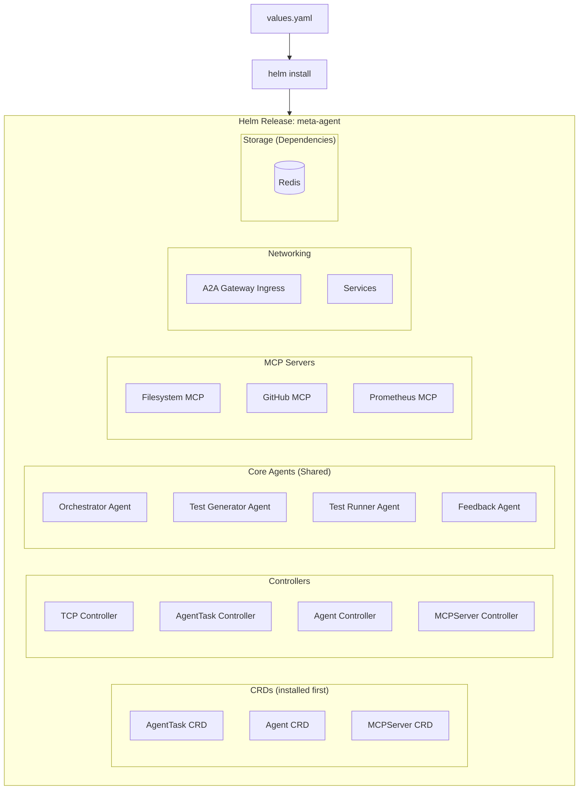

## Helm Charts

### Chart Structure

```
meta-agent/
├── Chart.yaml
├── values.yaml
├── templates/
│   ├── _helpers.tpl
│   ├── namespace.yaml
│   ├── crds/
│   │   ├── agenttask-crd.yaml
│   │   ├── agent-crd.yaml
│   │   └── mcpserver-crd.yaml
│   ├── controllers/
│   │   ├── tcp-controller-deployment.yaml
│   │   ├── agenttask-controller-deployment.yaml
│   │   ├── agent-controller-deployment.yaml
│   │   └── mcpserver-controller-deployment.yaml
│   ├── rbac/
│   │   ├── serviceaccount.yaml
│   │   ├── clusterrole.yaml
│   │   └── clusterrolebinding.yaml
│   ├── core-agents/
│   │   ├── orchestrator-agent.yaml
│   │   ├── test-generator-agent.yaml
│   │   ├── test-runner-agent.yaml
│   │   └── feedback-agent.yaml
│   ├── mcp-servers/
│   │   ├── filesystem-mcp.yaml
│   │   ├── github-mcp.yaml
│   │   └── prometheus-mcp.yaml
│   ├── networking/
│   │   ├── a2a-gateway-ingress.yaml
│   │   └── services.yaml
│   ├── storage/
│   │   └── redis-statefulset.yaml
│   └── configmaps/
│       └── agent-prompts-configmap.yaml
└── charts/
    └── redis/
```

### Chart.yaml

```yaml
apiVersion: v2
name: meta-agent
description: Autonomous meta-agent system with TCP feedback control
type: application
version: 0.1.0
appVersion: "1.0.0"

keywords:
  - ai
  - agents
  - kubernetes
  - a2a
  - mcp

maintainers:
  - name: CSM-101
    email: team@forgemaster.io

dependencies:
  - name: redis
    version: "18.x.x"
    repository: "https://charts.bitnami.com/bitnami"
    condition: redis.enabled
```

### values.yaml

```yaml
# Global settings
global:
  namespace: forgemaster-system
  imagePullPolicy: IfNotPresent

# TCP Controller Configuration
tcpController:
  enabled: true
  image:
    repository: forgemaster/tcp-controller
    tag: latest
  replicas: 1
  resources:
    limits:
      memory: "512Mi"
      cpu: "500m"
    requests:
      memory: "256Mi"
      cpu: "250m"
  
  # TCP coefficients
  coefficients:
    task: 1.0       # T weight
    context: 0.5    # C weight
    prediction: 0.3 # P weight
  
  errorThreshold: 0.2
  maxIterations: 10

# Core Agents Configuration
coreAgents:
  # Orchestrator Agent
  orchestrator:
    enabled: true
    image:
      repository: forgemaster/orchestrator-agent
      tag: latest
    replicas: 1
    model:
      provider: anthropic
      name: claude-sonnet-4-20250514
      temperature: 0.7
      maxTokens: 4096
    a2a:
      enabled: true
      port: 8080
    resources:
      limits:
        memory: "512Mi"
        cpu: "500m"

  # Test Generator Agent
  testGenerator:
    enabled: true
    image:
      repository: forgemaster/test-generator-agent
      tag: latest
    replicas: 1
    model:
      provider: anthropic
      name: claude-sonnet-4-20250514
      temperature: 0.5
      maxTokens: 4096
    testConfig:
      format: gherkin
      framework: behave
    a2a:
      enabled: true
      port: 8080
    resources:
      limits:
        memory: "512Mi"
        cpu: "500m"

  # Test Runner Agent
  testRunner:
    enabled: true
    image:
      repository: forgemaster/test-runner-agent
      tag: latest
    replicas: 1
    model:
      provider: anthropic
      name: claude-sonnet-4-20250514
      temperature: 0.3
      maxTokens: 2048
    testConfig:
      framework: behave
      timeout: 300s
    a2a:
      enabled: true
      port: 8080
    resources:
      limits:
        memory: "512Mi"
        cpu: "500m"

  # Feedback Agent
  feedback:
    enabled: true
    image:
      repository: forgemaster/feedback-agent
      tag: latest
    replicas: 1
    model:
      provider: anthropic
      name: claude-sonnet-4-20250514
      temperature: 0.5
      maxTokens: 2048
    metricsConfig:
      collectTokenUsage: true
      collectExecutionTime: true
      analyzePatterns: true
    a2a:
      enabled: true
      port: 8080
    resources:
      limits:
        memory: "256Mi"
        cpu: "250m"

# MCP Servers Configuration
mcpServers:
  filesystem:
    enabled: true
    image:
      repository: forgemaster/mcp-filesystem
      tag: latest
    resources:
      limits:
        memory: "256Mi"
        cpu: "250m"

  github:
    enabled: true
    image:
      repository: forgemaster/mcp-github
      tag: latest
    credentials:
      secretName: github-credentials
    resources:
      limits:
        memory: "256Mi"
        cpu: "250m"

  prometheus:
    enabled: true
    image:
      repository: forgemaster/mcp-prometheus
      tag: latest
    resources:
      limits:
        memory: "256Mi"
        cpu: "250m"

# A2A Gateway Configuration
a2aGateway:
  enabled: true
  ingress:
    enabled: true
    className: nginx
    host: agents.forgemaster.io
    tls:
      enabled: true
      secretName: a2a-tls-secret
  authentication:
    type: oauth2
    issuerUrl: "https://auth.forgemaster.io"

# Storage Configuration
storage:
  redis:
    enabled: true
    architecture: standalone
    auth:
      enabled: true
      existingSecret: redis-secret
    persistence:
      enabled: true
      size: 10Gi

# LLM Provider Configuration
llm:
  provider: anthropic
  apiKeySecret: anthropic-api-key
  defaultModel: claude-sonnet-4-20250514

# Observability
observability:
  enabled: true
  opentelemetry:
    enabled: true
    collectorEndpoint: "http://otel-collector:4317"
  metrics:
    enabled: true
    serviceMonitor: true

# Resource Quotas for Tasks
taskDefaults:
  resourceQuota:
    maxAgents: 5
    maxMemory: "4Gi"
    maxCPU: "4"
  timeout: 3600s
```

### Installation Commands

```bash
# Add Helm repository (if published)
helm repo add forgemaster https://charts.forgemaster.io
helm repo update

# Install with default values
helm install meta-agent forgemaster/meta-agent \
  --namespace forgemaster-system \
  --create-namespace

# Install with custom values
helm install meta-agent forgemaster/meta-agent \
  --namespace forgemaster-system \
  --create-namespace \
  -f custom-values.yaml

# Install from local chart
helm install meta-agent ./meta-agent \
  --namespace forgemaster-system \
  --create-namespace

# Set secrets during install
helm install meta-agent ./meta-agent \
  --namespace forgemaster-system \
  --create-namespace \
  --set llm.apiKeySecret=my-anthropic-secret \
  --set mcpServers.github.credentials.secretName=my-github-secret

# Upgrade existing installation
helm upgrade meta-agent ./meta-agent \
  --namespace forgemaster-system \
  -f custom-values.yaml

# Uninstall
helm uninstall meta-agent --namespace forgemaster-system
```

### Template Example: Core Agent

```yaml
# templates/core-agents/orchestrator-agent.yaml
{{- if .Values.coreAgents.orchestrator.enabled }}
apiVersion: forgemaster.io/v1alpha1
kind: Agent
metadata:
  name: orchestrator-agent
  namespace: {{ .Values.global.namespace }}
  labels:
    {{- include "meta-agent.labels" . | nindent 4 }}
    forgemaster.io/type: orchestrator
spec:
  type: orchestrator
  
  model:
    provider: {{ .Values.coreAgents.orchestrator.model.provider }}
    name: {{ .Values.coreAgents.orchestrator.model.name }}
    temperature: {{ .Values.coreAgents.orchestrator.model.temperature }}
    maxTokens: {{ .Values.coreAgents.orchestrator.model.maxTokens }}
    apiKeySecretRef:
      name: {{ .Values.llm.apiKeySecret }}
      key: api-key
      
  systemPrompt: |
    You are the Orchestrator Agent. Your responsibilities:
    1. Analyze incoming tasks from TCP Controller
    2. Determine which executor agents are needed
    3. Create/manage Agent and MCPServer CRDs
    4. Coordinate agent execution via A2A protocol
    5. Report results back to TCP Controller
    
  {{- if .Values.coreAgents.orchestrator.a2a.enabled }}
  a2a:
    enabled: true
    endpoint: "/a2a"
    port: {{ .Values.coreAgents.orchestrator.a2a.port }}
    agentCard:
      description: "Orchestrates task execution across multiple agents"
      skills:
        - name: orchestrate-task
          description: "Analyzes task and coordinates agent execution"
          inputModes: ["text"]
          outputModes: ["text"]
        - name: manage-agents
          description: "Creates and manages executor agents"
          inputModes: ["text"]
          outputModes: ["text"]
      capabilities:
        streaming: true
        pushNotifications: true
    authentication:
      type: {{ .Values.a2aGateway.authentication.type }}
  {{- end }}
  
  mcpServers:
    - name: filesystem-mcp
    
  resources:
    {{- toYaml .Values.coreAgents.orchestrator.resources | nindent 4 }}
{{- end }}
```

### Template Example: A2A Ingress

```yaml
# templates/networking/a2a-gateway-ingress.yaml
{{- if and .Values.a2aGateway.enabled .Values.a2aGateway.ingress.enabled }}
apiVersion: networking.k8s.io/v1
kind: Ingress
metadata:
  name: a2a-gateway
  namespace: {{ .Values.global.namespace }}
  labels:
    {{- include "meta-agent.labels" . | nindent 4 }}
  annotations:
    nginx.ingress.kubernetes.io/ssl-redirect: "true"
    nginx.ingress.kubernetes.io/proxy-body-size: "50m"
    nginx.ingress.kubernetes.io/proxy-read-timeout: "3600"
spec:
  ingressClassName: {{ .Values.a2aGateway.ingress.className }}
  {{- if .Values.a2aGateway.ingress.tls.enabled }}
  tls:
    - hosts:
        - {{ .Values.a2aGateway.ingress.host }}
      secretName: {{ .Values.a2aGateway.ingress.tls.secretName }}
  {{- end }}
  rules:
    - host: {{ .Values.a2aGateway.ingress.host }}
      http:
        paths:
          # Agent Card discovery endpoints
          {{- if .Values.coreAgents.orchestrator.enabled }}
          - path: /orchestrator/.well-known/agent.json
            pathType: Prefix
            backend:
              service:
                name: orchestrator-agent-a2a
                port:
                  number: {{ .Values.coreAgents.orchestrator.a2a.port }}
          - path: /orchestrator/
            pathType: Prefix
            backend:
              service:
                name: orchestrator-agent-a2a
                port:
                  number: {{ .Values.coreAgents.orchestrator.a2a.port }}
          {{- end }}
          
          {{- if .Values.coreAgents.testGenerator.enabled }}
          - path: /test-generator/.well-known/agent.json
            pathType: Prefix
            backend:
              service:
                name: test-generator-agent-a2a
                port:
                  number: {{ .Values.coreAgents.testGenerator.a2a.port }}
          - path: /test-generator/
            pathType: Prefix
            backend:
              service:
                name: test-generator-agent-a2a
                port:
                  number: {{ .Values.coreAgents.testGenerator.a2a.port }}
          {{- end }}
          
          {{- if .Values.coreAgents.testRunner.enabled }}
          - path: /test-runner/.well-known/agent.json
            pathType: Prefix
            backend:
              service:
                name: test-runner-agent-a2a
                port:
                  number: {{ .Values.coreAgents.testRunner.a2a.port }}
          - path: /test-runner/
            pathType: Prefix
            backend:
              service:
                name: test-runner-agent-a2a
                port:
                  number: {{ .Values.coreAgents.testRunner.a2a.port }}
          {{- end }}
          
          {{- if .Values.coreAgents.feedback.enabled }}
          - path: /feedback/.well-known/agent.json
            pathType: Prefix
            backend:
              service:
                name: feedback-agent-a2a
                port:
                  number: {{ .Values.coreAgents.feedback.a2a.port }}
          - path: /feedback/
            pathType: Prefix
            backend:
              service:
                name: feedback-agent-a2a
                port:
                  number: {{ .Values.coreAgents.feedback.a2a.port }}
          {{- end }}
{{- end }}
```

### Environment-Specific Values

```yaml
# values-dev.yaml
global:
  namespace: meta-agent-dev

tcpController:
  replicas: 1
  coefficients:
    task: 1.0
    context: 0.3
    prediction: 0.2

storage:
  redis:
    persistence:
      size: 1Gi

a2aGateway:
  ingress:
    host: agents.dev.forgemaster.io
```

```yaml
# values-prod.yaml
global:
  namespace: meta-agent-prod

tcpController:
  replicas: 3
  coefficients:
    task: 1.0
    context: 0.5
    prediction: 0.3
  resources:
    limits:
      memory: "1Gi"
      cpu: "1"

coreAgents:
  orchestrator:
    replicas: 2
  testGenerator:
    replicas: 2
  testRunner:
    replicas: 3
  feedback:
    replicas: 2

storage:
  redis:
    architecture: replication
    persistence:
      size: 50Gi

a2aGateway:
  ingress:
    host: agents.forgemaster.io
    tls:
      enabled: true

observability:
  enabled: true
  metrics:
    serviceMonitor: true
```

### Deployment Diagram with Helm


