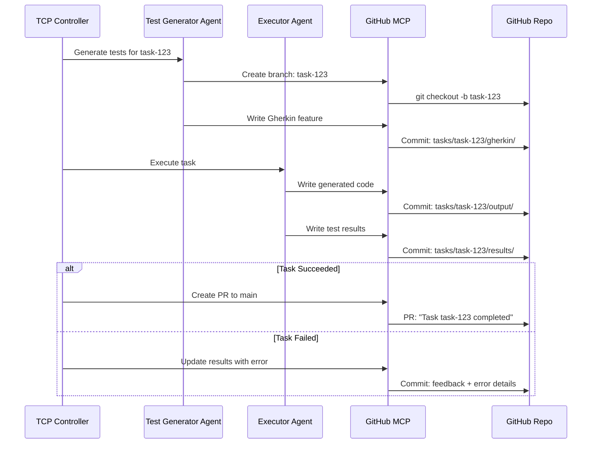

## Artifact Storage: GitHub

Artifacts (generated code, test results, Gherkin features) are stored in GitHub repositories via the GitHub MCP server.

### Why GitHub for Artifacts?

| Benefit | Description |
|---------|-------------|
| **Versioning** | Git history for all artifacts |
| **Collaboration** | PRs, reviews, issues |
| **CI/CD Integration** | GitHub Actions for testing |
| **Already in stack** | MCP GitHub server already used |
| **Free tier** | Generous limits for hackathon |

### Repository Structure

```
meta-agent-artifacts/
├── tasks/
│   └── {task-id}/
│       ├── metadata.json          # Task config, status
│       ├── gherkin/
│       │   └── features/
│       │       └── user-api.feature
│       ├── output/
│       │   ├── src/
│       │   │   └── api.rs
│       │   └── tests/
│       │       └── test_api.rs
│       ├── results/
│       │   ├── test-results.json
│       │   └── feedback.json
│       └── logs/
│           └── execution.log
│
├── agents/
│   └── {agent-type}/
│       ├── prompts/
│       │   └── system-prompt.md
│       └── configs/
│           └── default.yaml
│
└── templates/
    ├── gherkin/
    │   └── api-template.feature
    └── code/
        └── rust-api-template/
```

### Artifact Flow



### GitHub MCP Server Config

```yaml
apiVersion: metaagent.io/v1alpha1
kind: MCPServer
metadata:
  name: github-mcp
  namespace: meta-agent-system
spec:
  type: github
  image: metaagent/mcp-github:latest
  
  config:
    # Repository for artifacts
    artifactRepo:
      owner: "csm-101"
      name: "meta-agent-artifacts"
      defaultBranch: "main"
    
    # Capabilities
    capabilities:
      - repository_read
      - repository_write
      - pull_request
      - issues
      - actions
    
    # Branch strategy
    branching:
      taskBranchPrefix: "task/"
      autoCreateBranch: true
      autoCreatePR: true
      prTemplate: |
        ## Task Completed: {{task_id}}
        
        **Description:** {{description}}
        **Status:** {{status}}
        **Iterations:** {{iterations}}
        **Error Rate:** {{error_rate}}
        
        ### Test Results
        - Passed: {{tests_passed}}
        - Failed: {{tests_failed}}
        
        ### Generated Files
        {{#each files}}
        - `{{this.path}}`
        {{/each}}
  
  # Credentials
  credentialsSecret:
    name: github-credentials
    keys:
      token: GITHUB_TOKEN
```

### Helm Values Update

```yaml
# values.yaml (artifact storage section)
artifactStorage:
  type: github  # github, s3, minio
  
  github:
    enabled: true
    repository:
      owner: "csm-101"
      name: "meta-agent-artifacts"
    credentials:
      secretName: github-credentials
    branching:
      taskPrefix: "task/"
      autoCreatePR: true
    
  # Fallback to MinIO for local dev (no GitHub access)
  minio:
    enabled: false
```

### Benefits for Hackathon

1. **Demo-friendly** — Show PRs with generated code during presentation
2. **History** — All iterations visible in git log
3. **Collaboration** — Judges can review artifacts directly
4. **CI/CD** — Trigger GitHub Actions on PR to run additional validations
5. **Free** — No cloud storage costs
