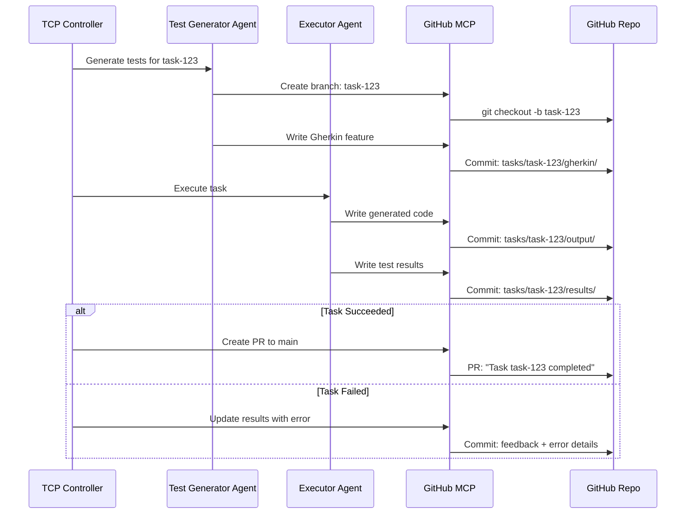

## Artifact Storage: GitHub

Artifacts (generated code, test results, Gherkin features) are stored in GitHub repositories via the GitHub MCP server.

### Why GitHub for Artifacts?

| Benefit | Description |
|---------|-------------|
| **Versioning** | Git history for all artifacts |
| **Collaboration** | PRs, reviews, issues |
| **CI/CD Integration** | GitHub Actions for testing |
| **Already in stack** | MCP GitHub server already used |
| **Free tier** | Generous limits for hackathon |

### Repository Structure

```
meta-agent-artifacts/
├── tasks/
│   └── {task-id}/
│       ├── metadata.json          # Task config, status
│       ├── gherkin/
│       │   └── features/
│       │       └── user-api.feature
│       ├── output/
│       │   ├── src/
│       │   │   └── api.rs
│       │   └── tests/
│       │       └── test_api.rs
│       ├── results/
│       │   ├── test-results.json
│       │   └── feedback.json
│       └── logs/
│           └── execution.log
│
├── agents/
│   └── {agent-type}/
│       ├── prompts/
│       │   └── system-prompt.md
│       └── configs/
│           └── default.yaml
│
└── templates/
    ├── gherkin/
    │   └── api-template.feature
    └── code/
        └── rust-api-template/
```

### Artifact Flow



### GitHub MCP Server Config

```yaml
apiVersion: metaagent.io/v1alpha1
kind: MCPServer
metadata:
  name: github-mcp
  namespace: meta-agent-system
spec:
  type: github
  image: metaagent/mcp-github:latest
  
  config:
    # Repository for artifacts
    artifactRepo:
      owner: "csm-101"
      name: "meta-agent-artifacts"
      defaultBranch: "main"
    
    # Capabilities
    capabilities:
      - repository_read
      - repository_write
      - pull_request
      - issues
      - actions
    
    # Branch strategy
    branching:
      taskBranchPrefix: "task/"
      autoCreateBranch: true
      autoCreatePR: true
      prTemplate: |
        ## Task Completed: {{task_id}}
        
        **Description:** {{description}}
        **Status:** {{status}}
        **Iterations:** {{iterations}}
        **Error Rate:** {{error_rate}}
        
        ### Test Results
        - Passed: {{tests_passed}}
        - Failed: {{tests_failed}}
        
        ### Generated Files
        {{#each files}}
        - `{{this.path}}`
        {{/each}}
  
  # Credentials
  credentialsSecret:
    name: github-credentials
    keys:
      token: GITHUB_TOKEN
```

### Rust GitHub Client (via MCP)

```rust
// crates/mcp-client/src/github.rs

use crate::McpClient;
use serde::{Deserialize, Serialize};

pub struct GitHubArtifacts {
    mcp: McpClient,
    repo_owner: String,
    repo_name: String,
}

#[derive(Debug, Clone, Serialize, Deserialize)]
pub struct ArtifactPath {
    pub task_id: String,
    pub category: ArtifactCategory,
    pub filename: String,
}

#[derive(Debug, Clone, Serialize, Deserialize)]
#[serde(rename_all = "lowercase")]
pub enum ArtifactCategory {
    Gherkin,
    Output,
    Results,
    Logs,
}

impl GitHubArtifacts {
    pub fn new(mcp: McpClient, owner: &str, repo: &str) -> Self {
        Self {
            mcp,
            repo_owner: owner.to_string(),
            repo_name: repo.to_string(),
        }
    }
    
    /// Create a new branch for task artifacts
    pub async fn create_task_branch(&self, task_id: &str) -> anyhow::Result<String> {
        let branch_name = format!("task/{}", task_id);
        
        self.mcp.call_tool(
            "github",
            "create_branch",
            serde_json::json!({
                "owner": self.repo_owner,
                "repo": self.repo_name,
                "branch": branch_name,
                "from": "main"
            })
        ).await?;
        
        Ok(branch_name)
    }
    
    /// Store an artifact
    pub async fn store_artifact(
        &self,
        task_id: &str,
        category: ArtifactCategory,
        filename: &str,
        content: &str,
        message: &str,
    ) -> anyhow::Result<String> {
        let branch = format!("task/{}", task_id);
        let path = format!(
            "tasks/{}/{}/{}",
            task_id,
            serde_json::to_string(&category)?.trim_matches('"'),
            filename
        );
        
        self.mcp.call_tool(
            "github",
            "create_or_update_file",
            serde_json::json!({
                "owner": self.repo_owner,
                "repo": self.repo_name,
                "branch": branch,
                "path": path,
                "content": content,
                "message": message
            })
        ).await?;
        
        Ok(path)
    }
    
    /// Store Gherkin feature file
    pub async fn store_gherkin(
        &self,
        task_id: &str,
        feature_name: &str,
        content: &str,
    ) -> anyhow::Result<String> {
        self.store_artifact(
            task_id,
            ArtifactCategory::Gherkin,
            &format!("features/{}.feature", feature_name),
            content,
            &format!("Add Gherkin feature: {}", feature_name),
        ).await
    }
    
    /// Store generated code
    pub async fn store_code(
        &self,
        task_id: &str,
        filename: &str,
        content: &str,
    ) -> anyhow::Result<String> {
        self.store_artifact(
            task_id,
            ArtifactCategory::Output,
            filename,
            content,
            &format!("Add generated code: {}", filename),
        ).await
    }
    
    /// Store test results
    pub async fn store_test_results(
        &self,
        task_id: &str,
        results: &TestResults,
    ) -> anyhow::Result<String> {
        let content = serde_json::to_string_pretty(results)?;
        
        self.store_artifact(
            task_id,
            ArtifactCategory::Results,
            "test-results.json",
            &content,
            &format!(
                "Test results: {}/{} passed",
                results.passed,
                results.total
            ),
        ).await
    }
    
    /// Retrieve an artifact
    pub async fn get_artifact(
        &self,
        task_id: &str,
        category: ArtifactCategory,
        filename: &str,
    ) -> anyhow::Result<String> {
        let branch = format!("task/{}", task_id);
        let path = format!(
            "tasks/{}/{}/{}",
            task_id,
            serde_json::to_string(&category)?.trim_matches('"'),
            filename
        );
        
        let result = self.mcp.call_tool(
            "github",
            "get_file_contents",
            serde_json::json!({
                "owner": self.repo_owner,
                "repo": self.repo_name,
                "branch": branch,
                "path": path
            })
        ).await?;
        
        Ok(result["content"].as_str().unwrap_or("").to_string())
    }
    
    /// Create PR for completed task
    pub async fn create_task_pr(
        &self,
        task_id: &str,
        title: &str,
        body: &str,
    ) -> anyhow::Result<u64> {
        let branch = format!("task/{}", task_id);
        
        let result = self.mcp.call_tool(
            "github",
            "create_pull_request",
            serde_json::json!({
                "owner": self.repo_owner,
                "repo": self.repo_name,
                "head": branch,
                "base": "main",
                "title": title,
                "body": body
            })
        ).await?;
        
        Ok(result["number"].as_u64().unwrap_or(0))
    }
    
    /// List artifacts for a task
    pub async fn list_task_artifacts(
        &self,
        task_id: &str,
    ) -> anyhow::Result<Vec<String>> {
        let branch = format!("task/{}", task_id);
        let path = format!("tasks/{}", task_id);
        
        let result = self.mcp.call_tool(
            "github",
            "list_files",
            serde_json::json!({
                "owner": self.repo_owner,
                "repo": self.repo_name,
                "branch": branch,
                "path": path,
                "recursive": true
            })
        ).await?;
        
        let files: Vec<String> = result["files"]
            .as_array()
            .map(|arr| {
                arr.iter()
                    .filter_map(|v| v["path"].as_str().map(String::from))
                    .collect()
            })
            .unwrap_or_default();
        
        Ok(files)
    }
}

#[derive(Debug, Clone, Serialize, Deserialize)]
pub struct TestResults {
    pub total: u32,
    pub passed: u32,
    pub failed: u32,
    pub skipped: u32,
    pub scenarios: Vec<ScenarioResult>,
}

#[derive(Debug, Clone, Serialize, Deserialize)]
pub struct ScenarioResult {
    pub name: String,
    pub status: String,
    pub duration_ms: u64,
    pub error: Option<String>,
}
```

### Helm Values Update

```yaml
# values.yaml (artifact storage section)
artifactStorage:
  type: github  # github, s3, minio
  
  github:
    enabled: true
    repository:
      owner: "csm-101"
      name: "meta-agent-artifacts"
    credentials:
      secretName: github-credentials
    branching:
      taskPrefix: "task/"
      autoCreatePR: true
    
  # Fallback to MinIO for local dev (no GitHub access)
  minio:
    enabled: false
```

### Benefits for Hackathon

1. **Demo-friendly** — Show PRs with generated code during presentation
2. **History** — All iterations visible in git log
3. **Collaboration** — Judges can review artifacts directly
4. **CI/CD** — Trigger GitHub Actions on PR to run additional validations
5. **Free** — No cloud storage costs
