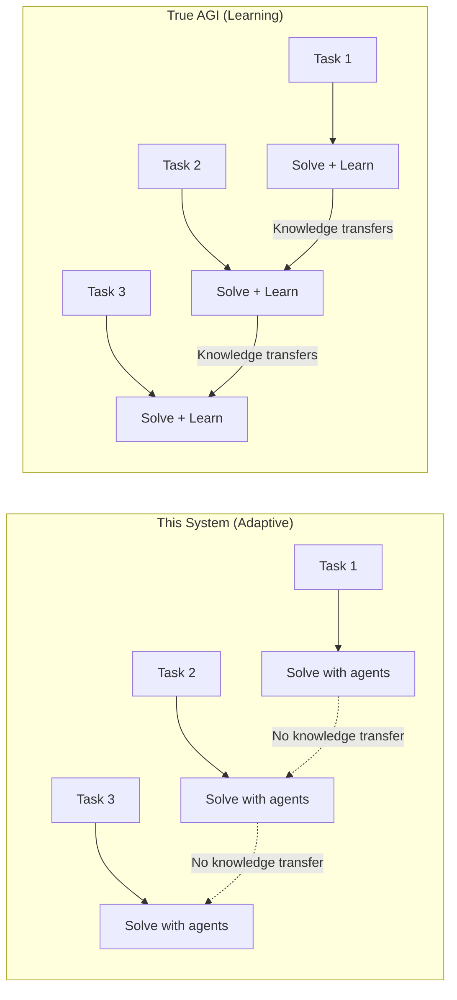
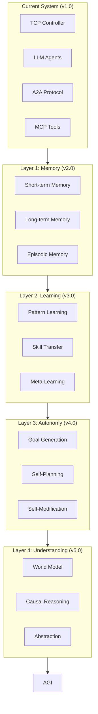
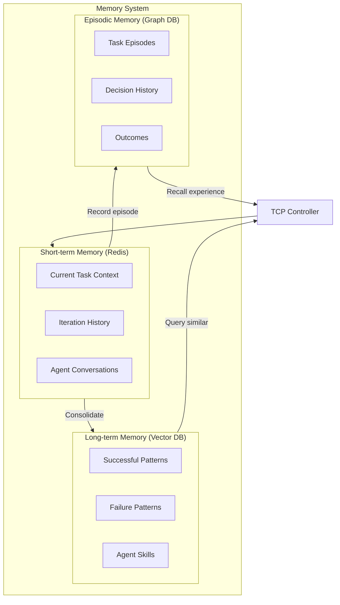
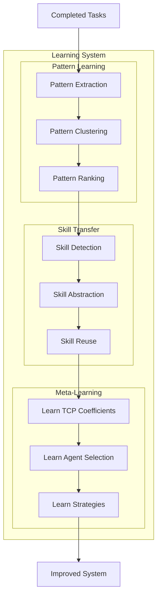
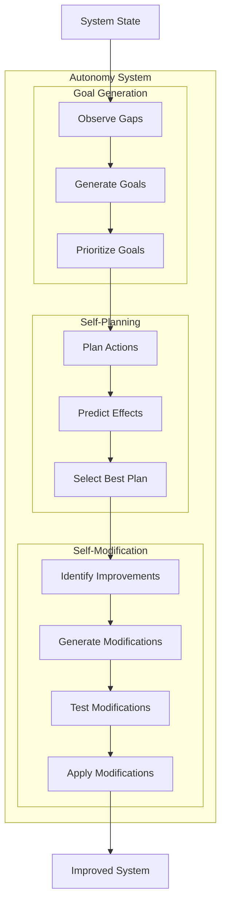
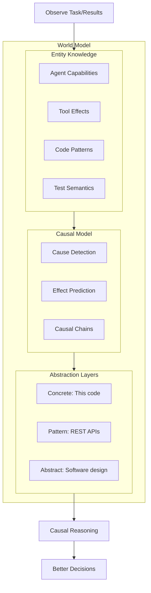

## Relation to Artificial General Intelligence (AGI)

### What is AGI?

**Artificial General Intelligence (AGI)** — a system that can perform any intellectual task a human can, with the ability to:
- Learn and adapt to new domains without retraining
- Transfer knowledge across different tasks
- Reason abstractly and solve novel problems
- Self-improve over time

### Is This System AGI?

**Short answer: No, but it has AGI-like properties.**

```
┌─────────────────────────────────────────────────────────────────────────┐
│                         AGI SPECTRUM                                     │
│                                                                          │
│   Narrow AI ◄─────────────────────────────────────────────────► AGI     │
│       │                           │                               │      │
│   Single task              Multi-task                    Any task       │
│   Fixed domain             Adaptive                      Universal      │
│   No transfer              Some transfer                 Full transfer  │
│                                                                          │
│                        ▲                                                 │
│                        │                                                 │
│                  This System                                             │
│              (Meta-Agent + TCP)                                          │
│                                                                          │
└─────────────────────────────────────────────────────────────────────────┘
```

### AGI Properties This System HAS ✅

| AGI Property | How This System Achieves It |
|--------------|----------------------------|
| **Task Generalization** | Can handle any task that can be expressed as "generate code that passes tests" |
| **Dynamic Agent Creation** | Orchestrator can spawn new specialist agents on demand |
| **Self-Evaluation** | Uses E2E tests (Gherkin) as objective success criteria |
| **Feedback Loop** | TCP Controller continuously optimizes based on results |
| **Tool Use** | Agents use MCP to access external tools (GitHub, filesystem, etc.) |
| **Collaboration** | Multiple agents work together via A2A protocol |
| **Learning from Context** | Agents use conversation history and previous attempts |

### AGI Properties This System LACKS ❌

| AGI Property | Current Limitation |
|--------------|-------------------|
| **True Learning** | Doesn't update model weights — relies on prompt context |
| **Long-term Memory** | Context window limited; no persistent learning |
| **Cross-domain Transfer** | Each task starts fresh; doesn't transfer skills |
| **Self-modification** | Cannot modify its own code or architecture |
| **Autonomous Goals** | Requires human to define tasks |
| **World Model** | No persistent understanding of the world |
| **Consciousness** | No subjective experience (obviously) |

### The Gap: Learning vs. Adaptation



**This system:** Adapts within a task (iterations), but doesn't learn across tasks.

**True AGI:** Would remember that "validation issues are common in REST APIs" and proactively add validation-specialist for similar future tasks.

### How Close Are We?

```
┌──────────────────────────────────────────────────────────────────────────┐
│                     PATH TOWARD AGI                                       │
│                                                                           │
│  ┌─────────┐    ┌─────────┐    ┌─────────┐    ┌─────────┐    ┌───────┐ │
│  │ Narrow  │ => │ Multi-  │ => │  Meta-  │ => │  Self-  │ => │  AGI  │ │
│  │   AI    │    │  Agent  │    │  Agent  │    │Improving│    │       │ │
│  └─────────┘    └─────────┘    └─────────┘    └─────────┘    └───────┘ │
│                                     ▲                                    │
│       ChatGPT        AutoGPT    This System      ???          ???       │
│       (2022)         (2023)       (2026)                                │
│                                                                          │
└──────────────────────────────────────────────────────────────────────────┘
```

### What Would Make This System More AGI-like?

| Enhancement | Description | Difficulty |
|-------------|-------------|------------|
| **Persistent Memory** | Store successful patterns across tasks | Medium |
| **Skill Library** | Save and reuse agent configurations | Medium |
| **Cross-task Learning** | Fine-tune agents based on performance | Hard |
| **Self-modification** | System modifies its own prompts/architecture | Very Hard |
| **Autonomous Goals** | System decides what tasks to work on | Research |
| **Continuous Learning** | Update models without human intervention | Research |

### Architectural Additions for AGI-like Behavior

```yaml
# Future: AGI-like enhancements
apiVersion: metaagent.io/v1alpha1
kind: AgentTask
spec:
  # Current: TCP Controller
  controller:
    type: tcp
    
  # Future: Learning extensions
  learning:
    # Remember successful patterns
    patternMemory:
      enabled: true
      storage: vectordb
      
    # Transfer knowledge between tasks
    skillTransfer:
      enabled: true
      similarityThreshold: 0.8
      
    # Self-improvement (experimental)
    selfImprovement:
      enabled: false  # Not yet implemented
      allowPromptModification: false
      allowArchitectureChange: false
```

### The Meta-Agent Advantage

This system is **closer to AGI** than typical AI because:

```
┌─────────────────────────────────────────────────────────────────────────┐
│                                                                          │
│   TYPICAL AI:  Human → defines solution → AI executes                   │
│                                                                          │
│   THIS SYSTEM: Human → defines problem → System finds solution          │
│                              │                                           │
│                              ▼                                           │
│                    ┌─────────────────┐                                  │
│                    │  Meta-Agent     │                                  │
│                    │  "Thinks about  │                                  │
│                    │   thinking"     │                                  │
│                    └────────┬────────┘                                  │
│                             │                                            │
│           ┌─────────────────┼─────────────────┐                         │
│           ▼                 ▼                 ▼                          │
│     Which agents?    What approach?    How to verify?                   │
│                                                                          │
└─────────────────────────────────────────────────────────────────────────┘
```

The system exhibits **meta-cognition** — it reasons about:
- Which agents to use (not hardcoded)
- How to verify success (generates its own tests)
- When to change strategy (feedback loop)

### Honest Assessment

| Claim | Reality |
|-------|---------|
| "This is AGI" | ❌ No — lacks true learning, transfer, autonomy |
| "This is a step toward AGI" | ✅ Yes — meta-reasoning, self-evaluation, dynamic adaptation |
| "This is useful" | ✅ Yes — solves real problems autonomously |
| "This could evolve toward AGI" | 🟡 Maybe — with persistent learning, skill transfer |

### Key Insight: The Missing Piece

```
┌─────────────────────────────────────────────────────────────────────────┐
│                                                                          │
│   Current:   Task → Solve → Forget                                      │
│                                                                          │
│   AGI:       Task → Solve → Remember → Apply to future → Get better     │
│                              ▲                                           │
│                              │                                           │
│                    THE MISSING PIECE:                                    │
│                    Persistent learning                                   │
│                    that survives across tasks                           │
│                                                                          │
└─────────────────────────────────────────────────────────────────────────┘
```

**This system is a "stateless AGI"** — it has general capabilities but no persistent learning. Each task is solved from scratch using the general capabilities of LLMs.

### Summary: AGI Positioning

```
┌─────────────────────────────────────────────────────────────────────────┐
│                                                                          │
│   This Meta-Agent System:                                               │
│                                                                          │
│   ✅ General-purpose (any task expressible as code + tests)             │
│   ✅ Adaptive (changes strategy based on feedback)                      │
│   ✅ Self-evaluating (generates and runs its own tests)                 │
│   ✅ Collaborative (multiple specialized agents)                        │
│   ✅ Tool-using (MCP integration)                                       │
│                                                                          │
│   ❌ Not learning (no weight updates)                                   │
│   ❌ Not transferring (each task is fresh)                              │
│   ❌ Not autonomous (needs human to start)                              │
│   ❌ Not self-modifying (architecture is fixed)                         │
│                                                                          │
│   VERDICT: "Proto-AGI" or "Narrow General Intelligence"                 │
│            — general within a domain, not truly universal               │
│                                                                          │
└─────────────────────────────────────────────────────────────────────────┘
```

This is a **stepping stone** — demonstrating that meta-reasoning, self-evaluation, and dynamic agent orchestration can create systems that are more general than traditional AI, while being honest that true AGI requires capabilities we don't yet have.

---

## Roadmap: Extending Toward AGI

This section describes concrete extensions to move the system closer to AGI capabilities.

### AGI Extension Layers



---

### Layer 1: Memory System (v2.0)

The first step toward AGI is **persistent memory** — remembering across tasks.

#### Memory Architecture



#### Memory CRDs

```yaml
apiVersion: metaagent.io/v1alpha1
kind: MemoryStore
metadata:
  name: meta-agent-memory
  namespace: meta-agent-system
spec:
  # Short-term memory (current context)
  shortTerm:
    backend: redis
    ttl: 24h
    maxSize: 100MB

  # Long-term memory (patterns, skills)
  longTerm:
    backend: qdrant  # Vector database
    embeddingModel: text-embedding-3-small
    dimensions: 1536
    indexing:
      metric: cosine

  # Episodic memory (experiences)
  episodic:
    backend: neo4j  # Graph database
    retention: 90d

  # Memory consolidation (STM → LTM)
  consolidation:
    enabled: true
    schedule: "0 * * * *"  # Hourly
    minSuccessRate: 0.8    # Only remember successful patterns
```

Memory-enhanced TCP Controller queries similar patterns and episodes before computing control signals, adjusting TCP coefficients based on historical success rates.

---

### Layer 2: Learning System (v3.0)

Beyond memory — the system should **learn and improve** over time.

#### Learning Architecture



#### Skill Library

```yaml
apiVersion: metaagent.io/v1alpha1
kind: SkillLibrary
metadata:
  name: learned-skills
  namespace: meta-agent-system
spec:
  skills:
    - name: rest-api-validation
      description: "Learned from 47 REST API tasks"
      learnedFrom:
        taskCount: 47
        successRate: 0.89
      pattern:
        agents:
          - code-generator
          - validation-specialist  # Learned: always add this!
        tcpCoefficients:
          task: 1.2      # Learned: be more aggressive
          context: 0.6
          prediction: 0.2
        commonFailures:
          - "Missing null checks"
          - "No input sanitization"
        preventiveActions:
          - "Always include validation-specialist agent"
          - "Run static analysis before tests"

    - name: async-rust-patterns
      description: "Learned from 23 async Rust tasks"
      learnedFrom:
        taskCount: 23
        successRate: 0.91
      pattern:
        agents:
          - code-generator
          - async-specialist
          - deadlock-detector
        specialPromptAdditions:
          - "Use tokio::select! for concurrent operations"
          - "Always handle cancellation"
```

Meta-learning extracts patterns from completed tasks, optimizes TCP coefficients per task type, and learns agent selection rules based on success rates.

---

### Layer 3: Autonomy (v4.0)

The system should be able to **set its own goals** and **improve itself**.

#### Autonomy Architecture



Goal generation analyzes skill gaps from failed tasks, performance bottlenecks, and recurring failure patterns to create prioritized improvement goals.

Self-modification operates under strict safety constraints:
- **Allowed**: TCP coefficients, agent prompts, agent selection, retry limits
- **Forbidden**: Core logic, safety constraints, memory/network access permissions
- Requires sandbox testing and optional human approval before applying changes

---

### Layer 4: World Model (v5.0)

True AGI needs a **model of the world** — understanding cause and effect.

#### World Model Architecture



#### Causal Reasoning

The causal model maintains a graph of cause-effect relationships learned from observations:

**Example causal relationships:**
- "Missing null check" --causes--> "NullPointerException in test"
- "Adding validation-agent" --prevents--> "Input validation failures"
- "High LLM temperature" --causes--> "Inconsistent code output"
- "Async code without timeout" --causes--> "Deadlock in test"

Key capabilities:
- **Explain failures**: Trace causal chain backward to find root causes
- **Predict effects**: Trace causal chain forward to estimate success probability
- **Learn from observations**: Extract and store new causal relationships

---

### AGI Extension Summary

```
┌─────────────────────────────────────────────────────────────────────────────┐
│                        ROADMAP TO AGI                                        │
├─────────────────────────────────────────────────────────────────────────────┤
│                                                                              │
│  CURRENT (v1.0)          Hackathon MVP                                      │
│  ─────────────────────────────────────────────────────────────              │
│  ✅ TCP Controller (PID)                                                    │
│  ✅ LLM Agents (Claude)                                                     │
│  ✅ A2A + A2UI + MCP                                                        │
│  ✅ Kubernetes Orchestration                                                │
│  ✅ Gherkin Test-Driven                                                     │
│                                                                              │
│  LAYER 1 (v2.0)          Memory                              +3 months      │
│  ─────────────────────────────────────────────────────────────              │
│  □ Short-term memory (Redis)                                                │
│  □ Long-term memory (Vector DB)                                             │
│  □ Episodic memory (Graph DB)                                               │
│  □ Memory-enhanced TCP Controller                                           │
│                                                                              │
│  LAYER 2 (v3.0)          Learning                            +6 months      │
│  ─────────────────────────────────────────────────────────────              │
│  □ Pattern extraction and clustering                                        │
│  □ Skill library (reusable agent configs)                                  │
│  □ Meta-learning (learn TCP coefficients)                                   │
│  □ Cross-task transfer                                                      │
│                                                                              │
│  LAYER 3 (v4.0)          Autonomy                            +12 months     │
│  ─────────────────────────────────────────────────────────────              │
│  □ Goal generation (identify improvement opportunities)                     │
│  □ Self-planning (create plans to achieve goals)                           │
│  □ Self-modification (with safety constraints)                             │
│  □ Human-in-the-loop approval for changes                                  │
│                                                                              │
│  LAYER 4 (v5.0)          Understanding                       +24 months     │
│  ─────────────────────────────────────────────────────────────              │
│  □ World model (entities, relationships)                                    │
│  □ Causal reasoning (why did X happen?)                                    │
│  □ Abstraction (concrete → pattern → abstract)                             │
│  □ Counterfactual reasoning (what if?)                                     │
│                                                                              │
│  ═══════════════════════════════════════════════════════════════════════   │
│                                                                              │
│  TRUE AGI                 Research Frontier                  +??? years     │
│  ─────────────────────────────────────────────────────────────              │
│  □ Continuous learning (update weights)                                     │
│  □ Universal transfer (any domain)                                          │
│  □ Autonomous goals (self-directed)                                         │
│  □ Full self-modification                                                   │
│  □ Consciousness (???)                                                      │
│                                                                              │
└─────────────────────────────────────────────────────────────────────────────┘
```

### Key Insight: AGI as Emergent Property

```
┌─────────────────────────────────────────────────────────────────────────────┐
│                                                                              │
│   AGI is not a single feature to implement.                                 │
│                                                                              │
│   AGI is an EMERGENT PROPERTY that arises when:                            │
│                                                                              │
│   Memory          +  Learning       +  Autonomy      +  Understanding      │
│   (Remember)         (Improve)         (Self-direct)    (Reason)           │
│                                                                              │
│   ...are combined with sufficient scale and integration.                    │
│                                                                              │
│   This system provides the ARCHITECTURE for these components               │
│   to be added incrementally.                                                │
│                                                                              │
└─────────────────────────────────────────────────────────────────────────────┘
```

### Why This Architecture Enables AGI Extension

| Current Component | AGI Extension |
|-------------------|---------------|
| **TCP Controller** | Add memory → remembers what worked |
| **Agent Registry** | Add skill library → reuse learned skills |
| **Feedback Loop** | Add learning → improve from each task |
| **A2A Protocol** | Add goal agents → autonomous planning |
| **Test-Driven** | Add causal model → understand WHY tests fail |

The architecture is **AGI-ready** — each component can be extended toward AGI without rebuilding the system.

---

## Near-term Future Considerations

- [ ] Multi-task parallelism
- [ ] Agent marketplace / registry
- [ ] Learning from successful runs (fine-tuning)
- [ ] Cost optimization (cheap agents first, expensive as fallback)
- [ ] Human-in-the-loop for low-confidence decisions

---
