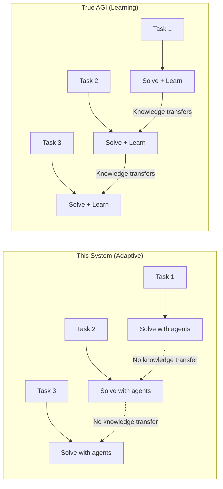
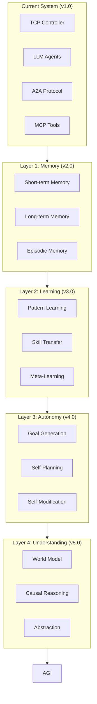
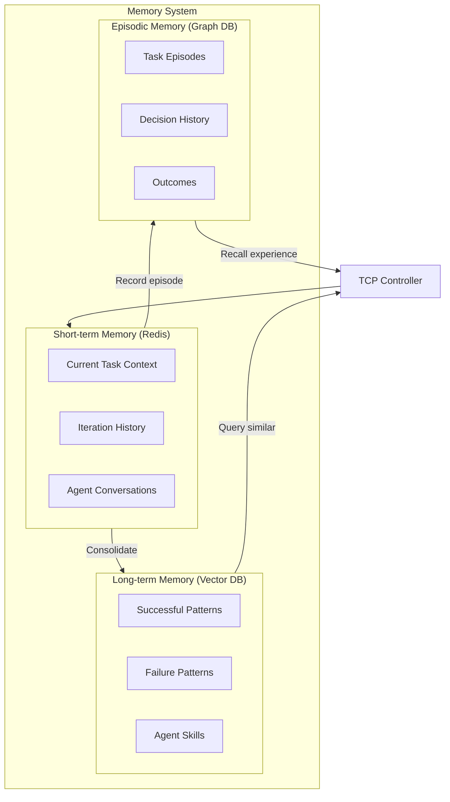
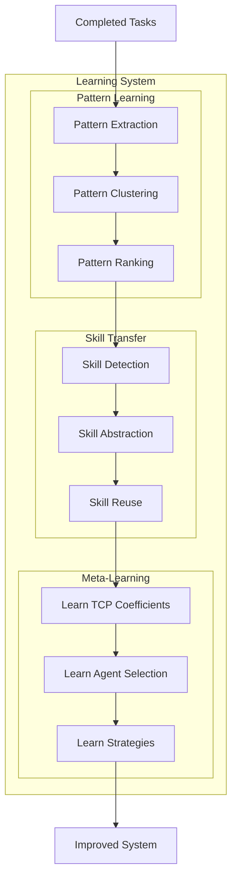
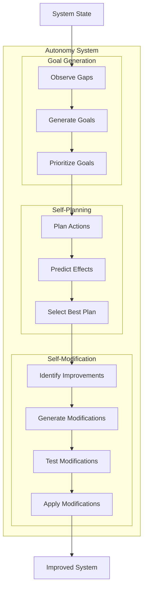
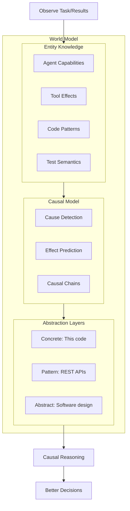

## Relation to Artificial General Intelligence (AGI)

### What is AGI?

**Artificial General Intelligence (AGI)** — a system that can perform any intellectual task a human can, with the ability to:
- Learn and adapt to new domains without retraining
- Transfer knowledge across different tasks
- Reason abstractly and solve novel problems
- Self-improve over time

### Is This System AGI?

**Short answer: No, but it has AGI-like properties.**

```
┌─────────────────────────────────────────────────────────────────────────┐
│                         AGI SPECTRUM                                     │
│                                                                          │
│   Narrow AI ◄─────────────────────────────────────────────────► AGI     │
│       │                           │                               │      │
│   Single task              Multi-task                    Any task       │
│   Fixed domain             Adaptive                      Universal      │
│   No transfer              Some transfer                 Full transfer  │
│                                                                          │
│                        ▲                                                 │
│                        │                                                 │
│                  This System                                             │
│              (Meta-Agent + TCP)                                          │
│                                                                          │
└─────────────────────────────────────────────────────────────────────────┘
```

### AGI Properties This System HAS ✅

| AGI Property | How This System Achieves It |
|--------------|----------------------------|
| **Task Generalization** | Can handle any task that can be expressed as "generate code that passes tests" |
| **Dynamic Agent Creation** | Orchestrator can spawn new specialist agents on demand |
| **Self-Evaluation** | Uses E2E tests (Gherkin) as objective success criteria |
| **Feedback Loop** | TCP Controller continuously optimizes based on results |
| **Tool Use** | Agents use MCP to access external tools (GitHub, filesystem, etc.) |
| **Collaboration** | Multiple agents work together via A2A protocol |
| **Learning from Context** | Agents use conversation history and previous attempts |

### AGI Properties This System LACKS ❌

| AGI Property | Current Limitation |
|--------------|-------------------|
| **True Learning** | Doesn't update model weights — relies on prompt context |
| **Long-term Memory** | Context window limited; no persistent learning |
| **Cross-domain Transfer** | Each task starts fresh; doesn't transfer skills |
| **Self-modification** | Cannot modify its own code or architecture |
| **Autonomous Goals** | Requires human to define tasks |
| **World Model** | No persistent understanding of the world |
| **Consciousness** | No subjective experience (obviously) |

### The Gap: Learning vs. Adaptation



**This system:** Adapts within a task (iterations), but doesn't learn across tasks.

**True AGI:** Would remember that "validation issues are common in REST APIs" and proactively add validation-specialist for similar future tasks.

### How Close Are We?

```
┌──────────────────────────────────────────────────────────────────────────┐
│                     PATH TOWARD AGI                                       │
│                                                                           │
│  ┌─────────┐    ┌─────────┐    ┌─────────┐    ┌─────────┐    ┌───────┐ │
│  │ Narrow  │ => │ Multi-  │ => │  Meta-  │ => │  Self-  │ => │  AGI  │ │
│  │   AI    │    │  Agent  │    │  Agent  │    │Improving│    │       │ │
│  └─────────┘    └─────────┘    └─────────┘    └─────────┘    └───────┘ │
│                                     ▲                                    │
│       ChatGPT        AutoGPT    This System      ???          ???       │
│       (2022)         (2023)       (2026)                                │
│                                                                          │
└──────────────────────────────────────────────────────────────────────────┘
```

### What Would Make This System More AGI-like?

| Enhancement | Description | Difficulty |
|-------------|-------------|------------|
| **Persistent Memory** | Store successful patterns across tasks | Medium |
| **Skill Library** | Save and reuse agent configurations | Medium |
| **Cross-task Learning** | Fine-tune agents based on performance | Hard |
| **Self-modification** | System modifies its own prompts/architecture | Very Hard |
| **Autonomous Goals** | System decides what tasks to work on | Research |
| **Continuous Learning** | Update models without human intervention | Research |

### Architectural Additions for AGI-like Behavior

```yaml
# Future: AGI-like enhancements
apiVersion: metaagent.io/v1alpha1
kind: AgentTask
spec:
  # Current: TCP Controller
  controller:
    type: tcp
    
  # Future: Learning extensions
  learning:
    # Remember successful patterns
    patternMemory:
      enabled: true
      storage: vectordb
      
    # Transfer knowledge between tasks
    skillTransfer:
      enabled: true
      similarityThreshold: 0.8
      
    # Self-improvement (experimental)
    selfImprovement:
      enabled: false  # Not yet implemented
      allowPromptModification: false
      allowArchitectureChange: false
```

### The Meta-Agent Advantage

This system is **closer to AGI** than typical AI because:

```
┌─────────────────────────────────────────────────────────────────────────┐
│                                                                          │
│   TYPICAL AI:  Human → defines solution → AI executes                   │
│                                                                          │
│   THIS SYSTEM: Human → defines problem → System finds solution          │
│                              │                                           │
│                              ▼                                           │
│                    ┌─────────────────┐                                  │
│                    │  Meta-Agent     │                                  │
│                    │  "Thinks about  │                                  │
│                    │   thinking"     │                                  │
│                    └────────┬────────┘                                  │
│                             │                                            │
│           ┌─────────────────┼─────────────────┐                         │
│           ▼                 ▼                 ▼                          │
│     Which agents?    What approach?    How to verify?                   │
│                                                                          │
└─────────────────────────────────────────────────────────────────────────┘
```

The system exhibits **meta-cognition** — it reasons about:
- Which agents to use (not hardcoded)
- How to verify success (generates its own tests)
- When to change strategy (feedback loop)

### Honest Assessment

| Claim | Reality |
|-------|---------|
| "This is AGI" | ❌ No — lacks true learning, transfer, autonomy |
| "This is a step toward AGI" | ✅ Yes — meta-reasoning, self-evaluation, dynamic adaptation |
| "This is useful" | ✅ Yes — solves real problems autonomously |
| "This could evolve toward AGI" | 🟡 Maybe — with persistent learning, skill transfer |

### Key Insight: The Missing Piece

```
┌─────────────────────────────────────────────────────────────────────────┐
│                                                                          │
│   Current:   Task → Solve → Forget                                      │
│                                                                          │
│   AGI:       Task → Solve → Remember → Apply to future → Get better     │
│                              ▲                                           │
│                              │                                           │
│                    THE MISSING PIECE:                                    │
│                    Persistent learning                                   │
│                    that survives across tasks                           │
│                                                                          │
└─────────────────────────────────────────────────────────────────────────┘
```

**This system is a "stateless AGI"** — it has general capabilities but no persistent learning. Each task is solved from scratch using the general capabilities of LLMs.

### Summary: AGI Positioning

```
┌─────────────────────────────────────────────────────────────────────────┐
│                                                                          │
│   This Meta-Agent System:                                               │
│                                                                          │
│   ✅ General-purpose (any task expressible as code + tests)             │
│   ✅ Adaptive (changes strategy based on feedback)                      │
│   ✅ Self-evaluating (generates and runs its own tests)                 │
│   ✅ Collaborative (multiple specialized agents)                        │
│   ✅ Tool-using (MCP integration)                                       │
│                                                                          │
│   ❌ Not learning (no weight updates)                                   │
│   ❌ Not transferring (each task is fresh)                              │
│   ❌ Not autonomous (needs human to start)                              │
│   ❌ Not self-modifying (architecture is fixed)                         │
│                                                                          │
│   VERDICT: "Proto-AGI" or "Narrow General Intelligence"                 │
│            — general within a domain, not truly universal               │
│                                                                          │
└─────────────────────────────────────────────────────────────────────────┘
```

This is a **stepping stone** — demonstrating that meta-reasoning, self-evaluation, and dynamic agent orchestration can create systems that are more general than traditional AI, while being honest that true AGI requires capabilities we don't yet have.

---

## Roadmap: Extending Toward AGI

This section describes concrete extensions to move the system closer to AGI capabilities.

### AGI Extension Layers



---

### Layer 1: Memory System (v2.0)

The first step toward AGI is **persistent memory** — remembering across tasks.

#### Memory Architecture



#### Memory CRDs

```yaml
apiVersion: metaagent.io/v1alpha1
kind: MemoryStore
metadata:
  name: meta-agent-memory
  namespace: meta-agent-system
spec:
  # Short-term memory (current context)
  shortTerm:
    backend: redis
    ttl: 24h
    maxSize: 100MB
    
  # Long-term memory (patterns, skills)
  longTerm:
    backend: qdrant  # Vector database
    embeddingModel: text-embedding-3-small
    dimensions: 1536
    indexing:
      metric: cosine
      
  # Episodic memory (experiences)
  episodic:
    backend: neo4j  # Graph database
    retention: 90d
    
  # Memory consolidation (STM → LTM)
  consolidation:
    enabled: true
    schedule: "0 * * * *"  # Hourly
    minSuccessRate: 0.8    # Only remember successful patterns
```

#### Rust Memory Implementation

```rust
// crates/memory/src/lib.rs

use async_trait::async_trait;
use serde::{Deserialize, Serialize};

/// Memory entry for pattern storage
#[derive(Debug, Clone, Serialize, Deserialize)]
pub struct MemoryEntry {
    pub id: String,
    pub task_type: String,
    pub pattern: Pattern,
    pub outcome: Outcome,
    pub embedding: Vec<f32>,
    pub created_at: chrono::DateTime<chrono::Utc>,
    pub access_count: u32,
    pub success_rate: f32,
}

#[derive(Debug, Clone, Serialize, Deserialize)]
pub struct Pattern {
    pub description: String,
    pub agents_used: Vec<String>,
    pub strategy: String,
    pub tcp_coefficients: TCPCoefficients,
    pub iterations_needed: u32,
}

#[derive(Debug, Clone, Serialize, Deserialize)]
pub struct Outcome {
    pub success: bool,
    pub final_error: f32,
    pub tests_passed: u32,
    pub tests_total: u32,
    pub duration_secs: u64,
}

/// Episodic memory entry
#[derive(Debug, Clone, Serialize, Deserialize)]
pub struct Episode {
    pub id: String,
    pub task_id: String,
    pub timestamp: chrono::DateTime<chrono::Utc>,
    pub decision: ControlDecision,
    pub context: EpisodeContext,
    pub result: EpisodeResult,
    pub lessons: Vec<String>,
}

#[derive(Debug, Clone, Serialize, Deserialize)]
pub struct EpisodeContext {
    pub error_rate: f32,
    pub iteration: u32,
    pub agents_active: Vec<String>,
    pub recent_failures: Vec<String>,
}

#[derive(Debug, Clone, Serialize, Deserialize)]
pub struct EpisodeResult {
    pub decision_correct: bool,
    pub error_after: f32,
    pub improvement: f32,
}

#[async_trait]
pub trait MemoryStore: Send + Sync {
    /// Store a successful pattern
    async fn store_pattern(&self, entry: MemoryEntry) -> anyhow::Result<()>;
    
    /// Find similar patterns for a task
    async fn find_similar_patterns(
        &self,
        task_description: &str,
        limit: usize,
    ) -> anyhow::Result<Vec<MemoryEntry>>;
    
    /// Record an episode
    async fn record_episode(&self, episode: Episode) -> anyhow::Result<()>;
    
    /// Recall relevant episodes
    async fn recall_episodes(
        &self,
        context: &EpisodeContext,
        limit: usize,
    ) -> anyhow::Result<Vec<Episode>>;
    
    /// Update pattern success rate
    async fn update_pattern_outcome(
        &self,
        pattern_id: &str,
        success: bool,
    ) -> anyhow::Result<()>;
}

/// Memory-enhanced TCP Controller
pub struct MemoryEnhancedController {
    tcp: TCPController,
    memory: Arc<dyn MemoryStore>,
}

impl MemoryEnhancedController {
    pub async fn compute_control_signal(
        &mut self,
        error: &ErrorSignal,
        task: &Task,
    ) -> anyhow::Result<ControlSignal> {
        // 1. Query memory for similar past experiences
        let similar_patterns = self.memory
            .find_similar_patterns(&task.description, 5)
            .await?;
        
        // 2. Recall relevant episodes
        let context = EpisodeContext {
            error_rate: error.value,
            iteration: error.iteration,
            agents_active: task.agents.clone(),
            recent_failures: task.recent_failures.clone(),
        };
        let episodes = self.memory.recall_episodes(&context, 10).await?;
        
        // 3. Adjust TCP coefficients based on memory
        let adjusted_coefficients = self.adjust_from_memory(
            &similar_patterns,
            &episodes,
        );
        
        // 4. Compute signal with memory-informed coefficients
        let signal = self.tcp
            .with_coefficients(adjusted_coefficients)
            .compute(error);
        
        // 5. Record this decision as an episode
        self.memory.record_episode(Episode {
            id: uuid::Uuid::new_v4().to_string(),
            task_id: task.id.clone(),
            timestamp: chrono::Utc::now(),
            decision: signal.action.clone(),
            context,
            result: EpisodeResult::pending(), // Updated later
            lessons: vec![],
        }).await?;
        
        Ok(signal)
    }
    
    fn adjust_from_memory(
        &self,
        patterns: &[MemoryEntry],
        episodes: &[Episode],
    ) -> TCPCoefficients {
        // Learn from successful patterns
        if let Some(best) = patterns.iter()
            .filter(|p| p.success_rate > 0.8)
            .max_by(|a, b| a.success_rate.partial_cmp(&b.success_rate).unwrap())
        {
            return best.pattern.tcp_coefficients.clone();
        }
        
        // Learn from episodes - what decisions worked?
        let successful_episodes: Vec<_> = episodes.iter()
            .filter(|e| e.result.decision_correct)
            .collect();
        
        if successful_episodes.len() > 3 {
            // Average the coefficients from successful episodes
            // ... implementation
        }
        
        // Default coefficients
        TCPCoefficients::default()
    }
}
```

---

### Layer 2: Learning System (v3.0)

Beyond memory — the system should **learn and improve** over time.

#### Learning Architecture



#### Skill Library

```yaml
apiVersion: metaagent.io/v1alpha1
kind: SkillLibrary
metadata:
  name: learned-skills
  namespace: meta-agent-system
spec:
  skills:
    - name: rest-api-validation
      description: "Learned from 47 REST API tasks"
      learnedFrom:
        taskCount: 47
        successRate: 0.89
      pattern:
        agents:
          - code-generator
          - validation-specialist  # Learned: always add this!
        tcpCoefficients:
          task: 1.2      # Learned: be more aggressive
          context: 0.6
          prediction: 0.2
        commonFailures:
          - "Missing null checks"
          - "No input sanitization"
        preventiveActions:
          - "Always include validation-specialist agent"
          - "Run static analysis before tests"
          
    - name: async-rust-patterns
      description: "Learned from 23 async Rust tasks"
      learnedFrom:
        taskCount: 23
        successRate: 0.91
      pattern:
        agents:
          - code-generator
          - async-specialist
          - deadlock-detector
        specialPromptAdditions:
          - "Use tokio::select! for concurrent operations"
          - "Always handle cancellation"
```

#### Meta-Learning: Learn to Learn

```rust
// crates/meta-learning/src/lib.rs

/// Meta-learner that improves the system itself
pub struct MetaLearner {
    memory: Arc<dyn MemoryStore>,
    skill_library: Arc<SkillLibrary>,
}

impl MetaLearner {
    /// Analyze completed tasks and extract learnings
    pub async fn learn_from_tasks(
        &self,
        tasks: Vec<CompletedTask>,
    ) -> anyhow::Result<Learnings> {
        let mut learnings = Learnings::default();
        
        // 1. Pattern extraction
        let patterns = self.extract_patterns(&tasks)?;
        learnings.new_patterns = patterns;
        
        // 2. Skill abstraction
        let skills = self.abstract_skills(&tasks)?;
        learnings.new_skills = skills;
        
        // 3. TCP coefficient optimization
        let better_coefficients = self.optimize_tcp_coefficients(&tasks)?;
        learnings.tcp_improvements = better_coefficients;
        
        // 4. Agent selection rules
        let agent_rules = self.learn_agent_selection(&tasks)?;
        learnings.agent_selection_rules = agent_rules;
        
        Ok(learnings)
    }
    
    /// Learn optimal TCP coefficients from task history
    fn optimize_tcp_coefficients(
        &self,
        tasks: &[CompletedTask],
    ) -> anyhow::Result<HashMap<String, TCPCoefficients>> {
        let mut optimized = HashMap::new();
        
        // Group tasks by type
        let by_type = group_by_task_type(tasks);
        
        for (task_type, type_tasks) in by_type {
            // Find coefficients that led to fastest convergence
            let successful = type_tasks.iter()
                .filter(|t| t.success && t.iterations < 5)
                .collect::<Vec<_>>();
            
            if successful.len() >= 10 {
                // Enough data to learn
                let avg_coefficients = average_coefficients(
                    successful.iter().map(|t| &t.tcp_coefficients)
                );
                optimized.insert(task_type, avg_coefficients);
            }
        }
        
        Ok(optimized)
    }
    
    /// Learn which agents to select for which task types
    fn learn_agent_selection(
        &self,
        tasks: &[CompletedTask],
    ) -> anyhow::Result<Vec<AgentSelectionRule>> {
        let mut rules = Vec::new();
        
        // Analyze successful tasks
        for task in tasks.iter().filter(|t| t.success) {
            // Extract features
            let features = extract_task_features(&task.description);
            
            // What agents were used?
            let agents = &task.agents_used;
            
            // Create rule
            rules.push(AgentSelectionRule {
                condition: features,
                recommended_agents: agents.clone(),
                confidence: task.success_rate,
            });
        }
        
        // Consolidate similar rules
        consolidate_rules(&mut rules);
        
        Ok(rules)
    }
}

#[derive(Debug, Clone)]
pub struct AgentSelectionRule {
    pub condition: TaskFeatures,
    pub recommended_agents: Vec<String>,
    pub confidence: f32,
}

#[derive(Debug, Clone)]
pub struct TaskFeatures {
    pub keywords: Vec<String>,
    pub domain: String,
    pub complexity: Complexity,
    pub requires_validation: bool,
    pub requires_async: bool,
    pub requires_database: bool,
}
```

---

### Layer 3: Autonomy (v4.0)

The system should be able to **set its own goals** and **improve itself**.

#### Autonomy Architecture



#### Goal Generation

```rust
// crates/autonomy/src/goals.rs

/// Autonomous goal generator
pub struct GoalGenerator {
    memory: Arc<dyn MemoryStore>,
    skill_library: Arc<SkillLibrary>,
}

impl GoalGenerator {
    /// Observe system state and generate improvement goals
    pub async fn generate_goals(&self) -> anyhow::Result<Vec<Goal>> {
        let mut goals = Vec::new();
        
        // 1. Identify skill gaps
        let skill_gaps = self.identify_skill_gaps().await?;
        for gap in skill_gaps {
            goals.push(Goal {
                id: uuid::Uuid::new_v4().to_string(),
                goal_type: GoalType::SkillAcquisition,
                description: format!("Learn skill: {}", gap.skill_name),
                priority: gap.impact_score,
                plan: self.plan_skill_acquisition(&gap)?,
            });
        }
        
        // 2. Identify performance bottlenecks
        let bottlenecks = self.identify_bottlenecks().await?;
        for bottleneck in bottlenecks {
            goals.push(Goal {
                id: uuid::Uuid::new_v4().to_string(),
                goal_type: GoalType::PerformanceImprovement,
                description: format!("Improve: {}", bottleneck.area),
                priority: bottleneck.severity,
                plan: self.plan_improvement(&bottleneck)?,
            });
        }
        
        // 3. Identify failure patterns to fix
        let failure_patterns = self.identify_failure_patterns().await?;
        for pattern in failure_patterns {
            goals.push(Goal {
                id: uuid::Uuid::new_v4().to_string(),
                goal_type: GoalType::FailurePrevention,
                description: format!("Prevent failure: {}", pattern.description),
                priority: pattern.frequency * pattern.severity,
                plan: self.plan_prevention(&pattern)?,
            });
        }
        
        // Sort by priority
        goals.sort_by(|a, b| b.priority.partial_cmp(&a.priority).unwrap());
        
        Ok(goals)
    }
    
    async fn identify_skill_gaps(&self) -> anyhow::Result<Vec<SkillGap>> {
        // Analyze failed tasks to find missing skills
        let failed_tasks = self.memory.get_failed_tasks(100).await?;
        
        let mut gaps = HashMap::new();
        
        for task in failed_tasks {
            // What skill would have helped?
            let missing_skills = analyze_missing_skills(&task);
            
            for skill in missing_skills {
                let entry = gaps.entry(skill.clone()).or_insert(SkillGap {
                    skill_name: skill,
                    occurrence_count: 0,
                    impact_score: 0.0,
                });
                entry.occurrence_count += 1;
                entry.impact_score += task.importance;
            }
        }
        
        Ok(gaps.into_values().collect())
    }
}

#[derive(Debug, Clone)]
pub struct Goal {
    pub id: String,
    pub goal_type: GoalType,
    pub description: String,
    pub priority: f32,
    pub plan: Plan,
}

#[derive(Debug, Clone)]
pub enum GoalType {
    SkillAcquisition,
    PerformanceImprovement,
    FailurePrevention,
    SelfImprovement,
}

#[derive(Debug, Clone)]
pub struct Plan {
    pub steps: Vec<PlanStep>,
    pub expected_outcome: String,
    pub success_criteria: Vec<String>,
}
```

#### Self-Modification (Careful!)

```rust
// crates/autonomy/src/self_modification.rs

/// Self-modification with safety constraints
pub struct SelfModifier {
    config: SelfModificationConfig,
    sandbox: Sandbox,
}

#[derive(Debug, Clone)]
pub struct SelfModificationConfig {
    /// What CAN be modified
    pub allowed_modifications: Vec<ModificationType>,
    /// What CANNOT be modified (safety)
    pub forbidden_modifications: Vec<ModificationType>,
    /// Require human approval for changes
    pub require_human_approval: bool,
    /// Test modifications before applying
    pub require_testing: bool,
    /// Maximum change magnitude
    pub max_change_magnitude: f32,
}

#[derive(Debug, Clone, PartialEq)]
pub enum ModificationType {
    // ALLOWED (relatively safe)
    TcpCoefficients,        // Tune control parameters
    AgentPrompts,           // Modify agent instructions
    AgentSelection,         // Which agents to use
    RetryLimits,           // How many retries
    
    // FORBIDDEN (dangerous)
    CoreLogic,             // Main controller code
    SafetyConstraints,     // Safety rules
    MemoryAccess,          // Memory permissions
    NetworkAccess,         // Network permissions
}

impl SelfModifier {
    /// Propose a modification (doesn't apply it yet)
    pub async fn propose_modification(
        &self,
        goal: &Goal,
    ) -> anyhow::Result<ProposedModification> {
        // 1. Analyze what change would achieve the goal
        let modification = self.analyze_needed_change(goal)?;
        
        // 2. Check if modification is allowed
        if self.config.forbidden_modifications.contains(&modification.mod_type) {
            anyhow::bail!(
                "Modification type {:?} is forbidden for safety", 
                modification.mod_type
            );
        }
        
        // 3. Check magnitude
        if modification.magnitude > self.config.max_change_magnitude {
            anyhow::bail!(
                "Modification magnitude {} exceeds limit {}", 
                modification.magnitude,
                self.config.max_change_magnitude
            );
        }
        
        Ok(modification)
    }
    
    /// Test a modification in sandbox
    pub async fn test_modification(
        &self,
        modification: &ProposedModification,
    ) -> anyhow::Result<TestResult> {
        // Run modification in isolated sandbox
        let sandbox_result = self.sandbox.test(modification).await?;
        
        // Evaluate against success criteria
        let evaluation = self.evaluate_result(&sandbox_result, &modification.goal)?;
        
        Ok(TestResult {
            success: evaluation.meets_criteria,
            improvements: evaluation.improvements,
            regressions: evaluation.regressions,
            safe_to_apply: evaluation.no_safety_issues,
        })
    }
    
    /// Apply modification (with safety checks)
    pub async fn apply_modification(
        &self,
        modification: &ProposedModification,
        test_result: &TestResult,
        human_approval: Option<HumanApproval>,
    ) -> anyhow::Result<()> {
        // Safety gate 1: Must be tested
        if self.config.require_testing && !test_result.success {
            anyhow::bail!("Cannot apply untested or failed modification");
        }
        
        // Safety gate 2: Must be safe
        if !test_result.safe_to_apply {
            anyhow::bail!("Modification has safety issues");
        }
        
        // Safety gate 3: May require human approval
        if self.config.require_human_approval {
            match human_approval {
                Some(approval) if approval.approved => {},
                _ => anyhow::bail!("Human approval required"),
            }
        }
        
        // Apply the modification
        match &modification.mod_type {
            ModificationType::TcpCoefficients => {
                self.apply_tcp_change(&modification.change).await?;
            }
            ModificationType::AgentPrompts => {
                self.apply_prompt_change(&modification.change).await?;
            }
            ModificationType::AgentSelection => {
                self.apply_selection_change(&modification.change).await?;
            }
            _ => anyhow::bail!("Unhandled modification type"),
        }
        
        // Record the modification
        self.record_modification(modification, test_result).await?;
        
        Ok(())
    }
}
```

---

### Layer 4: World Model (v5.0)

True AGI needs a **model of the world** — understanding cause and effect.

#### World Model Architecture



#### Causal Reasoning

```rust
// crates/world-model/src/causal.rs

/// Causal model for understanding cause and effect
pub struct CausalModel {
    graph: CausalGraph,
    learner: CausalLearner,
}

impl CausalModel {
    /// Infer why something happened
    pub fn explain_failure(
        &self,
        failure: &TestFailure,
        context: &TaskContext,
    ) -> Explanation {
        // Trace causal chain backward
        let causes = self.graph.trace_causes(&failure.symptom);
        
        // Find most likely root cause
        let root_cause = causes.iter()
            .max_by_key(|c| c.probability)
            .unwrap();
        
        Explanation {
            symptom: failure.symptom.clone(),
            root_cause: root_cause.clone(),
            causal_chain: causes,
            suggested_fix: self.suggest_fix(root_cause),
        }
    }
    
    /// Predict effect of an action
    pub fn predict_effect(
        &self,
        action: &ControlAction,
        context: &TaskContext,
    ) -> PredictedOutcome {
        // Trace causal chain forward
        let effects = self.graph.trace_effects(action);
        
        // Estimate probability of success
        let success_prob = effects.iter()
            .filter(|e| e.is_positive())
            .map(|e| e.probability)
            .product::<f32>();
        
        PredictedOutcome {
            action: action.clone(),
            likely_effects: effects,
            success_probability: success_prob,
            confidence: self.calculate_confidence(action, context),
        }
    }
    
    /// Learn causal relationships from observations
    pub fn learn_from_observation(
        &mut self,
        observation: Observation,
    ) -> anyhow::Result<()> {
        // Extract causal relationship
        let relationship = self.learner.extract_relationship(&observation)?;
        
        // Update causal graph
        self.graph.add_or_update_edge(relationship);
        
        Ok(())
    }
}

/// Example causal relationships the system might learn:
/// 
/// "Missing null check" --causes--> "NullPointerException in test"
/// "Adding validation-agent" --prevents--> "Input validation failures"
/// "High LLM temperature" --causes--> "Inconsistent code output"
/// "Async code without timeout" --causes--> "Deadlock in test"
```

---

### AGI Extension Summary

```
┌─────────────────────────────────────────────────────────────────────────────┐
│                        ROADMAP TO AGI                                        │
├─────────────────────────────────────────────────────────────────────────────┤
│                                                                              │
│  CURRENT (v1.0)          Hackathon MVP                                      │
│  ─────────────────────────────────────────────────────────────              │
│  ✅ TCP Controller (PID)                                                    │
│  ✅ LLM Agents (Claude)                                                     │
│  ✅ A2A + A2UI + MCP                                                        │
│  ✅ Kubernetes Orchestration                                                │
│  ✅ Gherkin Test-Driven                                                     │
│                                                                              │
│  LAYER 1 (v2.0)          Memory                              +3 months      │
│  ─────────────────────────────────────────────────────────────              │
│  □ Short-term memory (Redis)                                                │
│  □ Long-term memory (Vector DB)                                             │
│  □ Episodic memory (Graph DB)                                               │
│  □ Memory-enhanced TCP Controller                                           │
│                                                                              │
│  LAYER 2 (v3.0)          Learning                            +6 months      │
│  ─────────────────────────────────────────────────────────────              │
│  □ Pattern extraction and clustering                                        │
│  □ Skill library (reusable agent configs)                                  │
│  □ Meta-learning (learn TCP coefficients)                                   │
│  □ Cross-task transfer                                                      │
│                                                                              │
│  LAYER 3 (v4.0)          Autonomy                            +12 months     │
│  ─────────────────────────────────────────────────────────────              │
│  □ Goal generation (identify improvement opportunities)                     │
│  □ Self-planning (create plans to achieve goals)                           │
│  □ Self-modification (with safety constraints)                             │
│  □ Human-in-the-loop approval for changes                                  │
│                                                                              │
│  LAYER 4 (v5.0)          Understanding                       +24 months     │
│  ─────────────────────────────────────────────────────────────              │
│  □ World model (entities, relationships)                                    │
│  □ Causal reasoning (why did X happen?)                                    │
│  □ Abstraction (concrete → pattern → abstract)                             │
│  □ Counterfactual reasoning (what if?)                                     │
│                                                                              │
│  ═══════════════════════════════════════════════════════════════════════   │
│                                                                              │
│  TRUE AGI                 Research Frontier                  +??? years     │
│  ─────────────────────────────────────────────────────────────              │
│  □ Continuous learning (update weights)                                     │
│  □ Universal transfer (any domain)                                          │
│  □ Autonomous goals (self-directed)                                         │
│  □ Full self-modification                                                   │
│  □ Consciousness (???)                                                      │
│                                                                              │
└─────────────────────────────────────────────────────────────────────────────┘
```

### Key Insight: AGI as Emergent Property

```
┌─────────────────────────────────────────────────────────────────────────────┐
│                                                                              │
│   AGI is not a single feature to implement.                                 │
│                                                                              │
│   AGI is an EMERGENT PROPERTY that arises when:                            │
│                                                                              │
│   Memory          +  Learning       +  Autonomy      +  Understanding      │
│   (Remember)         (Improve)         (Self-direct)    (Reason)           │
│                                                                              │
│   ...are combined with sufficient scale and integration.                    │
│                                                                              │
│   This system provides the ARCHITECTURE for these components               │
│   to be added incrementally.                                                │
│                                                                              │
└─────────────────────────────────────────────────────────────────────────────┘
```

### Why This Architecture Enables AGI Extension

| Current Component | AGI Extension |
|-------------------|---------------|
| **TCP Controller** | Add memory → remembers what worked |
| **Agent Registry** | Add skill library → reuse learned skills |
| **Feedback Loop** | Add learning → improve from each task |
| **A2A Protocol** | Add goal agents → autonomous planning |
| **Test-Driven** | Add causal model → understand WHY tests fail |

The architecture is **AGI-ready** — each component can be extended toward AGI without rebuilding the system.

---
