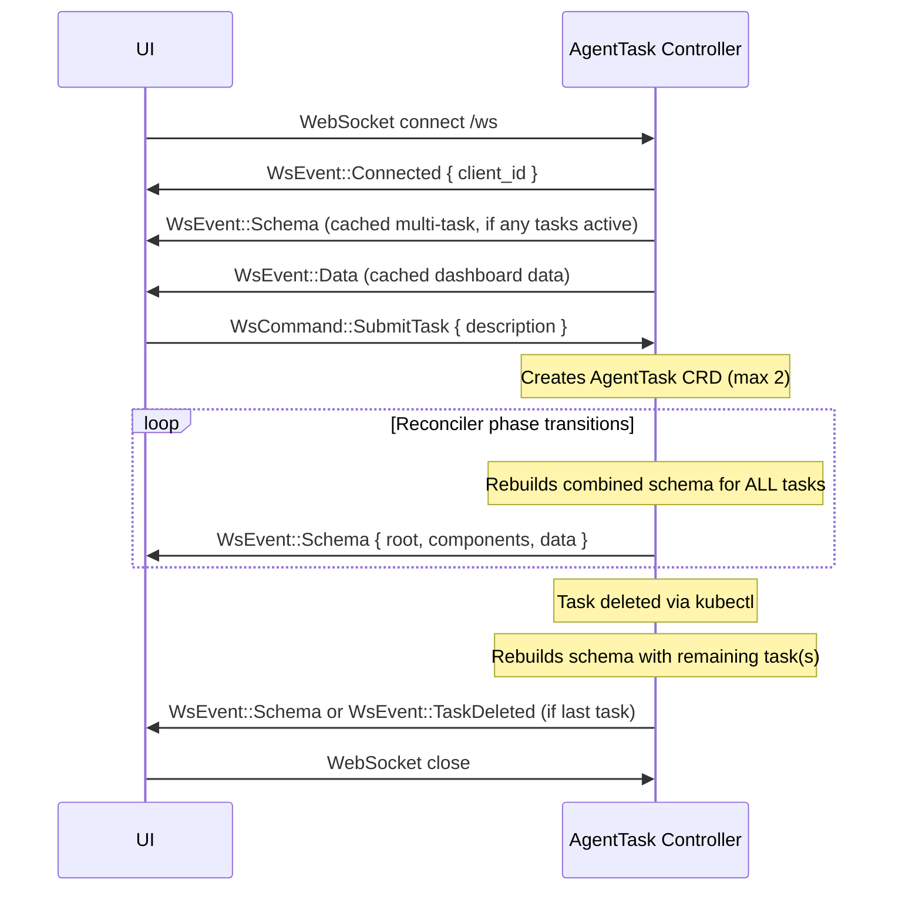
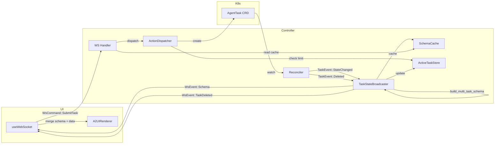

# WebSocket Protocol

This document defines the WebSocket message protocol between the AgentTask Controller and the UI.

---

## Overview

The AgentTask Controller exposes a WebSocket endpoint at `/ws`. The UI connects to receive real-time updates and send user actions. Messages are JSON-encoded.

Two message directions:
- **WsEvent** — Controller → UI (server pushes events)
- **WsCommand** — UI → Controller (client sends commands)

Four event types are implemented:
- `connected` — connection acknowledgment
- `data` — raw data updates
- `schema` — A2UI component definitions + data (primary mechanism for dynamic UI)
- `task_deleted` — task was deleted from Kubernetes, UI should clear stale state

---

## Multi-Task Support

The system supports up to **2 concurrent tasks**. Each task is displayed in its own status card, with a tab bar for navigation.

### Active Task Store

The `ActiveTaskStore` tracks active tasks in-memory using a `DashMap<String, TaskStateChanged>`. It enforces `MAX_ACTIVE_TASKS = 2`.

- Every `TaskEvent::StateChanged` inserts/updates the task in the store
- Every `TaskEvent::Deleted` removes the task from the store
- On each event, the combined schema for ALL active tasks is rebuilt and broadcast

### Schema Layout

```
hero-section (Column)
├── hero-tagline
├── hero-subtitle
├── task-card (input form — hidden when 2 tasks active)
├── task-tab-bar (Row — one button per task)
├── task-0-status-card (Card — first task)
└── task-1-status-card (Card — second task, if present)
```

- Component IDs are namespaced by task index: `task-0-status-name-row`, `task-1-status-phase-row`
- Data paths use the items array: `/tasks/items/0/name`, `/tasks/items/1/phase`
- The tab bar shows task names, bound to `/tasks/items/{i}/name`

### Task Limit

When the `ActiveTaskStore` is full (2 tasks), the `SubmitTaskAction` rejects new submissions with an error response:

```json
{
  "type": "data",
  "data": {
    "error": { "message": "Maximum of 2 concurrent tasks reached" }
  }
}
```

The input form (`task-card`) is also hidden from the schema when 2 tasks are active.

---

## Connection Lifecycle



### Late Joiner Support

When a client connects after tasks are already running, the handler sends cached state:

1. `WsEvent::Connected` — assigns client ID
2. Cached `schema` — last pushed A2UI schema (components + data) with all active tasks
3. Cached `dashboard` data — default data state

The `SchemaCache` stores both the schema and dashboard data, updated by the `TaskStateBroadcaster` on every state change.

---

## WsEvent (Controller → UI)

### Connected

Sent immediately after WebSocket upgrade. Confirms the connection and assigns a client ID.

```json
{
  "type": "connected",
  "client_id": "550e8400-e29b-41d4-a716-446655440000"
}
```

### Data

Pushes raw data state to the UI. Sent on initial connect with cached dashboard data.

```json
{
  "type": "data",
  "data": {
    "hero": { "tagline": "AI-Powered Code Generation" },
    "tasks": { "count": 0, "items": [] }
  }
}
```

The UI merges `data` with the A2UI schema's `defaultData` — WebSocket data takes precedence over defaults.

### Schema

Pushes A2UI component definitions and data from the controller. This is the primary mechanism for dynamic UI — the controller decides what components the UI renders.

All active tasks are included in a single schema push. Component IDs are namespaced by task index (`task-{i}-*`), and data paths use `/tasks/items/{i}/...`.

```json
{
  "type": "schema",
  "root": "hero-section",
  "components": [
    {
      "id": "hero-section",
      "component": {
        "Column": {
          "children": { "explicitList": ["hero-tagline", "hero-subtitle", "task-card", "task-tab-bar", "task-0-status-card"] }
        }
      }
    },
    {
      "id": "task-tab-bar",
      "component": {
        "Row": {
          "distribution": "start",
          "children": { "explicitList": ["task-tab-0"] }
        }
      }
    },
    {
      "id": "task-tab-0",
      "component": { "Text": { "text": { "path": "/tasks/items/0/name" }, "usageHint": "button" } }
    },
    {
      "id": "task-0-status-card",
      "component": { "Card": { "child": "task-0-status-col" } }
    },
    {
      "id": "task-0-status-col",
      "component": {
        "Column": {
          "children": { "explicitList": ["task-0-status-title", "task-0-status-name-row", "task-0-status-desc-row", "task-0-status-phase-row", "task-0-status-iteration-row", "task-0-status-error-row", "task-0-status-tests-row", "task-0-status-agents-section"] }
        }
      }
    }
  ],
  "data": {
    "hero": {
      "tagline": "AI-Powered Code Generation",
      "subtitle": "Describe your task. Let agents build it. Tests drive the loop."
    },
    "tasks": {
      "count": 1,
      "items": [
        {
          "name": "task-3f012dea",
          "description": "Create an e-commerce API",
          "age": "2m 30s",
          "phase": "Running",
          "iteration": 0,
          "error": 1.0,
          "testsTotal": 0,
          "testsPassed": 0,
          "testsDisplay": "0/0",
          "agents": [
            { "name": "orchestrator-task-3f012dea", "type": "orchestrator", "phase": "Running" }
          ]
        }
      ]
    }
  }
}
```

With 2 tasks active, the schema includes `task-1-status-card` and `task-tab-1`, and `task-card` is excluded from the hero-section children.

**Schema merging in the UI**: The UI maintains a static base schema (`dashboard.json`) and merges server-pushed components using ID-based override — server components with the same ID replace static ones.

**Component format**: A2UI v0.8 `ComponentInstance` — each component has an `id` and a `component` object keyed by type (`Column`, `Row`, `Card`, `Text`, `TextField`, `Button`).

**Data binding**: Components reference data via `{ "path": "/tasks/items/0/phase" }` for dynamic values or `{ "literalString": "Phase:" }` for static text.

### TaskDeleted

Sent when the last active task is deleted from Kubernetes. The UI should clear all task state.

```json
{
  "type": "task_deleted",
  "task_name": "task-3f012dea"
}
```

When tasks remain after a deletion, the controller rebuilds the combined schema with the remaining task(s) and sends a `WsEvent::Schema` instead of `TaskDeleted`.

---

## WsCommand (UI → Controller)

Commands use serde tagged enum format (`#[serde(tag = "type", rename_all = "snake_case")]`).

### Connect

Sent by the UI after WebSocket opens. Currently no payload.

```json
{
  "type": "connect"
}
```

### SubmitTask

Sent when the user submits a task description from the UI form. The A2UI button action resolves the form field value and sends it as a command.

```json
{
  "type": "submit_task",
  "description": "Create an e-commerce backend API with product catalog and shopping cart"
}
```

The `ActionDispatcher` routes this to `SubmitTaskAction`, which:
1. Checks the `ActiveTaskStore` — rejects if already at 2 tasks
2. Creates an `AgentTask` CRD in Kubernetes
3. Sends a `WsEvent::Data` response with the new task name and phase

---

## Data Flow



### Broadcast Channel

The reconciler emits `TaskEvent` variants via a `tokio::sync::broadcast` channel. The `TaskStateBroadcaster` listens on this channel and handles two cases:

**`TaskEvent::StateChanged`** — phase transition or live update:
1. Inserts/updates the task in `ActiveTaskStore`
2. Retrieves all active tasks via `ordered_tasks()` (sorted by name for deterministic ordering)
3. Builds combined A2UI schema via `build_multi_task_schema()`
4. Caches the schema and data in `SchemaCache` (for late joiners)
5. Broadcasts `WsEvent::Schema` to all connected clients via `ConnectionRegistry`

**`TaskEvent::Deleted`** — task deleted from K8s:
1. Removes the task from `ActiveTaskStore`
2. If tasks remain: rebuilds combined schema, caches, and broadcasts `WsEvent::Schema`
3. If no tasks remain: removes cached schema and dashboard, broadcasts `WsEvent::TaskDeleted`

### TaskStateChanged Event

Emitted by the controller on every phase transition:

| Field | Type | Description |
|-------|------|-------------|
| `task_name` | `String` | CRD resource name |
| `namespace` | `String` | Kubernetes namespace |
| `description` | `String` | Task description from spec |
| `created_at` | `Option<DateTime<Utc>>` | Task creation timestamp |
| `phase` | `AgentTaskPhase` | Current phase (Pending, Clarifying, Running, ...) |
| `iteration` | `i32` | TCP controller iteration count |
| `error` | `f64` | Error signal (0.0 - 1.0) |
| `tests_total` | `i32` | Total test count |
| `tests_passed` | `i32` | Passed test count |
| `agents` | `AgentInfoList` | Agents working on this task |

---

## JSON Schema

### WsEvent

```json
{
  "$schema": "http://json-schema.org/draft-07/schema#",
  "title": "WsEvent",
  "description": "Event pushed from the controller to the UI",
  "oneOf": [
    {
      "type": "object",
      "required": ["type", "client_id"],
      "properties": {
        "type": { "const": "connected" },
        "client_id": { "type": "string", "format": "uuid" }
      }
    },
    {
      "type": "object",
      "required": ["type", "data"],
      "properties": {
        "type": { "const": "data" },
        "data": { "type": "object" }
      }
    },
    {
      "type": "object",
      "required": ["type", "root", "components", "data"],
      "properties": {
        "type": { "const": "schema" },
        "root": { "type": "string", "description": "Root component ID (hero-section)" },
        "components": {
          "type": "array",
          "items": {
            "type": "object",
            "required": ["id", "component"],
            "properties": {
              "id": { "type": "string" },
              "component": { "type": "object" }
            }
          },
          "description": "A2UI v0.8 ComponentInstance array"
        },
        "data": {
          "type": "object",
          "properties": {
            "hero": { "type": "object" },
            "tasks": {
              "type": "object",
              "properties": {
                "count": { "type": "integer", "minimum": 0, "maximum": 2 },
                "items": {
                  "type": "array",
                  "maxItems": 2,
                  "items": {
                    "type": "object",
                    "properties": {
                      "name": { "type": "string" },
                      "description": { "type": "string" },
                      "age": { "type": "string" },
                      "phase": { "type": "string" },
                      "iteration": { "type": "integer" },
                      "error": { "type": "number" },
                      "testsTotal": { "type": "integer" },
                      "testsPassed": { "type": "integer" },
                      "testsDisplay": { "type": "string" },
                      "agents": {
                        "type": "array",
                        "items": {
                          "type": "object",
                          "properties": {
                            "name": { "type": "string" },
                            "type": { "type": "string" },
                            "phase": { "type": "string" }
                          }
                        }
                      }
                    }
                  }
                }
              }
            }
          }
        }
      }
    },
    {
      "type": "object",
      "required": ["type", "task_name"],
      "properties": {
        "type": { "const": "task_deleted" },
        "task_name": { "type": "string", "description": "Name of the deleted task" }
      }
    }
  ]
}
```

### WsCommand

```json
{
  "$schema": "http://json-schema.org/draft-07/schema#",
  "title": "WsCommand",
  "description": "Command sent from the UI to the controller",
  "oneOf": [
    {
      "type": "object",
      "required": ["type"],
      "properties": {
        "type": { "const": "connect" }
      }
    },
    {
      "type": "object",
      "required": ["type", "description"],
      "properties": {
        "type": { "const": "submit_task" },
        "description": { "type": "string" }
      }
    }
  ]
}
```

---

## References

- [07-a2ui-architecture.md](07-a2ui-architecture.md) — A2UI data flow and schema caching
- [02-components.md](02-components.md) — AgentTask Controller responsibilities
- [04-task-lifecycle.md](04-task-lifecycle.md) — Clarification relay flow
