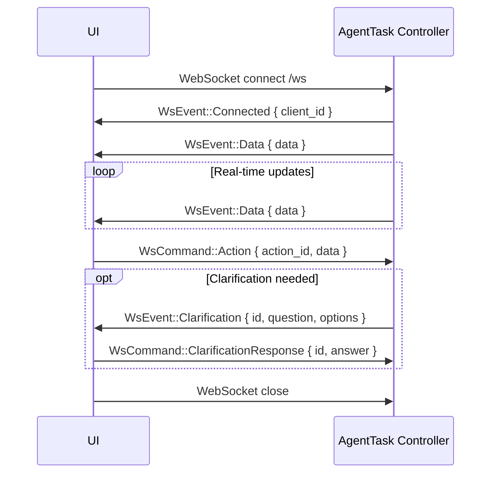

# WebSocket Protocol

This document defines the WebSocket message protocol between the AgentTask Controller and the UI.

---

## Overview

The AgentTask Controller exposes a WebSocket endpoint at `/ws`. The UI connects to receive real-time updates and send user actions. Messages are JSON-encoded.

Two message types:
- **WsEvent** — Controller → UI (server pushes events)
- **WsCommand** — UI → Controller (client sends commands)

---

## Connection Lifecycle



---

## WsEvent (Controller → UI)

### Connected

Sent immediately after WebSocket upgrade. Confirms the connection and assigns a client ID.

```json
{
  "type": "connected",
  "client_id": "550e8400-e29b-41d4-a716-446655440000"
}
```

### Data

Pushes the current data state to the UI. Sent on initial connect and whenever state changes (progress, agent status, test results, TCP signal, etc.).

```json
{
  "type": "data",
  "data": {
    "status": "Running",
    "task": {
      "description": "Create an e-commerce API"
    },
    "progress": {
      "steps": [
        { "label": "Analyze", "icon": "✅" },
        { "label": "Gen Tests", "icon": "✅" },
        { "label": "Gen Code", "icon": "⏳" },
        { "label": "Run Tests", "icon": "⬚" },
        { "label": "Complete", "icon": "⬚" }
      ]
    },
    "tcp": {
      "value": "0.40",
      "description": "Continue iteration"
    },
    "agent": {
      "name": "CodeGenerator",
      "role": "code-gen",
      "status": "Working",
      "iterations": 2,
      "testsPassed": 3
    },
    "tests": {
      "runTime": "1.2s",
      "passed": 3,
      "failed": 2,
      "skipped": 0
    }
  }
}
```

The `data` object carries only **dynamic runtime state**. Static content (app name, tagline, subtitle) stays in the A2UI schema `defaultData`. The UI merges both — WebSocket data takes precedence over defaults.

### Clarification

Sent when an agent needs user input to proceed. The UI renders an appropriate input component.

```json
{
  "type": "clarification",
  "id": "q-001",
  "question": "Which database should we use?",
  "options": ["PostgreSQL", "MySQL", "MongoDB"]
}
```

The `options` field is optional — omitted when free-text input is expected:

```json
{
  "type": "clarification",
  "id": "q-002",
  "question": "Enter your API key"
}
```

### Error

Sent when something goes wrong server-side.

```json
{
  "type": "error",
  "message": "Failed to create AgentTask: namespace quota exceeded"
}
```

---

## WsCommand (UI → Controller)

### Connect

Sent by the UI after WebSocket opens. Optional client ID for reconnection.

```json
{
  "type": "connect",
  "client_id": null
}
```

### Action

Sent when the user interacts with the UI (button click, form submit, navigation).

```json
{
  "type": "action",
  "action_id": "submitTask",
  "data": {
    "description": "Create an e-commerce backend API with product catalog and shopping cart"
  }
}
```

```json
{
  "type": "action",
  "action_id": "navigate",
  "data": {
    "view": "progress"
  }
}
```

### ClarificationResponse

Sent when the user answers a clarification question.

```json
{
  "type": "clarification_response",
  "id": "q-001",
  "answer": "PostgreSQL"
}
```

---

## JSON Schema

### WsEvent

```json
{
  "$schema": "http://json-schema.org/draft-07/schema#",
  "title": "WsEvent",
  "description": "Event pushed from the controller to the UI",
  "oneOf": [
    {
      "type": "object",
      "required": ["type", "client_id"],
      "properties": {
        "type": { "const": "connected" },
        "client_id": { "type": "string", "format": "uuid" }
      }
    },
    {
      "type": "object",
      "required": ["type", "data"],
      "properties": {
        "type": { "const": "data" },
        "data": { "type": "object" }
      }
    },
    {
      "type": "object",
      "required": ["type", "id", "question"],
      "properties": {
        "type": { "const": "clarification" },
        "id": { "type": "string" },
        "question": { "type": "string" },
        "options": {
          "type": "array",
          "items": { "type": "string" }
        }
      }
    },
    {
      "type": "object",
      "required": ["type", "message"],
      "properties": {
        "type": { "const": "error" },
        "message": { "type": "string" }
      }
    }
  ]
}
```

### WsCommand

```json
{
  "$schema": "http://json-schema.org/draft-07/schema#",
  "title": "WsCommand",
  "description": "Command sent from the UI to the controller",
  "oneOf": [
    {
      "type": "object",
      "required": ["type"],
      "properties": {
        "type": { "const": "connect" },
        "client_id": { "type": ["string", "null"] }
      }
    },
    {
      "type": "object",
      "required": ["type", "action_id", "data"],
      "properties": {
        "type": { "const": "action" },
        "action_id": { "type": "string" },
        "data": { "type": "object" }
      }
    },
    {
      "type": "object",
      "required": ["type", "id", "answer"],
      "properties": {
        "type": { "const": "clarification_response" },
        "id": { "type": "string" },
        "answer": { "type": "string" }
      }
    }
  ]
}
```

---

## References

- [07-a2ui-architecture.md](07-a2ui-architecture.md) — A2UI data flow and schema caching
- [02-components.md](02-components.md) — AgentTask Controller responsibilities
- [04-task-lifecycle.md](04-task-lifecycle.md) — Clarification relay flow
