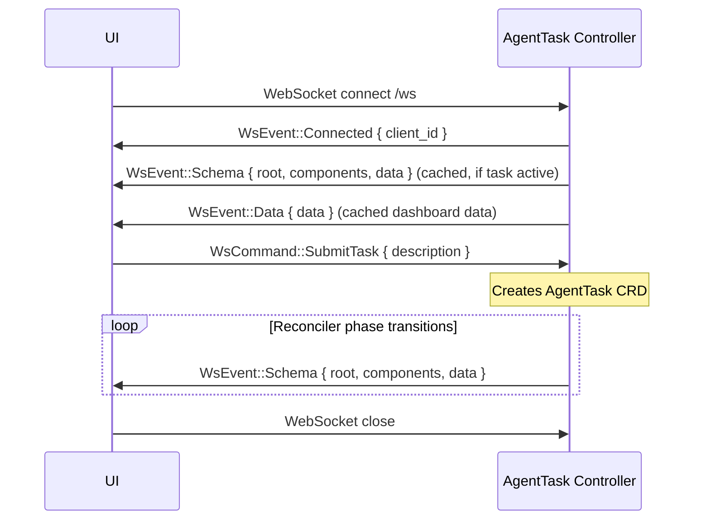
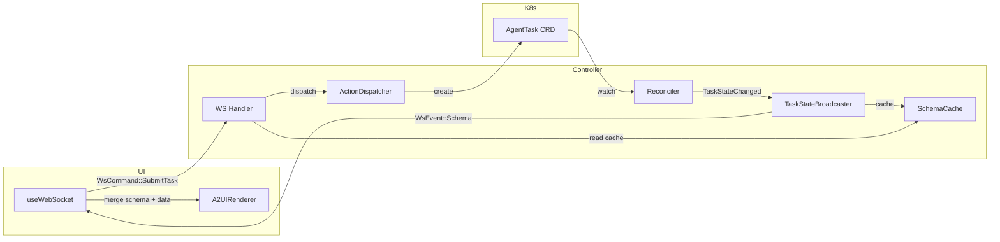

# WebSocket Protocol

This document defines the WebSocket message protocol between the AgentTask Controller and the UI.

---

## Overview

The AgentTask Controller exposes a WebSocket endpoint at `/ws`. The UI connects to receive real-time updates and send user actions. Messages are JSON-encoded.

Two message directions:
- **WsEvent** — Controller → UI (server pushes events)
- **WsCommand** — UI → Controller (client sends commands)

Three event types are implemented:
- `connected` — connection acknowledgment
- `data` — raw data updates
- `schema` — A2UI component definitions + data (primary mechanism for dynamic UI)

---

## Connection Lifecycle



### Late Joiner Support

When a client connects after a task is already running, the handler sends cached state:

1. `WsEvent::Connected` — assigns client ID
2. Cached `schema` — last pushed A2UI schema (components + data) so the client sees current task status
3. Cached `dashboard` data — default data state

The `SchemaCache` stores both the schema and dashboard data, updated by the `TaskStateBroadcaster` on every phase transition.

---

## WsEvent (Controller → UI)

### Connected

Sent immediately after WebSocket upgrade. Confirms the connection and assigns a client ID.

```json
{
  "type": "connected",
  "client_id": "550e8400-e29b-41d4-a716-446655440000"
}
```

### Data

Pushes raw data state to the UI. Sent on initial connect with cached dashboard data.

```json
{
  "type": "data",
  "data": {
    "hero": { "tagline": "AI-Powered Code Generation" },
    "task": { "description": "" }
  }
}
```

The UI merges `data` with the A2UI schema's `defaultData` — WebSocket data takes precedence over defaults.

### Schema

Pushes A2UI component definitions and data from the controller. This is the primary mechanism for dynamic UI — the controller decides what components the UI renders.

```json
{
  "type": "schema",
  "root": "task-status-card",
  "components": [
    {
      "id": "hero-section",
      "component": {
        "Column": {
          "children": { "explicitList": ["hero-tagline", "hero-subtitle", "task-card", "task-status-card"] }
        }
      }
    },
    {
      "id": "task-status-card",
      "component": { "Card": { "child": "task-status-col" } }
    },
    {
      "id": "task-status-col",
      "component": {
        "Column": {
          "children": { "explicitList": ["task-status-title", "task-status-name-row", "task-status-desc-row", "task-status-phase-row", "task-status-iteration-row", "task-status-error-row", "task-status-tests-row"] }
        }
      }
    }
  ],
  "data": {
    "task": {
      "name": "task-3f012dea",
      "description": "Create an e-commerce API",
      "phase": "Running",
      "iteration": 0,
      "error": 1.0,
      "testsTotal": 0,
      "testsPassed": 0,
      "testsDisplay": "0/0"
    }
  }
}
```

**Schema merging in the UI**: The UI maintains a static base schema (`dashboard.json`) and merges server-pushed components using ID-based override — server components with the same ID replace static ones. This allows the controller to inject new components (task status card) and modify the layout (override `hero-section` children) without replacing the entire UI.

**Component format**: A2UI v0.8 `ComponentInstance` — each component has an `id` and a `component` object keyed by type (`Column`, `Row`, `Card`, `Text`, `TextField`, `Button`).

**Data binding**: Components reference data via `{ "path": "/task/phase" }` for dynamic values or `{ "literalString": "Phase:" }` for static text.

---

## WsCommand (UI → Controller)

Commands use serde tagged enum format (`#[serde(tag = "type", rename_all = "snake_case")]`).

### Connect

Sent by the UI after WebSocket opens. Currently no payload.

```json
{
  "type": "connect"
}
```

### SubmitTask

Sent when the user submits a task description from the UI form. The A2UI button action resolves the form field value and sends it as a command.

```json
{
  "type": "submit_task",
  "description": "Create an e-commerce backend API with product catalog and shopping cart"
}
```

The `ActionDispatcher` routes this to `SubmitTaskAction`, which creates an `AgentTask` CRD in Kubernetes.

---

## Data Flow



### Broadcast Channel

The reconciler emits `TaskStateChanged` events via a `tokio::sync::broadcast` channel. The `TaskStateBroadcaster` listens on this channel and:

1. Builds A2UI component definitions via `build_task_status_schema()`
2. Caches the schema and data in `SchemaCache` (for late joiners)
3. Broadcasts `WsEvent::Schema` to all connected clients via `ConnectionRegistry`

### TaskStateChanged Event

Emitted by the controller on every phase transition:

| Field | Type | Description |
|-------|------|-------------|
| `task_name` | `String` | CRD resource name |
| `namespace` | `String` | Kubernetes namespace |
| `description` | `String` | Task description from spec |
| `phase` | `AgentTaskPhase` | Current phase (Pending, Clarifying, Running, ...) |
| `iteration` | `i32` | TCP controller iteration count |
| `error` | `f64` | Error signal (0.0 - 1.0) |
| `tests_total` | `i32` | Total test count |
| `tests_passed` | `i32` | Passed test count |

---

## JSON Schema

### WsEvent

```json
{
  "$schema": "http://json-schema.org/draft-07/schema#",
  "title": "WsEvent",
  "description": "Event pushed from the controller to the UI",
  "oneOf": [
    {
      "type": "object",
      "required": ["type", "client_id"],
      "properties": {
        "type": { "const": "connected" },
        "client_id": { "type": "string", "format": "uuid" }
      }
    },
    {
      "type": "object",
      "required": ["type", "data"],
      "properties": {
        "type": { "const": "data" },
        "data": { "type": "object" }
      }
    },
    {
      "type": "object",
      "required": ["type", "root", "components", "data"],
      "properties": {
        "type": { "const": "schema" },
        "root": { "type": "string", "description": "Root component ID" },
        "components": {
          "type": "array",
          "items": {
            "type": "object",
            "required": ["id", "component"],
            "properties": {
              "id": { "type": "string" },
              "component": { "type": "object" }
            }
          },
          "description": "A2UI v0.8 ComponentInstance array"
        },
        "data": { "type": "object", "description": "Data for populating component bindings" }
      }
    }
  ]
}
```

### WsCommand

```json
{
  "$schema": "http://json-schema.org/draft-07/schema#",
  "title": "WsCommand",
  "description": "Command sent from the UI to the controller",
  "oneOf": [
    {
      "type": "object",
      "required": ["type"],
      "properties": {
        "type": { "const": "connect" }
      }
    },
    {
      "type": "object",
      "required": ["type", "description"],
      "properties": {
        "type": { "const": "submit_task" },
        "description": { "type": "string" }
      }
    }
  ]
}
```

---

## References

- [07-a2ui-architecture.md](07-a2ui-architecture.md) — A2UI data flow and schema caching
- [02-components.md](02-components.md) — AgentTask Controller responsibilities
- [04-task-lifecycle.md](04-task-lifecycle.md) — Clarification relay flow
