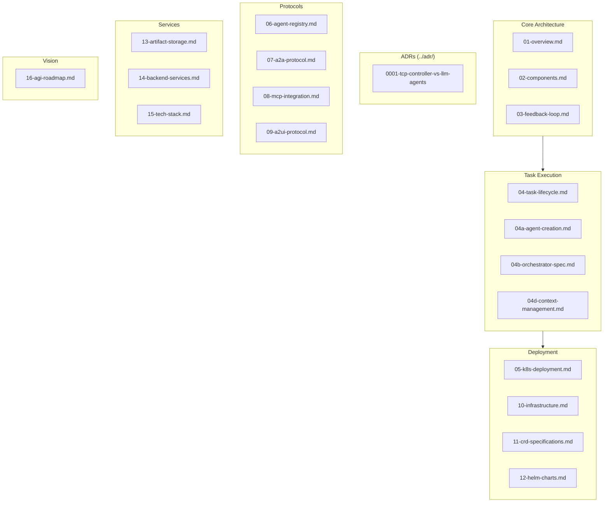

# Meta-Agent Architecture Documentation

> Autonomous meta-agent: analyzes tasks, creates/selects agents & MCP servers, orchestrates execution

This directory contains the architecture documentation for the Meta-Agent System, split by responsibility.

## Document Structure

## Documents

### Core Architecture
| File | Description |
|------|-------------|
| [01-overview.md](01-overview.md) | System overview and core concepts (TCP Controller, Gherkin setpoints, error signal) |
| [02-components.md](02-components.md) | Architecture diagram and component descriptions |
| [03-feedback-loop.md](03-feedback-loop.md) | Feedback loop flow and TCP control logic |

### Task Execution
| File | Description |
|------|-------------|
| [04-task-lifecycle.md](04-task-lifecycle.md) | Task submission, state machine, namespace lifecycle |
| [04a-agent-creation.md](04a-agent-creation.md) | Agent instantiation algorithm, templates, custom agents |
| [04b-orchestrator-spec.md](04b-orchestrator-spec.md) | Orchestrator decision logic, signal interpretation |
| [04d-context-management.md](04d-context-management.md) | Context schema, flow between agents, API |

### Architecture Decision Records
| File | Description |
|------|-------------|
| [0001-tcp-controller-vs-llm-agents.md](../adr/0001-tcp-controller-vs-llm-agents.md) | Why TCP (PID) Controller + LLM Agents (key architectural decision) |

### Deployment & Infrastructure
| File | Description |
|------|-------------|
| [05-k8s-deployment.md](05-k8s-deployment.md) | Kubernetes deployment model and CRDs |
| [10-infrastructure.md](10-infrastructure.md) | Ansible playbooks and local K8s cluster setup |
| [11-crd-specifications.md](11-crd-specifications.md) | CRD specifications |
| [12-helm-charts.md](12-helm-charts.md) | Helm chart structure and configuration |

### Protocols & Communication
| File | Description |
|------|-------------|
| [06-agent-registry.md](06-agent-registry.md) | Agent registry for discovery and health management |
| [07-a2a-protocol.md](07-a2a-protocol.md) | Agent-to-Agent (A2A) communication protocol |
| [08-mcp-integration.md](08-mcp-integration.md) | MCP integration with Anthropic Messages API |
| [09-a2ui-protocol.md](09-a2ui-protocol.md) | Agent-to-User Interface (A2UI) protocol |

### Backend Services
| File | Description |
|------|-------------|
| [13-artifact-storage.md](13-artifact-storage.md) | GitHub-based artifact storage |
| [14-backend-services.md](14-backend-services.md) | Rust backend services implementation |
| [15-tech-stack.md](15-tech-stack.md) | Technology stack overview |

### Vision & Future
| File | Description |
|------|-------------|
| [16-agi-roadmap.md](16-agi-roadmap.md) | Relation to AGI and roadmap for extension |

## Quick Start

1. Start with **[Project Goal](../project-goal.md)** for hackathon context and vision
2. Read **[01-overview.md](01-overview.md)** for core concepts
3. Review **[ADR-0001](../adr/0001-tcp-controller-vs-llm-agents.md)** to understand the key TCP Controller vs LLM split
4. Explore **[04-task-lifecycle.md](04-task-lifecycle.md)** for how tasks flow through the system
5. See **[05-k8s-deployment.md](05-k8s-deployment.md)** for deployment details

## Key Concepts

- **TCP Controller**: Task-Context-Prediction orchestration
- **Error Signal**: `error = (failed_tests + failed_outcomes) / total_checks`
- **Gherkin Setpoint**: E2E tests define dynamic success criteria
- **A2A/A2UI/MCP**: Protocol stack for agent communication
