# Meta-Agent System Architecture

> Autonomous meta-agent: analyzes tasks, creates/selects agents & MCP servers, orchestrates execution

## Overview

A self-regulating meta-agent system inspired by PID controller principles. The system dynamically provisions and orchestrates task-specific AI agents and MCP servers, using E2E tests as the setpoint for measuring success.

## Core Concepts

### TCP Controller (Task-Context-Prediction)

| Component | Term | Function |
|-----------|------|----------|
| Task Analyzer | **T** (Task) | Reacts to current task requirements and error state |
| Context Memory | **C** (Context) | Accumulated history, learned patterns, what worked before |
| Predictor | **P** (Prediction) | Anticipates failures, adapts to rate of change |

### Setpoint: E2E Test Generation (Gherkin)

Instead of hardcoded success criteria, a dedicated **Test Generator Agent** analyzes each incoming task and produces E2E tests in **Gherkin format** (Given-When-Then) that define what success looks like. This makes the setpoint:

- **Dynamic** — generated per task
- **Measurable** — pass/fail, objective
- **Self-documenting** — Gherkin is human-readable
- **Executable** — runs with Cucumber, Behave, etc.

### Error Signal

```
error = failed_tests / total_tests
```

The error signal drives the feedback loop, triggering adjustments in agent selection, configuration, or strategy.

---

## Architecture Diagram

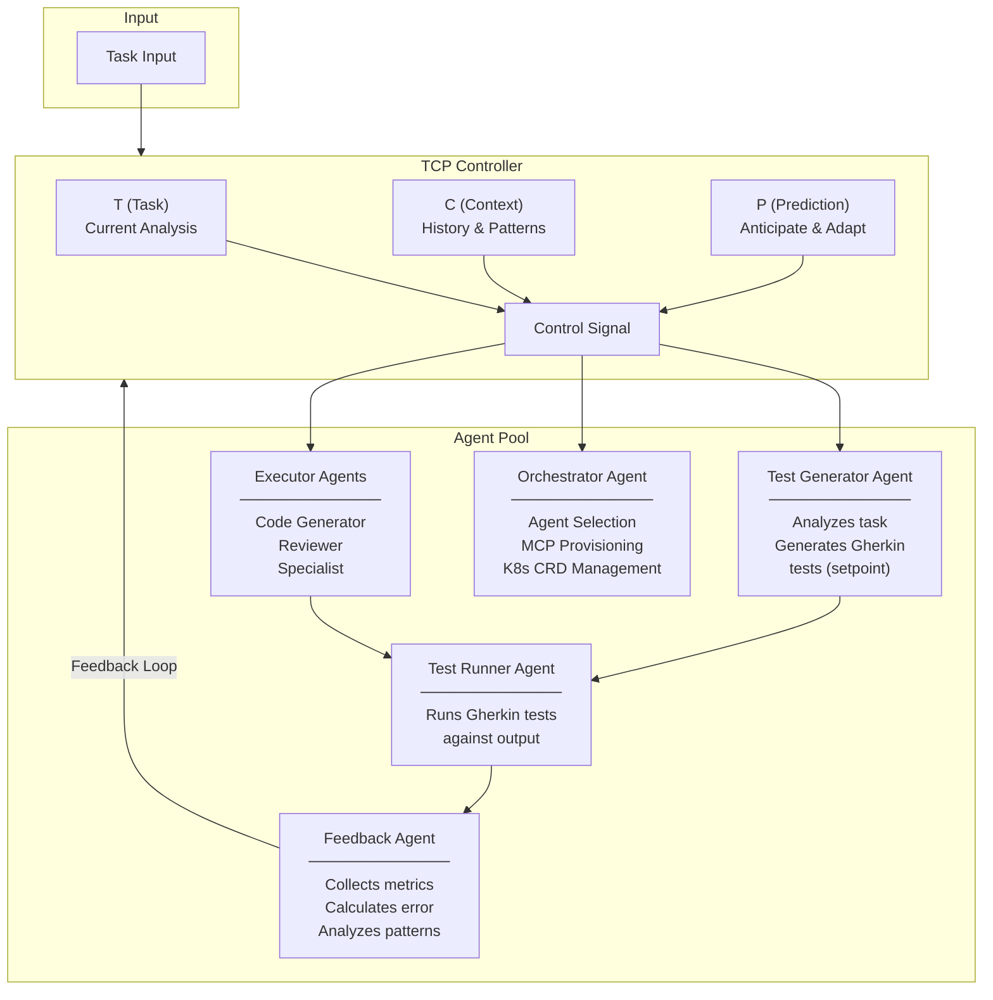
```mermaid
flowchart TB
    subgraph Input
        TI[Task Input]
    end

    subgraph Controller["TCP Controller"]
        T["T (Task)<br/>Current Analysis"]
        C["C (Context)<br/>History & Patterns"]
        P["P (Prediction)<br/>Anticipate & Adapt"]
        CS[Control Signal]
        T & C & P --> CS
    end

    subgraph Agents["Agent Pool"]
        TG["Test Generator Agent<br/>─────────────<br/>Analyzes task<br/>Generates Gherkin<br/>tests (setpoint)"]
        OR["Orchestrator Agent<br/>─────────────<br/>Agent Selection<br/>MCP Provisioning<br/>K8s CRD Management"]
        EX["Executor Agents<br/>─────────────<br/>Code Generator<br/>Reviewer<br/>Specialist"]
        TR["Test Runner Agent<br/>─────────────<br/>Runs Gherkin tests<br/>against output"]
        FB["Feedback Agent<br/>─────────────<br/>Collects metrics<br/>Calculates error<br/>Analyzes patterns"]
    end

    TI --> Controller
    CS --> TG & OR & EX
    TG --> TR
    EX --> TR
    TR --> FB
    FB -->|"Feedback Loop"| Controller
```

---

## Components

### 1. TCP Controller (Task-Context-Prediction)

The brain of the system. Receives task input and feedback, computes control signal.

**Responsibilities:**
- **T (Task):** Parse and understand incoming task, react to current error
- **C (Context):** Store and leverage history, learned patterns
- **P (Prediction):** Anticipate failures, adapt proactively
- Compute control signal to determine next action
- Decide: retry, spawn new agent, change strategy, or complete

### 2. Test Generator Agent

Creates the definition of success for each task using **Gherkin** syntax (Given-When-Then).

**Input:** Task description
**Output:** Set of E2E tests in Gherkin format

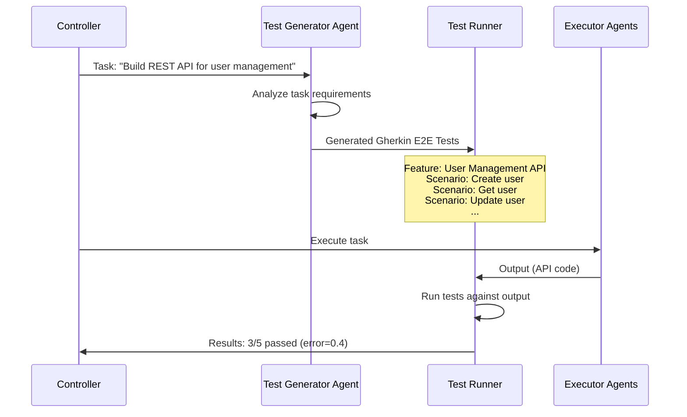
```mermaid
sequenceDiagram
    participant C as Controller
    participant TG as Test Generator Agent
    participant TR as Test Runner
    participant EX as Executor Agents

    C->>TG: Task: "Build REST API for user management"
    TG->>TG: Analyze task requirements
    TG->>TR: Generated Gherkin E2E Tests
    Note over TR: Feature: User Management API<br/>Scenario: Create user<br/>Scenario: Get user<br/>Scenario: Update user<br/>...
    C->>EX: Execute task
    EX->>TR: Output (API code)
    TR->>TR: Run tests against output
    TR->>C: Results: 3/5 passed (error=0.4)
```

**Example Gherkin Output:**

```gherkin
Feature: User Management API
  As a client
  I want to manage users via REST API
  So that I can perform CRUD operations

  Scenario: Create a new user
    Given the API is running
    When I send a POST request to "/users" with body:
      """
      {
        "name": "John Doe",
        "email": "john@example.com"
      }
      """
    Then the response status should be 201
    And the response should contain "id"

  Scenario: Get existing user
    Given a user exists with id "123"
    When I send a GET request to "/users/123"
    Then the response status should be 200
    And the response should contain "name"

  Scenario: Update user details
    Given a user exists with id "123"
    When I send a PUT request to "/users/123" with body:
      """
      {
        "name": "Jane Doe"
      }
      """
    Then the response status should be 200
    And the user name should be "Jane Doe"

  Scenario: Delete user
    Given a user exists with id "123"
    When I send a DELETE request to "/users/123"
    Then the response status should be 204
    And the user should no longer exist

  Scenario: Invalid input returns error
    Given the API is running
    When I send a POST request to "/users" with body:
      """
      {
        "invalid": "data"
      }
      """
    Then the response status should be 400
    And the response should contain "error"
```

### 3. Orchestrator Agent

An agent that provisions and manages execution resources.

**Responsibilities:**
- Select appropriate agents for the task
- Create new agents if needed (dynamically define new Agent CRDs)
- Provision MCP servers
- Manage K8s CRDs (AgentTask, Agent, MCPServer, TestSuite)
- Manage lifecycle (start, stop, scale)

### 4. Executor Agents

Task-specific agents that do the actual work.

**Types:**
- Code Generator
- Code Reviewer
- Data Processor
- Research Agent
- Specialist Agents (created on demand)

### 5. Test Runner Agent

An agent that executes Gherkin E2E tests against the output using BDD frameworks.

**Input:** Gherkin feature files + Agent output
**Output:** Test results (pass/fail per scenario)

**Supported Runners:**
- Python: `behave`, `pytest-bdd`
- JavaScript: `cucumber-js`
- Java: `cucumber-jvm`
- Go: `godog`

### 6. Feedback Collector Agent

An agent that gathers metrics, analyzes results, and calculates the error signal for the TCP Controller.

**Responsibilities:**
- Collect test results from Test Runner Agent
- Gather execution metrics (time, tokens, retries)
- Calculate error signal
- Analyze failure patterns
- Provide recommendations for next iteration

**Metrics:**
- Test pass rate
- Execution time
- Token usage
- Retry count
- Agent performance trends

---

## Feedback Loop Flow

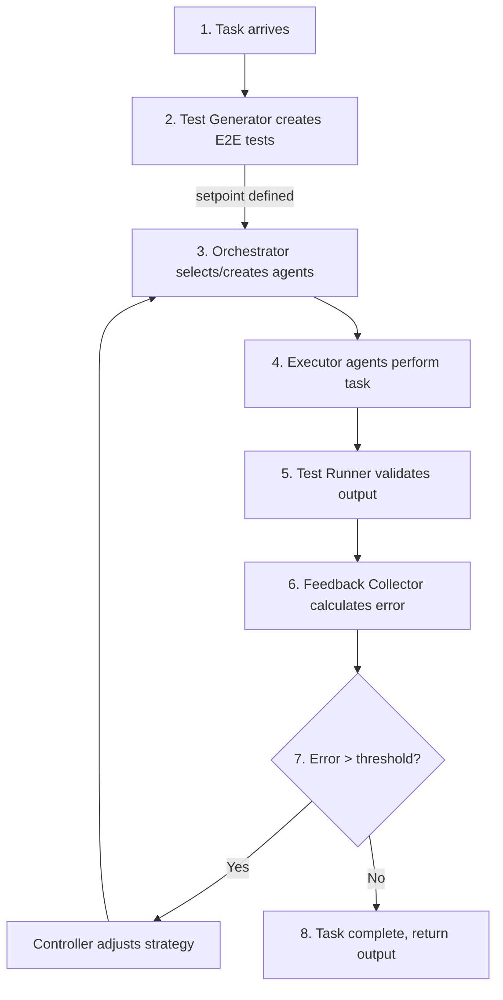
```mermaid
flowchart TD
    A[1. Task arrives] --> B[2. Test Generator creates E2E tests]
    B -->|"setpoint defined"| C[3. Orchestrator selects/creates agents]
    C --> D[4. Executor agents perform task]
    D --> E[5. Test Runner validates output]
    E --> F[6. Feedback Collector calculates error]
    F --> G{7. Error > threshold?}
    G -->|Yes| H[Controller adjusts strategy]
    H --> C
    G -->|No| I[8. Task complete, return output]
```

---

## TCP Control Logic

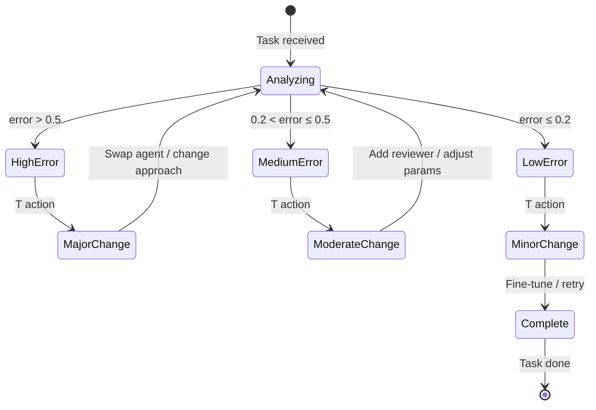
```mermaid
stateDiagram-v2
    [*] --> Analyzing: Task received
    
    Analyzing --> HighError: error > 0.5
    Analyzing --> MediumError: 0.2 < error ≤ 0.5
    Analyzing --> LowError: error ≤ 0.2
    
    HighError --> MajorChange: T action
    MajorChange --> Analyzing: Swap agent / change approach
    
    MediumError --> ModerateChange: T action
    ModerateChange --> Analyzing: Add reviewer / adjust params
    
    LowError --> MinorChange: T action
    MinorChange --> Complete: Fine-tune / retry
    
    Complete --> [*]: Task done
```

### T (Task) — Immediate Response

```python
t_action = Kt * current_error
```

| Error Level | Action |
|-------------|--------|
| High (> 0.5) | Major change: swap agent, change approach |
| Medium (0.2-0.5) | Moderate: add reviewer agent, adjust params |
| Low (< 0.2) | Minor: fine-tune, retry failed tests |

### C (Context) — Accumulated Learning

```python
context += current_error * dt
c_action = Kc * context
```

Tracks patterns over time:
- Same task type keeps failing → flag for model change
- Certain agents consistently underperform → deprioritize
- Successful patterns → remember and reuse

### P (Prediction) — Predictive Adjustment

```python
prediction = (current_error - previous_error) / dt
p_action = Kp * prediction
```

| Trend | Meaning | Action |
|-------|---------|--------|
| Error increasing | Getting worse | Preemptive intervention |
| Error stable | No progress | Try different approach |
| Error decreasing | Improving | Continue current strategy |

---

## Design Decision: Why TCP (PID) Controller + LLM Agents

A key architectural decision in this system is the separation of concerns between the **controller** and **agents**:

- **TCP Controller** — Uses PID-like mathematical control (no LLM)
- **Agents** — Use LLM for creative work (Claude API)

### Architecture Overview

```
┌─────────────────────────────────────────────────────────────────┐
│                     TCP CONTROLLER (PID)                        │
│                         Rust + Math                             │
│                                                                 │
│   Role: ORCHESTRATION — "What to do"                           │
│   • Measure error signal                                        │
│   • Compute control action (swap, retry, add agent)            │
│   • Fast, deterministic, free                                   │
└─────────────────────────────┬───────────────────────────────────┘
                              │ Control Signal
                              ▼
┌─────────────────────────────────────────────────────────────────┐
│                       AGENTS (LLM)                              │
│                      Claude API                                 │
│                                                                 │
│   Role: EXECUTION — "How to do"                                │
│   • Generate Gherkin tests                                      │
│   • Write code                                                  │
│   • Review and fix                                              │
│   • Creative, context-aware                                     │
└─────────────────────────────────────────────────────────────────┘
```

### Why NOT Use LLM for Controller?

| Aspect | PID Controller | LLM Controller |
|--------|----------------|----------------|
| **Speed** | 0.001ms | 2000ms (2M× slower) |
| **Cost** | $0 | ~$0.01/decision |
| **Determinism** | 100% same input → same output | Non-deterministic |
| **Reliability** | Always works | API can fail/timeout |
| **Scalability** | 1M decisions/sec | ~1 decision/sec |
| **Debuggability** | Easy to trace math | Hard to explain |

### What Controller Actually Needs

The controller doesn't need to **understand** — it just needs to **react**:

```
┌─────────────────────────────────────────────────────────────┐
│                    CONTROLLER INPUT                          │
│                                                              │
│   • error = 0.4 (number)                                    │
│   • previous_error = 0.5 (number)                           │
│   • iteration = 3 (number)                                  │
│                                                              │
│   Question: "Should I swap agent, add agent, or continue?"  │
│                                                              │
│   This is a MATHEMATICAL decision, not a CREATIVE one.      │
└─────────────────────────────────────────────────────────────┘
```

PID is perfect for this:
```rust
// Controller decision - pure math, no understanding needed
let signal = Kt * error + Kc * integral + Kp * derivative;

match signal {
    s if s > 0.5 => SwapAgent,    // High error → drastic change
    s if s > 0.2 => AddAgent,     // Medium error → add help
    _ => Continue,                 // Low error → keep going
}
```

### What Agents Actually Need

Agents need to **understand** and **create** — this requires LLM:

```
┌─────────────────────────────────────────────────────────────┐
│                      AGENT INPUT                             │
│                                                              │
│   • Task: "Build REST API for user management"              │
│   • Context: Previous attempts, test failures               │
│   • Requirements: Must pass Gherkin tests                   │
│                                                              │
│   Question: "How do I implement this?"                      │
│                                                              │
│   This is a CREATIVE decision requiring UNDERSTANDING.      │
└─────────────────────────────────────────────────────────────┘
```

LLM is essential for this:
```rust
// Agent work - requires understanding and creativity
let prompt = format!(
    "Generate Rust code for REST API that passes these tests:\n{}",
    gherkin_tests
);
let code = llm.complete(&prompt).await?; // Creative work
```

### Analogy: Factory Floor

```
TCP Controller = Factory Manager
├── Looks at metrics (error rate, throughput)
├── Makes decisions: "Station 3 is slow, add worker"
├── Doesn't need to know HOW to build the product
└── Just optimizes the process

LLM Agents = Skilled Workers  
├── Actually build the product
├── Need creativity, understanding, skills
├── Follow manager's resource decisions
└── Report results back
```

### Comparison by Scenario

**Scenario 1: Error Decreasing (0.6 → 0.4 → 0.2)**

| Controller | Decision | Time | Cost |
|------------|----------|------|------|
| PID | Continue (derivative negative) | 0.001ms | $0 |
| LLM | "Error decreasing, continue" | 2000ms | $0.01 |

→ **Same result, PID is 2M× faster and free**

**Scenario 2: High Error (0.8)**

| Controller | Decision | Time | Cost |
|------------|----------|------|------|
| PID | Swap agent (error > 0.5) | 0.001ms | $0 |
| LLM | "High error, analyzing why... swap agent" | 2000ms | $0.01 |

→ **Same result, PID is faster**

**Scenario 3: Stuck Error (0.4 → 0.4 → 0.4)**

| Controller | Decision | Quality |
|------------|----------|---------|
| PID | Swap agent (threshold) | Generic but works |
| LLM | "Same tests failing, add validation-specialist" | More targeted |

→ **LLM is smarter, but PID still solves the problem**

### Cost Analysis (100 Tasks/Day)

```
Average: 5 iterations per task = 500 control decisions/day

PID Controller:
├── 500 decisions × $0 = $0/day
├── 500 decisions × 0.001ms = 0.5ms total
└── Total: FREE, INSTANT

LLM Controller:
├── 500 decisions × $0.01 = $5/day
├── 500 decisions × 2000ms = 16.7 minutes total  
└── Total: $150/month, SLOW

LLM Agents (actual work):
├── ~2000 LLM calls for actual work = $20/day
└── This cost is NECESSARY — agents do real work
```

**Conclusion:** Save LLM budget for agents who need it!

### The Key Insight

```
┌────────────────────────────────────────────────────────────────┐
│                                                                 │
│   PID KNOWS:  "Error is 0.4"                                   │
│   PID ASKS:   "Is 0.4 > threshold?"                            │
│   PID DOES:   Mathematical comparison → action                  │
│                                                                 │
│   ─────────────────────────────────────────────────────────    │
│                                                                 │
│   LLM KNOWS:  "Error is 0.4 because test_validation failed     │
│               due to missing null check in line 42"            │
│   LLM ASKS:   "What's the best way to fix this?"               │
│   LLM DOES:   Writes the actual fix                            │
│                                                                 │
│   ─────────────────────────────────────────────────────────    │
│                                                                 │
│   INSIGHT:    Controller doesn't NEED to know WHY.             │
│               It just needs to know WHAT to do about it.       │
│               Agents already explain failures in their output. │
│                                                                 │
└────────────────────────────────────────────────────────────────┘
```

### When Would LLM Controller Make Sense?

LLM controller might be useful if:
- Need to explain decisions to users ("Why did you swap the agent?")
- Very complex task routing requiring domain knowledge
- Low throughput (<10 decisions/hour) where latency doesn't matter
- Research/exploration phase where you want maximum intelligence

**But for this system:** PID is sufficient because agents handle complexity.

### Final Architecture Decision

```yaml
# TCP Controller: PID (Rust)
tcp_controller:
  type: pid  # NOT llm
  implementation: rust
  latency: "<1ms"
  cost: "$0"
  coefficients:
    task: 1.0
    context: 0.5
    prediction: 0.3

# Agents: LLM (Claude)
agents:
  type: llm  # Needs understanding
  implementation: claude-api
  latency: "1-5s"
  cost: "~$0.01/call"
  
  instances:
    - test_generator    # Creative: writes Gherkin
    - code_generator    # Creative: writes code
    - reviewer          # Creative: finds issues
    - feedback          # Creative: summarizes results
```

### Summary: Right Tool for Each Job

| Component | Tool | Why |
|-----------|------|-----|
| **TCP Controller** | PID (Math) | Fast, free, deterministic — just needs to react to numbers |
| **Test Generator** | LLM | Needs to understand task and create tests |
| **Code Generator** | LLM | Needs to write creative, working code |
| **Reviewer** | LLM | Needs to understand code and find issues |
| **Feedback Agent** | LLM | Needs to analyze results and summarize |

This separation gives us:
- ⚡ **Speed** — Controller decisions in microseconds
- 💰 **Cost efficiency** — LLM only where creativity is needed
- 🎯 **Reliability** — Deterministic orchestration
- 🧠 **Intelligence** — Smart agents where it matters

**This is good engineering: use the simplest tool that solves each problem.**

---

## K8s Deployment Model

### Custom Resource Definitions (CRDs)

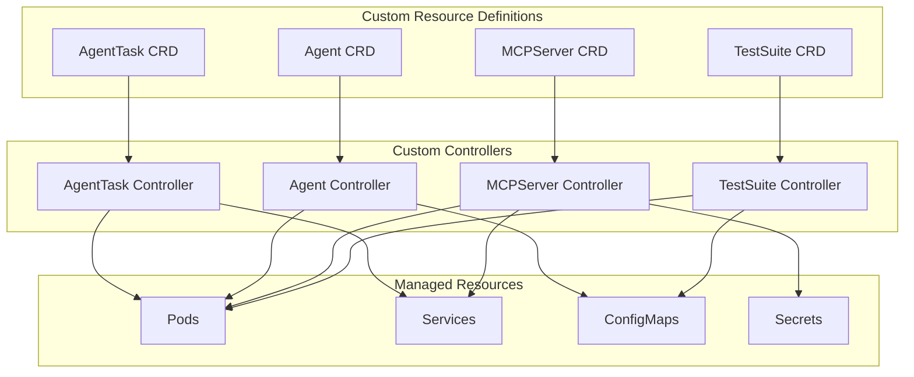
```mermaid
flowchart TB
    subgraph CRDs["Custom Resource Definitions"]
        AT[AgentTask CRD]
        AG[Agent CRD]
        MCP[MCPServer CRD]
        TS[TestSuite CRD]
    end
    
    subgraph Controllers["Custom Controllers"]
        ATC[AgentTask Controller]
        AGC[Agent Controller]
        MCPC[MCPServer Controller]
        TSC[TestSuite Controller]
    end
    
    subgraph Resources["Managed Resources"]
        Pods[Pods]
        SVC[Services]
        CM[ConfigMaps]
        SEC[Secrets]
    end
    
    AT --> ATC
    AG --> AGC
    MCP --> MCPC
    TS --> TSC
    
    ATC --> Pods & SVC
    AGC --> Pods & CM
    MCPC --> Pods & SVC & SEC
    TSC --> Pods & CM
```

### AgentTask CRD

Top-level resource that defines a task to be executed.

```yaml
apiVersion: metaagent.io/v1alpha1
kind: AgentTask
metadata:
  name: user-api-task
  namespace: tasks
spec:
  description: "Build REST API for user management"
  
  # TCP Controller settings
  controller:
    taskWeight: 1.0      # T coefficient
    contextWeight: 0.5   # C coefficient  
    predictionWeight: 0.3 # P coefficient
    errorThreshold: 0.2
    maxIterations: 10
    
  # Test generation config
  testGenerator:
    format: gherkin
    framework: behave
    
  # Resource limits for spawned agents
  resourceQuota:
    maxAgents: 5
    maxMemory: "4Gi"
    maxCPU: "4"
    
status:
  phase: Running # Pending | Running | Succeeded | Failed
  iteration: 3
  currentError: 0.35
  testsTotal: 5
  testsPassed: 3
  agents:
    - name: code-generator-abc123
      status: Completed
    - name: reviewer-def456
      status: Running
```

### Agent CRD

Defines an individual agent instance.

```yaml
apiVersion: metaagent.io/v1alpha1
kind: Agent
metadata:
  name: code-generator-abc123
  namespace: tasks
  labels:
    metaagent.io/task: user-api-task
    metaagent.io/type: code-generator
spec:
  type: code-generator
  
  # LLM configuration
  model:
    provider: anthropic
    name: claude-sonnet-4-20250514
    temperature: 0.7
    maxTokens: 4096
    
  # Agent prompt/instructions
  systemPrompt: |
    You are a code generator agent specialized in REST APIs.
    Generate clean, well-documented code.
    
  # MCP servers this agent needs
  mcpServers:
    - name: github-mcp
    - name: filesystem-mcp
    
  # Resource limits
  resources:
    limits:
      memory: "512Mi"
      cpu: "500m"
    requests:
      memory: "256Mi"
      cpu: "250m"

status:
  phase: Running
  startTime: "2026-01-19T12:00:00Z"
  tokensUsed: 2847
  output:
    configMapRef: code-generator-abc123-output
```

### MCPServer CRD

Defines an MCP server instance.

```yaml
apiVersion: metaagent.io/v1alpha1
kind: MCPServer
metadata:
  name: github-mcp
  namespace: tasks
  labels:
    metaagent.io/task: user-api-task
spec:
  type: github
  
  # MCP server image
  image: metaagent/mcp-github:latest
  
  # Server configuration
  config:
    capabilities:
      - repository_read
      - repository_write
      - pull_request
      
  # Credentials reference
  credentialsSecret:
    name: github-credentials
    
  # Resource limits
  resources:
    limits:
      memory: "256Mi"
      cpu: "250m"

status:
  phase: Running
  endpoint: "http://github-mcp:3000"
  tools:
    - create_repository
    - list_files
    - create_pull_request
```

### TestSuite CRD

Defines the Gherkin test suite (setpoint).

```yaml
apiVersion: metaagent.io/v1alpha1
kind: TestSuite
metadata:
  name: user-api-tests
  namespace: tasks
  labels:
    metaagent.io/task: user-api-task
spec:
  format: gherkin
  framework: behave
  
  # Gherkin feature inline or from ConfigMap
  features:
    - name: user-management
      content: |
        Feature: User Management API
          As a client
          I want to manage users via REST API
          So that I can perform CRUD operations

          Scenario: Create a new user
            Given the API is running
            When I send a POST request to "/users" with body:
              """
              {
                "name": "John Doe",
                "email": "john@example.com"
              }
              """
            Then the response status should be 201
            And the response should contain "id"

          Scenario: Get existing user
            Given a user exists with id "123"
            When I send a GET request to "/users/123"
            Then the response status should be 200
            And the response should contain "name"

          Scenario: Invalid input returns error
            Given the API is running
            When I send a POST request to "/users" with body:
              """
              {
                "invalid": "data"
              }
              """
            Then the response status should be 400
            And the response should contain "error"

  # Test Runner Agent reference
  runnerAgent:
    name: test-runner-agent

status:
  phase: Completed
  lastRun: "2026-01-19T12:05:00Z"
  results:
    total: 3
    passed: 2
    failed: 1
    error: 0.33
  failedScenarios:
    - "Invalid input returns error"
```

### Test Runner Agent CRD

```yaml
apiVersion: metaagent.io/v1alpha1
kind: Agent
metadata:
  name: test-runner-agent
  namespace: tasks
  labels:
    metaagent.io/task: user-api-task
    metaagent.io/type: test-runner
spec:
  type: test-runner
  
  model:
    provider: anthropic
    name: claude-sonnet-4-20250514
    temperature: 0.3
    maxTokens: 2048
    
  systemPrompt: |
    You are a Test Runner agent. Your job is to:
    1. Execute Gherkin test scenarios against the provided output
    2. Report pass/fail for each scenario
    3. Provide detailed failure messages
    
  # Test framework configuration
  testConfig:
    framework: behave
    timeout: 300s
    parallel: false
    
  mcpServers:
    - name: filesystem-mcp
    
  resources:
    limits:
      memory: "512Mi"
      cpu: "500m"

status:
  phase: Running
  lastExecution: "2026-01-19T12:05:00Z"
```

### Feedback Agent CRD

```yaml
apiVersion: metaagent.io/v1alpha1
kind: Agent
metadata:
  name: feedback-agent
  namespace: tasks
  labels:
    metaagent.io/task: user-api-task
    metaagent.io/type: feedback
spec:
  type: feedback
  
  model:
    provider: anthropic
    name: claude-sonnet-4-20250514
    temperature: 0.5
    maxTokens: 2048
    
  systemPrompt: |
    You are a Feedback Collector agent. Your job is to:
    1. Analyze test results from Test Runner
    2. Calculate error metrics
    3. Identify failure patterns
    4. Recommend adjustments for next iteration
    5. Update context memory with learnings
    
  # Metrics to collect
  metricsConfig:
    collectTokenUsage: true
    collectExecutionTime: true
    collectRetryCount: true
    analyzePatterns: true
    
  mcpServers:
    - name: prometheus-mcp
    
  resources:
    limits:
      memory: "256Mi"
      cpu: "250m"

status:
  phase: Running
  currentError: 0.33
  recommendations:
    - "Executor agent missed input validation"
    - "Suggest adding validation-specialist agent"
```

### Cluster Architecture

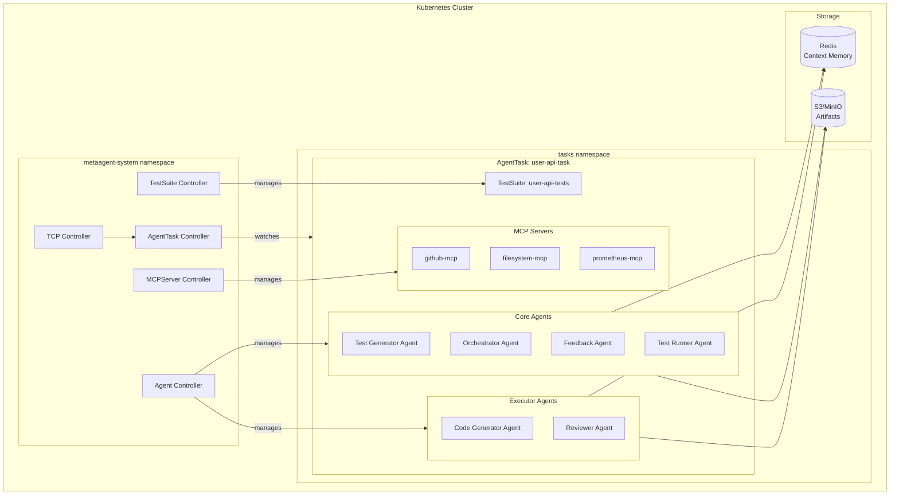
```mermaid
flowchart TB
    subgraph Cluster["Kubernetes Cluster"]
        subgraph ControlPlane["metaagent-system namespace"]
            TCPC[TCP Controller]
            ATC[AgentTask Controller]
            AGC[Agent Controller]
            MCPC[MCPServer Controller]
            TSC[TestSuite Controller]
        end
        
        subgraph TaskNS["tasks namespace"]
            subgraph Task1["AgentTask: user-api-task"]
                direction TB
                subgraph CoreAgents["Core Agents"]
                    TGA[Test Generator Agent]
                    OA[Orchestrator Agent]
                    FBA[Feedback Agent]
                    TRA[Test Runner Agent]
                end
                subgraph ExecutorAgents["Executor Agents"]
                    AG1[Code Generator Agent]
                    AG2[Reviewer Agent]
                end
                subgraph MCPServers["MCP Servers"]
                    MCP1[github-mcp]
                    MCP2[filesystem-mcp]
                    MCP3[prometheus-mcp]
                end
                TS1[TestSuite: user-api-tests]
            end
        end
        
        subgraph Storage["Storage"]
            Redis[(Redis<br/>Context Memory)]
            S3[(S3/MinIO<br/>Artifacts)]
        end
    end
    
    TCPC --> ATC
    ATC -->|"watches"| Task1
    AGC -->|"manages"| CoreAgents & ExecutorAgents
    MCPC -->|"manages"| MCPServers
    TSC -->|"manages"| TS1
    
    CoreAgents & ExecutorAgents --> Redis
    CoreAgents & ExecutorAgents --> S3
```

### Operator Reconciliation Loop

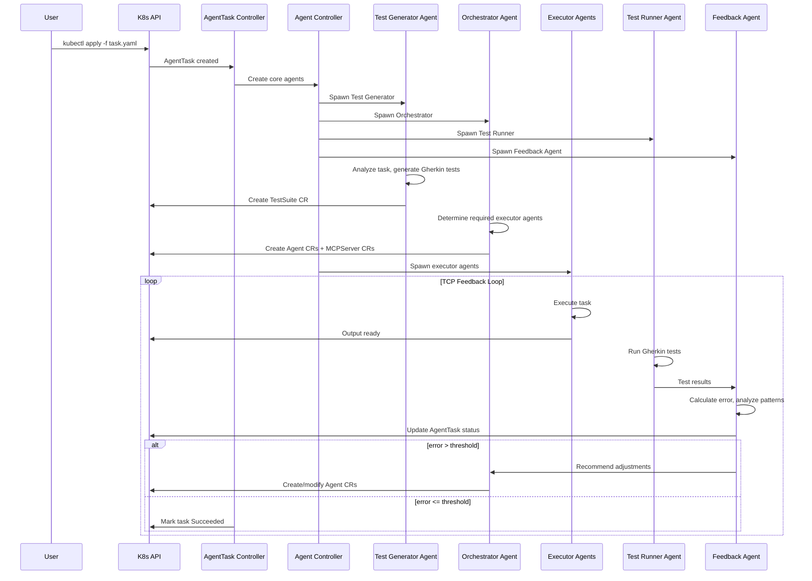
```mermaid
sequenceDiagram
    participant U as User
    participant API as K8s API
    participant ATC as AgentTask Controller
    participant AGC as Agent Controller
    participant TGA as Test Generator Agent
    participant OA as Orchestrator Agent
    participant EX as Executor Agents
    participant TRA as Test Runner Agent
    participant FBA as Feedback Agent
    
    U->>API: kubectl apply -f task.yaml
    API->>ATC: AgentTask created
    
    ATC->>AGC: Create core agents
    AGC->>TGA: Spawn Test Generator
    AGC->>OA: Spawn Orchestrator
    AGC->>TRA: Spawn Test Runner
    AGC->>FBA: Spawn Feedback Agent
    
    TGA->>TGA: Analyze task, generate Gherkin tests
    TGA->>API: Create TestSuite CR
    
    OA->>OA: Determine required executor agents
    OA->>API: Create Agent CRs + MCPServer CRs
    AGC->>EX: Spawn executor agents
    
    loop TCP Feedback Loop
        EX->>EX: Execute task
        EX->>API: Output ready
        TRA->>TRA: Run Gherkin tests
        TRA->>FBA: Test results
        FBA->>FBA: Calculate error, analyze patterns
        FBA->>API: Update AgentTask status
        alt error > threshold
            FBA->>OA: Recommend adjustments
            OA->>API: Create/modify Agent CRs
        else error <= threshold
            ATC->>API: Mark task Succeeded
        end
    end
```

### Resource Management

- **Namespace per task** — isolation
- **HPA** — scale agents based on load
- **Pod lifecycle** — terminate on completion
- **MCP servers as sidecars** — co-located with agents

---

## Edge Cases & Mitigations

| Problem | Mitigation |
|---------|------------|
| Test Agent writes bad tests | Validation layer, multiple test agents with voting |
| Tests too strict/loose | Confidence scoring on tests |
| Infinite loop | Max iterations + fallback to human review |
| Non-testable tasks | Hybrid: E2E for code, LLM-as-judge for creative |
| Agent keeps failing | Circuit breaker pattern, blacklist agent |
| Resource exhaustion | K8s resource limits, pod priority |

---

## Future Considerations

- [ ] Multi-task parallelism
- [ ] Agent marketplace / registry
- [ ] Learning from successful runs (fine-tuning)
- [ ] Cost optimization (cheap agents first, expensive as fallback)
- [ ] Human-in-the-loop for low-confidence decisions

---

## Agent Registry

A centralized registry where agents register their capabilities on startup and can be discovered by other agents or controllers.

### Why Agent Registry?

| Problem | Solution |
|---------|----------|
| How does Orchestrator find the right agent? | Search by skills/capabilities |
| New agent spins up — who knows about it? | Auto-registration on startup |
| Agent crashes — how to avoid routing to it? | Health checks + auto-deregister |
| Need specialist agent for rare task? | Query registry for matching skills |

### Registry Architecture

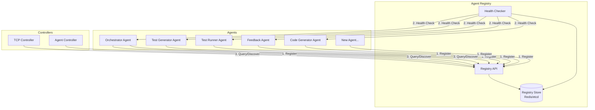
```mermaid
flowchart TB
    subgraph Registry["Agent Registry"]
        API[Registry API]
        DB[(Registry Store<br/>Redis/etcd)]
        HC[Health Checker]
    end
    
    subgraph Agents["Agents"]
        OA[Orchestrator Agent]
        TGA[Test Generator Agent]
        TRA[Test Runner Agent]
        FBA[Feedback Agent]
        CGA[Code Generator Agent]
        NEW[New Agent...]
    end
    
    subgraph Controllers["Controllers"]
        TCP[TCP Controller]
        AGC[Agent Controller]
    end
    
    OA & TGA & TRA & FBA & CGA -->|"1. Register"| API
    NEW -->|"1. Register"| API
    API --> DB
    
    HC -->|"2. Health Check"| OA & TGA & TRA & FBA & CGA
    HC --> DB
    
    TCP & AGC & OA -->|"3. Query/Discover"| API
```

### Agent Registration Flow

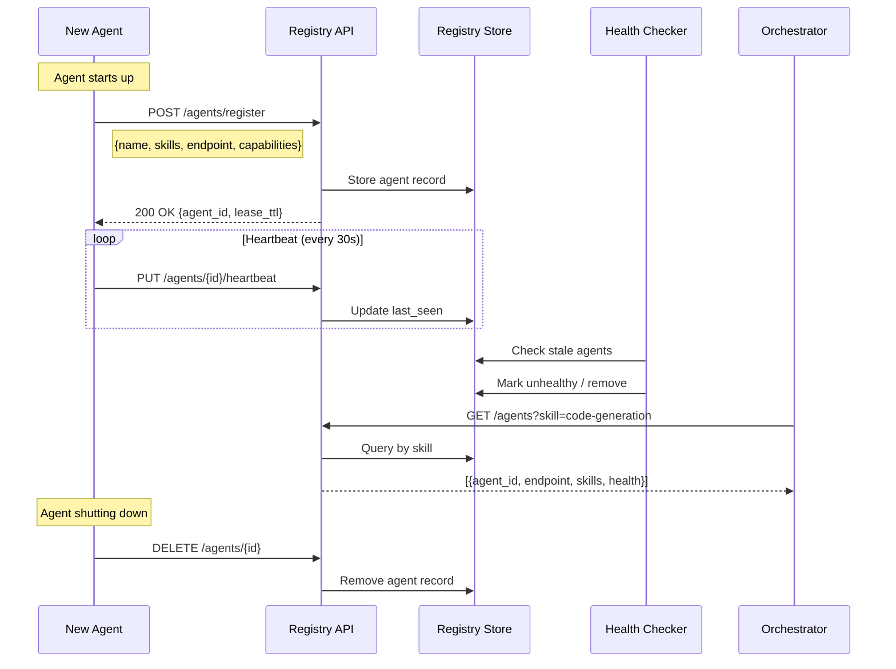
```mermaid
sequenceDiagram
    participant A as New Agent
    participant R as Registry API
    participant DB as Registry Store
    participant HC as Health Checker
    participant O as Orchestrator

    Note over A: Agent starts up
    
    A->>R: POST /agents/register
    Note right of A: {name, skills, endpoint, capabilities}
    R->>DB: Store agent record
    R-->>A: 200 OK {agent_id, lease_ttl}
    
    loop Heartbeat (every 30s)
        A->>R: PUT /agents/{id}/heartbeat
        R->>DB: Update last_seen
    end
    
    HC->>DB: Check stale agents
    HC->>DB: Mark unhealthy / remove
    
    O->>R: GET /agents?skill=code-generation
    R->>DB: Query by skill
    R-->>O: [{agent_id, endpoint, skills, health}]
    
    Note over A: Agent shutting down
    A->>R: DELETE /agents/{id}
    R->>DB: Remove agent record
```

### Registry CRD

```yaml
apiVersion: metaagent.io/v1alpha1
kind: AgentRegistry
metadata:
  name: meta-agent-registry
  namespace: meta-agent-system
spec:
  # Storage backend
  storage:
    type: redis  # redis, etcd, postgresql
    connectionRef:
      secretName: registry-redis-credentials
      
  # Health check configuration
  healthCheck:
    enabled: true
    interval: 30s
    timeout: 10s
    unhealthyThreshold: 3
    
  # Registration settings
  registration:
    # How long before agent must re-register
    leaseTTL: 60s
    # Require heartbeat to stay registered
    requireHeartbeat: true
    # Auto-cleanup stale registrations
    cleanupInterval: 120s
    
  # Discovery settings
  discovery:
    # Cache discovery results
    cacheEnabled: true
    cacheTTL: 10s
    # Enable skill-based search
    skillMatching: true
    # Enable capability filtering
    capabilityFiltering: true
    
  # API server configuration
  api:
    port: 8082
    rateLimit:
      requestsPerMinute: 1000
```

### Agent Registration Record

```yaml
apiVersion: metaagent.io/v1alpha1
kind: AgentRegistration
metadata:
  name: code-generator-abc123
  namespace: meta-agent-system
  labels:
    metaagent.io/type: executor
    metaagent.io/skill: code-generation
spec:
  # Agent identity
  agentRef:
    name: code-generator-abc123
    namespace: meta-agent-system
    
  # Skills this agent provides (searchable)
  skills:
    - name: code-generation
      description: "Generates code from specifications"
      proficiency: 0.95  # 0-1 score
      languages:
        - python
        - javascript
        - rust
        
    - name: api-design
      description: "Designs REST API endpoints"
      proficiency: 0.85
      
    - name: documentation
      description: "Writes code documentation"
      proficiency: 0.80
      
  # Capabilities (what protocols/features supported)
  capabilities:
    a2a:
      enabled: true
      version: "1.0"
      endpoint: "http://code-generator-abc123:8080/a2a"
    a2ui:
      enabled: false
    mcp:
      enabled: true
      tools:
        - filesystem
        - github
    streaming:
      enabled: true
      format: sse
      
  # Resource information
  resources:
    maxConcurrentTasks: 5
    currentLoad: 2
    memoryUsage: "256Mi"
    cpuUsage: "200m"
    
  # Model information
  model:
    provider: anthropic
    name: claude-sonnet-4-20250514
    
status:
  phase: Healthy  # Healthy, Unhealthy, Unknown, Deregistered
  lastHeartbeat: "2026-01-19T12:05:00Z"
  registeredAt: "2026-01-19T10:00:00Z"
  tasksCompleted: 47
  averageLatency: "2.3s"
  successRate: 0.94
```

### Registry API

```yaml
# OpenAPI spec for Registry API
openapi: 3.0.0
info:
  title: Agent Registry API
  version: 1.0.0
  
paths:
  /agents/register:
    post:
      summary: Register a new agent
      requestBody:
        content:
          application/json:
            schema:
              $ref: '#/components/schemas/AgentRegistration'
      responses:
        '200':
          description: Registration successful
          content:
            application/json:
              schema:
                type: object
                properties:
                  agentId:
                    type: string
                  leaseTTL:
                    type: integer
                    
  /agents/{agentId}:
    get:
      summary: Get agent details
      parameters:
        - name: agentId
          in: path
          required: true
          schema:
            type: string
      responses:
        '200':
          description: Agent details
          
    delete:
      summary: Deregister agent
      parameters:
        - name: agentId
          in: path
          required: true
          schema:
            type: string
      responses:
        '204':
          description: Deregistered
          
  /agents/{agentId}/heartbeat:
    put:
      summary: Send heartbeat
      parameters:
        - name: agentId
          in: path
          required: true
          schema:
            type: string
      requestBody:
        content:
          application/json:
            schema:
              type: object
              properties:
                currentLoad:
                  type: integer
                memoryUsage:
                  type: string
      responses:
        '200':
          description: Heartbeat accepted
          
  /agents/search:
    get:
      summary: Search agents by criteria
      parameters:
        - name: skill
          in: query
          schema:
            type: string
          description: Filter by skill name
        - name: capability
          in: query
          schema:
            type: string
          description: Filter by capability (a2a, a2ui, mcp)
        - name: healthy
          in: query
          schema:
            type: boolean
          description: Only return healthy agents
        - name: minProficiency
          in: query
          schema:
            type: number
          description: Minimum skill proficiency (0-1)
        - name: maxLoad
          in: query
          schema:
            type: integer
          description: Maximum current load
      responses:
        '200':
          description: Matching agents
          content:
            application/json:
              schema:
                type: array
                items:
                  $ref: '#/components/schemas/AgentRegistration'
                  
  /agents/skills:
    get:
      summary: List all available skills
      responses:
        '200':
          description: List of skills
          content:
            application/json:
              schema:
                type: array
                items:
                  type: object
                  properties:
                    name:
                      type: string
                    agentCount:
                      type: integer
                    avgProficiency:
                      type: number
```

### Agent Registration on Startup (Rust)

```rust
// src/registry/client.rs
use anyhow::Result;
use reqwest::Client;
use serde::{Deserialize, Serialize};
use std::sync::Arc;
use tokio::sync::RwLock;
use tokio::time::{interval, Duration};
use tracing::{info, error};

#[derive(Debug, Clone, Serialize, Deserialize)]
pub struct Skill {
    pub name: String,
    pub description: String,
    pub proficiency: f32,
    #[serde(skip_serializing_if = "Option::is_none")]
    pub metadata: Option<serde_json::Value>,
}

#[derive(Debug, Clone, Serialize, Deserialize)]
pub struct AgentCapabilities {
    pub a2a: A2ACapability,
    pub a2ui: A2UICapability,
    pub mcp: MCPCapability,
    pub streaming: StreamingCapability,
}

#[derive(Debug, Clone, Serialize, Deserialize)]
pub struct A2ACapability {
    pub enabled: bool,
    #[serde(skip_serializing_if = "Option::is_none")]
    pub endpoint: Option<String>,
}

#[derive(Debug, Clone, Serialize, Deserialize)]
pub struct A2UICapability {
    pub enabled: bool,
}

#[derive(Debug, Clone, Serialize, Deserialize)]
pub struct MCPCapability {
    pub enabled: bool,
    #[serde(default)]
    pub tools: Vec<String>,
}

#[derive(Debug, Clone, Serialize, Deserialize)]
pub struct StreamingCapability {
    pub enabled: bool,
    #[serde(default = "default_format")]
    pub format: String,
}

fn default_format() -> String {
    "sse".to_string()
}

#[derive(Debug, Serialize)]
struct RegistrationRequest {
    name: String,
    endpoint: String,
    skills: Vec<Skill>,
    capabilities: AgentCapabilities,
}

#[derive(Debug, Deserialize)]
struct RegistrationResponse {
    agent_id: String,
    lease_ttl: u64,
}

#[derive(Debug, Serialize)]
struct HeartbeatRequest {
    current_load: u32,
    memory_usage: String,
}

pub struct AgentRegistryClient {
    client: Client,
    registry_url: String,
    agent_name: String,
    agent_id: Arc<RwLock<Option<String>>>,
    lease_ttl: Arc<RwLock<u64>>,
    shutdown_tx: Option<tokio::sync::oneshot::Sender<()>>,
}

impl AgentRegistryClient {
    pub fn new(registry_url: &str, agent_name: &str) -> Self {
        Self {
            client: Client::new(),
            registry_url: registry_url.to_string(),
            agent_name: agent_name.to_string(),
            agent_id: Arc::new(RwLock::new(None)),
            lease_ttl: Arc::new(RwLock::new(60)),
            shutdown_tx: None,
        }
    }

    pub async fn register(
        &mut self,
        skills: Vec<Skill>,
        capabilities: AgentCapabilities,
        endpoint: &str,
    ) -> Result<String> {
        let request = RegistrationRequest {
            name: self.agent_name.clone(),
            endpoint: endpoint.to_string(),
            skills,
            capabilities,
        };

        let response: RegistrationResponse = self
            .client
            .post(format!("{}/agents/register", self.registry_url))
            .json(&request)
            .send()
            .await?
            .error_for_status()?
            .json()
            .await?;

        // Store agent_id and lease_ttl
        {
            let mut id = self.agent_id.write().await;
            *id = Some(response.agent_id.clone());
        }
        {
            let mut ttl = self.lease_ttl.write().await;
            *ttl = response.lease_ttl;
        }

        // Start heartbeat loop
        let (shutdown_tx, shutdown_rx) = tokio::sync::oneshot::channel();
        self.shutdown_tx = Some(shutdown_tx);
        
        self.spawn_heartbeat_loop(shutdown_rx);

        info!(agent_id = %response.agent_id, "Agent registered successfully");
        Ok(response.agent_id)
    }

    fn spawn_heartbeat_loop(&self, mut shutdown_rx: tokio::sync::oneshot::Receiver<()>) {
        let client = self.client.clone();
        let registry_url = self.registry_url.clone();
        let agent_id = self.agent_id.clone();
        let lease_ttl = self.lease_ttl.clone();

        tokio::spawn(async move {
            loop {
                let ttl = *lease_ttl.read().await;
                let mut interval = interval(Duration::from_secs(ttl / 2));
                
                tokio::select! {
                    _ = interval.tick() => {
                        if let Some(id) = agent_id.read().await.as_ref() {
                            if let Err(e) = Self::send_heartbeat(&client, &registry_url, id).await {
                                error!(error = %e, "Heartbeat failed");
                            }
                        }
                    }
                    _ = &mut shutdown_rx => {
                        info!("Heartbeat loop shutting down");
                        break;
                    }
                }
            }
        });
    }

    async fn send_heartbeat(client: &Client, registry_url: &str, agent_id: &str) -> Result<()> {
        let request = HeartbeatRequest {
            current_load: Self::get_current_load(),
            memory_usage: Self::get_memory_usage(),
        };

        client
            .put(format!("{}/agents/{}/heartbeat", registry_url, agent_id))
            .json(&request)
            .send()
            .await?
            .error_for_status()?;

        Ok(())
    }

    pub async fn deregister(&mut self) -> Result<()> {
        // Stop heartbeat loop
        if let Some(tx) = self.shutdown_tx.take() {
            let _ = tx.send(());
        }

        // Deregister from registry
        if let Some(id) = self.agent_id.read().await.as_ref() {
            self.client
                .delete(format!("{}/agents/{}", self.registry_url, id))
                .send()
                .await?
                .error_for_status()?;
            
            info!(agent_id = %id, "Agent deregistered");
        }

        Ok(())
    }

    fn get_current_load() -> u32 {
        // TODO: Implement actual load tracking
        0
    }

    fn get_memory_usage() -> String {
        // TODO: Implement actual memory tracking
        "256Mi".to_string()
    }
}

// Usage
#[tokio::main]
async fn main() -> Result<()> {
    tracing_subscriber::init();

    let mut registry = AgentRegistryClient::new(
        "http://agent-registry:8082",
        "code-generator-agent",
    );

    let agent_id = registry
        .register(
            vec![
                Skill {
                    name: "code-generation".to_string(),
                    description: "Generates code from specs".to_string(),
                    proficiency: 0.95,
                    metadata: Some(serde_json::json!({
                        "languages": ["python", "javascript", "rust"]
                    })),
                },
                Skill {
                    name: "api-design".to_string(),
                    description: "Designs REST APIs".to_string(),
                    proficiency: 0.85,
                    metadata: None,
                },
            ],
            AgentCapabilities {
                a2a: A2ACapability {
                    enabled: true,
                    endpoint: Some("http://code-generator:8080/a2a".to_string()),
                },
                a2ui: A2UICapability { enabled: false },
                mcp: MCPCapability {
                    enabled: true,
                    tools: vec!["filesystem".to_string(), "github".to_string()],
                },
                streaming: StreamingCapability {
                    enabled: true,
                    format: "sse".to_string(),
                },
            },
            "http://code-generator:8080",
        )
        .await?;

    println!("Registered with ID: {}", agent_id);

    // Run agent main loop...
    tokio::signal::ctrl_c().await?;

    registry.deregister().await?;
    Ok(())
}
```

### Agent Registry Service (Rust)

```rust
// src/registry/server.rs
use axum::{
    extract::{Path, Query, State},
    http::StatusCode,
    routing::{delete, get, post, put},
    Json, Router,
};
use redis::AsyncCommands;
use serde::{Deserialize, Serialize};
use std::sync::Arc;
use tokio::sync::RwLock;
use tracing::{info, error};
use uuid::Uuid;

#[derive(Clone)]
pub struct AppState {
    redis: redis::Client,
    config: RegistryConfig,
}

#[derive(Clone)]
pub struct RegistryConfig {
    pub lease_ttl: u64,
    pub cleanup_interval: u64,
    pub unhealthy_threshold: u64,
}

#[derive(Debug, Serialize, Deserialize)]
pub struct AgentRegistration {
    pub id: String,
    pub name: String,
    pub endpoint: String,
    pub skills: Vec<Skill>,
    pub capabilities: serde_json::Value,
    pub status: AgentStatus,
    pub registered_at: chrono::DateTime<chrono::Utc>,
    pub last_heartbeat: chrono::DateTime<chrono::Utc>,
    pub current_load: u32,
    pub memory_usage: String,
}

#[derive(Debug, Serialize, Deserialize, Clone, PartialEq)]
#[serde(rename_all = "lowercase")]
pub enum AgentStatus {
    Healthy,
    Unhealthy,
    Unknown,
}

#[derive(Debug, Serialize, Deserialize, Clone)]
pub struct Skill {
    pub name: String,
    pub description: String,
    pub proficiency: f32,
    #[serde(skip_serializing_if = "Option::is_none")]
    pub metadata: Option<serde_json::Value>,
}

// Request/Response types
#[derive(Debug, Deserialize)]
pub struct RegisterRequest {
    pub name: String,
    pub endpoint: String,
    pub skills: Vec<Skill>,
    pub capabilities: serde_json::Value,
}

#[derive(Debug, Serialize)]
pub struct RegisterResponse {
    pub agent_id: String,
    pub lease_ttl: u64,
}

#[derive(Debug, Deserialize)]
pub struct HeartbeatRequest {
    pub current_load: u32,
    pub memory_usage: String,
}

#[derive(Debug, Deserialize)]
pub struct SearchQuery {
    pub skill: Option<String>,
    pub capability: Option<String>,
    pub healthy: Option<bool>,
    pub min_proficiency: Option<f32>,
    pub max_load: Option<u32>,
}

#[derive(Debug, Serialize)]
pub struct SkillSummary {
    pub name: String,
    pub agent_count: usize,
    pub avg_proficiency: f32,
}

// Handlers
async fn register_agent(
    State(state): State<Arc<AppState>>,
    Json(request): Json<RegisterRequest>,
) -> Result<Json<RegisterResponse>, StatusCode> {
    let agent_id = Uuid::new_v4().to_string();
    let now = chrono::Utc::now();

    let registration = AgentRegistration {
        id: agent_id.clone(),
        name: request.name,
        endpoint: request.endpoint,
        skills: request.skills,
        capabilities: request.capabilities,
        status: AgentStatus::Healthy,
        registered_at: now,
        last_heartbeat: now,
        current_load: 0,
        memory_usage: "0Mi".to_string(),
    };

    // Store in Redis
    let mut conn = state.redis.get_async_connection().await
        .map_err(|_| StatusCode::INTERNAL_SERVER_ERROR)?;

    let json = serde_json::to_string(&registration)
        .map_err(|_| StatusCode::INTERNAL_SERVER_ERROR)?;

    conn.set_ex::<_, _, ()>(
        format!("agent:{}", agent_id),
        json,
        state.config.lease_ttl * 2,
    )
    .await
    .map_err(|_| StatusCode::INTERNAL_SERVER_ERROR)?;

    // Add to agent index
    conn.sadd::<_, _, ()>("agents:index", &agent_id)
        .await
        .map_err(|_| StatusCode::INTERNAL_SERVER_ERROR)?;

    // Index by skills
    for skill in &registration.skills {
        conn.sadd::<_, _, ()>(format!("skill:{}:agents", skill.name), &agent_id)
            .await
            .map_err(|_| StatusCode::INTERNAL_SERVER_ERROR)?;
    }

    info!(agent_id = %agent_id, name = %registration.name, "Agent registered");

    Ok(Json(RegisterResponse {
        agent_id,
        lease_ttl: state.config.lease_ttl,
    }))
}

async fn heartbeat(
    State(state): State<Arc<AppState>>,
    Path(agent_id): Path<String>,
    Json(request): Json<HeartbeatRequest>,
) -> Result<StatusCode, StatusCode> {
    let mut conn = state.redis.get_async_connection().await
        .map_err(|_| StatusCode::INTERNAL_SERVER_ERROR)?;

    // Get current registration
    let json: Option<String> = conn
        .get(format!("agent:{}", agent_id))
        .await
        .map_err(|_| StatusCode::INTERNAL_SERVER_ERROR)?;

    let json = json.ok_or(StatusCode::NOT_FOUND)?;
    let mut registration: AgentRegistration = serde_json::from_str(&json)
        .map_err(|_| StatusCode::INTERNAL_SERVER_ERROR)?;

    // Update heartbeat
    registration.last_heartbeat = chrono::Utc::now();
    registration.current_load = request.current_load;
    registration.memory_usage = request.memory_usage;
    registration.status = AgentStatus::Healthy;

    // Save back
    let json = serde_json::to_string(&registration)
        .map_err(|_| StatusCode::INTERNAL_SERVER_ERROR)?;

    conn.set_ex::<_, _, ()>(
        format!("agent:{}", agent_id),
        json,
        state.config.lease_ttl * 2,
    )
    .await
    .map_err(|_| StatusCode::INTERNAL_SERVER_ERROR)?;

    Ok(StatusCode::OK)
}

async fn get_agent(
    State(state): State<Arc<AppState>>,
    Path(agent_id): Path<String>,
) -> Result<Json<AgentRegistration>, StatusCode> {
    let mut conn = state.redis.get_async_connection().await
        .map_err(|_| StatusCode::INTERNAL_SERVER_ERROR)?;

    let json: Option<String> = conn
        .get(format!("agent:{}", agent_id))
        .await
        .map_err(|_| StatusCode::INTERNAL_SERVER_ERROR)?;

    let json = json.ok_or(StatusCode::NOT_FOUND)?;
    let registration: AgentRegistration = serde_json::from_str(&json)
        .map_err(|_| StatusCode::INTERNAL_SERVER_ERROR)?;

    Ok(Json(registration))
}

async fn deregister_agent(
    State(state): State<Arc<AppState>>,
    Path(agent_id): Path<String>,
) -> Result<StatusCode, StatusCode> {
    let mut conn = state.redis.get_async_connection().await
        .map_err(|_| StatusCode::INTERNAL_SERVER_ERROR)?;

    // Get registration to clean up skill indexes
    let json: Option<String> = conn
        .get(format!("agent:{}", agent_id))
        .await
        .map_err(|_| StatusCode::INTERNAL_SERVER_ERROR)?;

    if let Some(json) = json {
        if let Ok(registration) = serde_json::from_str::<AgentRegistration>(&json) {
            // Remove from skill indexes
            for skill in &registration.skills {
                conn.srem::<_, _, ()>(format!("skill:{}:agents", skill.name), &agent_id)
                    .await
                    .ok();
            }
        }
    }

    // Remove from index and delete record
    conn.srem::<_, _, ()>("agents:index", &agent_id)
        .await
        .map_err(|_| StatusCode::INTERNAL_SERVER_ERROR)?;

    conn.del::<_, ()>(format!("agent:{}", agent_id))
        .await
        .map_err(|_| StatusCode::INTERNAL_SERVER_ERROR)?;

    info!(agent_id = %agent_id, "Agent deregistered");

    Ok(StatusCode::NO_CONTENT)
}

async fn search_agents(
    State(state): State<Arc<AppState>>,
    Query(query): Query<SearchQuery>,
) -> Result<Json<Vec<AgentRegistration>>, StatusCode> {
    let mut conn = state.redis.get_async_connection().await
        .map_err(|_| StatusCode::INTERNAL_SERVER_ERROR)?;

    // Get agent IDs (filtered by skill if specified)
    let agent_ids: Vec<String> = if let Some(skill) = &query.skill {
        conn.smembers(format!("skill:{}:agents", skill))
            .await
            .unwrap_or_default()
    } else {
        conn.smembers("agents:index")
            .await
            .unwrap_or_default()
    };

    let mut results = Vec::new();

    for agent_id in agent_ids {
        let json: Option<String> = conn
            .get(format!("agent:{}", agent_id))
            .await
            .ok()
            .flatten();

        if let Some(json) = json {
            if let Ok(registration) = serde_json::from_str::<AgentRegistration>(&json) {
                // Apply filters
                if let Some(healthy) = query.healthy {
                    if healthy && registration.status != AgentStatus::Healthy {
                        continue;
                    }
                }

                if let Some(max_load) = query.max_load {
                    if registration.current_load > max_load {
                        continue;
                    }
                }

                if let Some(min_prof) = query.min_proficiency {
                    if let Some(skill_name) = &query.skill {
                        let has_skill = registration.skills.iter().any(|s| {
                            &s.name == skill_name && s.proficiency >= min_prof
                        });
                        if !has_skill {
                            continue;
                        }
                    }
                }

                results.push(registration);
            }
        }
    }

    Ok(Json(results))
}

async fn list_skills(
    State(state): State<Arc<AppState>>,
) -> Result<Json<Vec<SkillSummary>>, StatusCode> {
    let mut conn = state.redis.get_async_connection().await
        .map_err(|_| StatusCode::INTERNAL_SERVER_ERROR)?;

    // Get all agents
    let agent_ids: Vec<String> = conn
        .smembers("agents:index")
        .await
        .unwrap_or_default();

    let mut skill_map: std::collections::HashMap<String, (usize, f32)> = 
        std::collections::HashMap::new();

    for agent_id in agent_ids {
        let json: Option<String> = conn
            .get(format!("agent:{}", agent_id))
            .await
            .ok()
            .flatten();

        if let Some(json) = json {
            if let Ok(registration) = serde_json::from_str::<AgentRegistration>(&json) {
                for skill in registration.skills {
                    let entry = skill_map.entry(skill.name).or_insert((0, 0.0));
                    entry.0 += 1;
                    entry.1 += skill.proficiency;
                }
            }
        }
    }

    let summaries: Vec<SkillSummary> = skill_map
        .into_iter()
        .map(|(name, (count, total_prof))| SkillSummary {
            name,
            agent_count: count,
            avg_proficiency: total_prof / count as f32,
        })
        .collect();

    Ok(Json(summaries))
}

// Router setup
pub fn create_router(state: Arc<AppState>) -> Router {
    Router::new()
        .route("/agents/register", post(register_agent))
        .route("/agents/search", get(search_agents))
        .route("/agents/skills", get(list_skills))
        .route("/agents/:agent_id", get(get_agent))
        .route("/agents/:agent_id", delete(deregister_agent))
        .route("/agents/:agent_id/heartbeat", put(heartbeat))
        .with_state(state)
}

// Main
#[tokio::main]
async fn main() -> anyhow::Result<()> {
    tracing_subscriber::init();

    let redis = redis::Client::open("redis://localhost:6379")?;
    
    let state = Arc::new(AppState {
        redis,
        config: RegistryConfig {
            lease_ttl: 60,
            cleanup_interval: 120,
            unhealthy_threshold: 3,
        },
    });

    // Spawn cleanup task
    let cleanup_state = state.clone();
    tokio::spawn(async move {
        cleanup_loop(cleanup_state).await;
    });

    let app = create_router(state);

    let listener = tokio::net::TcpListener::bind("0.0.0.0:8082").await?;
    info!("Agent Registry listening on :8082");
    
    axum::serve(listener, app).await?;
    
    Ok(())
}

async fn cleanup_loop(state: Arc<AppState>) {
    let mut interval = tokio::time::interval(
        std::time::Duration::from_secs(state.config.cleanup_interval)
    );

    loop {
        interval.tick().await;
        
        if let Err(e) = cleanup_stale_agents(&state).await {
            error!(error = %e, "Cleanup failed");
        }
    }
}

async fn cleanup_stale_agents(state: &AppState) -> anyhow::Result<()> {
    let mut conn = state.redis.get_async_connection().await?;
    
    let agent_ids: Vec<String> = conn.smembers("agents:index").await?;
    let threshold = chrono::Utc::now() 
        - chrono::Duration::seconds(state.config.lease_ttl as i64 * 2);

    for agent_id in agent_ids {
        let json: Option<String> = conn.get(format!("agent:{}", agent_id)).await?;
        
        if let Some(json) = json {
            if let Ok(registration) = serde_json::from_str::<AgentRegistration>(&json) {
                if registration.last_heartbeat < threshold {
                    info!(agent_id = %agent_id, "Removing stale agent");
                    
                    // Remove from indexes
                    for skill in &registration.skills {
                        conn.srem::<_, _, ()>(
                            format!("skill:{}:agents", skill.name), 
                            &agent_id
                        ).await?;
                    }
                    conn.srem::<_, _, ()>("agents:index", &agent_id).await?;
                    conn.del::<_, ()>(format!("agent:{}", agent_id)).await?;
                }
            }
        }
    }

    Ok(())
}
```

### Cargo.toml for Backend Services

```toml
[package]
name = "meta-agent"
version = "0.1.0"
edition = "2021"

[workspace]
members = [
    "crates/registry",
    "crates/tcp-controller",
    "crates/agent-runtime",
    "crates/a2a-rs",
    "crates/common",
]

[workspace.dependencies]
# Async runtime
tokio = { version = "1.35", features = ["full"] }

# Web framework
axum = { version = "0.7", features = ["macros"] }
tower = "0.4"
tower-http = { version = "0.5", features = ["cors", "trace"] }

# Serialization
serde = { version = "1.0", features = ["derive"] }
serde_json = "1.0"

# Database
redis = { version = "0.24", features = ["tokio-comp", "connection-manager"] }

# HTTP client
reqwest = { version = "0.11", features = ["json", "rustls-tls"] }

# Observability
tracing = "0.1"
tracing-subscriber = { version = "0.3", features = ["env-filter"] }
opentelemetry = "0.21"
opentelemetry-otlp = "0.14"

# Utils
anyhow = "1.0"
thiserror = "1.0"
uuid = { version = "1.6", features = ["v4", "serde"] }
chrono = { version = "0.4", features = ["serde"] }
config = "0.14"

# Kubernetes
kube = { version = "0.87", features = ["runtime", "derive"] }
k8s-openapi = { version = "0.20", features = ["v1_28"] }

# LLM
anthropic-sdk = "0.1"  # or custom implementation

[profile.release]
lto = true
codegen-units = 1
panic = "abort"
strip = true
```

### Rust Project Structure

```
meta-agent/
├── Cargo.toml
├── Cargo.lock
├── crates/
│   ├── registry/
│   │   ├── Cargo.toml
│   │   └── src/
│   │       ├── lib.rs
│   │       ├── main.rs
│   │       ├── handlers.rs
│   │       ├── models.rs
│   │       ├── storage.rs
│   │       └── health.rs
│   │
│   ├── tcp-controller/
│   │   ├── Cargo.toml
│   │   └── src/
│   │       ├── lib.rs
│   │       ├── main.rs
│   │       ├── controller.rs
│   │       ├── feedback.rs
│   │       └── coefficients.rs
│   │
│   ├── agent-runtime/
│   │   ├── Cargo.toml
│   │   └── src/
│   │       ├── lib.rs
│   │       ├── main.rs
│   │       ├── agent.rs
│   │       ├── llm.rs
│   │       └── executor.rs
│   │
│   ├── a2a-rs/
│   │   ├── Cargo.toml
│   │   └── src/
│   │       ├── lib.rs
│   │       ├── client.rs
│   │       ├── server.rs
│   │       ├── types.rs
│   │       └── transport.rs
│   │
│   └── common/
│       ├── Cargo.toml
│       └── src/
│           ├── lib.rs
│           ├── config.rs
│           ├── errors.rs
│           └── telemetry.rs
│
├── docker/
│   ├── Dockerfile.registry
│   ├── Dockerfile.tcp-controller
│   └── Dockerfile.agent
│
└── helm/
    └── meta-agent/
```

### Dockerfile for Rust Services

```dockerfile
# docker/Dockerfile.registry
FROM rust:1.75-alpine AS builder

RUN apk add --no-cache musl-dev

WORKDIR /app

# Copy workspace files
COPY Cargo.toml Cargo.lock ./
COPY crates ./crates

# Build release binary
RUN cargo build --release --package registry

# Runtime image
FROM alpine:3.19

RUN apk add --no-cache ca-certificates

COPY --from=builder /app/target/release/registry /usr/local/bin/

EXPOSE 8082

ENV RUST_LOG=info

CMD ["registry"]
```

### Orchestrator Agent Discovery (Rust)

```rust
// src/discovery.rs
use anyhow::Result;
use reqwest::Client;
use serde::{Deserialize, Serialize};
use tracing::info;

#[derive(Debug, Clone, Serialize, Deserialize)]
pub struct DiscoveredAgent {
    pub id: String,
    pub name: String,
    pub endpoint: String,
    pub skills: Vec<Skill>,
    pub capabilities: serde_json::Value,
    pub status: String,
    pub current_load: u32,
}

#[derive(Debug, Clone, Serialize, Deserialize)]
pub struct Skill {
    pub name: String,
    pub description: String,
    pub proficiency: f32,
    #[serde(skip_serializing_if = "Option::is_none")]
    pub metadata: Option<serde_json::Value>,
}

pub struct AgentDiscovery {
    client: Client,
    registry_url: String,
}

impl AgentDiscovery {
    pub fn new(registry_url: &str) -> Self {
        Self {
            client: Client::new(),
            registry_url: registry_url.to_string(),
        }
    }

    /// Find the best agent for a given skill requirement
    pub async fn find_agent_for_task(
        &self,
        required_skill: &str,
        min_proficiency: f32,
        prefer_low_load: bool,
    ) -> Result<Option<DiscoveredAgent>> {
        let mut agents = self
            .search_agents(Some(required_skill), None, true, Some(min_proficiency), None)
            .await?;

        if agents.is_empty() {
            return Ok(None);
        }

        if prefer_low_load {
            // Sort by load (ascending), then by proficiency (descending)
            agents.sort_by(|a, b| {
                let load_cmp = a.current_load.cmp(&b.current_load);
                if load_cmp == std::cmp::Ordering::Equal {
                    let prof_a = self.get_skill_proficiency(a, required_skill);
                    let prof_b = self.get_skill_proficiency(b, required_skill);
                    prof_b.partial_cmp(&prof_a).unwrap_or(std::cmp::Ordering::Equal)
                } else {
                    load_cmp
                }
            });
        } else {
            // Sort by proficiency only (descending)
            agents.sort_by(|a, b| {
                let prof_a = self.get_skill_proficiency(a, required_skill);
                let prof_b = self.get_skill_proficiency(b, required_skill);
                prof_b.partial_cmp(&prof_a).unwrap_or(std::cmp::Ordering::Equal)
            });
        }

        Ok(agents.into_iter().next())
    }

    /// Search registry for agents matching criteria
    pub async fn search_agents(
        &self,
        skill: Option<&str>,
        capability: Option<&str>,
        healthy_only: bool,
        min_proficiency: Option<f32>,
        max_load: Option<u32>,
    ) -> Result<Vec<DiscoveredAgent>> {
        let mut params = Vec::new();

        if let Some(s) = skill {
            params.push(("skill", s.to_string()));
        }
        if let Some(c) = capability {
            params.push(("capability", c.to_string()));
        }
        if healthy_only {
            params.push(("healthy", "true".to_string()));
        }
        if let Some(p) = min_proficiency {
            params.push(("minProficiency", p.to_string()));
        }
        if let Some(l) = max_load {
            params.push(("maxLoad", l.to_string()));
        }

        let response = self
            .client
            .get(format!("{}/agents/search", self.registry_url))
            .query(&params)
            .send()
            .await?
            .error_for_status()?
            .json::<Vec<DiscoveredAgent>>()
            .await?;

        Ok(response)
    }

    /// Get list of all skills available in the registry
    pub async fn get_available_skills(&self) -> Result<Vec<SkillSummary>> {
        let response = self
            .client
            .get(format!("{}/agents/skills", self.registry_url))
            .send()
            .await?
            .error_for_status()?
            .json()
            .await?;

        Ok(response)
    }

    fn get_skill_proficiency(&self, agent: &DiscoveredAgent, skill_name: &str) -> f32 {
        agent
            .skills
            .iter()
            .find(|s| s.name == skill_name)
            .map(|s| s.proficiency)
            .unwrap_or(0.0)
    }
}

#[derive(Debug, Deserialize)]
pub struct SkillSummary {
    pub name: String,
    pub agent_count: usize,
    pub avg_proficiency: f32,
}

// Usage in Orchestrator Agent
pub async fn orchestrate_task(
    discovery: &AgentDiscovery,
    task_description: &str,
) -> Result<std::collections::HashMap<String, DiscoveredAgent>> {
    // Analyze task to determine required skills
    let required_skills = analyze_task_skills(task_description);
    // e.g., vec!["code-generation", "testing", "documentation"]

    let mut selected_agents = std::collections::HashMap::new();

    for skill in required_skills {
        match discovery
            .find_agent_for_task(&skill, 0.8, true)
            .await?
        {
            Some(agent) => {
                info!(
                    skill = %skill,
                    agent_id = %agent.id,
                    agent_name = %agent.name,
                    "Found agent for skill"
                );
                selected_agents.insert(skill, agent);
            }
            None => {
                // No agent found - might need to create one dynamically
                info!(skill = %skill, "No agent found for skill");
            }
        }
    }

    Ok(selected_agents)
}

fn analyze_task_skills(task_description: &str) -> Vec<String> {
    // TODO: Use LLM to analyze task and extract required skills
    // For now, return hardcoded skills based on keywords
    let mut skills = Vec::new();
    
    let description = task_description.to_lowercase();
    
    if description.contains("api") || description.contains("code") {
        skills.push("code-generation".to_string());
    }
    if description.contains("test") {
        skills.push("testing".to_string());
    }
    if description.contains("document") {
        skills.push("documentation".to_string());
    }
    if description.contains("review") {
        skills.push("code-review".to_string());
    }
    
    if skills.is_empty() {
        skills.push("general".to_string());
    }
    
    skills
}
```

### Helm Values for Registry

```yaml
# values.yaml (additions)
agentRegistry:
  enabled: true
  
  image:
    repository: metaagent/agent-registry
    tag: latest
    
  replicas: 2  # HA
  
  storage:
    type: redis
    # Uses same Redis as other components
    
  healthCheck:
    enabled: true
    interval: 30s
    timeout: 10s
    unhealthyThreshold: 3
    
  registration:
    leaseTTL: 60s
    requireHeartbeat: true
    cleanupInterval: 120s
    
  api:
    port: 8082
    
  service:
    type: ClusterIP
    port: 8082
    
  resources:
    limits:
      memory: "256Mi"
      cpu: "250m"
```

### Registry in Cluster Architecture

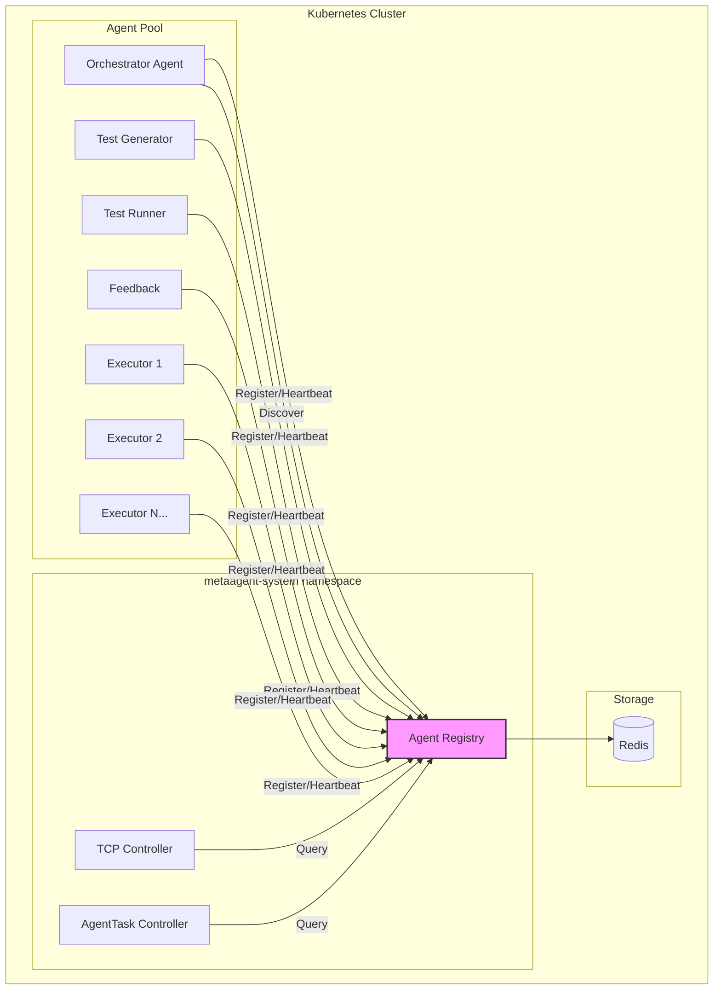
```mermaid
flowchart TB
    subgraph Cluster["Kubernetes Cluster"]
        subgraph ControlPlane["metaagent-system namespace"]
            REG[Agent Registry]
            TCPC[TCP Controller]
            ATC[AgentTask Controller]
        end
        
        subgraph AgentPool["Agent Pool"]
            OA[Orchestrator Agent]
            TGA[Test Generator]
            TRA[Test Runner]
            FBA[Feedback]
            EX1[Executor 1]
            EX2[Executor 2]
            EXN[Executor N...]
        end
        
        subgraph Storage["Storage"]
            Redis[(Redis)]
        end
    end
    
    OA & TGA & TRA & FBA & EX1 & EX2 & EXN -->|"Register/Heartbeat"| REG
    REG --> Redis
    
    TCPC & ATC -->|"Query"| REG
    OA -->|"Discover"| REG
    
    style REG fill:#f9f,stroke:#333,stroke-width:2px
```

## Agent Communication: A2A Protocol

Agents communicate using the **Agent2Agent (A2A) Protocol** — an open standard by Google (now Linux Foundation) for secure agent-to-agent communication.

### Why A2A?

| Protocol | Purpose |
|----------|---------|
| **MCP** | Agent ↔ Tools/Data communication |
| **A2A** | Agent ↔ Agent communication |

A2A complements MCP: use MCP for tools and data access, use A2A for inter-agent collaboration.

### A2A Core Concepts

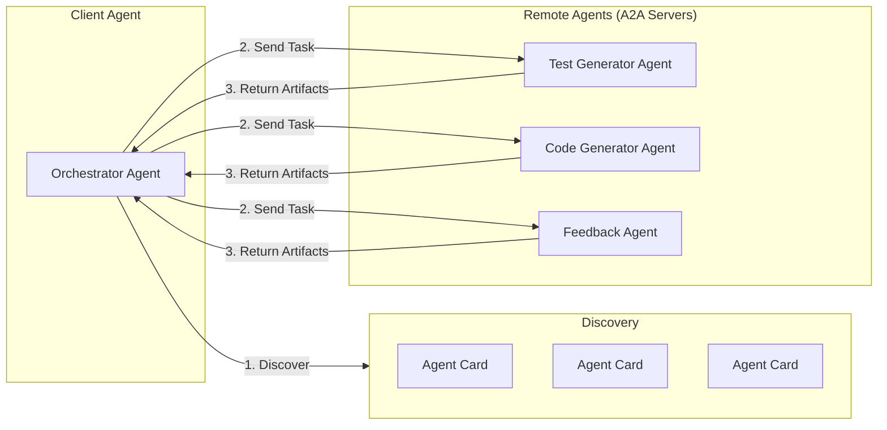
```mermaid
flowchart LR
    subgraph ClientAgent["Client Agent"]
        CA[Orchestrator Agent]
    end
    
    subgraph Discovery["Discovery"]
        AC1[Agent Card]
        AC2[Agent Card]
        AC3[Agent Card]
    end
    
    subgraph RemoteAgents["Remote Agents (A2A Servers)"]
        RA1[Test Generator Agent]
        RA2[Code Generator Agent]
        RA3[Feedback Agent]
    end
    
    CA -->|"1. Discover"| Discovery
    CA -->|"2. Send Task"| RA1 & RA2 & RA3
    RA1 & RA2 & RA3 -->|"3. Return Artifacts"| CA
```

### Agent Card

Each agent exposes an **Agent Card** — a JSON manifest describing its capabilities:

```json
{
  "name": "test-generator-agent",
  "description": "Generates Gherkin E2E tests from task descriptions",
  "version": "1.0.0",
  "endpoint": "https://agents.metaagent.io/test-generator",
  "capabilities": {
    "streaming": true,
    "pushNotifications": true
  },
  "skills": [
    {
      "name": "generate-gherkin",
      "description": "Analyzes task and generates Gherkin feature files",
      "inputModes": ["text"],
      "outputModes": ["text", "file"]
    }
  ],
  "authentication": {
    "type": "oauth2",
    "authorizationUrl": "https://auth.metaagent.io/oauth/authorize"
  }
}
```

### A2A Message Flow

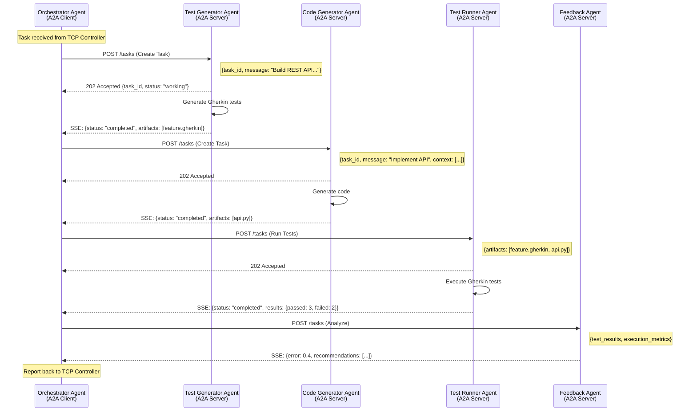
```mermaid
sequenceDiagram
    participant OA as Orchestrator Agent<br/>(A2A Client)
    participant TGA as Test Generator Agent<br/>(A2A Server)
    participant CGA as Code Generator Agent<br/>(A2A Server)
    participant TRA as Test Runner Agent<br/>(A2A Server)
    participant FBA as Feedback Agent<br/>(A2A Server)

    Note over OA: Task received from TCP Controller
    
    OA->>TGA: POST /tasks (Create Task)
    Note right of TGA: {task_id, message: "Build REST API..."}
    TGA-->>OA: 202 Accepted {task_id, status: "working"}
    TGA->>TGA: Generate Gherkin tests
    TGA-->>OA: SSE: {status: "completed", artifacts: [feature.gherkin]}
    
    OA->>CGA: POST /tasks (Create Task)
    Note right of CGA: {task_id, message: "Implement API", context: [...]}
    CGA-->>OA: 202 Accepted
    CGA->>CGA: Generate code
    CGA-->>OA: SSE: {status: "completed", artifacts: [api.py]}
    
    OA->>TRA: POST /tasks (Run Tests)
    Note right of TRA: {artifacts: [feature.gherkin, api.py]}
    TRA-->>OA: 202 Accepted
    TRA->>TRA: Execute Gherkin tests
    TRA-->>OA: SSE: {status: "completed", results: {passed: 3, failed: 2}}
    
    OA->>FBA: POST /tasks (Analyze)
    Note right of FBA: {test_results, execution_metrics}
    FBA-->>OA: SSE: {error: 0.4, recommendations: [...]}
    
    Note over OA: Report back to TCP Controller
```

### A2A Task States

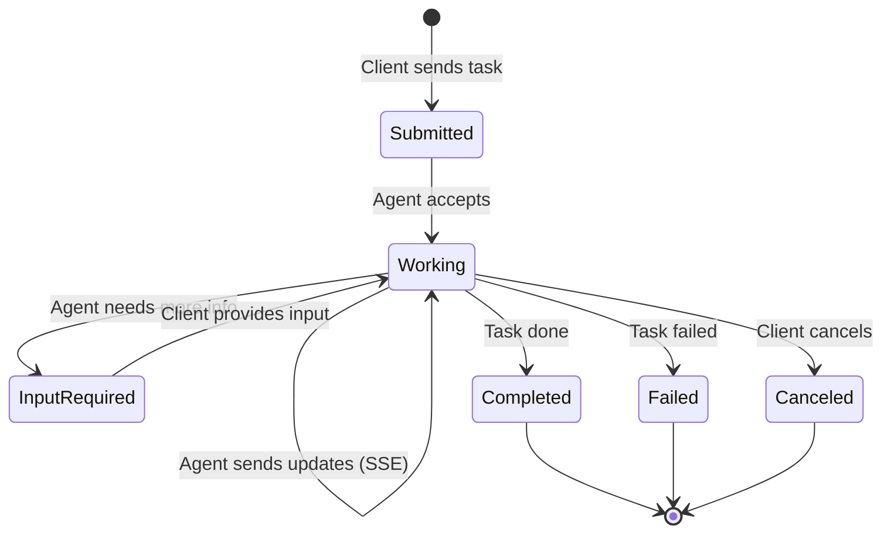
```mermaid
stateDiagram-v2
    [*] --> Submitted: Client sends task
    Submitted --> Working: Agent accepts
    Working --> Working: Agent sends updates (SSE)
    Working --> InputRequired: Agent needs more info
    InputRequired --> Working: Client provides input
    Working --> Completed: Task done
    Working --> Failed: Task failed
    Working --> Canceled: Client cancels
    Completed --> [*]
    Failed --> [*]
    Canceled --> [*]
```

### Agent CRD with A2A Configuration

```yaml
apiVersion: metaagent.io/v1alpha1
kind: Agent
metadata:
  name: test-generator-agent
  namespace: tasks
spec:
  type: test-generator
  
  # A2A Server Configuration
  a2a:
    enabled: true
    endpoint: "/a2a"
    port: 8080
    
    # Agent Card configuration
    agentCard:
      description: "Generates Gherkin E2E tests from task descriptions"
      skills:
        - name: generate-gherkin
          description: "Analyzes task and generates Gherkin feature files"
          inputModes: ["text"]
          outputModes: ["text", "file"]
      capabilities:
        streaming: true
        pushNotifications: true
        
    # Authentication
    authentication:
      type: oauth2
      secretRef:
        name: a2a-oauth-credentials
        
    # Rate limiting
    rateLimit:
      requestsPerMinute: 60
      
  model:
    provider: anthropic
    name: claude-sonnet-4-20250514
    
  # MCP servers for tools/data access
  mcpServers:
    - name: filesystem-mcp
    
  resources:
    limits:
      memory: "512Mi"
      cpu: "500m"
```

### A2A + MCP Integration

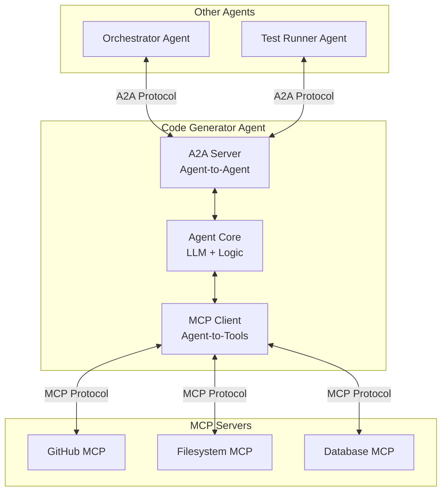
```mermaid
flowchart TB
    subgraph Agent["Code Generator Agent"]
        A2AS[A2A Server<br/>Agent-to-Agent]
        Core[Agent Core<br/>LLM + Logic]
        MCPC[MCP Client<br/>Agent-to-Tools]
    end
    
    subgraph OtherAgents["Other Agents"]
        OA[Orchestrator Agent]
        TRA[Test Runner Agent]
    end
    
    subgraph MCPServers["MCP Servers"]
        GH[GitHub MCP]
        FS[Filesystem MCP]
        DB[Database MCP]
    end
    
    OA <-->|"A2A Protocol"| A2AS
    TRA <-->|"A2A Protocol"| A2AS
    A2AS <--> Core
    Core <--> MCPC
    MCPC <-->|"MCP Protocol"| GH & FS & DB
```

### K8s Service for A2A

```yaml
apiVersion: v1
kind: Service
metadata:
  name: test-generator-agent-a2a
  namespace: tasks
  labels:
    metaagent.io/agent: test-generator-agent
    metaagent.io/protocol: a2a
spec:
  selector:
    metaagent.io/agent: test-generator-agent
  ports:
    - name: a2a
      port: 8080
      targetPort: 8080
      protocol: TCP
  type: ClusterIP
---
# Ingress for external A2A access
apiVersion: networking.k8s.io/v1
kind: Ingress
metadata:
  name: a2a-gateway
  namespace: tasks
  annotations:
    nginx.ingress.kubernetes.io/ssl-redirect: "true"
spec:
  rules:
    - host: agents.metaagent.io
      http:
        paths:
          - path: /test-generator/.well-known/agent.json
            pathType: Prefix
            backend:
              service:
                name: test-generator-agent-a2a
                port:
                  number: 8080
          - path: /test-generator/
            pathType: Prefix
            backend:
              service:
                name: test-generator-agent-a2a
                port:
                  number: 8080
```

## User Interface: A2UI Protocol

Agents interact with users using the **A2UI (Agent to User Interface)** protocol — a declarative UI protocol that lets agents generate rich, interactive interfaces without executing arbitrary code.

### Protocol Stack

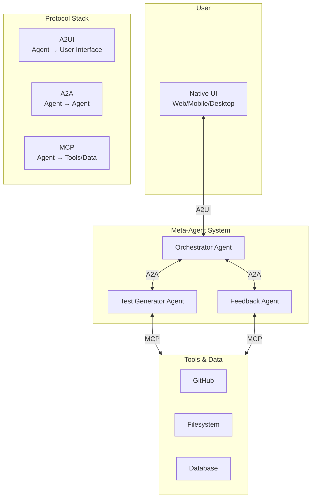
```mermaid
flowchart TB
    subgraph User["User"]
        UI[Native UI<br/>Web/Mobile/Desktop]
    end
    
    subgraph Protocols["Protocol Stack"]
        A2UI["A2UI<br/>Agent → User Interface"]
        A2A["A2A<br/>Agent → Agent"]
        MCP["MCP<br/>Agent → Tools/Data"]
    end
    
    subgraph Agents["Meta-Agent System"]
        OA[Orchestrator Agent]
        TGA[Test Generator Agent]
        FBA[Feedback Agent]
    end
    
    subgraph Tools["Tools & Data"]
        GH[GitHub]
        FS[Filesystem]
        DB[Database]
    end
    
    UI <-->|"A2UI"| OA
    OA <-->|"A2A"| TGA & FBA
    TGA & FBA <-->|"MCP"| Tools
```

| Protocol | Purpose | Direction |
|----------|---------|-----------|
| **A2UI** | Agent ↔ User Interface | Agent to User |
| **A2A** | Agent ↔ Agent | Agent to Agent |
| **MCP** | Agent ↔ Tools/Data | Agent to Tools |

### Why A2UI?

**Traditional approach (text-only):**
```
User: "Show me task status"
Agent: "Task user-api-task is running. Iteration 3 of 10. 
        Error: 0.35. Tests: 3/5 passed. Agents: code-generator 
        (completed), reviewer (running)..."
```

**With A2UI (rich UI):**
```
Agent generates → Dashboard with progress bar, test results table, 
                  agent status cards, action buttons
```

### A2UI Core Concepts

**1. Declarative, not executable** — Agents send JSON component descriptions, not code
**2. Component catalog** — Clients define trusted components agents can use
**3. Native rendering** — Same JSON renders on web, mobile, desktop
**4. Streaming** — UI builds incrementally in real-time

### A2UI Response Structure

```json
{
  "a2ui": "0.8",
  "components": [
    {
      "id": "task-dashboard",
      "type": "card",
      "properties": {
        "title": "Task: user-api-task"
      },
      "children": ["progress-section", "tests-section", "agents-section"]
    },
    {
      "id": "progress-section",
      "type": "container",
      "children": ["progress-bar", "iteration-text", "error-text"]
    },
    {
      "id": "progress-bar",
      "type": "progress",
      "properties": {
        "value": { "$data": "/task/progress" },
        "max": 100,
        "label": "Task Progress"
      }
    },
    {
      "id": "iteration-text",
      "type": "text",
      "properties": {
        "content": { "$data": "/task/iterationText" }
      }
    },
    {
      "id": "error-text",
      "type": "text",
      "properties": {
        "content": { "$data": "/task/errorText" },
        "variant": "error"
      }
    },
    {
      "id": "tests-section",
      "type": "container",
      "children": ["tests-table"]
    },
    {
      "id": "tests-table",
      "type": "table",
      "properties": {
        "columns": ["Scenario", "Status"],
        "rows": { "$data": "/task/testResults" }
      }
    },
    {
      "id": "agents-section",
      "type": "container",
      "children": ["agents-list"]
    },
    {
      "id": "agents-list",
      "type": "list",
      "properties": {
        "items": { "$data": "/task/agents" },
        "itemTemplate": "agent-card"
      }
    },
    {
      "id": "action-buttons",
      "type": "button-group",
      "children": ["retry-btn", "cancel-btn"]
    },
    {
      "id": "retry-btn",
      "type": "button",
      "properties": {
        "label": "Retry Failed Tests",
        "action": "retry_tests",
        "variant": "primary"
      }
    },
    {
      "id": "cancel-btn",
      "type": "button",
      "properties": {
        "label": "Cancel Task",
        "action": "cancel_task",
        "variant": "danger"
      }
    }
  ],
  "data": {
    "task": {
      "progress": 60,
      "iterationText": "Iteration 3 of 10",
      "errorText": "Current Error: 0.35",
      "testResults": [
        { "scenario": "Create user", "status": "✅ Passed" },
        { "scenario": "Get user", "status": "✅ Passed" },
        { "scenario": "Update user", "status": "❌ Failed" },
        { "scenario": "Delete user", "status": "✅ Passed" },
        { "scenario": "Invalid input", "status": "❌ Failed" }
      ],
      "agents": [
        { "name": "code-generator", "status": "Completed" },
        { "name": "reviewer", "status": "Running" }
      ]
    }
  }
}
```

### Component Catalog

Define trusted components the agents can use:

```yaml
# a2ui-catalog.yaml
apiVersion: metaagent.io/v1alpha1
kind: A2UICatalog
metadata:
  name: meta-agent-catalog
  namespace: meta-agent-system
spec:
  components:
    # Layout Components
    - name: card
      description: "Container with title and content"
      properties:
        - name: title
          type: string
        - name: subtitle
          type: string
          optional: true
          
    - name: container
      description: "Generic container for grouping"
      properties:
        - name: direction
          type: enum
          values: [row, column]
          default: column
          
    # Display Components
    - name: text
      description: "Text display"
      properties:
        - name: content
          type: string
        - name: variant
          type: enum
          values: [default, heading, subheading, error, success]
          
    - name: progress
      description: "Progress bar"
      properties:
        - name: value
          type: number
        - name: max
          type: number
          default: 100
        - name: label
          type: string
          
    - name: table
      description: "Data table"
      properties:
        - name: columns
          type: array
        - name: rows
          type: array
          
    - name: list
      description: "List of items"
      properties:
        - name: items
          type: array
        - name: itemTemplate
          type: string
          
    # Input Components
    - name: button
      description: "Clickable button"
      properties:
        - name: label
          type: string
        - name: action
          type: string
        - name: variant
          type: enum
          values: [primary, secondary, danger]
          
    - name: text-field
      description: "Text input"
      properties:
        - name: label
          type: string
        - name: placeholder
          type: string
        - name: value
          type: string
          
    - name: select
      description: "Dropdown select"
      properties:
        - name: label
          type: string
        - name: options
          type: array
        - name: value
          type: string
          
    # Task-Specific Components
    - name: agent-card
      description: "Agent status card"
      properties:
        - name: name
          type: string
        - name: status
          type: enum
          values: [Pending, Running, Completed, Failed]
        - name: tokensUsed
          type: number
          optional: true
          
    - name: test-result
      description: "Gherkin test result"
      properties:
        - name: scenario
          type: string
        - name: status
          type: enum
          values: [Passed, Failed, Skipped]
        - name: error
          type: string
          optional: true
          
    - name: tcp-gauge
      description: "TCP Controller gauge"
      properties:
        - name: label
          type: string
        - name: value
          type: number
        - name: threshold
          type: number
```

### A2UI Flow with A2A

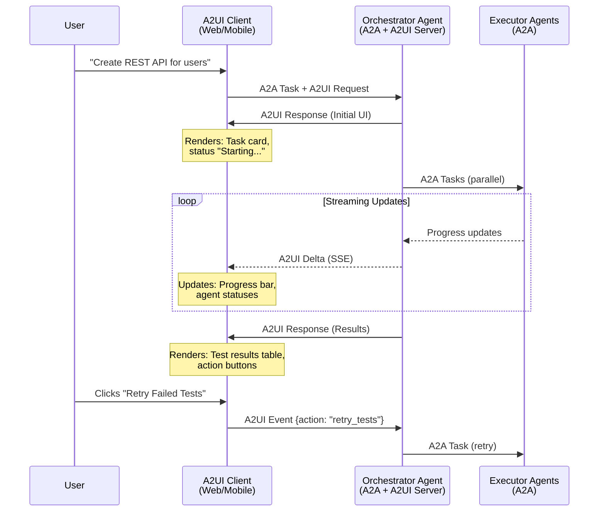
```mermaid
sequenceDiagram
    participant U as User
    participant Client as A2UI Client<br/>(Web/Mobile)
    participant OA as Orchestrator Agent<br/>(A2A + A2UI Server)
    participant Agents as Executor Agents<br/>(A2A)

    U->>Client: "Create REST API for users"
    Client->>OA: A2A Task + A2UI Request
    
    OA->>Client: A2UI Response (Initial UI)
    Note over Client: Renders: Task card,<br/>status "Starting..."
    
    OA->>Agents: A2A Tasks (parallel)
    
    loop Streaming Updates
        Agents-->>OA: Progress updates
        OA-->>Client: A2UI Delta (SSE)
        Note over Client: Updates: Progress bar,<br/>agent statuses
    end
    
    OA->>Client: A2UI Response (Results)
    Note over Client: Renders: Test results table,<br/>action buttons
    
    U->>Client: Clicks "Retry Failed Tests"
    Client->>OA: A2UI Event {action: "retry_tests"}
    OA->>Agents: A2A Task (retry)
```

### Client Renderer (React Example)

```typescript
// A2UIRenderer.tsx
import React from 'react';
import { A2UIResponse, A2UIComponent } from '@a2ui/core';

// Component catalog mapping
const componentMap: Record<string, React.ComponentType<any>> = {
  'card': Card,
  'container': Container,
  'text': Text,
  'progress': ProgressBar,
  'table': DataTable,
  'list': List,
  'button': Button,
  'agent-card': AgentCard,
  'test-result': TestResult,
  'tcp-gauge': TCPGauge,
};

interface A2UIRendererProps {
  response: A2UIResponse;
  onAction: (action: string, data?: any) => void;
}

export const A2UIRenderer: React.FC<A2UIRendererProps> = ({ 
  response, 
  onAction 
}) => {
  const { components, data } = response;
  
  const resolveData = (binding: any) => {
    if (typeof binding === 'object' && binding.$data) {
      // Resolve JSONPath reference
      return getByPath(data, binding.$data);
    }
    return binding;
  };
  
  const renderComponent = (id: string): React.ReactNode => {
    const component = components.find(c => c.id === id);
    if (!component) return null;
    
    const Component = componentMap[component.type];
    if (!Component) {
      console.warn(`Unknown component type: ${component.type}`);
      return null;
    }
    
    // Resolve data bindings in properties
    const resolvedProps = Object.entries(component.properties || {})
      .reduce((acc, [key, value]) => ({
        ...acc,
        [key]: resolveData(value)
      }), {});
    
    // Handle actions
    const handleAction = () => {
      if (resolvedProps.action) {
        onAction(resolvedProps.action, resolvedProps.actionData);
      }
    };
    
    return (
      <Component 
        key={id}
        {...resolvedProps}
        onClick={handleAction}
      >
        {component.children?.map(childId => renderComponent(childId))}
      </Component>
    );
  };
  
  // Find root component(s)
  const rootIds = components
    .filter(c => !components.some(p => p.children?.includes(c.id)))
    .map(c => c.id);
  
  return (
    <div className="a2ui-root">
      {rootIds.map(id => renderComponent(id))}
    </div>
  );
};
```

### Agent CRD with A2UI Support

```yaml
apiVersion: metaagent.io/v1alpha1
kind: Agent
metadata:
  name: orchestrator-agent
  namespace: meta-agent-system
spec:
  type: orchestrator
  
  model:
    provider: anthropic
    name: claude-sonnet-4-20250514
    
  # A2A Server (agent-to-agent)
  a2a:
    enabled: true
    port: 8080
    
  # A2UI Server (agent-to-user)
  a2ui:
    enabled: true
    port: 8081
    
    # Reference to component catalog
    catalogRef:
      name: meta-agent-catalog
      
    # Streaming configuration
    streaming:
      enabled: true
      format: sse  # Server-Sent Events
      
    # UI generation settings
    generation:
      # Include task dashboard by default
      defaultComponents:
        - task-dashboard
        - agent-status-panel
      # Max components per response
      maxComponents: 50
      
  systemPrompt: |
    You are the Orchestrator Agent with A2UI capabilities.
    
    When presenting information to users:
    1. Use A2UI components from the catalog
    2. Prefer rich UI over text when showing:
       - Task progress and status
       - Test results
       - Agent states
       - Error information
    3. Include action buttons for user interactions
    4. Stream updates in real-time
    
    Available A2UI components:
    - card, container, text, progress
    - table, list, button, select
    - agent-card, test-result, tcp-gauge
```

### Helm Values for A2UI

```yaml
# values.yaml (additions)
a2ui:
  enabled: true
  
  # A2UI Client (Frontend)
  client:
    enabled: true
    image:
      repository: metaagent/a2ui-client
      tag: latest
    framework: react  # react, angular, flutter
    port: 3000
    
  # Component catalog
  catalog:
    name: meta-agent-catalog
    components:
      # Include all standard + custom components
      standard: true
      custom:
        - agent-card
        - test-result
        - tcp-gauge
        
  # Ingress for A2UI client
  ingress:
    enabled: true
    host: ui.metaagent.io
    tls:
      enabled: true
```

### A2UI + A2A + MCP Integration Diagram

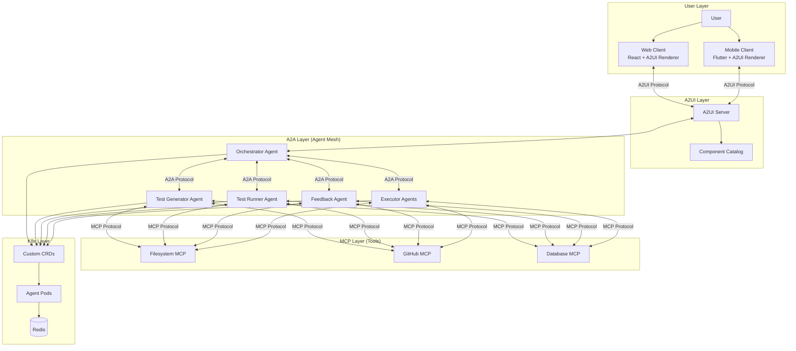
```mermaid
flowchart TB
    subgraph UserLayer["User Layer"]
        User[User]
        WebUI[Web Client<br/>React + A2UI Renderer]
        MobileUI[Mobile Client<br/>Flutter + A2UI Renderer]
    end
    
    subgraph A2UILayer["A2UI Layer"]
        A2UIS[A2UI Server]
        Catalog[Component Catalog]
    end
    
    subgraph A2ALayer["A2A Layer (Agent Mesh)"]
        OA[Orchestrator Agent]
        TGA[Test Generator Agent]
        TRA[Test Runner Agent]
        FBA[Feedback Agent]
        EX[Executor Agents]
    end
    
    subgraph MCPLayer["MCP Layer (Tools)"]
        MCPFS[Filesystem MCP]
        MCPGH[GitHub MCP]
        MCPDB[Database MCP]
    end
    
    subgraph K8sLayer["K8s Layer"]
        CRDs[Custom CRDs]
        Pods[Agent Pods]
        Redis[(Redis)]
    end
    
    User --> WebUI & MobileUI
    WebUI & MobileUI <-->|"A2UI Protocol"| A2UIS
    A2UIS --> Catalog
    A2UIS <--> OA
    
    OA <-->|"A2A Protocol"| TGA & TRA & FBA & EX
    
    TGA & TRA & FBA & EX <-->|"MCP Protocol"| MCPFS & MCPGH & MCPDB
    
    OA & TGA & TRA & FBA & EX --> CRDs
    CRDs --> Pods
    Pods --> Redis
```

## Infrastructure: Ansible + Local K8s Cluster

### Directory Structure

```
infrastructure/
├── ansible.cfg
├── inventory/
│   ├── local.yml
│   └── production.yml
├── playbooks/
│   ├── site.yml
│   ├── cluster-create.yml
│   ├── cluster-destroy.yml
│   ├── deploy-meta-agent.yml
│   └── run-tests.yml
├── roles/
│   ├── common/
│   │   ├── tasks/
│   │   │   └── main.yml
│   │   └── vars/
│   │       └── main.yml
│   ├── docker/
│   │   ├── tasks/
│   │   │   └── main.yml
│   │   └── handlers/
│   │       └── main.yml
│   ├── kind/
│   │   ├── tasks/
│   │   │   └── main.yml
│   │   ├── templates/
│   │   │   └── kind-config.yaml.j2
│   │   └── defaults/
│   │       └── main.yml
│   ├── kubectl/
│   │   └── tasks/
│   │       └── main.yml
│   ├── helm/
│   │   └── tasks/
│   │       └── main.yml
│   ├── meta-agent/
│   │   ├── tasks/
│   │   │   └── main.yml
│   │   ├── templates/
│   │   │   └── values-local.yaml.j2
│   │   └── defaults/
│   │       └── main.yml
│   └── tests/
│       ├── tasks/
│       │   └── main.yml
│       └── files/
│           └── test-task.yaml
└── group_vars/
    ├── all.yml
    └── local.yml
```

### ansible.cfg

```ini
[defaults]
inventory = inventory/local.yml
roles_path = roles
host_key_checking = False
retry_files_enabled = False
stdout_callback = yaml
interpreter_python = auto_silent

[privilege_escalation]
become = False
```

### Inventory: Local Development

```yaml
# inventory/local.yml
all:
  hosts:
    localhost:
      ansible_connection: local
      ansible_python_interpreter: "{{ ansible_playbook_python }}"
  
  vars:
    env: local
    cluster_name: meta-agent-local
    k8s_provider: kind  # kind, minikube, k3d
    
    # Kind cluster settings
    kind_version: "0.20.0"
    kubernetes_version: "1.28.0"
    kind_workers: 2
    
    # Meta-agent settings
    meta_agent_namespace: meta-agent-system
    meta_agent_chart_path: "../helm/meta-agent"
    
    # Local registry
    local_registry_enabled: true
    local_registry_port: 5000
```

### Group Variables

```yaml
# group_vars/all.yml
---
# Common variables for all environments
project_name: meta-agent
domain: metaagent.local

# Tool versions
kubectl_version: "1.28.0"
helm_version: "3.13.0"
kind_version: "0.20.0"

# Docker settings
docker_registry: "localhost:5000"

# Anthropic API (from environment or vault)
anthropic_api_key: "{{ lookup('env', 'ANTHROPIC_API_KEY') }}"

# TCP Controller defaults
tcp_coefficients:
  task: 1.0
  context: 0.5
  prediction: 0.3
```

```yaml
# group_vars/local.yml
---
# Local development overrides
k8s_context: "kind-{{ cluster_name }}"

# Smaller resources for local
resources:
  tcp_controller:
    memory: "256Mi"
    cpu: "250m"
  agents:
    memory: "256Mi"
    cpu: "250m"

# Local storage
storage:
  redis_size: "1Gi"
  minio_size: "5Gi"

# Disable TLS locally
tls_enabled: false

# Local ingress
ingress_host: "agents.local"
```

### Main Playbook: site.yml

```yaml
# playbooks/site.yml
---
- name: Setup Meta-Agent Development Environment
  hosts: localhost
  gather_facts: true
  
  vars_prompt:
    - name: action
      prompt: "Action (create/destroy/deploy/test)"
      default: "create"
      private: false

  tasks:
    - name: Create cluster
      when: action == "create"
      include_tasks: cluster-create.yml
      
    - name: Destroy cluster
      when: action == "destroy"
      include_tasks: cluster-destroy.yml
      
    - name: Deploy meta-agent
      when: action == "deploy"
      include_tasks: deploy-meta-agent.yml
      
    - name: Run tests
      when: action == "test"
      include_tasks: run-tests.yml
```

### Playbook: Cluster Create

```yaml
# playbooks/cluster-create.yml
---
- name: Create Local Kubernetes Cluster
  hosts: localhost
  gather_facts: true
  become: false
  
  pre_tasks:
    - name: Display cluster info
      debug:
        msg: |
          Creating cluster: {{ cluster_name }}
          Provider: {{ k8s_provider }}
          Workers: {{ kind_workers }}
  
  roles:
    - role: common
      tags: [common]
    - role: docker
      tags: [docker]
    - role: kubectl
      tags: [kubectl]
    - role: helm
      tags: [helm]
    - role: kind
      tags: [kind, cluster]
  
  post_tasks:
    - name: Verify cluster is running
      command: kubectl cluster-info
      register: cluster_info
      changed_when: false
      
    - name: Display cluster info
      debug:
        var: cluster_info.stdout_lines
        
    - name: Create namespaces
      kubernetes.core.k8s:
        state: present
        definition:
          apiVersion: v1
          kind: Namespace
          metadata:
            name: "{{ item }}"
      loop:
        - "{{ meta_agent_namespace }}"
        - meta-agent-tasks
        
    - name: Success message
      debug:
        msg: |
          ✅ Cluster '{{ cluster_name }}' created successfully!
          
          Next steps:
            ansible-playbook playbooks/site.yml -e action=deploy
```

### Playbook: Deploy Meta-Agent

```yaml
# playbooks/deploy-meta-agent.yml
---
- name: Deploy Meta-Agent to Cluster
  hosts: localhost
  gather_facts: true
  become: false
  
  pre_tasks:
    - name: Check cluster is running
      command: kubectl cluster-info
      register: cluster_check
      failed_when: cluster_check.rc != 0
      changed_when: false
      
    - name: Verify Anthropic API key is set
      assert:
        that:
          - anthropic_api_key | length > 0
        fail_msg: "ANTHROPIC_API_KEY environment variable must be set"
  
  roles:
    - role: meta-agent
      tags: [meta-agent, deploy]
  
  post_tasks:
    - name: Wait for core agents to be ready
      kubernetes.core.k8s_info:
        kind: Pod
        namespace: "{{ meta_agent_namespace }}"
        label_selectors:
          - "metaagent.io/type in (orchestrator, test-generator, test-runner, feedback)"
      register: agent_pods
      until: >
        agent_pods.resources | length >= 4 and
        agent_pods.resources | selectattr('status.phase', 'equalto', 'Running') | list | length >= 4
      retries: 30
      delay: 10
      
    - name: Display deployment status
      debug:
        msg: |
          ✅ Meta-Agent deployed successfully!
          
          Core Agents:
          
            - {{ pod.metadata.name }}: {{ pod.status.phase }}
          
          
          Access A2A Gateway:
            kubectl port-forward -n {{ meta_agent_namespace }} svc/a2a-gateway 8080:80
            curl http://localhost:8080/orchestrator/.well-known/agent.json
```

### Playbook: Run Tests

```yaml
# playbooks/run-tests.yml
---
- name: Run Meta-Agent Tests
  hosts: localhost
  gather_facts: true
  become: false
  
  vars:
    test_task_name: "test-task-{{ ansible_date_time.epoch }}"
  
  tasks:
    - name: Check cluster is running
      command: kubectl cluster-info
      register: cluster_check
      failed_when: cluster_check.rc != 0
      changed_when: false
      
    - name: Create test AgentTask
      kubernetes.core.k8s:
        state: present
        definition:
          apiVersion: metaagent.io/v1alpha1
          kind: AgentTask
          metadata:
            name: "{{ test_task_name }}"
            namespace: meta-agent-tasks
          spec:
            description: "Build a simple REST API endpoint that returns 'Hello World'"
            controller:
              taskWeight: 1.0
              contextWeight: 0.5
              predictionWeight: 0.3
              errorThreshold: 0.2
              maxIterations: 5
            testGenerator:
              format: gherkin
              framework: behave
            resourceQuota:
              maxAgents: 3
              maxMemory: "2Gi"
              maxCPU: "2"
      register: test_task
      
    - name: Wait for task to complete
      kubernetes.core.k8s_info:
        kind: AgentTask
        name: "{{ test_task_name }}"
        namespace: meta-agent-tasks
      register: task_status
      until: >
        task_status.resources[0].status.phase is defined and
        task_status.resources[0].status.phase in ['Succeeded', 'Failed']
      retries: 60
      delay: 10
      
    - name: Get task results
      set_fact:
        task_result: "{{ task_status.resources[0] }}"
        
    - name: Display test results
      debug:
        msg: |
          ═══════════════════════════════════════════════════
          TEST RESULTS: {{ test_task_name }}
          ═══════════════════════════════════════════════════
          
          Status: {{ task_result.status.phase }}
          Iterations: {{ task_result.status.iteration | default('N/A') }}
          Final Error: {{ task_result.status.currentError | default('N/A') }}
          
          Tests:
            Total: {{ task_result.status.testsTotal | default('N/A') }}
            Passed: {{ task_result.status.testsPassed | default('N/A') }}
          
          Agents Used:
          
            - {{ agent.name }}: {{ agent.status }}
          
          ═══════════════════════════════════════════════════
          
    - name: Assert task succeeded
      assert:
        that:
          - task_result.status.phase == 'Succeeded'
        fail_msg: "Task failed! Check logs for details."
        success_msg: "✅ All tests passed!"
        
    - name: Cleanup test task
      kubernetes.core.k8s:
        state: absent
        kind: AgentTask
        name: "{{ test_task_name }}"
        namespace: meta-agent-tasks
      when: cleanup_after_test | default(true)
```

### Role: Kind Cluster

```yaml
# roles/kind/tasks/main.yml
---
- name: Check if kind is installed
  command: which kind
  register: kind_installed
  ignore_errors: true
  changed_when: false

- name: Install kind
  when: kind_installed.rc != 0
  block:
    - name: Download kind binary
      get_url:
        url: "https://kind.sigs.k8s.io/dl/v{{ kind_version }}/kind-linux-amd64"
        dest: /usr/local/bin/kind
        mode: '0755'
      become: true

- name: Check if cluster exists
  command: "kind get clusters"
  register: existing_clusters
  changed_when: false

- name: Create kind config
  template:
    src: kind-config.yaml.j2
    dest: /tmp/kind-config.yaml
    mode: '0644'
  when: cluster_name not in existing_clusters.stdout_lines

- name: Create kind cluster
  command: >
    kind create cluster
    --name {{ cluster_name }}
    --config /tmp/kind-config.yaml
    --wait 5m
  when: cluster_name not in existing_clusters.stdout_lines

- name: Set kubectl context
  command: "kubectl config use-context kind-{{ cluster_name }}"
  changed_when: false

- name: Setup local registry
  when: local_registry_enabled | default(false)
  block:
    - name: Create local registry container
      community.docker.docker_container:
        name: kind-registry
        image: registry:2
        state: started
        restart_policy: always
        ports:
          - "{{ local_registry_port }}:5000"
          
    - name: Connect registry to kind network
      command: "docker network connect kind kind-registry"
      ignore_errors: true
      changed_when: false
```

### Role: Kind Config Template

```yaml
# roles/kind/templates/kind-config.yaml.j2
kind: Cluster
apiVersion: kind.x-k8s.io/v1alpha4
name: {{ cluster_name }}

nodes:
  - role: control-plane
    kubeadmConfigPatches:
      - |
        kind: InitConfiguration
        nodeRegistration:
          kubeletExtraArgs:
            node-labels: "ingress-ready=true"
    extraPortMappings:
      - containerPort: 80
        hostPort: 80
        protocol: TCP
      - containerPort: 443
        hostPort: 443
        protocol: TCP
      - containerPort: 30000
        hostPort: 30000
        protocol: TCP

  - role: worker



containerdConfigPatches:
  - |-
    [plugins."io.containerd.grpc.v1.cri".registry.mirrors."localhost:{{ local_registry_port }}"]
      endpoint = ["http://kind-registry:5000"]


networking:
  apiServerAddress: "127.0.0.1"
  apiServerPort: 6443
```

### Role: Meta-Agent Deployment

```yaml
# roles/meta-agent/tasks/main.yml
---
- name: Create Anthropic API secret
  kubernetes.core.k8s:
    state: present
    definition:
      apiVersion: v1
      kind: Secret
      metadata:
        name: anthropic-api-key
        namespace: "{{ meta_agent_namespace }}"
      type: Opaque
      stringData:
        api-key: "{{ anthropic_api_key }}"

- name: Generate Helm values for local environment
  template:
    src: values-local.yaml.j2
    dest: /tmp/meta-agent-values.yaml
    mode: '0644'

- name: Add Bitnami repo for dependencies
  kubernetes.core.helm_repository:
    name: bitnami
    repo_url: https://charts.bitnami.com/bitnami

- name: Update Helm dependencies
  command:
    cmd: helm dependency update
    chdir: "{{ meta_agent_chart_path }}"
  changed_when: false

- name: Deploy Meta-Agent via Helm
  kubernetes.core.helm:
    name: meta-agent
    chart_ref: "{{ meta_agent_chart_path }}"
    release_namespace: "{{ meta_agent_namespace }}"
    create_namespace: true
    values_files:
      - /tmp/meta-agent-values.yaml
    wait: true
    wait_timeout: 10m
    
- name: Install NGINX Ingress Controller
  kubernetes.core.helm:
    name: ingress-nginx
    chart_ref: ingress-nginx
    chart_repo_url: https://kubernetes.github.io/ingress-nginx
    release_namespace: ingress-nginx
    create_namespace: true
    values:
      controller:
        service:
          type: NodePort
          nodePorts:
            http: 30000
    wait: true
```

### Role: Local Values Template

```yaml
# roles/meta-agent/templates/values-local.yaml.j2
# Auto-generated for local development
# Generated by Ansible at {{ ansible_date_time.iso8601 }}

global:
  namespace: {{ meta_agent_namespace }}
  imagePullPolicy: IfNotPresent

tcpController:
  enabled: true
  replicas: 1
  coefficients:
    task: {{ tcp_coefficients.task }}
    context: {{ tcp_coefficients.context }}
    prediction: {{ tcp_coefficients.prediction }}
  resources:
    limits:
      memory: "{{ resources.tcp_controller.memory }}"
      cpu: "{{ resources.tcp_controller.cpu }}"

coreAgents:
  orchestrator:
    enabled: true
    replicas: 1
    model:
      provider: anthropic
      name: claude-sonnet-4-20250514
      temperature: 0.7
      maxTokens: 4096
    a2a:
      enabled: true
      port: 8080
    resources:
      limits:
        memory: "{{ resources.agents.memory }}"
        cpu: "{{ resources.agents.cpu }}"

  testGenerator:
    enabled: true
    replicas: 1
    model:
      provider: anthropic
      name: claude-sonnet-4-20250514
      temperature: 0.5
      maxTokens: 4096
    a2a:
      enabled: true
      port: 8080
    resources:
      limits:
        memory: "{{ resources.agents.memory }}"
        cpu: "{{ resources.agents.cpu }}"

  testRunner:
    enabled: true
    replicas: 1
    model:
      provider: anthropic
      name: claude-sonnet-4-20250514
      temperature: 0.3
      maxTokens: 2048
    a2a:
      enabled: true
      port: 8080
    resources:
      limits:
        memory: "{{ resources.agents.memory }}"
        cpu: "{{ resources.agents.cpu }}"

  feedback:
    enabled: true
    replicas: 1
    model:
      provider: anthropic
      name: claude-sonnet-4-20250514
      temperature: 0.5
      maxTokens: 2048
    a2a:
      enabled: true
      port: 8080
    resources:
      limits:
        memory: "{{ resources.agents.memory }}"
        cpu: "{{ resources.agents.cpu }}"

mcpServers:
  filesystem:
    enabled: true
  github:
    enabled: false  # Disabled for local testing
  prometheus:
    enabled: false  # Disabled for local testing

a2aGateway:
  enabled: true
  ingress:
    enabled: true
    className: nginx
    host: {{ ingress_host }}
    tls:
      enabled: {{ tls_enabled }}

storage:
  redis:
    enabled: true
    architecture: standalone
    persistence:
      size: {{ storage.redis_size }}
  minio:
    enabled: true
    persistence:
      size: {{ storage.minio_size }}

llm:
  provider: anthropic
  apiKeySecret: anthropic-api-key

observability:
  enabled: false  # Disabled for local testing
```

### Quick Start Commands

```bash
# 1. Setup environment
export ANTHROPIC_API_KEY="your-api-key"

# 2. Create local cluster
ansible-playbook playbooks/cluster-create.yml

# 3. Deploy meta-agent
ansible-playbook playbooks/deploy-meta-agent.yml

# 4. Run tests
ansible-playbook playbooks/run-tests.yml

# 5. Full setup (all in one)
ansible-playbook playbooks/site.yml -e action=create
ansible-playbook playbooks/site.yml -e action=deploy
ansible-playbook playbooks/site.yml -e action=test

# 6. Destroy cluster when done
ansible-playbook playbooks/cluster-destroy.yml

# Useful shortcuts
alias ma-create="ansible-playbook playbooks/cluster-create.yml"
alias ma-deploy="ansible-playbook playbooks/deploy-meta-agent.yml"
alias ma-test="ansible-playbook playbooks/run-tests.yml"
alias ma-destroy="ansible-playbook playbooks/cluster-destroy.yml"
```

### Makefile for Convenience

```makefile
# Makefile
.PHONY: all create deploy test destroy clean logs

ANSIBLE_PLAYBOOK = ansible-playbook
PLAYBOOK_DIR = playbooks

all: create deploy test

create:
	$(ANSIBLE_PLAYBOOK) $(PLAYBOOK_DIR)/cluster-create.yml

deploy:
	$(ANSIBLE_PLAYBOOK) $(PLAYBOOK_DIR)/deploy-meta-agent.yml

test:
	$(ANSIBLE_PLAYBOOK) $(PLAYBOOK_DIR)/run-tests.yml

destroy:
	$(ANSIBLE_PLAYBOOK) $(PLAYBOOK_DIR)/cluster-destroy.yml

clean: destroy
	rm -rf /tmp/meta-agent-*
	docker rm -f kind-registry 2>/dev/null || true

logs:
	kubectl logs -n meta-agent-system -l app=meta-agent --tail=100 -f

port-forward:
	kubectl port-forward -n meta-agent-system svc/a2a-gateway 8080:80

status:
	@echo "=== Cluster Status ==="
	kubectl cluster-info
	@echo "\n=== Pods ==="
	kubectl get pods -n meta-agent-system
	@echo "\n=== Agent Tasks ==="
	kubectl get agenttasks -n meta-agent-tasks
```

### Workflow Diagram

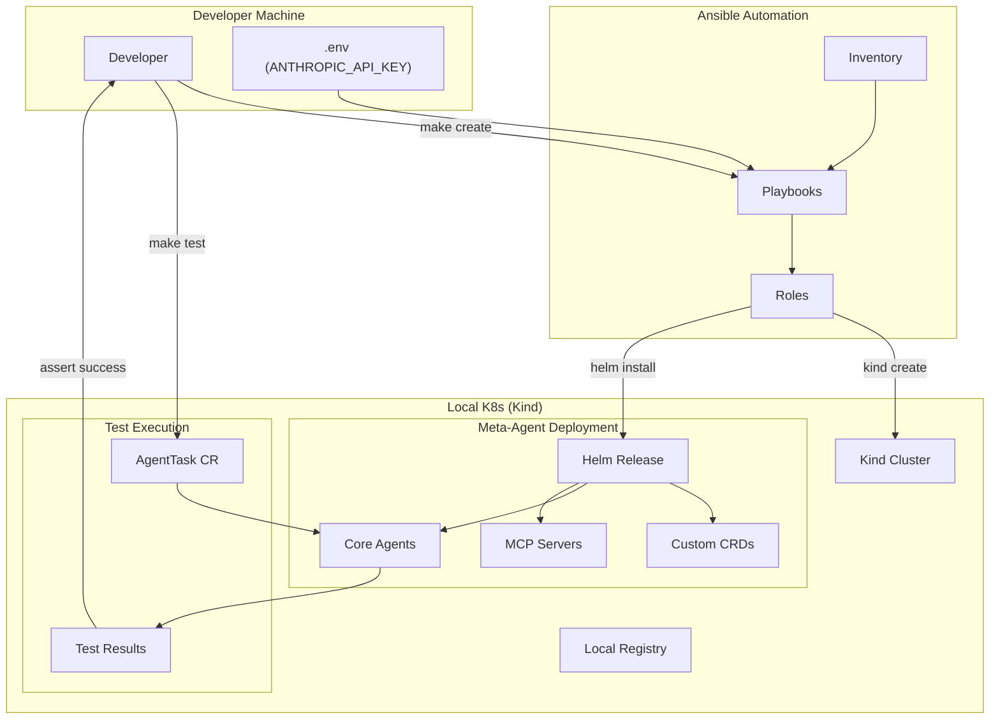
```mermaid
flowchart TD
    subgraph Developer["Developer Machine"]
        DEV[Developer]
        ENV[".env (ANTHROPIC_API_KEY)"]
    end
    
    subgraph Ansible["Ansible Automation"]
        PLAY[Playbooks]
        ROLES[Roles]
        INV[Inventory]
    end
    
    subgraph LocalCluster["Local K8s (Kind)"]
        KIND[Kind Cluster]
        REG[Local Registry]
        
        subgraph MetaAgent["Meta-Agent Deployment"]
            HELM[Helm Release]
            CRDs[Custom CRDs]
            AGENTS[Core Agents]
            MCP[MCP Servers]
        end
        
        subgraph Testing["Test Execution"]
            TASK[AgentTask CR]
            RESULT[Test Results]
        end
    end
    
    DEV -->|"make create"| PLAY
    ENV --> PLAY
    PLAY --> ROLES
    INV --> PLAY
    
    ROLES -->|"kind create"| KIND
    ROLES -->|"helm install"| HELM
    
    HELM --> CRDs
    HELM --> AGENTS
    HELM --> MCP
    
    DEV -->|"make test"| TASK
    TASK --> AGENTS
    AGENTS --> RESULT
    RESULT -->|"assert success"| DEV
```

## Helm Charts

### Chart Structure

```
meta-agent/
├── Chart.yaml
├── values.yaml
├── templates/
│   ├── _helpers.tpl
│   ├── namespace.yaml
│   ├── crds/
│   │   ├── agenttask-crd.yaml
│   │   ├── agent-crd.yaml
│   │   ├── mcpserver-crd.yaml
│   │   └── testsuite-crd.yaml
│   ├── controllers/
│   │   ├── tcp-controller-deployment.yaml
│   │   ├── agenttask-controller-deployment.yaml
│   │   ├── agent-controller-deployment.yaml
│   │   ├── mcpserver-controller-deployment.yaml
│   │   └── testsuite-controller-deployment.yaml
│   ├── rbac/
│   │   ├── serviceaccount.yaml
│   │   ├── clusterrole.yaml
│   │   └── clusterrolebinding.yaml
│   ├── core-agents/
│   │   ├── orchestrator-agent.yaml
│   │   ├── test-generator-agent.yaml
│   │   ├── test-runner-agent.yaml
│   │   └── feedback-agent.yaml
│   ├── mcp-servers/
│   │   ├── filesystem-mcp.yaml
│   │   ├── github-mcp.yaml
│   │   └── prometheus-mcp.yaml
│   ├── networking/
│   │   ├── a2a-gateway-ingress.yaml
│   │   └── services.yaml
│   ├── storage/
│   │   ├── redis-statefulset.yaml
│   │   └── minio-statefulset.yaml
│   └── configmaps/
│       └── agent-prompts-configmap.yaml
└── charts/
    └── redis/
```

### Chart.yaml

```yaml
apiVersion: v2
name: meta-agent
description: Autonomous meta-agent system with TCP feedback control
type: application
version: 0.1.0
appVersion: "1.0.0"

keywords:
  - ai
  - agents
  - kubernetes
  - a2a
  - mcp

maintainers:
  - name: CSM-101
    email: team@metaagent.io

dependencies:
  - name: redis
    version: "18.x.x"
    repository: "https://charts.bitnami.com/bitnami"
    condition: redis.enabled
```

### values.yaml

```yaml
# Global settings
global:
  namespace: meta-agent-system
  imagePullPolicy: IfNotPresent

# TCP Controller Configuration
tcpController:
  enabled: true
  image:
    repository: metaagent/tcp-controller
    tag: latest
  replicas: 1
  resources:
    limits:
      memory: "512Mi"
      cpu: "500m"
    requests:
      memory: "256Mi"
      cpu: "250m"
  
  # TCP coefficients
  coefficients:
    task: 1.0       # T weight
    context: 0.5    # C weight
    prediction: 0.3 # P weight
  
  errorThreshold: 0.2
  maxIterations: 10

# Core Agents Configuration
coreAgents:
  # Orchestrator Agent
  orchestrator:
    enabled: true
    image:
      repository: metaagent/orchestrator-agent
      tag: latest
    replicas: 1
    model:
      provider: anthropic
      name: claude-sonnet-4-20250514
      temperature: 0.7
      maxTokens: 4096
    a2a:
      enabled: true
      port: 8080
    resources:
      limits:
        memory: "512Mi"
        cpu: "500m"

  # Test Generator Agent
  testGenerator:
    enabled: true
    image:
      repository: metaagent/test-generator-agent
      tag: latest
    replicas: 1
    model:
      provider: anthropic
      name: claude-sonnet-4-20250514
      temperature: 0.5
      maxTokens: 4096
    testConfig:
      format: gherkin
      framework: behave
    a2a:
      enabled: true
      port: 8080
    resources:
      limits:
        memory: "512Mi"
        cpu: "500m"

  # Test Runner Agent
  testRunner:
    enabled: true
    image:
      repository: metaagent/test-runner-agent
      tag: latest
    replicas: 1
    model:
      provider: anthropic
      name: claude-sonnet-4-20250514
      temperature: 0.3
      maxTokens: 2048
    testConfig:
      framework: behave
      timeout: 300s
    a2a:
      enabled: true
      port: 8080
    resources:
      limits:
        memory: "512Mi"
        cpu: "500m"

  # Feedback Agent
  feedback:
    enabled: true
    image:
      repository: metaagent/feedback-agent
      tag: latest
    replicas: 1
    model:
      provider: anthropic
      name: claude-sonnet-4-20250514
      temperature: 0.5
      maxTokens: 2048
    metricsConfig:
      collectTokenUsage: true
      collectExecutionTime: true
      analyzePatterns: true
    a2a:
      enabled: true
      port: 8080
    resources:
      limits:
        memory: "256Mi"
        cpu: "250m"

# MCP Servers Configuration
mcpServers:
  filesystem:
    enabled: true
    image:
      repository: metaagent/mcp-filesystem
      tag: latest
    resources:
      limits:
        memory: "256Mi"
        cpu: "250m"

  github:
    enabled: true
    image:
      repository: metaagent/mcp-github
      tag: latest
    credentials:
      secretName: github-credentials
    resources:
      limits:
        memory: "256Mi"
        cpu: "250m"

  prometheus:
    enabled: true
    image:
      repository: metaagent/mcp-prometheus
      tag: latest
    resources:
      limits:
        memory: "256Mi"
        cpu: "250m"

# A2A Gateway Configuration
a2aGateway:
  enabled: true
  ingress:
    enabled: true
    className: nginx
    host: agents.metaagent.io
    tls:
      enabled: true
      secretName: a2a-tls-secret
  authentication:
    type: oauth2
    issuerUrl: "https://auth.metaagent.io"

# Storage Configuration
storage:
  redis:
    enabled: true
    architecture: standalone
    auth:
      enabled: true
      existingSecret: redis-secret
    persistence:
      enabled: true
      size: 10Gi

  minio:
    enabled: true
    persistence:
      enabled: true
      size: 50Gi
    credentials:
      secretName: minio-credentials

# LLM Provider Configuration
llm:
  provider: anthropic
  apiKeySecret: anthropic-api-key
  defaultModel: claude-sonnet-4-20250514

# Observability
observability:
  enabled: true
  opentelemetry:
    enabled: true
    collectorEndpoint: "http://otel-collector:4317"
  metrics:
    enabled: true
    serviceMonitor: true

# Resource Quotas for Tasks
taskDefaults:
  resourceQuota:
    maxAgents: 5
    maxMemory: "4Gi"
    maxCPU: "4"
  timeout: 3600s
```

### Installation Commands

```bash
# Add Helm repository (if published)
helm repo add metaagent https://charts.metaagent.io
helm repo update

# Install with default values
helm install meta-agent metaagent/meta-agent \
  --namespace meta-agent-system \
  --create-namespace

# Install with custom values
helm install meta-agent metaagent/meta-agent \
  --namespace meta-agent-system \
  --create-namespace \
  -f custom-values.yaml

# Install from local chart
helm install meta-agent ./meta-agent \
  --namespace meta-agent-system \
  --create-namespace

# Set secrets during install
helm install meta-agent ./meta-agent \
  --namespace meta-agent-system \
  --create-namespace \
  --set llm.apiKeySecret=my-anthropic-secret \
  --set mcpServers.github.credentials.secretName=my-github-secret

# Upgrade existing installation
helm upgrade meta-agent ./meta-agent \
  --namespace meta-agent-system \
  -f custom-values.yaml

# Uninstall
helm uninstall meta-agent --namespace meta-agent-system
```

### Template Example: Core Agent

```yaml
# templates/core-agents/orchestrator-agent.yaml
{{- if .Values.coreAgents.orchestrator.enabled }}
apiVersion: metaagent.io/v1alpha1
kind: Agent
metadata:
  name: orchestrator-agent
  namespace: {{ .Values.global.namespace }}
  labels:
    {{- include "meta-agent.labels" . | nindent 4 }}
    metaagent.io/type: orchestrator
spec:
  type: orchestrator
  
  model:
    provider: {{ .Values.coreAgents.orchestrator.model.provider }}
    name: {{ .Values.coreAgents.orchestrator.model.name }}
    temperature: {{ .Values.coreAgents.orchestrator.model.temperature }}
    maxTokens: {{ .Values.coreAgents.orchestrator.model.maxTokens }}
    apiKeySecretRef:
      name: {{ .Values.llm.apiKeySecret }}
      key: api-key
      
  systemPrompt: |
    You are the Orchestrator Agent. Your responsibilities:
    1. Analyze incoming tasks from TCP Controller
    2. Determine which executor agents are needed
    3. Create/manage Agent and MCPServer CRDs
    4. Coordinate agent execution via A2A protocol
    5. Report results back to TCP Controller
    
  {{- if .Values.coreAgents.orchestrator.a2a.enabled }}
  a2a:
    enabled: true
    endpoint: "/a2a"
    port: {{ .Values.coreAgents.orchestrator.a2a.port }}
    agentCard:
      description: "Orchestrates task execution across multiple agents"
      skills:
        - name: orchestrate-task
          description: "Analyzes task and coordinates agent execution"
          inputModes: ["text"]
          outputModes: ["text"]
        - name: manage-agents
          description: "Creates and manages executor agents"
          inputModes: ["text"]
          outputModes: ["text"]
      capabilities:
        streaming: true
        pushNotifications: true
    authentication:
      type: {{ .Values.a2aGateway.authentication.type }}
  {{- end }}
  
  mcpServers:
    - name: filesystem-mcp
    
  resources:
    {{- toYaml .Values.coreAgents.orchestrator.resources | nindent 4 }}
{{- end }}
```

### Template Example: A2A Ingress

```yaml
# templates/networking/a2a-gateway-ingress.yaml
{{- if and .Values.a2aGateway.enabled .Values.a2aGateway.ingress.enabled }}
apiVersion: networking.k8s.io/v1
kind: Ingress
metadata:
  name: a2a-gateway
  namespace: {{ .Values.global.namespace }}
  labels:
    {{- include "meta-agent.labels" . | nindent 4 }}
  annotations:
    nginx.ingress.kubernetes.io/ssl-redirect: "true"
    nginx.ingress.kubernetes.io/proxy-body-size: "50m"
    nginx.ingress.kubernetes.io/proxy-read-timeout: "3600"
spec:
  ingressClassName: {{ .Values.a2aGateway.ingress.className }}
  {{- if .Values.a2aGateway.ingress.tls.enabled }}
  tls:
    - hosts:
        - {{ .Values.a2aGateway.ingress.host }}
      secretName: {{ .Values.a2aGateway.ingress.tls.secretName }}
  {{- end }}
  rules:
    - host: {{ .Values.a2aGateway.ingress.host }}
      http:
        paths:
          # Agent Card discovery endpoints
          {{- if .Values.coreAgents.orchestrator.enabled }}
          - path: /orchestrator/.well-known/agent.json
            pathType: Prefix
            backend:
              service:
                name: orchestrator-agent-a2a
                port:
                  number: {{ .Values.coreAgents.orchestrator.a2a.port }}
          - path: /orchestrator/
            pathType: Prefix
            backend:
              service:
                name: orchestrator-agent-a2a
                port:
                  number: {{ .Values.coreAgents.orchestrator.a2a.port }}
          {{- end }}
          
          {{- if .Values.coreAgents.testGenerator.enabled }}
          - path: /test-generator/.well-known/agent.json
            pathType: Prefix
            backend:
              service:
                name: test-generator-agent-a2a
                port:
                  number: {{ .Values.coreAgents.testGenerator.a2a.port }}
          - path: /test-generator/
            pathType: Prefix
            backend:
              service:
                name: test-generator-agent-a2a
                port:
                  number: {{ .Values.coreAgents.testGenerator.a2a.port }}
          {{- end }}
          
          {{- if .Values.coreAgents.testRunner.enabled }}
          - path: /test-runner/.well-known/agent.json
            pathType: Prefix
            backend:
              service:
                name: test-runner-agent-a2a
                port:
                  number: {{ .Values.coreAgents.testRunner.a2a.port }}
          - path: /test-runner/
            pathType: Prefix
            backend:
              service:
                name: test-runner-agent-a2a
                port:
                  number: {{ .Values.coreAgents.testRunner.a2a.port }}
          {{- end }}
          
          {{- if .Values.coreAgents.feedback.enabled }}
          - path: /feedback/.well-known/agent.json
            pathType: Prefix
            backend:
              service:
                name: feedback-agent-a2a
                port:
                  number: {{ .Values.coreAgents.feedback.a2a.port }}
          - path: /feedback/
            pathType: Prefix
            backend:
              service:
                name: feedback-agent-a2a
                port:
                  number: {{ .Values.coreAgents.feedback.a2a.port }}
          {{- end }}
{{- end }}
```

### Environment-Specific Values

```yaml
# values-dev.yaml
global:
  namespace: meta-agent-dev

tcpController:
  replicas: 1
  coefficients:
    task: 1.0
    context: 0.3
    prediction: 0.2

storage:
  redis:
    persistence:
      size: 1Gi
  minio:
    persistence:
      size: 5Gi

a2aGateway:
  ingress:
    host: agents.dev.metaagent.io
```

```yaml
# values-prod.yaml
global:
  namespace: meta-agent-prod

tcpController:
  replicas: 3
  coefficients:
    task: 1.0
    context: 0.5
    prediction: 0.3
  resources:
    limits:
      memory: "1Gi"
      cpu: "1"

coreAgents:
  orchestrator:
    replicas: 2
  testGenerator:
    replicas: 2
  testRunner:
    replicas: 3
  feedback:
    replicas: 2

storage:
  redis:
    architecture: replication
    persistence:
      size: 50Gi
  minio:
    persistence:
      size: 500Gi

a2aGateway:
  ingress:
    host: agents.metaagent.io
    tls:
      enabled: true

observability:
  enabled: true
  metrics:
    serviceMonitor: true
```

### Deployment Diagram with Helm

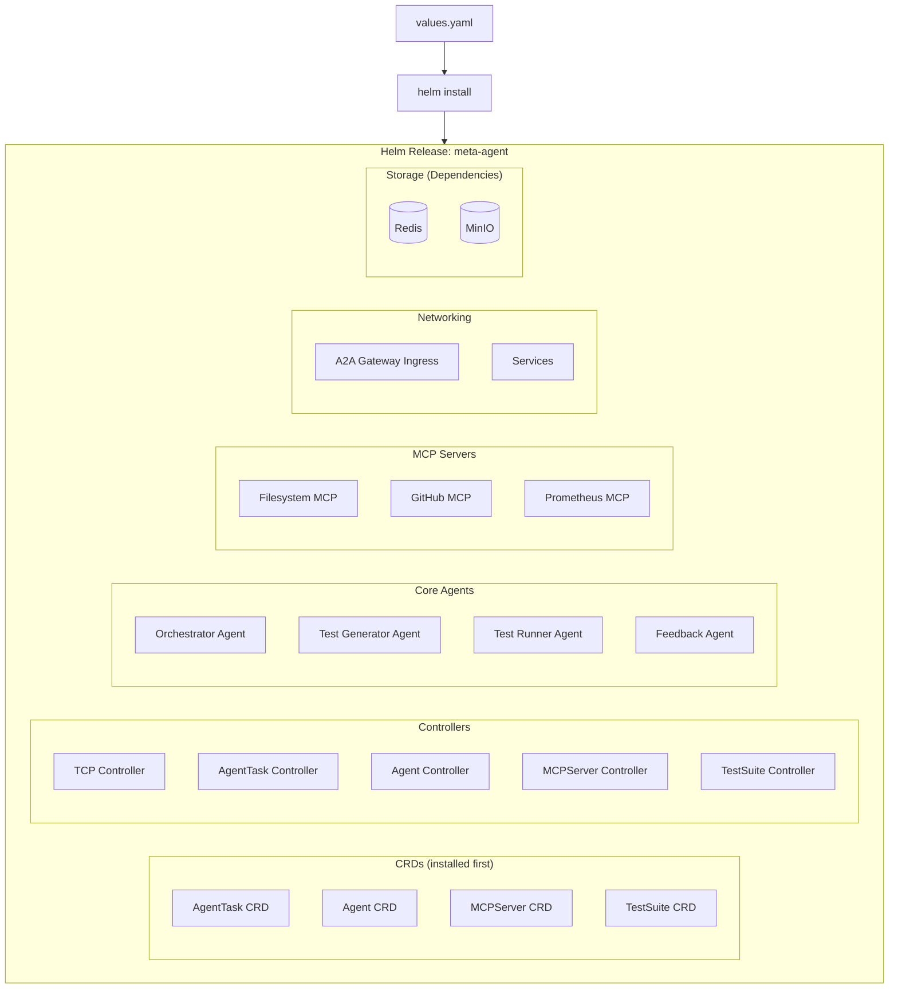
```mermaid
flowchart TB
    subgraph HelmRelease["Helm Release: meta-agent"]
        subgraph CRDs["CRDs (installed first)"]
            CRD1[AgentTask CRD]
            CRD2[Agent CRD]
            CRD3[MCPServer CRD]
            CRD4[TestSuite CRD]
        end
        
        subgraph Controllers["Controllers"]
            TC[TCP Controller]
            ATC[AgentTask Controller]
            AGC[Agent Controller]
            MC[MCPServer Controller]
            TSC[TestSuite Controller]
        end
        
        subgraph CoreAgents["Core Agents"]
            OA[Orchestrator Agent]
            TGA[Test Generator Agent]
            TRA[Test Runner Agent]
            FBA[Feedback Agent]
        end
        
        subgraph MCPServers["MCP Servers"]
            FS[Filesystem MCP]
            GH[GitHub MCP]
            PM[Prometheus MCP]
        end
        
        subgraph Networking["Networking"]
            ING[A2A Gateway Ingress]
            SVC[Services]
        end
        
        subgraph Storage["Storage (Dependencies)"]
            RD[(Redis)]
            MN[(MinIO)]
        end
    end
    
    HelmCLI[helm install] --> HelmRelease
    Values[values.yaml] --> HelmCLI
```

## Artifact Storage: GitHub

Artifacts (generated code, test results, Gherkin features) are stored in GitHub repositories via the GitHub MCP server.

### Why GitHub for Artifacts?

| Benefit | Description |
|---------|-------------|
| **Versioning** | Git history for all artifacts |
| **Collaboration** | PRs, reviews, issues |
| **CI/CD Integration** | GitHub Actions for testing |
| **Already in stack** | MCP GitHub server already used |
| **Free tier** | Generous limits for hackathon |

### Repository Structure

```
meta-agent-artifacts/
├── tasks/
│   └── {task-id}/
│       ├── metadata.json          # Task config, status
│       ├── gherkin/
│       │   └── features/
│       │       └── user-api.feature
│       ├── output/
│       │   ├── src/
│       │   │   └── api.rs
│       │   └── tests/
│       │       └── test_api.rs
│       ├── results/
│       │   ├── test-results.json
│       │   └── feedback.json
│       └── logs/
│           └── execution.log
│
├── agents/
│   └── {agent-type}/
│       ├── prompts/
│       │   └── system-prompt.md
│       └── configs/
│           └── default.yaml
│
└── templates/
    ├── gherkin/
    │   └── api-template.feature
    └── code/
        └── rust-api-template/
```

### Artifact Flow

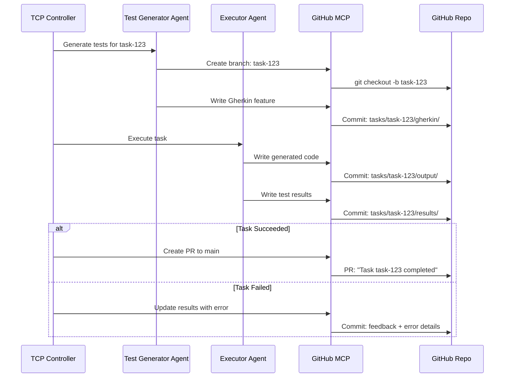
```mermaid
sequenceDiagram
    participant TC as TCP Controller
    participant TGA as Test Generator Agent
    participant EX as Executor Agent
    participant GH as GitHub MCP
    participant Repo as GitHub Repo

    TC->>TGA: Generate tests for task-123
    TGA->>GH: Create branch: task-123
    GH->>Repo: git checkout -b task-123
    
    TGA->>GH: Write Gherkin feature
    GH->>Repo: Commit: tasks/task-123/gherkin/
    
    TC->>EX: Execute task
    EX->>GH: Write generated code
    GH->>Repo: Commit: tasks/task-123/output/
    
    EX->>GH: Write test results
    GH->>Repo: Commit: tasks/task-123/results/
    
    alt Task Succeeded
        TC->>GH: Create PR to main
        GH->>Repo: PR: "Task task-123 completed"
    else Task Failed
        TC->>GH: Update results with error
        GH->>Repo: Commit: feedback + error details
    end
```

### GitHub MCP Server Config

```yaml
apiVersion: metaagent.io/v1alpha1
kind: MCPServer
metadata:
  name: github-mcp
  namespace: meta-agent-system
spec:
  type: github
  image: metaagent/mcp-github:latest
  
  config:
    # Repository for artifacts
    artifactRepo:
      owner: "csm-101"
      name: "meta-agent-artifacts"
      defaultBranch: "main"
    
    # Capabilities
    capabilities:
      - repository_read
      - repository_write
      - pull_request
      - issues
      - actions
    
    # Branch strategy
    branching:
      taskBranchPrefix: "task/"
      autoCreateBranch: true
      autoCreatePR: true
      prTemplate: |
        ## Task Completed: {{task_id}}
        
        **Description:** {{description}}
        **Status:** {{status}}
        **Iterations:** {{iterations}}
        **Error Rate:** {{error_rate}}
        
        ### Test Results
        - Passed: {{tests_passed}}
        - Failed: {{tests_failed}}
        
        ### Generated Files
        {{#each files}}
        - `{{this.path}}`
        {{/each}}
  
  # Credentials
  credentialsSecret:
    name: github-credentials
    keys:
      token: GITHUB_TOKEN
```

### Rust GitHub Client (via MCP)

```rust
// crates/mcp-client/src/github.rs

use crate::McpClient;
use serde::{Deserialize, Serialize};

pub struct GitHubArtifacts {
    mcp: McpClient,
    repo_owner: String,
    repo_name: String,
}

#[derive(Debug, Clone, Serialize, Deserialize)]
pub struct ArtifactPath {
    pub task_id: String,
    pub category: ArtifactCategory,
    pub filename: String,
}

#[derive(Debug, Clone, Serialize, Deserialize)]
#[serde(rename_all = "lowercase")]
pub enum ArtifactCategory {
    Gherkin,
    Output,
    Results,
    Logs,
}

impl GitHubArtifacts {
    pub fn new(mcp: McpClient, owner: &str, repo: &str) -> Self {
        Self {
            mcp,
            repo_owner: owner.to_string(),
            repo_name: repo.to_string(),
        }
    }
    
    /// Create a new branch for task artifacts
    pub async fn create_task_branch(&self, task_id: &str) -> anyhow::Result<String> {
        let branch_name = format!("task/{}", task_id);
        
        self.mcp.call_tool(
            "github",
            "create_branch",
            serde_json::json!({
                "owner": self.repo_owner,
                "repo": self.repo_name,
                "branch": branch_name,
                "from": "main"
            })
        ).await?;
        
        Ok(branch_name)
    }
    
    /// Store an artifact
    pub async fn store_artifact(
        &self,
        task_id: &str,
        category: ArtifactCategory,
        filename: &str,
        content: &str,
        message: &str,
    ) -> anyhow::Result<String> {
        let branch = format!("task/{}", task_id);
        let path = format!(
            "tasks/{}/{}/{}",
            task_id,
            serde_json::to_string(&category)?.trim_matches('"'),
            filename
        );
        
        self.mcp.call_tool(
            "github",
            "create_or_update_file",
            serde_json::json!({
                "owner": self.repo_owner,
                "repo": self.repo_name,
                "branch": branch,
                "path": path,
                "content": content,
                "message": message
            })
        ).await?;
        
        Ok(path)
    }
    
    /// Store Gherkin feature file
    pub async fn store_gherkin(
        &self,
        task_id: &str,
        feature_name: &str,
        content: &str,
    ) -> anyhow::Result<String> {
        self.store_artifact(
            task_id,
            ArtifactCategory::Gherkin,
            &format!("features/{}.feature", feature_name),
            content,
            &format!("Add Gherkin feature: {}", feature_name),
        ).await
    }
    
    /// Store generated code
    pub async fn store_code(
        &self,
        task_id: &str,
        filename: &str,
        content: &str,
    ) -> anyhow::Result<String> {
        self.store_artifact(
            task_id,
            ArtifactCategory::Output,
            filename,
            content,
            &format!("Add generated code: {}", filename),
        ).await
    }
    
    /// Store test results
    pub async fn store_test_results(
        &self,
        task_id: &str,
        results: &TestResults,
    ) -> anyhow::Result<String> {
        let content = serde_json::to_string_pretty(results)?;
        
        self.store_artifact(
            task_id,
            ArtifactCategory::Results,
            "test-results.json",
            &content,
            &format!(
                "Test results: {}/{} passed",
                results.passed,
                results.total
            ),
        ).await
    }
    
    /// Retrieve an artifact
    pub async fn get_artifact(
        &self,
        task_id: &str,
        category: ArtifactCategory,
        filename: &str,
    ) -> anyhow::Result<String> {
        let branch = format!("task/{}", task_id);
        let path = format!(
            "tasks/{}/{}/{}",
            task_id,
            serde_json::to_string(&category)?.trim_matches('"'),
            filename
        );
        
        let result = self.mcp.call_tool(
            "github",
            "get_file_contents",
            serde_json::json!({
                "owner": self.repo_owner,
                "repo": self.repo_name,
                "branch": branch,
                "path": path
            })
        ).await?;
        
        Ok(result["content"].as_str().unwrap_or("").to_string())
    }
    
    /// Create PR for completed task
    pub async fn create_task_pr(
        &self,
        task_id: &str,
        title: &str,
        body: &str,
    ) -> anyhow::Result<u64> {
        let branch = format!("task/{}", task_id);
        
        let result = self.mcp.call_tool(
            "github",
            "create_pull_request",
            serde_json::json!({
                "owner": self.repo_owner,
                "repo": self.repo_name,
                "head": branch,
                "base": "main",
                "title": title,
                "body": body
            })
        ).await?;
        
        Ok(result["number"].as_u64().unwrap_or(0))
    }
    
    /// List artifacts for a task
    pub async fn list_task_artifacts(
        &self,
        task_id: &str,
    ) -> anyhow::Result<Vec<String>> {
        let branch = format!("task/{}", task_id);
        let path = format!("tasks/{}", task_id);
        
        let result = self.mcp.call_tool(
            "github",
            "list_files",
            serde_json::json!({
                "owner": self.repo_owner,
                "repo": self.repo_name,
                "branch": branch,
                "path": path,
                "recursive": true
            })
        ).await?;
        
        let files: Vec<String> = result["files"]
            .as_array()
            .map(|arr| {
                arr.iter()
                    .filter_map(|v| v["path"].as_str().map(String::from))
                    .collect()
            })
            .unwrap_or_default();
        
        Ok(files)
    }
}

#[derive(Debug, Clone, Serialize, Deserialize)]
pub struct TestResults {
    pub total: u32,
    pub passed: u32,
    pub failed: u32,
    pub skipped: u32,
    pub scenarios: Vec<ScenarioResult>,
}

#[derive(Debug, Clone, Serialize, Deserialize)]
pub struct ScenarioResult {
    pub name: String,
    pub status: String,
    pub duration_ms: u64,
    pub error: Option<String>,
}
```

### Helm Values Update

```yaml
# values.yaml (artifact storage section)
artifactStorage:
  type: github  # github, s3, minio
  
  github:
    enabled: true
    repository:
      owner: "csm-101"
      name: "meta-agent-artifacts"
    credentials:
      secretName: github-credentials
    branching:
      taskPrefix: "task/"
      autoCreatePR: true
    
  # Fallback to MinIO for local dev (no GitHub access)
  minio:
    enabled: false
```

### Benefits for Hackathon

1. **Demo-friendly** — Show PRs with generated code during presentation
2. **History** — All iterations visible in git log
3. **Collaboration** — Judges can review artifacts directly
4. **CI/CD** — Trigger GitHub Actions on PR to run additional validations
5. **Free** — No cloud storage costs

## Backend Services: Rust

All backend services are written in **Rust** for performance, safety, and low resource footprint.

### Rust Workspace Structure

```
meta-agent/
├── Cargo.toml                 # Workspace root
├── Cargo.lock
├── rust-toolchain.toml
├── .cargo/
│   └── config.toml
│
├── crates/
│   ├── meta-agent-core/       # Shared types, traits, utilities
│   │   ├── Cargo.toml
│   │   └── src/
│   │       ├── lib.rs
│   │       ├── types.rs
│   │       ├── error.rs
│   │       └── config.rs
│   │
│   ├── tcp-controller/        # TCP Controller service
│   │   ├── Cargo.toml
│   │   └── src/
│   │       ├── main.rs
│   │       ├── controller.rs
│   │       ├── feedback.rs
│   │       └── api.rs
│   │
│   ├── agent-registry/        # Agent Registry service
│   │   ├── Cargo.toml
│   │   └── src/
│   │       ├── main.rs
│   │       ├── registry.rs
│   │       ├── health.rs
│   │       └── api.rs
│   │
│   ├── agent-runtime/         # Agent execution runtime
│   │   ├── Cargo.toml
│   │   └── src/
│   │       ├── main.rs
│   │       ├── agent.rs
│   │       ├── llm.rs
│   │       └── executor.rs
│   │
│   ├── a2a-rs/                # A2A Protocol implementation
│   │   ├── Cargo.toml
│   │   └── src/
│   │       ├── lib.rs
│   │       ├── client.rs
│   │       ├── server.rs
│   │       ├── types.rs
│   │       └── transport.rs
│   │
│   ├── a2ui-rs/               # A2UI Protocol implementation
│   │   ├── Cargo.toml
│   │   └── src/
│   │       ├── lib.rs
│   │       ├── components.rs
│   │       ├── renderer.rs
│   │       └── streaming.rs
│   │
│   ├── mcp-client/            # MCP Client implementation
│   │   ├── Cargo.toml
│   │   └── src/
│   │       ├── lib.rs
│   │       ├── client.rs
│   │       └── tools.rs
│   │
│   └── k8s-operator/          # Kubernetes Operator (kube-rs)
│       ├── Cargo.toml
│       └── src/
│           ├── main.rs
│           ├── crds.rs
│           ├── controllers/
│           │   ├── mod.rs
│           │   ├── agent_task.rs
│           │   ├── agent.rs
│           │   └── mcp_server.rs
│           └── reconcilers.rs
│
├── docker/
│   ├── Dockerfile.tcp-controller
│   ├── Dockerfile.agent-registry
│   ├── Dockerfile.agent-runtime
│   └── Dockerfile.k8s-operator
│
└── tests/
    ├── integration/
    └── e2e/
```

### Workspace Cargo.toml

```toml
# Cargo.toml (workspace root)
[workspace]
resolver = "2"
members = [
    "crates/meta-agent-core",
    "crates/tcp-controller",
    "crates/agent-registry",
    "crates/agent-runtime",
    "crates/a2a-rs",
    "crates/a2ui-rs",
    "crates/mcp-client",
    "crates/k8s-operator",
]

[workspace.package]
version = "0.1.0"
edition = "2021"
rust-version = "1.75"
license = "Apache-2.0"
repository = "https://github.com/csm-101/meta-agent"

[workspace.dependencies]
# Async runtime
tokio = { version = "1.35", features = ["full"] }
async-trait = "0.1"
futures = "0.3"

# Web framework
axum = { version = "0.7", features = ["ws", "macros"] }
tower = "0.4"
tower-http = { version = "0.5", features = ["cors", "trace"] }

# Serialization
serde = { version = "1.0", features = ["derive"] }
serde_json = "1.0"

# HTTP client
reqwest = { version = "0.11", features = ["json", "stream"] }

# Redis
redis = { version = "0.24", features = ["tokio-comp", "connection-manager"] }

# Kubernetes
kube = { version = "0.87", features = ["runtime", "derive"] }
k8s-openapi = { version = "0.20", features = ["v1_28"] }

# LLM
async-openai = "0.18"  # Works with Claude API

# Observability
tracing = "0.1"
tracing-subscriber = { version = "0.3", features = ["env-filter", "json"] }
opentelemetry = "0.21"
opentelemetry-otlp = "0.14"

# Error handling
thiserror = "1.0"
anyhow = "1.0"

# Config
config = "0.14"
dotenvy = "0.15"

# Testing
tokio-test = "0.4"
wiremock = "0.5"
```

### Core Types (meta-agent-core)

```rust
// crates/meta-agent-core/src/types.rs

use serde::{Deserialize, Serialize};
use std::collections::HashMap;

/// Agent skill definition
#[derive(Debug, Clone, Serialize, Deserialize)]
pub struct Skill {
    pub name: String,
    pub description: String,
    pub proficiency: f32,  // 0.0 - 1.0
    #[serde(default)]
    pub metadata: HashMap<String, serde_json::Value>,
}

/// Agent capabilities
#[derive(Debug, Clone, Serialize, Deserialize)]
pub struct Capabilities {
    pub a2a: Option<A2ACapability>,
    pub a2ui: Option<A2UICapability>,
    pub mcp: Option<MCPCapability>,
    pub streaming: bool,
}

#[derive(Debug, Clone, Serialize, Deserialize)]
pub struct A2ACapability {
    pub enabled: bool,
    pub endpoint: String,
    pub version: String,
}

#[derive(Debug, Clone, Serialize, Deserialize)]
pub struct A2UICapability {
    pub enabled: bool,
    pub supported_components: Vec<String>,
}

#[derive(Debug, Clone, Serialize, Deserialize)]
pub struct MCPCapability {
    pub enabled: bool,
    pub tools: Vec<String>,
}

/// TCP Controller coefficients
#[derive(Debug, Clone, Serialize, Deserialize)]
pub struct TCPCoefficients {
    pub task: f32,       // T weight
    pub context: f32,    // C weight
    pub prediction: f32, // P weight
}

impl Default for TCPCoefficients {
    fn default() -> Self {
        Self {
            task: 1.0,
            context: 0.5,
            prediction: 0.3,
        }
    }
}

/// Task status
#[derive(Debug, Clone, Serialize, Deserialize, PartialEq)]
#[serde(rename_all = "lowercase")]
pub enum TaskPhase {
    Pending,
    Running,
    Succeeded,
    Failed,
}

/// Agent health status
#[derive(Debug, Clone, Serialize, Deserialize, PartialEq)]
#[serde(rename_all = "lowercase")]
pub enum HealthStatus {
    Healthy,
    Unhealthy,
    Unknown,
}

/// Test result from Gherkin execution
#[derive(Debug, Clone, Serialize, Deserialize)]
pub struct TestResult {
    pub scenario: String,
    pub status: TestStatus,
    pub error: Option<String>,
    pub duration_ms: u64,
}

#[derive(Debug, Clone, Serialize, Deserialize, PartialEq)]
#[serde(rename_all = "lowercase")]
pub enum TestStatus {
    Passed,
    Failed,
    Skipped,
}

/// Error calculation result
#[derive(Debug, Clone, Serialize, Deserialize)]
pub struct ErrorSignal {
    pub value: f32,           // 0.0 - 1.0
    pub tests_total: u32,
    pub tests_passed: u32,
    pub tests_failed: u32,
    pub iteration: u32,
}

impl ErrorSignal {
    pub fn from_test_results(results: &[TestResult], iteration: u32) -> Self {
        let total = results.len() as u32;
        let passed = results.iter().filter(|r| r.status == TestStatus::Passed).count() as u32;
        let failed = total - passed;
        
        Self {
            value: if total > 0 { failed as f32 / total as f32 } else { 1.0 },
            tests_total: total,
            tests_passed: passed,
            tests_failed: failed,
            iteration,
        }
    }
}
```

### TCP Controller Service

```rust
// crates/tcp-controller/src/main.rs

use axum::{
    routing::{get, post},
    Router,
    extract::State,
    Json,
};
use std::sync::Arc;
use tokio::sync::RwLock;
use tracing::{info, instrument};

mod controller;
mod feedback;
mod api;

use controller::TCPController;
use meta_agent_core::config::Config;

#[derive(Clone)]
pub struct AppState {
    controller: Arc<RwLock<TCPController>>,
    redis: redis::Client,
}

#[tokio::main]
async fn main() -> anyhow::Result<()> {
    // Initialize tracing
    tracing_subscriber::fmt()
        .with_env_filter("tcp_controller=debug,tower_http=debug")
        .json()
        .init();

    // Load config
    let config = Config::load()?;
    
    // Connect to Redis
    let redis = redis::Client::open(config.redis_url.clone())?;
    
    // Initialize TCP Controller
    let controller = TCPController::new(config.tcp_coefficients.clone());
    
    let state = AppState {
        controller: Arc::new(RwLock::new(controller)),
        redis,
    };

    // Build router
    let app = Router::new()
        .route("/health", get(health_check))
        .route("/api/v1/tasks", post(api::create_task))
        .route("/api/v1/tasks/:id", get(api::get_task))
        .route("/api/v1/tasks/:id/feedback", post(api::submit_feedback))
        .route("/api/v1/control-signal", post(api::compute_control_signal))
        .with_state(state)
        .layer(tower_http::trace::TraceLayer::new_for_http());

    let addr = format!("0.0.0.0:{}", config.port);
    info!("TCP Controller listening on {}", addr);
    
    let listener = tokio::net::TcpListener::bind(&addr).await?;
    axum::serve(listener, app).await?;
    
    Ok(())
}

async fn health_check() -> &'static str {
    "OK"
}
```

```rust
// crates/tcp-controller/src/controller.rs

use meta_agent_core::types::{TCPCoefficients, ErrorSignal};
use tracing::instrument;

/// TCP Controller implementing Task-Context-Prediction feedback loop
pub struct TCPController {
    coefficients: TCPCoefficients,
    context_history: Vec<ErrorSignal>,
    max_history: usize,
}

impl TCPController {
    pub fn new(coefficients: TCPCoefficients) -> Self {
        Self {
            coefficients,
            context_history: Vec::new(),
            max_history: 100,
        }
    }
    
    /// Compute control signal based on TCP model
    #[instrument(skip(self))]
    pub fn compute_control_signal(&mut self, current_error: &ErrorSignal) -> ControlSignal {
        // T (Task) - Proportional response to current error
        let t_action = self.coefficients.task * current_error.value;
        
        // C (Context) - Integral of historical errors
        let c_action = self.compute_context_action();
        
        // D (Prediction) - Derivative based on error trend
        let p_action = self.compute_prediction_action(current_error);
        
        // Store in history
        self.context_history.push(current_error.clone());
        if self.context_history.len() > self.max_history {
            self.context_history.remove(0);
        }
        
        // Combined control signal
        let total = t_action + c_action + p_action;
        
        ControlSignal {
            action: self.determine_action(total, current_error),
            t_component: t_action,
            c_component: c_action,
            p_component: p_action,
            total_signal: total,
        }
    }
    
    fn compute_context_action(&self) -> f32 {
        if self.context_history.is_empty() {
            return 0.0;
        }
        
        // Average error over history (integral approximation)
        let sum: f32 = self.context_history.iter().map(|e| e.value).sum();
        let avg = sum / self.context_history.len() as f32;
        
        self.coefficients.context * avg
    }
    
    fn compute_prediction_action(&self, current: &ErrorSignal) -> f32 {
        if self.context_history.is_empty() {
            return 0.0;
        }
        
        // Derivative: rate of change
        let previous = self.context_history.last().unwrap();
        let derivative = current.value - previous.value;
        
        self.coefficients.prediction * derivative
    }
    
    fn determine_action(&self, signal: f32, error: &ErrorSignal) -> ControlAction {
        match signal {
            s if s > 0.5 => ControlAction::MajorChange {
                reason: "High error - swap agent or change approach".into(),
                swap_agent: true,
            },
            s if s > 0.2 => ControlAction::ModerateChange {
                reason: "Medium error - add reviewer or adjust params".into(),
                add_agent: Some("reviewer".into()),
            },
            s if s > 0.0 => ControlAction::MinorChange {
                reason: "Low error - fine-tune and retry".into(),
            },
            _ => ControlAction::Complete {
                reason: "Error within threshold".into(),
            },
        }
    }
}

#[derive(Debug, Clone, serde::Serialize)]
pub struct ControlSignal {
    pub action: ControlAction,
    pub t_component: f32,
    pub c_component: f32,
    pub p_component: f32,
    pub total_signal: f32,
}

#[derive(Debug, Clone, serde::Serialize)]
#[serde(tag = "type", rename_all = "snake_case")]
pub enum ControlAction {
    MajorChange { reason: String, swap_agent: bool },
    ModerateChange { reason: String, add_agent: Option<String> },
    MinorChange { reason: String },
    Complete { reason: String },
}
```

### Agent Registry Service

```rust
// crates/agent-registry/src/main.rs

use axum::{
    routing::{get, post, put, delete},
    Router,
    extract::{State, Path, Query},
    Json,
};
use redis::AsyncCommands;
use std::sync::Arc;
use tokio::sync::RwLock;
use tracing::info;

mod registry;
mod health;
mod api;

use registry::{AgentRegistry, AgentRegistration};

#[derive(Clone)]
pub struct AppState {
    registry: Arc<RwLock<AgentRegistry>>,
    redis: redis::aio::ConnectionManager,
}

#[tokio::main]
async fn main() -> anyhow::Result<()> {
    tracing_subscriber::fmt()
        .with_env_filter("agent_registry=debug")
        .json()
        .init();

    let config = meta_agent_core::config::Config::load()?;
    
    // Connect to Redis
    let client = redis::Client::open(config.redis_url.clone())?;
    let redis = client.get_connection_manager().await?;
    
    // Initialize registry
    let registry = AgentRegistry::new(redis.clone());
    
    let state = AppState {
        registry: Arc::new(RwLock::new(registry)),
        redis,
    };
    
    // Start health checker background task
    let health_state = state.clone();
    tokio::spawn(async move {
        health::run_health_checker(health_state).await;
    });

    let app = Router::new()
        .route("/health", get(|| async { "OK" }))
        // Registration
        .route("/agents/register", post(api::register_agent))
        .route("/agents/:id", get(api::get_agent))
        .route("/agents/:id", delete(api::deregister_agent))
        .route("/agents/:id/heartbeat", put(api::heartbeat))
        // Discovery
        .route("/agents/search", get(api::search_agents))
        .route("/agents/skills", get(api::list_skills))
        .with_state(state);

    let addr = format!("0.0.0.0:{}", config.registry_port);
    info!("Agent Registry listening on {}", addr);
    
    let listener = tokio::net::TcpListener::bind(&addr).await?;
    axum::serve(listener, app).await?;
    
    Ok(())
}
```

```rust
// crates/agent-registry/src/registry.rs

use meta_agent_core::types::{Skill, Capabilities, HealthStatus};
use redis::AsyncCommands;
use serde::{Deserialize, Serialize};
use std::collections::HashMap;
use chrono::{DateTime, Utc};
use uuid::Uuid;

const AGENTS_KEY: &str = "meta-agent:registry:agents";
const AGENT_PREFIX: &str = "meta-agent:registry:agent:";
const SKILLS_INDEX: &str = "meta-agent:registry:skills:";

#[derive(Debug, Clone, Serialize, Deserialize)]
pub struct AgentRegistration {
    pub id: String,
    pub name: String,
    pub endpoint: String,
    pub skills: Vec<Skill>,
    pub capabilities: Capabilities,
    pub health: HealthStatus,
    pub current_load: u32,
    pub max_concurrent_tasks: u32,
    pub registered_at: DateTime<Utc>,
    pub last_heartbeat: DateTime<Utc>,
}

#[derive(Debug, Clone, Serialize, Deserialize)]
pub struct RegisterRequest {
    pub name: String,
    pub endpoint: String,
    pub skills: Vec<Skill>,
    pub capabilities: Capabilities,
    #[serde(default = "default_max_tasks")]
    pub max_concurrent_tasks: u32,
}

fn default_max_tasks() -> u32 { 5 }

#[derive(Debug, Clone, Serialize, Deserialize)]
pub struct SearchQuery {
    pub skill: Option<String>,
    pub capability: Option<String>,
    pub healthy: Option<bool>,
    pub min_proficiency: Option<f32>,
    pub max_load: Option<u32>,
}

pub struct AgentRegistry {
    redis: redis::aio::ConnectionManager,
    lease_ttl_secs: u64,
}

impl AgentRegistry {
    pub fn new(redis: redis::aio::ConnectionManager) -> Self {
        Self {
            redis,
            lease_ttl_secs: 60,
        }
    }
    
    /// Register a new agent
    pub async fn register(&mut self, req: RegisterRequest) -> anyhow::Result<AgentRegistration> {
        let id = Uuid::new_v4().to_string();
        let now = Utc::now();
        
        let registration = AgentRegistration {
            id: id.clone(),
            name: req.name,
            endpoint: req.endpoint,
            skills: req.skills.clone(),
            capabilities: req.capabilities,
            health: HealthStatus::Healthy,
            current_load: 0,
            max_concurrent_tasks: req.max_concurrent_tasks,
            registered_at: now,
            last_heartbeat: now,
        };
        
        // Store agent data
        let key = format!("{}{}", AGENT_PREFIX, id);
        let data = serde_json::to_string(&registration)?;
        self.redis.set_ex(&key, &data, self.lease_ttl_secs).await?;
        
        // Add to agents set
        self.redis.sadd(AGENTS_KEY, &id).await?;
        
        // Index by skills
        for skill in &req.skills {
            let skill_key = format!("{}{}", SKILLS_INDEX, skill.name);
            self.redis.sadd(&skill_key, &id).await?;
        }
        
        Ok(registration)
    }
    
    /// Update heartbeat
    pub async fn heartbeat(
        &mut self, 
        id: &str, 
        current_load: Option<u32>
    ) -> anyhow::Result<()> {
        let key = format!("{}{}", AGENT_PREFIX, id);
        
        // Get current registration
        let data: Option<String> = self.redis.get(&key).await?;
        let mut reg: AgentRegistration = match data {
            Some(d) => serde_json::from_str(&d)?,
            None => anyhow::bail!("Agent not found: {}", id),
        };
        
        // Update
        reg.last_heartbeat = Utc::now();
        reg.health = HealthStatus::Healthy;
        if let Some(load) = current_load {
            reg.current_load = load;
        }
        
        // Save with TTL refresh
        let data = serde_json::to_string(&reg)?;
        self.redis.set_ex(&key, &data, self.lease_ttl_secs).await?;
        
        Ok(())
    }
    
    /// Search for agents
    pub async fn search(&mut self, query: SearchQuery) -> anyhow::Result<Vec<AgentRegistration>> {
        let mut agent_ids: Vec<String> = if let Some(skill) = &query.skill {
            // Get agents with this skill
            let skill_key = format!("{}{}", SKILLS_INDEX, skill);
            self.redis.smembers(&skill_key).await?
        } else {
            // Get all agents
            self.redis.smembers(AGENTS_KEY).await?
        };
        
        let mut results = Vec::new();
        
        for id in agent_ids {
            let key = format!("{}{}", AGENT_PREFIX, id);
            let data: Option<String> = self.redis.get(&key).await?;
            
            if let Some(d) = data {
                let reg: AgentRegistration = serde_json::from_str(&d)?;
                
                // Apply filters
                if let Some(true) = query.healthy {
                    if reg.health != HealthStatus::Healthy {
                        continue;
                    }
                }
                
                if let Some(max_load) = query.max_load {
                    if reg.current_load > max_load {
                        continue;
                    }
                }
                
                if let Some(min_prof) = query.min_proficiency {
                    if let Some(skill_name) = &query.skill {
                        let has_skill = reg.skills.iter()
                            .any(|s| &s.name == skill_name && s.proficiency >= min_prof);
                        if !has_skill {
                            continue;
                        }
                    }
                }
                
                if let Some(cap) = &query.capability {
                    let has_cap = match cap.as_str() {
                        "a2a" => reg.capabilities.a2a.as_ref().map(|c| c.enabled).unwrap_or(false),
                        "a2ui" => reg.capabilities.a2ui.as_ref().map(|c| c.enabled).unwrap_or(false),
                        "mcp" => reg.capabilities.mcp.as_ref().map(|c| c.enabled).unwrap_or(false),
                        _ => true,
                    };
                    if !has_cap {
                        continue;
                    }
                }
                
                results.push(reg);
            }
        }
        
        // Sort by load (ascending)
        results.sort_by_key(|r| r.current_load);
        
        Ok(results)
    }
    
    /// Deregister an agent
    pub async fn deregister(&mut self, id: &str) -> anyhow::Result<()> {
        let key = format!("{}{}", AGENT_PREFIX, id);
        
        // Get registration to clean up skill indexes
        let data: Option<String> = self.redis.get(&key).await?;
        if let Some(d) = data {
            let reg: AgentRegistration = serde_json::from_str(&d)?;
            
            // Remove from skill indexes
            for skill in &reg.skills {
                let skill_key = format!("{}{}", SKILLS_INDEX, skill.name);
                self.redis.srem(&skill_key, id).await?;
            }
        }
        
        // Remove from agents set
        self.redis.srem(AGENTS_KEY, id).await?;
        
        // Delete agent data
        self.redis.del(&key).await?;
        
        Ok(())
    }
    
    /// Get all available skills
    pub async fn list_skills(&mut self) -> anyhow::Result<Vec<SkillInfo>> {
        let agents: Vec<String> = self.redis.smembers(AGENTS_KEY).await?;
        let mut skill_map: HashMap<String, SkillInfo> = HashMap::new();
        
        for id in agents {
            let key = format!("{}{}", AGENT_PREFIX, id);
            let data: Option<String> = self.redis.get(&key).await?;
            
            if let Some(d) = data {
                let reg: AgentRegistration = serde_json::from_str(&d)?;
                
                for skill in reg.skills {
                    let entry = skill_map.entry(skill.name.clone()).or_insert(SkillInfo {
                        name: skill.name,
                        agent_count: 0,
                        total_proficiency: 0.0,
                    });
                    entry.agent_count += 1;
                    entry.total_proficiency += skill.proficiency;
                }
            }
        }
        
        Ok(skill_map.into_values()
            .map(|mut s| {
                s.total_proficiency /= s.agent_count as f32; // Convert to average
                s
            })
            .collect())
    }
}

#[derive(Debug, Clone, Serialize, Deserialize)]
pub struct SkillInfo {
    pub name: String,
    pub agent_count: u32,
    #[serde(rename = "avgProficiency")]
    pub total_proficiency: f32,
}
```

### A2A Protocol Implementation

```rust
// crates/a2a-rs/src/lib.rs

pub mod client;
pub mod server;
pub mod types;
pub mod transport;

pub use client::A2AClient;
pub use server::A2AServer;
pub use types::*;
```

```rust
// crates/a2a-rs/src/types.rs

use serde::{Deserialize, Serialize};
use std::collections::HashMap;

/// Agent Card - describes agent capabilities
#[derive(Debug, Clone, Serialize, Deserialize)]
pub struct AgentCard {
    pub name: String,
    pub description: String,
    pub version: String,
    pub endpoint: String,
    pub capabilities: AgentCapabilities,
    pub skills: Vec<AgentSkill>,
    pub authentication: Option<AuthConfig>,
}

#[derive(Debug, Clone, Serialize, Deserialize)]
pub struct AgentCapabilities {
    pub streaming: bool,
    pub push_notifications: bool,
}

#[derive(Debug, Clone, Serialize, Deserialize)]
pub struct AgentSkill {
    pub name: String,
    pub description: String,
    pub input_modes: Vec<String>,
    pub output_modes: Vec<String>,
}

#[derive(Debug, Clone, Serialize, Deserialize)]
pub struct AuthConfig {
    #[serde(rename = "type")]
    pub auth_type: String,
    pub authorization_url: Option<String>,
}

/// A2A Task
#[derive(Debug, Clone, Serialize, Deserialize)]
pub struct Task {
    pub id: String,
    pub session_id: Option<String>,
    pub status: TaskStatus,
    pub message: Message,
    pub artifacts: Vec<Artifact>,
    pub metadata: HashMap<String, serde_json::Value>,
}

#[derive(Debug, Clone, Serialize, Deserialize)]
#[serde(rename_all = "lowercase")]
pub enum TaskStatus {
    Submitted,
    Working,
    InputRequired,
    Completed,
    Failed,
    Canceled,
}

#[derive(Debug, Clone, Serialize, Deserialize)]
pub struct Message {
    pub role: MessageRole,
    pub parts: Vec<MessagePart>,
}

#[derive(Debug, Clone, Serialize, Deserialize)]
#[serde(rename_all = "lowercase")]
pub enum MessageRole {
    User,
    Agent,
}

#[derive(Debug, Clone, Serialize, Deserialize)]
#[serde(tag = "type", rename_all = "lowercase")]
pub enum MessagePart {
    Text { text: String },
    File { uri: String, mime_type: String },
    Data { data: serde_json::Value },
}

#[derive(Debug, Clone, Serialize, Deserialize)]
pub struct Artifact {
    pub name: String,
    #[serde(rename = "type")]
    pub artifact_type: String,
    pub content: ArtifactContent,
}

#[derive(Debug, Clone, Serialize, Deserialize)]
#[serde(untagged)]
pub enum ArtifactContent {
    Text(String),
    Binary(Vec<u8>),
    Json(serde_json::Value),
}

/// JSON-RPC request/response for A2A
#[derive(Debug, Clone, Serialize, Deserialize)]
pub struct JsonRpcRequest {
    pub jsonrpc: String,
    pub id: serde_json::Value,
    pub method: String,
    pub params: serde_json::Value,
}

#[derive(Debug, Clone, Serialize, Deserialize)]
pub struct JsonRpcResponse {
    pub jsonrpc: String,
    pub id: serde_json::Value,
    #[serde(skip_serializing_if = "Option::is_none")]
    pub result: Option<serde_json::Value>,
    #[serde(skip_serializing_if = "Option::is_none")]
    pub error: Option<JsonRpcError>,
}

#[derive(Debug, Clone, Serialize, Deserialize)]
pub struct JsonRpcError {
    pub code: i32,
    pub message: String,
    pub data: Option<serde_json::Value>,
}
```

```rust
// crates/a2a-rs/src/client.rs

use crate::types::*;
use reqwest::Client;
use tokio_stream::Stream;
use futures::StreamExt;

pub struct A2AClient {
    http: Client,
    base_url: String,
}

impl A2AClient {
    pub fn new(endpoint: &str) -> Self {
        Self {
            http: Client::new(),
            base_url: endpoint.to_string(),
        }
    }
    
    /// Fetch agent card for discovery
    pub async fn get_agent_card(&self) -> anyhow::Result<AgentCard> {
        let url = format!("{}/.well-known/agent.json", self.base_url);
        let resp = self.http.get(&url).send().await?;
        let card = resp.json::<AgentCard>().await?;
        Ok(card)
    }
    
    /// Send a task to the agent
    pub async fn send_task(&self, message: Message) -> anyhow::Result<Task> {
        let request = JsonRpcRequest {
            jsonrpc: "2.0".to_string(),
            id: serde_json::json!(uuid::Uuid::new_v4().to_string()),
            method: "tasks/send".to_string(),
            params: serde_json::json!({
                "message": message
            }),
        };
        
        let resp = self.http
            .post(&self.base_url)
            .json(&request)
            .send()
            .await?;
            
        let rpc_resp = resp.json::<JsonRpcResponse>().await?;
        
        if let Some(error) = rpc_resp.error {
            anyhow::bail!("A2A error: {} - {}", error.code, error.message);
        }
        
        let task: Task = serde_json::from_value(rpc_resp.result.unwrap())?;
        Ok(task)
    }
    
    /// Stream task updates via SSE
    pub async fn stream_task(
        &self, 
        task_id: &str
    ) -> anyhow::Result<impl Stream<Item = anyhow::Result<Task>>> {
        let url = format!("{}/tasks/{}/stream", self.base_url, task_id);
        let resp = self.http.get(&url).send().await?;
        
        let stream = resp.bytes_stream().map(|result| {
            result
                .map_err(anyhow::Error::from)
                .and_then(|bytes| {
                    let text = String::from_utf8(bytes.to_vec())?;
                    // Parse SSE format
                    if text.starts_with("data: ") {
                        let json = &text[6..];
                        let task: Task = serde_json::from_str(json)?;
                        Ok(task)
                    } else {
                        anyhow::bail!("Invalid SSE format")
                    }
                })
        });
        
        Ok(stream)
    }
    
    /// Cancel a task
    pub async fn cancel_task(&self, task_id: &str) -> anyhow::Result<()> {
        let request = JsonRpcRequest {
            jsonrpc: "2.0".to_string(),
            id: serde_json::json!(uuid::Uuid::new_v4().to_string()),
            method: "tasks/cancel".to_string(),
            params: serde_json::json!({
                "taskId": task_id
            }),
        };
        
        self.http
            .post(&self.base_url)
            .json(&request)
            .send()
            .await?;
            
        Ok(())
    }
}
```

### Kubernetes Operator (kube-rs)

```rust
// crates/k8s-operator/src/crds.rs

use kube::CustomResource;
use schemars::JsonSchema;
use serde::{Deserialize, Serialize};
use std::collections::HashMap;

/// AgentTask CRD
#[derive(CustomResource, Debug, Clone, Serialize, Deserialize, JsonSchema)]
#[kube(
    group = "metaagent.io",
    version = "v1alpha1",
    kind = "AgentTask",
    namespaced,
    status = "AgentTaskStatus",
    printcolumn = r#"{"name":"Phase", "type":"string", "jsonPath":".status.phase"}"#,
    printcolumn = r#"{"name":"Error", "type":"number", "jsonPath":".status.currentError"}"#
)]
pub struct AgentTaskSpec {
    pub description: String,
    pub controller: ControllerConfig,
    pub test_generator: TestGeneratorConfig,
    pub resource_quota: ResourceQuota,
}

#[derive(Debug, Clone, Serialize, Deserialize, JsonSchema)]
pub struct ControllerConfig {
    pub task_weight: f32,
    pub context_weight: f32,
    pub prediction_weight: f32,
    pub error_threshold: f32,
    pub max_iterations: u32,
}

#[derive(Debug, Clone, Serialize, Deserialize, JsonSchema)]
pub struct TestGeneratorConfig {
    pub format: String, // "gherkin"
    pub framework: String, // "behave"
}

#[derive(Debug, Clone, Serialize, Deserialize, JsonSchema)]
pub struct ResourceQuota {
    pub max_agents: u32,
    pub max_memory: String,
    pub max_cpu: String,
}

#[derive(Debug, Clone, Serialize, Deserialize, JsonSchema)]
pub struct AgentTaskStatus {
    pub phase: String,
    pub iteration: u32,
    pub current_error: f32,
    pub tests_total: u32,
    pub tests_passed: u32,
    pub agents: Vec<AgentStatus>,
}

#[derive(Debug, Clone, Serialize, Deserialize, JsonSchema)]
pub struct AgentStatus {
    pub name: String,
    pub status: String,
}

/// Agent CRD
#[derive(CustomResource, Debug, Clone, Serialize, Deserialize, JsonSchema)]
#[kube(
    group = "metaagent.io",
    version = "v1alpha1",
    kind = "Agent",
    namespaced,
    status = "AgentCRDStatus"
)]
pub struct AgentSpec {
    #[serde(rename = "type")]
    pub agent_type: String,
    pub model: ModelConfig,
    pub system_prompt: String,
    #[serde(default)]
    pub a2a: Option<A2AConfig>,
    #[serde(default)]
    pub a2ui: Option<A2UIConfig>,
    #[serde(default)]
    pub mcp_servers: Vec<String>,
    pub resources: ResourceRequirements,
}

#[derive(Debug, Clone, Serialize, Deserialize, JsonSchema)]
pub struct ModelConfig {
    pub provider: String,
    pub name: String,
    pub temperature: f32,
    pub max_tokens: u32,
}

#[derive(Debug, Clone, Serialize, Deserialize, JsonSchema)]
pub struct A2AConfig {
    pub enabled: bool,
    pub port: u16,
}

#[derive(Debug, Clone, Serialize, Deserialize, JsonSchema)]
pub struct A2UIConfig {
    pub enabled: bool,
    pub port: u16,
    pub catalog_ref: String,
}

#[derive(Debug, Clone, Serialize, Deserialize, JsonSchema)]
pub struct ResourceRequirements {
    pub limits: ResourceLimits,
    pub requests: Option<ResourceLimits>,
}

#[derive(Debug, Clone, Serialize, Deserialize, JsonSchema)]
pub struct ResourceLimits {
    pub memory: String,
    pub cpu: String,
}

#[derive(Debug, Clone, Serialize, Deserialize, JsonSchema)]
pub struct AgentCRDStatus {
    pub phase: String,
    pub registered: bool,
    pub registry_id: Option<String>,
}
```

```rust
// crates/k8s-operator/src/main.rs

use futures::StreamExt;
use kube::{
    api::{Api, ListParams, PostParams},
    runtime::controller::{Action, Controller},
    Client, ResourceExt,
};
use std::sync::Arc;
use tokio::time::Duration;
use tracing::{error, info, instrument};

mod crds;
mod controllers;

use crds::{AgentTask, Agent};

#[tokio::main]
async fn main() -> anyhow::Result<()> {
    tracing_subscriber::fmt()
        .with_env_filter("k8s_operator=debug,kube=info")
        .json()
        .init();

    let client = Client::try_default().await?;
    
    // Start AgentTask controller
    let tasks: Api<AgentTask> = Api::all(client.clone());
    let agents: Api<Agent> = Api::all(client.clone());
    
    info!("Starting Meta-Agent Kubernetes Operator");
    
    let task_controller = Controller::new(tasks, ListParams::default())
        .run(
            controllers::agent_task::reconcile,
            controllers::agent_task::error_policy,
            Arc::new(controllers::agent_task::Context::new(client.clone())),
        )
        .for_each(|res| async move {
            match res {
                Ok(o) => info!("Reconciled AgentTask: {:?}", o),
                Err(e) => error!("Reconcile error: {:?}", e),
            }
        });
    
    let agent_controller = Controller::new(agents, ListParams::default())
        .run(
            controllers::agent::reconcile,
            controllers::agent::error_policy,
            Arc::new(controllers::agent::Context::new(client.clone())),
        )
        .for_each(|res| async move {
            match res {
                Ok(o) => info!("Reconciled Agent: {:?}", o),
                Err(e) => error!("Reconcile error: {:?}", e),
            }
        });
    
    // Run both controllers concurrently
    tokio::join!(task_controller, agent_controller);
    
    Ok(())
}
```

### Dockerfile (Multi-stage Build)

```dockerfile
# docker/Dockerfile.tcp-controller

# Build stage
FROM rust:1.75-slim-bookworm as builder

WORKDIR /app

# Install build dependencies
RUN apt-get update && apt-get install -y \
    pkg-config \
    libssl-dev \
    && rm -rf /var/lib/apt/lists/*

# Copy workspace files
COPY Cargo.toml Cargo.lock ./
COPY crates ./crates

# Build release binary
RUN cargo build --release --package tcp-controller

# Runtime stage
FROM debian:bookworm-slim

RUN apt-get update && apt-get install -y \
    ca-certificates \
    && rm -rf /var/lib/apt/lists/*

COPY --from=builder /app/target/release/tcp-controller /usr/local/bin/

ENV RUST_LOG=tcp_controller=info

EXPOSE 8080

CMD ["tcp-controller"]
```

### Makefile for Rust

```makefile
# Makefile

.PHONY: build test lint fmt check docker-build

# Build all crates
build:
	cargo build --release

# Run tests
test:
	cargo test --workspace

# Run lints
lint:
	cargo clippy --workspace -- -D warnings

# Format code
fmt:
	cargo fmt --all

# Check formatting and lints
check: fmt lint
	cargo check --workspace

# Build Docker images
docker-build:
	docker build -f docker/Dockerfile.tcp-controller -t metaagent/tcp-controller:latest .
	docker build -f docker/Dockerfile.agent-registry -t metaagent/agent-registry:latest .
	docker build -f docker/Dockerfile.agent-runtime -t metaagent/agent-runtime:latest .
	docker build -f docker/Dockerfile.k8s-operator -t metaagent/k8s-operator:latest .

# Run locally
run-tcp-controller:
	cargo run --package tcp-controller

run-registry:
	cargo run --package agent-registry

# Generate CRD manifests
generate-crds:
	cargo run --package k8s-operator -- generate-crds > helm/meta-agent/crds/
```

## Tech Stack (Proposed)

| Component | Technology |
|-----------|------------|
| **Backend Language** | **Rust** |
| Infrastructure Automation | Ansible |
| Local K8s Cluster | Kind (Kubernetes in Docker) |
| Orchestration | Kubernetes + Custom CRDs |
| Package Management | Helm Charts |
| K8s Operator | kube-rs (Rust) |
| Web Framework | Axum (Rust) |
| Async Runtime | Tokio |
| Agent Registry | Rust (Axum + Redis) |
| TCP Controller | Rust (Axum + Tokio) |
| Agent Runtime | Rust (async-openai) |
| A2A Implementation | a2a-rs (Rust) |
| A2UI Implementation | a2ui-rs (Rust) |
| MCP Client | Rust |
| Agent ↔ User | A2UI Protocol |
| Agent ↔ Agent | A2A Protocol |
| Agent ↔ Tools | MCP Protocol |
| A2UI Client | React / Flutter |
| Test Framework | Behave (Gherkin) |
| State Store | Redis |
| Artifact Storage | GitHub (via MCP) |
| Observability | OpenTelemetry (Rust SDK) |
| LLM | Claude API |

---

## Relation to Artificial General Intelligence (AGI)

### What is AGI?

**Artificial General Intelligence (AGI)** — a system that can perform any intellectual task a human can, with the ability to:
- Learn and adapt to new domains without retraining
- Transfer knowledge across different tasks
- Reason abstractly and solve novel problems
- Self-improve over time

### Is This System AGI?

**Short answer: No, but it has AGI-like properties.**

```
┌─────────────────────────────────────────────────────────────────────────┐
│                         AGI SPECTRUM                                     │
│                                                                          │
│   Narrow AI ◄─────────────────────────────────────────────────► AGI     │
│       │                           │                               │      │
│   Single task              Multi-task                    Any task       │
│   Fixed domain             Adaptive                      Universal      │
│   No transfer              Some transfer                 Full transfer  │
│                                                                          │
│                        ▲                                                 │
│                        │                                                 │
│                  This System                                             │
│              (Meta-Agent + TCP)                                          │
│                                                                          │
└─────────────────────────────────────────────────────────────────────────┘
```

### AGI Properties This System HAS ✅

| AGI Property | How This System Achieves It |
|--------------|----------------------------|
| **Task Generalization** | Can handle any task that can be expressed as "generate code that passes tests" |
| **Dynamic Agent Creation** | Orchestrator can spawn new specialist agents on demand |
| **Self-Evaluation** | Uses E2E tests (Gherkin) as objective success criteria |
| **Feedback Loop** | TCP Controller continuously optimizes based on results |
| **Tool Use** | Agents use MCP to access external tools (GitHub, filesystem, etc.) |
| **Collaboration** | Multiple agents work together via A2A protocol |
| **Learning from Context** | Agents use conversation history and previous attempts |

### AGI Properties This System LACKS ❌

| AGI Property | Current Limitation |
|--------------|-------------------|
| **True Learning** | Doesn't update model weights — relies on prompt context |
| **Long-term Memory** | Context window limited; no persistent learning |
| **Cross-domain Transfer** | Each task starts fresh; doesn't transfer skills |
| **Self-modification** | Cannot modify its own code or architecture |
| **Autonomous Goals** | Requires human to define tasks |
| **World Model** | No persistent understanding of the world |
| **Consciousness** | No subjective experience (obviously) |

### The Gap: Learning vs. Adaptation

```mermaid
flowchart LR
    subgraph ThisSystem["This System (Adaptive)"]
        T1[Task 1] --> A1[Solve with agents]
        T2[Task 2] --> A2[Solve with agents]
        T3[Task 3] --> A3[Solve with agents]
        
        A1 -.->|"No knowledge transfer"| A2
        A2 -.->|"No knowledge transfer"| A3
    end
    
    subgraph AGI["True AGI (Learning)"]
        T4[Task 1] --> B1[Solve + Learn]
        T5[Task 2] --> B2[Solve + Learn]
        T6[Task 3] --> B3[Solve + Learn]
        
        B1 -->|"Knowledge transfers"| B2
        B2 -->|"Knowledge transfers"| B3
    end
```

**This system:** Adapts within a task (iterations), but doesn't learn across tasks.

**True AGI:** Would remember that "validation issues are common in REST APIs" and proactively add validation-specialist for similar future tasks.

### How Close Are We?

```
┌──────────────────────────────────────────────────────────────────────────┐
│                     PATH TOWARD AGI                                       │
│                                                                           │
│  ┌─────────┐    ┌─────────┐    ┌─────────┐    ┌─────────┐    ┌───────┐ │
│  │ Narrow  │ => │ Multi-  │ => │  Meta-  │ => │  Self-  │ => │  AGI  │ │
│  │   AI    │    │  Agent  │    │  Agent  │    │Improving│    │       │ │
│  └─────────┘    └─────────┘    └─────────┘    └─────────┘    └───────┘ │
│                                     ▲                                    │
│       ChatGPT        AutoGPT    This System      ???          ???       │
│       (2022)         (2023)       (2026)                                │
│                                                                          │
└──────────────────────────────────────────────────────────────────────────┘
```

### What Would Make This System More AGI-like?

| Enhancement | Description | Difficulty |
|-------------|-------------|------------|
| **Persistent Memory** | Store successful patterns across tasks | Medium |
| **Skill Library** | Save and reuse agent configurations | Medium |
| **Cross-task Learning** | Fine-tune agents based on performance | Hard |
| **Self-modification** | System modifies its own prompts/architecture | Very Hard |
| **Autonomous Goals** | System decides what tasks to work on | Research |
| **Continuous Learning** | Update models without human intervention | Research |

### Architectural Additions for AGI-like Behavior

```yaml
# Future: AGI-like enhancements
apiVersion: metaagent.io/v1alpha1
kind: AgentTask
spec:
  # Current: TCP Controller
  controller:
    type: tcp
    
  # Future: Learning extensions
  learning:
    # Remember successful patterns
    patternMemory:
      enabled: true
      storage: vectordb
      
    # Transfer knowledge between tasks
    skillTransfer:
      enabled: true
      similarityThreshold: 0.8
      
    # Self-improvement (experimental)
    selfImprovement:
      enabled: false  # Not yet implemented
      allowPromptModification: false
      allowArchitectureChange: false
```

### The Meta-Agent Advantage

This system is **closer to AGI** than typical AI because:

```
┌─────────────────────────────────────────────────────────────────────────┐
│                                                                          │
│   TYPICAL AI:  Human → defines solution → AI executes                   │
│                                                                          │
│   THIS SYSTEM: Human → defines problem → System finds solution          │
│                              │                                           │
│                              ▼                                           │
│                    ┌─────────────────┐                                  │
│                    │  Meta-Agent     │                                  │
│                    │  "Thinks about  │                                  │
│                    │   thinking"     │                                  │
│                    └────────┬────────┘                                  │
│                             │                                            │
│           ┌─────────────────┼─────────────────┐                         │
│           ▼                 ▼                 ▼                          │
│     Which agents?    What approach?    How to verify?                   │
│                                                                          │
└─────────────────────────────────────────────────────────────────────────┘
```

The system exhibits **meta-cognition** — it reasons about:
- Which agents to use (not hardcoded)
- How to verify success (generates its own tests)
- When to change strategy (feedback loop)

### Honest Assessment

| Claim | Reality |
|-------|---------|
| "This is AGI" | ❌ No — lacks true learning, transfer, autonomy |
| "This is a step toward AGI" | ✅ Yes — meta-reasoning, self-evaluation, dynamic adaptation |
| "This is useful" | ✅ Yes — solves real problems autonomously |
| "This could evolve toward AGI" | 🟡 Maybe — with persistent learning, skill transfer |

### Key Insight: The Missing Piece

```
┌─────────────────────────────────────────────────────────────────────────┐
│                                                                          │
│   Current:   Task → Solve → Forget                                      │
│                                                                          │
│   AGI:       Task → Solve → Remember → Apply to future → Get better     │
│                              ▲                                           │
│                              │                                           │
│                    THE MISSING PIECE:                                    │
│                    Persistent learning                                   │
│                    that survives across tasks                           │
│                                                                          │
└─────────────────────────────────────────────────────────────────────────┘
```

**This system is a "stateless AGI"** — it has general capabilities but no persistent learning. Each task is solved from scratch using the general capabilities of LLMs.

### Summary: AGI Positioning

```
┌─────────────────────────────────────────────────────────────────────────┐
│                                                                          │
│   This Meta-Agent System:                                               │
│                                                                          │
│   ✅ General-purpose (any task expressible as code + tests)             │
│   ✅ Adaptive (changes strategy based on feedback)                      │
│   ✅ Self-evaluating (generates and runs its own tests)                 │
│   ✅ Collaborative (multiple specialized agents)                        │
│   ✅ Tool-using (MCP integration)                                       │
│                                                                          │
│   ❌ Not learning (no weight updates)                                   │
│   ❌ Not transferring (each task is fresh)                              │
│   ❌ Not autonomous (needs human to start)                              │
│   ❌ Not self-modifying (architecture is fixed)                         │
│                                                                          │
│   VERDICT: "Proto-AGI" or "Narrow General Intelligence"                 │
│            — general within a domain, not truly universal               │
│                                                                          │
└─────────────────────────────────────────────────────────────────────────┘
```

This is a **stepping stone** — demonstrating that meta-reasoning, self-evaluation, and dynamic agent orchestration can create systems that are more general than traditional AI, while being honest that true AGI requires capabilities we don't yet have.

---

## Roadmap: Extending Toward AGI

This section describes concrete extensions to move the system closer to AGI capabilities.

### AGI Extension Layers

```mermaid
flowchart TB
    subgraph Current["Current System (v1.0)"]
        TCP[TCP Controller]
        Agents[LLM Agents]
        A2A[A2A Protocol]
        MCP[MCP Tools]
    end
    
    subgraph Layer1["Layer 1: Memory (v2.0)"]
        STM[Short-term Memory]
        LTM[Long-term Memory]
        EM[Episodic Memory]
    end
    
    subgraph Layer2["Layer 2: Learning (v3.0)"]
        PL[Pattern Learning]
        ST[Skill Transfer]
        MA[Meta-Learning]
    end
    
    subgraph Layer3["Layer 3: Autonomy (v4.0)"]
        GG[Goal Generation]
        SP[Self-Planning]
        SM[Self-Modification]
    end
    
    subgraph Layer4["Layer 4: Understanding (v5.0)"]
        WM[World Model]
        CR[Causal Reasoning]
        AB[Abstraction]
    end
    
    Current --> Layer1 --> Layer2 --> Layer3 --> Layer4
    
    Layer4 --> AGI[AGI]
```

---

### Layer 1: Memory System (v2.0)

The first step toward AGI is **persistent memory** — remembering across tasks.

#### Memory Architecture

```mermaid
flowchart TB
    subgraph MemorySystem["Memory System"]
        subgraph STM["Short-term Memory (Redis)"]
            CTX[Current Task Context]
            ITER[Iteration History]
            CONV[Agent Conversations]
        end
        
        subgraph LTM["Long-term Memory (Vector DB)"]
            PATTERNS[Successful Patterns]
            FAILURES[Failure Patterns]
            SKILLS[Agent Skills]
        end
        
        subgraph EM["Episodic Memory (Graph DB)"]
            TASKS[Task Episodes]
            DECISIONS[Decision History]
            OUTCOMES[Outcomes]
        end
    end
    
    TCP[TCP Controller] --> STM
    STM -->|"Consolidate"| LTM
    LTM -->|"Query similar"| TCP
    
    STM -->|"Record episode"| EM
    EM -->|"Recall experience"| TCP
```

#### Memory CRDs

```yaml
apiVersion: metaagent.io/v1alpha1
kind: MemoryStore
metadata:
  name: meta-agent-memory
  namespace: meta-agent-system
spec:
  # Short-term memory (current context)
  shortTerm:
    backend: redis
    ttl: 24h
    maxSize: 100MB
    
  # Long-term memory (patterns, skills)
  longTerm:
    backend: qdrant  # Vector database
    embeddingModel: text-embedding-3-small
    dimensions: 1536
    indexing:
      metric: cosine
      
  # Episodic memory (experiences)
  episodic:
    backend: neo4j  # Graph database
    retention: 90d
    
  # Memory consolidation (STM → LTM)
  consolidation:
    enabled: true
    schedule: "0 * * * *"  # Hourly
    minSuccessRate: 0.8    # Only remember successful patterns
```

#### Rust Memory Implementation

```rust
// crates/memory/src/lib.rs

use async_trait::async_trait;
use serde::{Deserialize, Serialize};

/// Memory entry for pattern storage
#[derive(Debug, Clone, Serialize, Deserialize)]
pub struct MemoryEntry {
    pub id: String,
    pub task_type: String,
    pub pattern: Pattern,
    pub outcome: Outcome,
    pub embedding: Vec<f32>,
    pub created_at: chrono::DateTime<chrono::Utc>,
    pub access_count: u32,
    pub success_rate: f32,
}

#[derive(Debug, Clone, Serialize, Deserialize)]
pub struct Pattern {
    pub description: String,
    pub agents_used: Vec<String>,
    pub strategy: String,
    pub tcp_coefficients: TCPCoefficients,
    pub iterations_needed: u32,
}

#[derive(Debug, Clone, Serialize, Deserialize)]
pub struct Outcome {
    pub success: bool,
    pub final_error: f32,
    pub tests_passed: u32,
    pub tests_total: u32,
    pub duration_secs: u64,
}

/// Episodic memory entry
#[derive(Debug, Clone, Serialize, Deserialize)]
pub struct Episode {
    pub id: String,
    pub task_id: String,
    pub timestamp: chrono::DateTime<chrono::Utc>,
    pub decision: ControlDecision,
    pub context: EpisodeContext,
    pub result: EpisodeResult,
    pub lessons: Vec<String>,
}

#[derive(Debug, Clone, Serialize, Deserialize)]
pub struct EpisodeContext {
    pub error_rate: f32,
    pub iteration: u32,
    pub agents_active: Vec<String>,
    pub recent_failures: Vec<String>,
}

#[derive(Debug, Clone, Serialize, Deserialize)]
pub struct EpisodeResult {
    pub decision_correct: bool,
    pub error_after: f32,
    pub improvement: f32,
}

#[async_trait]
pub trait MemoryStore: Send + Sync {
    /// Store a successful pattern
    async fn store_pattern(&self, entry: MemoryEntry) -> anyhow::Result<()>;
    
    /// Find similar patterns for a task
    async fn find_similar_patterns(
        &self,
        task_description: &str,
        limit: usize,
    ) -> anyhow::Result<Vec<MemoryEntry>>;
    
    /// Record an episode
    async fn record_episode(&self, episode: Episode) -> anyhow::Result<()>;
    
    /// Recall relevant episodes
    async fn recall_episodes(
        &self,
        context: &EpisodeContext,
        limit: usize,
    ) -> anyhow::Result<Vec<Episode>>;
    
    /// Update pattern success rate
    async fn update_pattern_outcome(
        &self,
        pattern_id: &str,
        success: bool,
    ) -> anyhow::Result<()>;
}

/// Memory-enhanced TCP Controller
pub struct MemoryEnhancedController {
    tcp: TCPController,
    memory: Arc<dyn MemoryStore>,
}

impl MemoryEnhancedController {
    pub async fn compute_control_signal(
        &mut self,
        error: &ErrorSignal,
        task: &Task,
    ) -> anyhow::Result<ControlSignal> {
        // 1. Query memory for similar past experiences
        let similar_patterns = self.memory
            .find_similar_patterns(&task.description, 5)
            .await?;
        
        // 2. Recall relevant episodes
        let context = EpisodeContext {
            error_rate: error.value,
            iteration: error.iteration,
            agents_active: task.agents.clone(),
            recent_failures: task.recent_failures.clone(),
        };
        let episodes = self.memory.recall_episodes(&context, 10).await?;
        
        // 3. Adjust TCP coefficients based on memory
        let adjusted_coefficients = self.adjust_from_memory(
            &similar_patterns,
            &episodes,
        );
        
        // 4. Compute signal with memory-informed coefficients
        let signal = self.tcp
            .with_coefficients(adjusted_coefficients)
            .compute(error);
        
        // 5. Record this decision as an episode
        self.memory.record_episode(Episode {
            id: uuid::Uuid::new_v4().to_string(),
            task_id: task.id.clone(),
            timestamp: chrono::Utc::now(),
            decision: signal.action.clone(),
            context,
            result: EpisodeResult::pending(), // Updated later
            lessons: vec![],
        }).await?;
        
        Ok(signal)
    }
    
    fn adjust_from_memory(
        &self,
        patterns: &[MemoryEntry],
        episodes: &[Episode],
    ) -> TCPCoefficients {
        // Learn from successful patterns
        if let Some(best) = patterns.iter()
            .filter(|p| p.success_rate > 0.8)
            .max_by(|a, b| a.success_rate.partial_cmp(&b.success_rate).unwrap())
        {
            return best.pattern.tcp_coefficients.clone();
        }
        
        // Learn from episodes - what decisions worked?
        let successful_episodes: Vec<_> = episodes.iter()
            .filter(|e| e.result.decision_correct)
            .collect();
        
        if successful_episodes.len() > 3 {
            // Average the coefficients from successful episodes
            // ... implementation
        }
        
        // Default coefficients
        TCPCoefficients::default()
    }
}
```

---

### Layer 2: Learning System (v3.0)

Beyond memory — the system should **learn and improve** over time.

#### Learning Architecture

```mermaid
flowchart TB
    subgraph Learning["Learning System"]
        subgraph PatternLearning["Pattern Learning"]
            PE[Pattern Extraction]
            PC[Pattern Clustering]
            PR[Pattern Ranking]
        end
        
        subgraph SkillTransfer["Skill Transfer"]
            SD[Skill Detection]
            SA[Skill Abstraction]
            SR[Skill Reuse]
        end
        
        subgraph MetaLearning["Meta-Learning"]
            LA[Learn TCP Coefficients]
            LP[Learn Agent Selection]
            LS[Learn Strategies]
        end
    end
    
    Tasks[Completed Tasks] --> PE
    PE --> PC --> PR
    PR --> SD --> SA --> SR
    
    SR --> LA
    LA --> LP --> LS
    
    LS --> BetterSystem[Improved System]
```

#### Skill Library

```yaml
apiVersion: metaagent.io/v1alpha1
kind: SkillLibrary
metadata:
  name: learned-skills
  namespace: meta-agent-system
spec:
  skills:
    - name: rest-api-validation
      description: "Learned from 47 REST API tasks"
      learnedFrom:
        taskCount: 47
        successRate: 0.89
      pattern:
        agents:
          - code-generator
          - validation-specialist  # Learned: always add this!
        tcpCoefficients:
          task: 1.2      # Learned: be more aggressive
          context: 0.6
          prediction: 0.2
        commonFailures:
          - "Missing null checks"
          - "No input sanitization"
        preventiveActions:
          - "Always include validation-specialist agent"
          - "Run static analysis before tests"
          
    - name: async-rust-patterns
      description: "Learned from 23 async Rust tasks"
      learnedFrom:
        taskCount: 23
        successRate: 0.91
      pattern:
        agents:
          - code-generator
          - async-specialist
          - deadlock-detector
        specialPromptAdditions:
          - "Use tokio::select! for concurrent operations"
          - "Always handle cancellation"
```

#### Meta-Learning: Learn to Learn

```rust
// crates/meta-learning/src/lib.rs

/// Meta-learner that improves the system itself
pub struct MetaLearner {
    memory: Arc<dyn MemoryStore>,
    skill_library: Arc<SkillLibrary>,
}

impl MetaLearner {
    /// Analyze completed tasks and extract learnings
    pub async fn learn_from_tasks(
        &self,
        tasks: Vec<CompletedTask>,
    ) -> anyhow::Result<Learnings> {
        let mut learnings = Learnings::default();
        
        // 1. Pattern extraction
        let patterns = self.extract_patterns(&tasks)?;
        learnings.new_patterns = patterns;
        
        // 2. Skill abstraction
        let skills = self.abstract_skills(&tasks)?;
        learnings.new_skills = skills;
        
        // 3. TCP coefficient optimization
        let better_coefficients = self.optimize_tcp_coefficients(&tasks)?;
        learnings.tcp_improvements = better_coefficients;
        
        // 4. Agent selection rules
        let agent_rules = self.learn_agent_selection(&tasks)?;
        learnings.agent_selection_rules = agent_rules;
        
        Ok(learnings)
    }
    
    /// Learn optimal TCP coefficients from task history
    fn optimize_tcp_coefficients(
        &self,
        tasks: &[CompletedTask],
    ) -> anyhow::Result<HashMap<String, TCPCoefficients>> {
        let mut optimized = HashMap::new();
        
        // Group tasks by type
        let by_type = group_by_task_type(tasks);
        
        for (task_type, type_tasks) in by_type {
            // Find coefficients that led to fastest convergence
            let successful = type_tasks.iter()
                .filter(|t| t.success && t.iterations < 5)
                .collect::<Vec<_>>();
            
            if successful.len() >= 10 {
                // Enough data to learn
                let avg_coefficients = average_coefficients(
                    successful.iter().map(|t| &t.tcp_coefficients)
                );
                optimized.insert(task_type, avg_coefficients);
            }
        }
        
        Ok(optimized)
    }
    
    /// Learn which agents to select for which task types
    fn learn_agent_selection(
        &self,
        tasks: &[CompletedTask],
    ) -> anyhow::Result<Vec<AgentSelectionRule>> {
        let mut rules = Vec::new();
        
        // Analyze successful tasks
        for task in tasks.iter().filter(|t| t.success) {
            // Extract features
            let features = extract_task_features(&task.description);
            
            // What agents were used?
            let agents = &task.agents_used;
            
            // Create rule
            rules.push(AgentSelectionRule {
                condition: features,
                recommended_agents: agents.clone(),
                confidence: task.success_rate,
            });
        }
        
        // Consolidate similar rules
        consolidate_rules(&mut rules);
        
        Ok(rules)
    }
}

#[derive(Debug, Clone)]
pub struct AgentSelectionRule {
    pub condition: TaskFeatures,
    pub recommended_agents: Vec<String>,
    pub confidence: f32,
}

#[derive(Debug, Clone)]
pub struct TaskFeatures {
    pub keywords: Vec<String>,
    pub domain: String,
    pub complexity: Complexity,
    pub requires_validation: bool,
    pub requires_async: bool,
    pub requires_database: bool,
}
```

---

### Layer 3: Autonomy (v4.0)

The system should be able to **set its own goals** and **improve itself**.

#### Autonomy Architecture

```mermaid
flowchart TB
    subgraph Autonomy["Autonomy System"]
        subgraph GoalGeneration["Goal Generation"]
            OG[Observe Gaps]
            GG[Generate Goals]
            GP[Prioritize Goals]
        end
        
        subgraph SelfPlanning["Self-Planning"]
            PA[Plan Actions]
            PE[Predict Effects]
            PS[Select Best Plan]
        end
        
        subgraph SelfModification["Self-Modification"]
            IM[Identify Improvements]
            GM[Generate Modifications]
            TM[Test Modifications]
            AM[Apply Modifications]
        end
    end
    
    System[System State] --> OG --> GG --> GP
    GP --> PA --> PE --> PS
    PS --> IM --> GM --> TM --> AM
    AM --> ImprovedSystem[Improved System]
```

#### Goal Generation

```rust
// crates/autonomy/src/goals.rs

/// Autonomous goal generator
pub struct GoalGenerator {
    memory: Arc<dyn MemoryStore>,
    skill_library: Arc<SkillLibrary>,
}

impl GoalGenerator {
    /// Observe system state and generate improvement goals
    pub async fn generate_goals(&self) -> anyhow::Result<Vec<Goal>> {
        let mut goals = Vec::new();
        
        // 1. Identify skill gaps
        let skill_gaps = self.identify_skill_gaps().await?;
        for gap in skill_gaps {
            goals.push(Goal {
                id: uuid::Uuid::new_v4().to_string(),
                goal_type: GoalType::SkillAcquisition,
                description: format!("Learn skill: {}", gap.skill_name),
                priority: gap.impact_score,
                plan: self.plan_skill_acquisition(&gap)?,
            });
        }
        
        // 2. Identify performance bottlenecks
        let bottlenecks = self.identify_bottlenecks().await?;
        for bottleneck in bottlenecks {
            goals.push(Goal {
                id: uuid::Uuid::new_v4().to_string(),
                goal_type: GoalType::PerformanceImprovement,
                description: format!("Improve: {}", bottleneck.area),
                priority: bottleneck.severity,
                plan: self.plan_improvement(&bottleneck)?,
            });
        }
        
        // 3. Identify failure patterns to fix
        let failure_patterns = self.identify_failure_patterns().await?;
        for pattern in failure_patterns {
            goals.push(Goal {
                id: uuid::Uuid::new_v4().to_string(),
                goal_type: GoalType::FailurePrevention,
                description: format!("Prevent failure: {}", pattern.description),
                priority: pattern.frequency * pattern.severity,
                plan: self.plan_prevention(&pattern)?,
            });
        }
        
        // Sort by priority
        goals.sort_by(|a, b| b.priority.partial_cmp(&a.priority).unwrap());
        
        Ok(goals)
    }
    
    async fn identify_skill_gaps(&self) -> anyhow::Result<Vec<SkillGap>> {
        // Analyze failed tasks to find missing skills
        let failed_tasks = self.memory.get_failed_tasks(100).await?;
        
        let mut gaps = HashMap::new();
        
        for task in failed_tasks {
            // What skill would have helped?
            let missing_skills = analyze_missing_skills(&task);
            
            for skill in missing_skills {
                let entry = gaps.entry(skill.clone()).or_insert(SkillGap {
                    skill_name: skill,
                    occurrence_count: 0,
                    impact_score: 0.0,
                });
                entry.occurrence_count += 1;
                entry.impact_score += task.importance;
            }
        }
        
        Ok(gaps.into_values().collect())
    }
}

#[derive(Debug, Clone)]
pub struct Goal {
    pub id: String,
    pub goal_type: GoalType,
    pub description: String,
    pub priority: f32,
    pub plan: Plan,
}

#[derive(Debug, Clone)]
pub enum GoalType {
    SkillAcquisition,
    PerformanceImprovement,
    FailurePrevention,
    SelfImprovement,
}

#[derive(Debug, Clone)]
pub struct Plan {
    pub steps: Vec<PlanStep>,
    pub expected_outcome: String,
    pub success_criteria: Vec<String>,
}
```

#### Self-Modification (Careful!)

```rust
// crates/autonomy/src/self_modification.rs

/// Self-modification with safety constraints
pub struct SelfModifier {
    config: SelfModificationConfig,
    sandbox: Sandbox,
}

#[derive(Debug, Clone)]
pub struct SelfModificationConfig {
    /// What CAN be modified
    pub allowed_modifications: Vec<ModificationType>,
    /// What CANNOT be modified (safety)
    pub forbidden_modifications: Vec<ModificationType>,
    /// Require human approval for changes
    pub require_human_approval: bool,
    /// Test modifications before applying
    pub require_testing: bool,
    /// Maximum change magnitude
    pub max_change_magnitude: f32,
}

#[derive(Debug, Clone, PartialEq)]
pub enum ModificationType {
    // ALLOWED (relatively safe)
    TcpCoefficients,        // Tune control parameters
    AgentPrompts,           // Modify agent instructions
    AgentSelection,         // Which agents to use
    RetryLimits,           // How many retries
    
    // FORBIDDEN (dangerous)
    CoreLogic,             // Main controller code
    SafetyConstraints,     // Safety rules
    MemoryAccess,          // Memory permissions
    NetworkAccess,         // Network permissions
}

impl SelfModifier {
    /// Propose a modification (doesn't apply it yet)
    pub async fn propose_modification(
        &self,
        goal: &Goal,
    ) -> anyhow::Result<ProposedModification> {
        // 1. Analyze what change would achieve the goal
        let modification = self.analyze_needed_change(goal)?;
        
        // 2. Check if modification is allowed
        if self.config.forbidden_modifications.contains(&modification.mod_type) {
            anyhow::bail!(
                "Modification type {:?} is forbidden for safety", 
                modification.mod_type
            );
        }
        
        // 3. Check magnitude
        if modification.magnitude > self.config.max_change_magnitude {
            anyhow::bail!(
                "Modification magnitude {} exceeds limit {}", 
                modification.magnitude,
                self.config.max_change_magnitude
            );
        }
        
        Ok(modification)
    }
    
    /// Test a modification in sandbox
    pub async fn test_modification(
        &self,
        modification: &ProposedModification,
    ) -> anyhow::Result<TestResult> {
        // Run modification in isolated sandbox
        let sandbox_result = self.sandbox.test(modification).await?;
        
        // Evaluate against success criteria
        let evaluation = self.evaluate_result(&sandbox_result, &modification.goal)?;
        
        Ok(TestResult {
            success: evaluation.meets_criteria,
            improvements: evaluation.improvements,
            regressions: evaluation.regressions,
            safe_to_apply: evaluation.no_safety_issues,
        })
    }
    
    /// Apply modification (with safety checks)
    pub async fn apply_modification(
        &self,
        modification: &ProposedModification,
        test_result: &TestResult,
        human_approval: Option<HumanApproval>,
    ) -> anyhow::Result<()> {
        // Safety gate 1: Must be tested
        if self.config.require_testing && !test_result.success {
            anyhow::bail!("Cannot apply untested or failed modification");
        }
        
        // Safety gate 2: Must be safe
        if !test_result.safe_to_apply {
            anyhow::bail!("Modification has safety issues");
        }
        
        // Safety gate 3: May require human approval
        if self.config.require_human_approval {
            match human_approval {
                Some(approval) if approval.approved => {},
                _ => anyhow::bail!("Human approval required"),
            }
        }
        
        // Apply the modification
        match &modification.mod_type {
            ModificationType::TcpCoefficients => {
                self.apply_tcp_change(&modification.change).await?;
            }
            ModificationType::AgentPrompts => {
                self.apply_prompt_change(&modification.change).await?;
            }
            ModificationType::AgentSelection => {
                self.apply_selection_change(&modification.change).await?;
            }
            _ => anyhow::bail!("Unhandled modification type"),
        }
        
        // Record the modification
        self.record_modification(modification, test_result).await?;
        
        Ok(())
    }
}
```

---

### Layer 4: World Model (v5.0)

True AGI needs a **model of the world** — understanding cause and effect.

#### World Model Architecture

```mermaid
flowchart TB
    subgraph WorldModel["World Model"]
        subgraph Entities["Entity Knowledge"]
            AGENTS[Agent Capabilities]
            TOOLS[Tool Effects]
            CODE[Code Patterns]
            TESTS[Test Semantics]
        end
        
        subgraph Causal["Causal Model"]
            CAUSE[Cause Detection]
            EFFECT[Effect Prediction]
            CHAIN[Causal Chains]
        end
        
        subgraph Abstraction["Abstraction Layers"]
            CONCRETE[Concrete: This code]
            PATTERN[Pattern: REST APIs]
            ABSTRACT[Abstract: Software design]
        end
    end
    
    Perception[Observe Task/Results] --> Entities
    Entities --> Causal
    Causal --> Abstraction
    Abstraction --> Reasoning[Causal Reasoning]
    Reasoning --> BetterDecisions[Better Decisions]
```

#### Causal Reasoning

```rust
// crates/world-model/src/causal.rs

/// Causal model for understanding cause and effect
pub struct CausalModel {
    graph: CausalGraph,
    learner: CausalLearner,
}

impl CausalModel {
    /// Infer why something happened
    pub fn explain_failure(
        &self,
        failure: &TestFailure,
        context: &TaskContext,
    ) -> Explanation {
        // Trace causal chain backward
        let causes = self.graph.trace_causes(&failure.symptom);
        
        // Find most likely root cause
        let root_cause = causes.iter()
            .max_by_key(|c| c.probability)
            .unwrap();
        
        Explanation {
            symptom: failure.symptom.clone(),
            root_cause: root_cause.clone(),
            causal_chain: causes,
            suggested_fix: self.suggest_fix(root_cause),
        }
    }
    
    /// Predict effect of an action
    pub fn predict_effect(
        &self,
        action: &ControlAction,
        context: &TaskContext,
    ) -> PredictedOutcome {
        // Trace causal chain forward
        let effects = self.graph.trace_effects(action);
        
        // Estimate probability of success
        let success_prob = effects.iter()
            .filter(|e| e.is_positive())
            .map(|e| e.probability)
            .product::<f32>();
        
        PredictedOutcome {
            action: action.clone(),
            likely_effects: effects,
            success_probability: success_prob,
            confidence: self.calculate_confidence(action, context),
        }
    }
    
    /// Learn causal relationships from observations
    pub fn learn_from_observation(
        &mut self,
        observation: Observation,
    ) -> anyhow::Result<()> {
        // Extract causal relationship
        let relationship = self.learner.extract_relationship(&observation)?;
        
        // Update causal graph
        self.graph.add_or_update_edge(relationship);
        
        Ok(())
    }
}

/// Example causal relationships the system might learn:
/// 
/// "Missing null check" --causes--> "NullPointerException in test"
/// "Adding validation-agent" --prevents--> "Input validation failures"
/// "High LLM temperature" --causes--> "Inconsistent code output"
/// "Async code without timeout" --causes--> "Deadlock in test"
```

---

### AGI Extension Summary

```
┌─────────────────────────────────────────────────────────────────────────────┐
│                        ROADMAP TO AGI                                        │
├─────────────────────────────────────────────────────────────────────────────┤
│                                                                              │
│  CURRENT (v1.0)          Hackathon MVP                                      │
│  ─────────────────────────────────────────────────────────────              │
│  ✅ TCP Controller (PID)                                                    │
│  ✅ LLM Agents (Claude)                                                     │
│  ✅ A2A + A2UI + MCP                                                        │
│  ✅ Kubernetes Orchestration                                                │
│  ✅ Gherkin Test-Driven                                                     │
│                                                                              │
│  LAYER 1 (v2.0)          Memory                              +3 months      │
│  ─────────────────────────────────────────────────────────────              │
│  □ Short-term memory (Redis)                                                │
│  □ Long-term memory (Vector DB)                                             │
│  □ Episodic memory (Graph DB)                                               │
│  □ Memory-enhanced TCP Controller                                           │
│                                                                              │
│  LAYER 2 (v3.0)          Learning                            +6 months      │
│  ─────────────────────────────────────────────────────────────              │
│  □ Pattern extraction and clustering                                        │
│  □ Skill library (reusable agent configs)                                  │
│  □ Meta-learning (learn TCP coefficients)                                   │
│  □ Cross-task transfer                                                      │
│                                                                              │
│  LAYER 3 (v4.0)          Autonomy                            +12 months     │
│  ─────────────────────────────────────────────────────────────              │
│  □ Goal generation (identify improvement opportunities)                     │
│  □ Self-planning (create plans to achieve goals)                           │
│  □ Self-modification (with safety constraints)                             │
│  □ Human-in-the-loop approval for changes                                  │
│                                                                              │
│  LAYER 4 (v5.0)          Understanding                       +24 months     │
│  ─────────────────────────────────────────────────────────────              │
│  □ World model (entities, relationships)                                    │
│  □ Causal reasoning (why did X happen?)                                    │
│  □ Abstraction (concrete → pattern → abstract)                             │
│  □ Counterfactual reasoning (what if?)                                     │
│                                                                              │
│  ═══════════════════════════════════════════════════════════════════════   │
│                                                                              │
│  TRUE AGI                 Research Frontier                  +??? years     │
│  ─────────────────────────────────────────────────────────────              │
│  □ Continuous learning (update weights)                                     │
│  □ Universal transfer (any domain)                                          │
│  □ Autonomous goals (self-directed)                                         │
│  □ Full self-modification                                                   │
│  □ Consciousness (???)                                                      │
│                                                                              │
└─────────────────────────────────────────────────────────────────────────────┘
```

### Key Insight: AGI as Emergent Property

```
┌─────────────────────────────────────────────────────────────────────────────┐
│                                                                              │
│   AGI is not a single feature to implement.                                 │
│                                                                              │
│   AGI is an EMERGENT PROPERTY that arises when:                            │
│                                                                              │
│   Memory          +  Learning       +  Autonomy      +  Understanding      │
│   (Remember)         (Improve)         (Self-direct)    (Reason)           │
│                                                                              │
│   ...are combined with sufficient scale and integration.                    │
│                                                                              │
│   This system provides the ARCHITECTURE for these components               │
│   to be added incrementally.                                                │
│                                                                              │
└─────────────────────────────────────────────────────────────────────────────┘
```

### Why This Architecture Enables AGI Extension

| Current Component | AGI Extension |
|-------------------|---------------|
| **TCP Controller** | Add memory → remembers what worked |
| **Agent Registry** | Add skill library → reuse learned skills |
| **Feedback Loop** | Add learning → improve from each task |
| **A2A Protocol** | Add goal agents → autonomous planning |
| **Test-Driven** | Add causal model → understand WHY tests fail |

The architecture is **AGI-ready** — each component can be extended toward AGI without rebuilding the system.

---

## Summary

This meta-agent system combines:

1. **TCP control model** — Task-Context-Prediction feedback loop
2. **E2E test-driven setpoints** — Gherkin-based, dynamic, measurable success criteria
3. **Agent Registry** — dynamic agent discovery by skills and capabilities
4. **A2UI protocol** — rich, declarative agent-to-user interfaces
5. **A2A protocol** — standardized agent-to-agent communication
6. **MCP protocol** — agent-to-tools/data access
7. **K8s orchestration** — CRD-based, scalable, isolated agent execution
8. **Self-improving loop** — learns from history, predicts failures

### Architecture Overview

```
┌─────────────────────────────────────────┐
│              User Layer                 │
│         (Web / Mobile / Desktop)        │
└─────────────────┬───────────────────────┘
                  │ A2UI (Agent → User)
┌─────────────────▼───────────────────────┐
│            Agent Layer                  │
│   ┌─────────────────────────────────┐   │
│   │        Agent Registry           │   │
│   │   (Discovery + Health Check)    │   │
│   └─────────────────────────────────┘   │
│   Orchestrator ←→ Executors ←→ Feedback │
└───────┬─────────────────────┬───────────┘
        │ A2A (Agent → Agent) │ MCP (Agent → Tools)
┌───────▼───────┐     ┌───────▼───────────┐
│  Other Agents │     │   Tools & Data    │
│  (Remote/Local)│     │ (GitHub, FS, DB)  │
└───────────────┘     └───────────────────┘
```

The result is an autonomous system that can tackle diverse tasks by dynamically discovering and assembling the right agents, presenting rich UIs to users, and continuously optimizing based on feedback.
