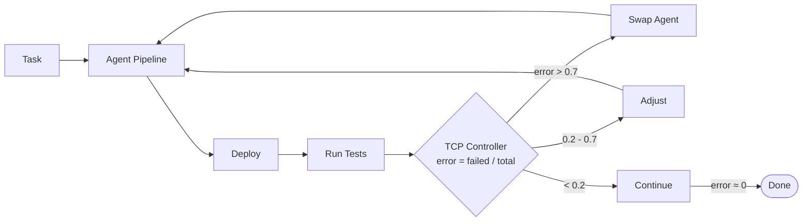
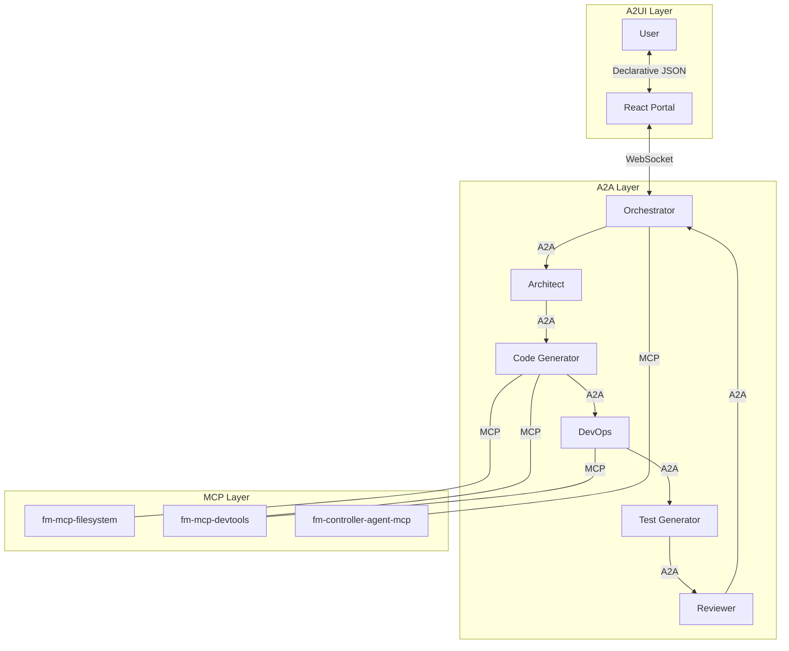
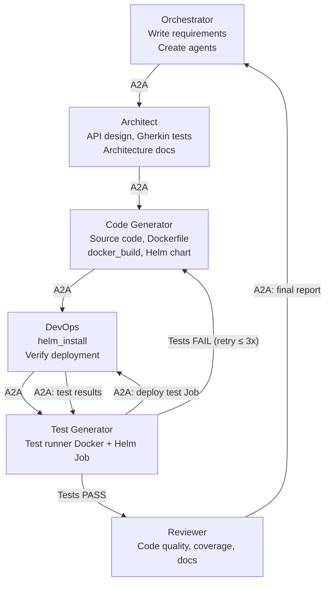
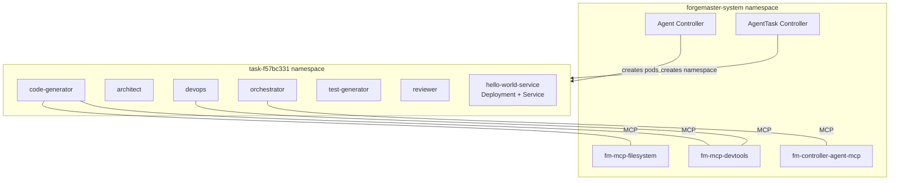

# ForgeMaster Pitch Deck

Slide content for the 5-minute demo video. Use during non-terminal sections.

---

## Slide 1 — Title (0:00-0:10)

**ForgeMaster**

Autonomous Agent Orchestration for Kubernetes

*AgentForge Hackathon 2026 — Dmytro Shcherbatiuk*

---

## Slide 2 — The Problem (0:30-0:50)

**AI coding today is one-shot**

```
User → LLM → Code → Hope it works → Manual fix → Repeat
```

- No feedback loop
- No automated testing
- No deployment verification
- Human in the loop for every retry

---

## Slide 3 — The Solution (0:50-1:15)

**ForgeMaster: Control Theory + AI Agents**



| Error Signal | Action |
|---|---|
| > 0.7 | Swap agent |
| 0.5-0.7 | Add specialist |
| 0.2-0.5 | Adjust params |
| < 0.2 | Continue |

**Controller = math (microseconds, $0). Agents = Claude API (creative work, $$).**

---

## Slide 4 — Three Protocols (1:15-1:45)

**Standards-based, not reinvented**

| Protocol | Purpose | Standard |
|---|---|---|
| **MCP** | Agent-to-Tools | Anthropic |
| **A2A** | Agent-to-Agent | Google / Linux Foundation |
| **A2UI** | Agent-to-User | Google |



---

## Slide 5 — Agent Pipeline (1:45-2:00)

**Six agents, self-coordinating via A2A**



Each agent:
- Own Kubernetes pod
- Own Claude API session
- Own MCP tools (filesystem, Docker, Helm)
- A2A endpoint for peer communication

---

## Slide 6 — Kubernetes-Native (2:00-2:15)

**Two Custom Resource Definitions**

```yaml
apiVersion: forgemaster.io/v1alpha1
kind: AgentTask
spec:
  description: "Build a REST API..."
status:
  phase: Running
  error: 0.35
```

```yaml
apiVersion: forgemaster.io/v1alpha1
kind: Agent
spec:
  type: code-generator
  model:
    name: claude-sonnet-4-20250514
    maxTokens: 16384
  mcpServers:
    - name: fm-mcp-filesystem
    - name: fm-mcp-devtools
```



- Per-task namespace isolation
- Operator-managed lifecycle
- Resource quotas, RBAC, health checks

---

## Slides 7-10 — DEMO (2:15-3:50)

*No slides — show terminal and UI*

---

## Slide 11 — Engineering Quality (3:50-4:15)

**Production-grade, not a prototype**

| | |
|---|---|
| **Language** | Rust (5 crates, single responsibility each) |
| **Orchestration** | Kubernetes CRDs + Operators |
| **Deployment** | Helm charts + Ansible |
| **Environments** | Local (OrbStack) / Remote (ghcr.io) |
| **CI/CD** | GitHub Actions → ghcr.io |
| **Documentation** | 10 ADRs, architecture docs |
| **Observability** | Full audit trail per agent conversation |

---

## Slide 12 — Why ForgeMaster Should Win (4:15-4:50)

**1. Standards-based**
A2A + MCP + A2UI — composing open protocols, not reinventing them.
Any MCP server, any A2A agent can plug in.

**2. Kubernetes-native**
CRDs, operators, namespace isolation, Helm, RBAC.
Scales. Observable. Production-ready.

**3. Control theory meets AI**
TCP controller: microseconds, zero cost, deterministic.
LLM budget reserved for creative work only.

---

## Slide 13 — Close (4:50-5:00)

**ForgeMaster**

Autonomous agent orchestration,
powered by control theory,
built for Kubernetes.

*github.com/dshcherbatiuk/forgemaster*
