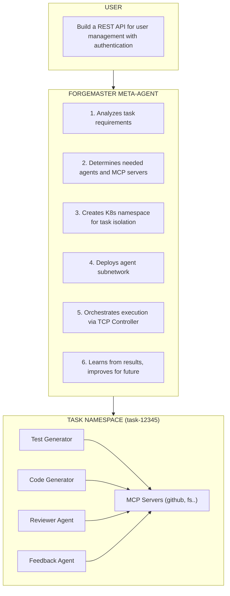
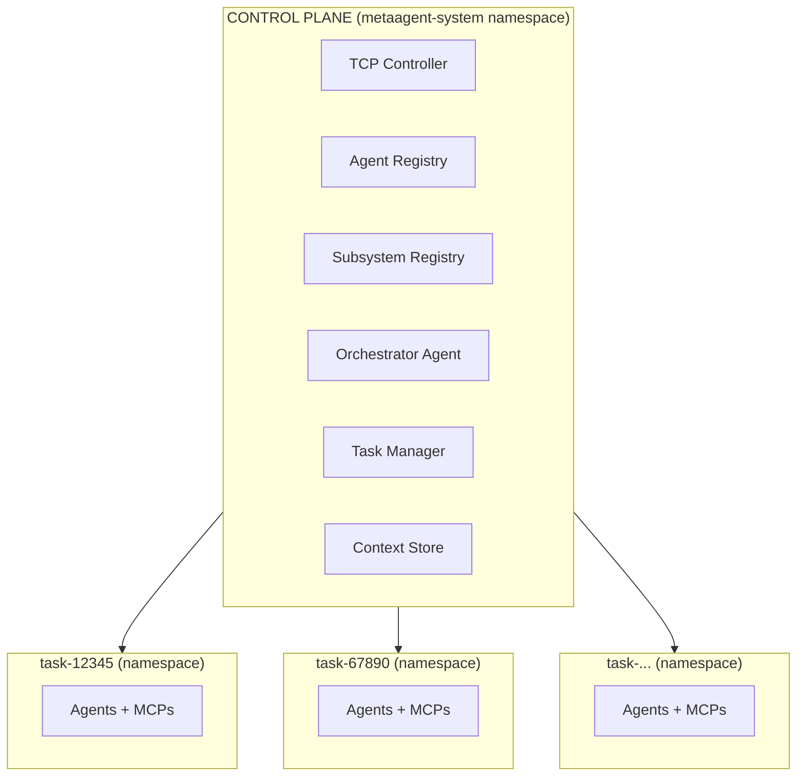

# Project Goal: ForgeMaster

## Hackathon Context

**Event:** AgentForge Hackathon 2026

**Challenge:** Design and implement Agentic Engineering systems capable of automating complex processes end-to-end. Focus on agent coordination, adaptability, and reliability in real-world use cases.

## Vision

**ForgeMaster** is a meta-agent system that autonomously configures, deploys, and orchestrates task-specific agents and MCP servers in Kubernetes.



## Core Idea

### 1. Task-Driven Agent Creation

User provides a high-level task. ForgeMaster:
- Analyzes task complexity and requirements
- Selects or creates appropriate agents
- Provisions necessary MCP servers (GitHub, filesystem, databases)
- Deploys everything in isolated K8s namespace

### 2. Autonomous Orchestration

Once deployed, the TCP Controller:
- Runs feedback loop using E2E tests (Gherkin) as success criteria
- Measures error signal: `failed_tests / total_tests`
- Makes orchestration decisions (swap agent, add agent, retry)
- No human intervention required

### 3. Subsystem Reuse

After completing tasks, ForgeMaster:
- Remembers successful agent combinations
- Extracts reusable subsystem templates
- Applies learned patterns to similar future tasks

**Example:**
```
Task 1: "Build REST API for products"
  → Creates: [TestGen, CodeGen, Reviewer] + [github-mcp, postgres-mcp]
  → Success! Saves as "rest-api-subsystem" template

Task 2: "Build REST API for orders"
  → Detects similarity to Task 1
  → Reuses "rest-api-subsystem" template
  → Faster startup, proven agent combination
```

### 4. Dynamic Agent Creation

When existing agents don't match requirements:
- ForgeMaster creates new specialized agents
- Configures model, system prompt, MCP connections
- Registers in Agent Registry with skill tags
- Available for future reuse

## Key Differentiators

| Aspect | Traditional | ForgeMaster |
|--------|-------------|-------------|
| Agent setup | Manual configuration | Automatic based on task |
| Orchestration | Human-driven | Autonomous (TCP Controller) |
| Success criteria | Subjective | Objective (E2E tests) |
| Learning | None | Subsystem reuse, pattern memory |
| Isolation | Shared environment | Per-task K8s namespace |
| Cost | LLM for everything | LLM only for creative work |

## Target Use Cases

1. **Web Development Pipelines**
   - REST API development
   - Frontend component creation
   - Full-stack feature implementation

2. **Data Engineering Workflows**
   - ETL pipeline development
   - Data validation and transformation
   - Schema migrations

3. **Testing Automation**
   - Test suite generation
   - Test maintenance and updates
   - Coverage improvement

4. **ML Experimentation**
   - Model training pipelines
   - Hyperparameter tuning
   - Experiment tracking

## Success Metrics

- **Autonomy**: Minimal human intervention after task submission
- **Reliability**: High success rate on diverse tasks
- **Efficiency**: Subsystem reuse reduces time-to-solution
- **Adaptability**: System handles novel tasks by creating new agents

## Architecture Summary



## Guiding Principles

1. **Separation of Concerns**
   - TCP Controller: Math-based orchestration (fast, free, deterministic)
   - Agents: LLM-based creative work (understanding, generation)

2. **Test-Driven Success**
   - Gherkin E2E tests define success criteria
   - Error signal drives feedback loop
   - Objective, measurable progress

3. **Kubernetes-Native**
   - CRDs for all resources (AgentTask, Agent, MCPServer, TestSuite)
   - Namespace isolation per task
   - Operator pattern for lifecycle management

4. **Reuse Over Recreation**
   - Learn from successful task completions
   - Build library of reusable subsystems
   - Accelerate future similar tasks
