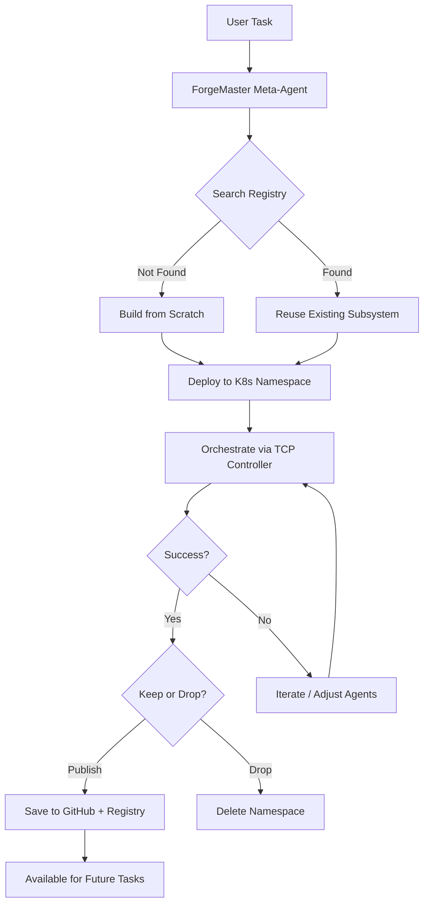
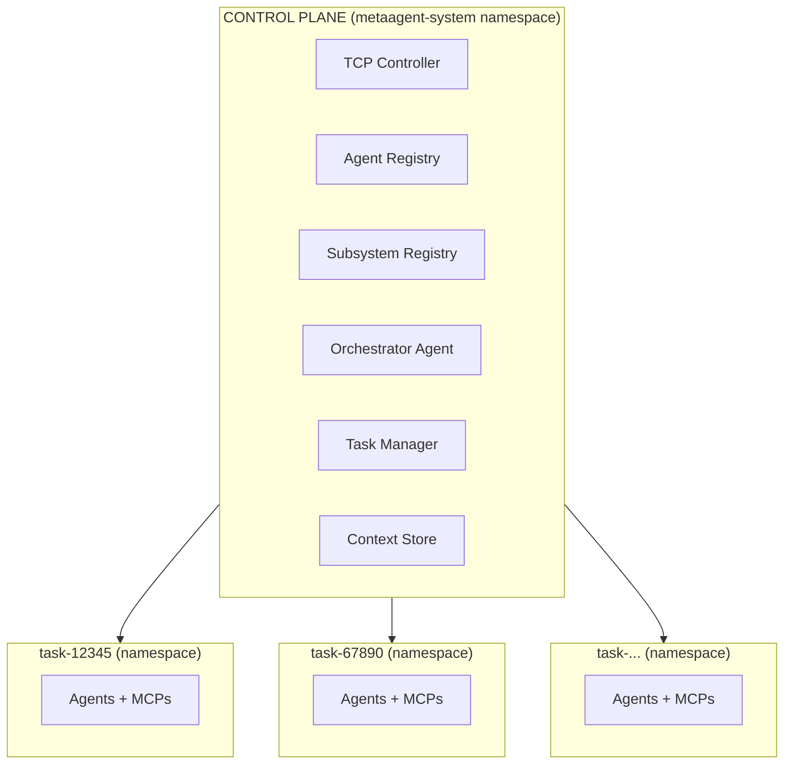

# Project Goal: ForgeMaster

## Hackathon Context

**Event:** AgentForge Hackathon 2026

**Challenge:** Design and implement Agentic Engineering systems capable of automating complex processes end-to-end. Focus on agent coordination, adaptability, and reliability in real-world use cases.

## Vision

**ForgeMaster** is a meta-agent system that autonomously discovers, creates, orchestrates, and manages task-specific agent subsystems in Kubernetes.

Unlike traditional agent frameworks where you manually configure agents, ForgeMaster treats agent combinations as **deployable, versioned artifacts**. When you submit a task, ForgeMaster searches its registry for existing subsystems that can solve it. If found, it reuses them instantly. If not, it builds a new agent subnetwork from scratch, deploys it to an isolated K8s namespace, orchestrates execution via a TCP Controller, and upon success can publish the proven combination to GitHub and registry for future reuse — or simply drop it if it was a one-time task.

This is **agentic engineering**: the system doesn't just use agents, it engineers them.



## Core Idea

### 1. Discover — Search for Existing Subsystems

When a user submits a task, ForgeMaster first searches its registry for existing agent subsystems that can handle it. The registry contains proven agent combinations from previous successful tasks, each tagged with skills, task types, and success rates.

If a matching subsystem is found (e.g., "ticket-booking-automation" for a travel booking task), ForgeMaster reuses it immediately — no need to figure out which agents to create or how to configure them.

### 2. Build — Create from Scratch

If no suitable subsystem exists, ForgeMaster builds one from scratch:
- Analyzes task requirements to determine needed skills
- Creates specialized agents with appropriate models and prompts
- Provisions MCP servers (GitHub, filesystem, databases)
- Deploys everything to an isolated K8s namespace

The meta-agent doesn't just select from a fixed set — it can create entirely new agent types tailored to the specific task.

### 3. Orchestrate — Execute via TCP Controller

Once deployed, the TCP Controller takes over:
- Runs a feedback loop using **dual validation**: tests + real-world outcome verification
- Measures error signal: `(failed_tests + failed_outcomes) / total_checks`
- Makes orchestration decisions using TCP control logic (swap agent, add agent, retry)
- No human intervention required — fully autonomous execution

**Dual Validation Principle:**
> Tests verify the HOW (implementation). Outcomes verify the WHAT (it actually worked).

| Task Type | Test Validation | Outcome Validation |
|-----------|-----------------|-------------------|
| Ticket Booking | "Booking flow completes" | Confirmation email received, booking ID exists |
| ETL Pipeline | "Data transforms correctly" | Row counts match, data queryable in target |
| API Development | "Endpoints return 200" | External client can call API successfully |
| ML Training | "Model trains without error" | Metrics improve on validation set |

### 4. Publish or Drop — Manage the Lifecycle

After task completion, ForgeMaster decides what to do with the subsystem:

**Publish** — If the agent combination proved successful and is likely useful for future tasks:
- Save configuration to GitHub as versioned artifact
- Register in Subsystem Registry with metadata (skills, success rate, task types)
- Available for instant reuse on similar future tasks

**Drop** — If it was a one-time task or the combination isn't worth keeping:
- Delete the K8s namespace and all resources
- No trace left, clean environment

### Example Lifecycle

```
Task 1: "Build automated flight ticket booking system"
  → Search: No matching subsystem found
  → Build: Creates [WebScraper, BookingAgent, PaymentValidator, NotificationAgent] + [browser-mcp, email-mcp]
  → Orchestrate: TCP Controller runs feedback loop, 4 iterations, success
  → Publish: Saves as "ticket-booking-automation" to registry

Task 2: "Book concert tickets when they go on sale"
  → Search: Found "ticket-booking-automation" (89% match)
  → Reuse: Deploys existing subsystem instantly
  → Orchestrate: 2 iterations, success
  → Drop: One-time task, delete namespace

Task 3: "Set up ETL pipeline for sales data"
  → Search: No matching subsystem found
  → Build: Creates [SchemaAnalyzer, TransformAgent, ValidationAgent, LoadAgent] + [postgres-mcp, s3-mcp]
  → Orchestrate: 5 iterations, success
  → Publish: Saves as "etl-data-pipeline" to registry

Task 4: "Generate test suite for payment module"
  → Search: No matching subsystem found
  → Build: Creates [CodeAnalyzer, TestGenerator, CoverageChecker] + [github-mcp, jest-mcp]
  → Orchestrate: 3 iterations, success
  → Publish: Saves as "test-automation-suite" to registry

Task 5: "Run hyperparameter tuning for recommendation model"
  → Search: No matching subsystem found
  → Build: Creates [ExperimentDesigner, TrainingAgent, MetricsAnalyzer] + [mlflow-mcp, gpu-mcp]
  → Orchestrate: 8 iterations, success
  → Publish: Saves as "ml-hyperparameter-tuning" to registry
```

## Key Differentiators

| Aspect | Traditional | ForgeMaster |
|--------|-------------|-------------|
| Agent setup | Manual configuration | Discover existing or build new |
| Agent lifecycle | Static, always running | Dynamic: deploy → use → publish/drop |
| Orchestration | Human-driven or LLM | Autonomous (TCP Controller, math-based) |
| Success criteria | Subjective | Objective (E2E tests + outcome validation) |
| Learning | None | Subsystem reuse, pattern memory |
| Artifact management | None | Publish to GitHub + Registry |
| Isolation | Shared environment | Per-task K8s namespace |
| Context memory | Lost on LLM compression | External store, never lost |
| Cost | LLM for everything | LLM only for creative work |

## What Makes This "Agentic Engineering"

ForgeMaster treats agent subsystems as **first-class engineering artifacts**:

- **Versioned** — Subsystems are saved with version history
- **Discoverable** — Registry enables search by skills, task type, success rate
- **Reusable** — Proven combinations are instantly deployable
- **Disposable** — One-time subsystems are cleanly removed
- **Evolvable** — Successful patterns inform future configurations

## Persistent Context Memory

Unlike pure LLM systems that lose details when context is compressed, ForgeMaster stores full task history externally.

**The Problem with LLM Context:**
```
Conversation grows → Context window fills → Compress/summarize → Details lost
```

**ForgeMaster Solution:**
```
Context stored in Redis/DB → LLM queries what it needs → Nothing lost
```

| Component | Storage | What's Kept |
|-----------|---------|-------------|
| **LLM Agent** | In-context (limited) | Current task + recent history |
| **Context Store** | Redis/DB (unlimited) | Full history, all patterns, all decisions |
| **TCP Controller** | Pure math (no LLM) | State machine, error history |

**Benefits:**
- Agents can "forget" but Context Store never does
- Full history available across iterations
- Patterns persist between tasks
- Cross-agent shared memory
- No information loss from LLM compression

## Target Use Cases

1. **Task Automation**
   - Ticket booking (flights, concerts, events)
   - Form filling and submission
   - Scheduled data collection

2. **Web Development Pipelines**
   - REST API development
   - Frontend component creation
   - Full-stack feature implementation

3. **Data Engineering Workflows**
   - ETL pipeline creation
   - Data validation and transformation
   - Schema migrations

4. **Testing Automation**
   - Test suite generation
   - Regression test maintenance
   - Coverage improvement

5. **ML Experimentation**
   - Model training pipelines
   - Hyperparameter tuning
   - Experiment tracking and comparison

## Success Metrics

- **Autonomy**: Minimal human intervention after task submission
- **Reliability**: High success rate on diverse tasks
- **Efficiency**: Subsystem reuse reduces time-to-solution
- **Adaptability**: System handles novel tasks by creating new agents

## Architecture Summary



## Guiding Principles

1. **Separation of Concerns**
   - TCP Controller: Math-based orchestration (fast, free, deterministic)
   - Agents: LLM-based creative work (understanding, generation)

2. **Test-Driven Success**
   - Gherkin E2E tests define success criteria
   - Error signal drives feedback loop
   - Objective, measurable progress

3. **Kubernetes-Native**
   - CRDs for all resources (AgentTask, Agent, MCPServer, TestSuite)
   - Namespace isolation per task
   - Operator pattern for lifecycle management

4. **Reuse Over Recreation**
   - Learn from successful task completions
   - Build library of reusable subsystems
   - Accelerate future similar tasks
